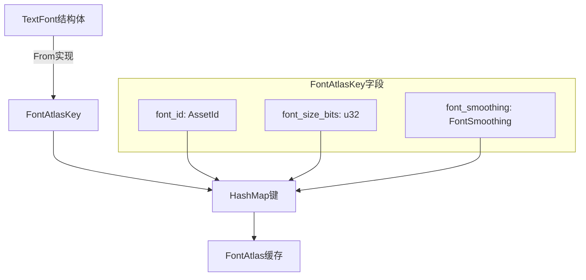

+++
title = "#22161 Name the fields of `FontAtlasKey"
date = "2025-12-17T00:00:00"
draft = false
template = "pull_request_page.html"
in_search_index = false

[extra]
current_language = "zh-cn"
available_languages = {"en" = { name = "English", url = "/pull_request/bevy/2025-12/pr-22161-en-20251217" }, "zh-cn" = { name = "中文", url = "/pull_request/bevy/2025-12/pr-22161-zh-cn-20251217" }}
+++

# Title

## 基本信息
- **标题**: Name the fields of `FontAtlasKey`
- **PR链接**: https://github.com/bevyengine/bevy/pull/22161
- **作者**: ickshonpe
- **状态**: 已合并
- **标签**: A-UI, C-代码质量, S-准备最终审核, D-直接明了
- **创建时间**: 2025-12-17T11:50:51Z
- **合并时间**: 2025-12-17T19:16:58Z
- **合并者**: alice-i-cecile

## 描述翻译
将 `FontAtlasKey` 结构体的字段命名。

### 解决方案
为字段命名并添加文档注释。

---

## PR分析：为FontAtlasKey字段命名的重构

这次PR的核心是一个代码质量改进：将`FontAtlasKey`从元组结构体（tuple struct）转换为具名字段结构体（struct with named fields）。虽然修改量不大，但这是一个典型的代码可读性提升案例。

### 背景：元组结构体的问题

在Bevy的文本渲染系统中，`FontAtlasKey`被用作字体图集的哈希键（hash key）。原来的实现是一个元组结构体：
```rust
pub struct FontAtlasKey(pub AssetId<Font>, pub u32, pub FontSmoothing);
```

这种设计虽然简洁，但存在可读性问题：使用`key.0`、`key.1`、`key.2`这样的索引访问字段，不直观且容易出错。在大型代码库中，维护者需要查阅定义才能理解每个字段的含义。

### 解决方案：具名字段结构体

PR将`FontAtlasKey`重构为具名字段结构体：
```rust
pub struct FontAtlasKey {
    /// Font asset id
    pub id: AssetId<Font>,
    /// Font size via `f32::to_bits`
    pub font_size_bits: u32,
    /// Antialiasing method
    pub font_smoothing: FontSmoothing,
}
```

这种改进有几个明显优势：
1. **自文档化**：字段名本身就说明了其用途
2. **类型安全**：避免误用字段顺序
3. **IDE友好**：现代IDE可以更好地提供代码补全和悬停提示

### 实施细节：一致性修改

这个PR虽然简单，但需要修改所有使用`FontAtlasKey`的地方以保持一致性：

1. **构造函数更新**：
```rust
// 之前
FontAtlasKey(
    font.font.id(),
    font.font_size.to_bits(),
    font.font_smoothing,
)

// 之后
Self {
    id: font.font.id(),
    font_size_bits: font.font_size.to_bits(),
    font_smoothing: font.font_smoothing,
}
```

2. **字段访问更新**：
```rust
// 之前：key.0
font_atlas_sets.retain(|key, _| key.0 != *id);

// 之后：key.id
font_atlas_sets.retain(|key, _| key.id != *id);
```

所有修改都遵循最小变更原则，没有改变逻辑，只是改进了可读性。

### 技术考量：为什么使用`font_size_bits`

一个值得注意的细节是`font_size_bits`字段。字体大小在逻辑上是`f32`类型，但`HashMap`的键需要实现`Eq`和`Hash`，而`f32`不满足这些要求（因为有NaN等特殊情况）。解决方案是使用`f32::to_bits()`将浮点数转换为它的二进制表示（`u32`），这样可以作为哈希键。

字段名`font_size_bits`清楚地表明了这一点，比原来的元组索引`key.1`更具可读性。

### 影响：可维护性提升

这个PR展示了良好的代码质量实践。对于维护者来说：
- 新开发者在阅读代码时更容易理解`FontAtlasKey`的用途
- 减少了因字段顺序混淆导致的bug风险
- 文档注释（doc comments）为IDE工具提供了更多上下文

### 架构位置

`FontAtlasKey`在Bevy的文本渲染管道中扮演重要角色。它作为键用于缓存字体图集，避免为相同字体、大小和抗锯齿设置的文本重复生成图集。这次改进不影响性能，但提升了代码的可维护性。

---

## 可视化表示



---

## 主要文件变更

### 1. `crates/bevy_text/src/font_atlas_set.rs` (+14/-7)

**变更说明**：重构`FontAtlasKey`结构体定义和相关使用。

**关键代码**：
```rust
// 之前：
pub struct FontAtlasKey(pub AssetId<Font>, pub u32, pub FontSmoothing);

impl From<&TextFont> for FontAtlasKey {
    fn from(font: &TextFont) -> Self {
        FontAtlasKey(
            font.font.id(),
            font.font_size.to_bits(),
            font.font_smoothing,
        )
    }
}

// 之后：
pub struct FontAtlasKey {
    /// Font asset id
    pub id: AssetId<Font>,
    /// Font size via `f32::to_bits`
    pub font_size_bits: u32,
    /// Antialiasing method
    pub font_smoothing: FontSmoothing,
}

impl From<&TextFont> for FontAtlasKey {
    fn from(font: &TextFont) -> Self {
        Self {
            id: font.font.id(),
            font_size_bits: font.font_size.to_bits(),
            font_smoothing: font.font_smoothing,
        }
    }
}
```

### 2. `crates/bevy_text/src/pipeline.rs` (+4/-4)

**变更说明**：更新文本管道中使用`FontAtlasKey`的地方。

**关键代码**：
```rust
// 之前：
font_atlas_set
    .entry(FontAtlasKey(
        font_id,
        physical_glyph.cache_key.font_size_bits,
        font_smoothing,
    ))

// 之后：
font_atlas_set
    .entry(FontAtlasKey {
        id: font_id,
        font_size_bits: physical_glyph.cache_key.font_size_bits,
        font_smoothing,
    })
```

### 3. `examples/stress_tests/many_text2d.rs` (+1/-1)

**变更说明**：更新示例代码中的字段访问。

**关键代码**：
```rust
// 之前：
.filter(|(key, _)| key.0 == font_id)

// 之后：
.filter(|(key, _)| key.id == font_id)
```

---

## 扩展阅读

1. **Rust编程语言 - 结构体章节**：了解元组结构体和具名结构体的区别
2. **Bevy引擎 - 文本渲染系统**：理解字体图集在游戏引擎中的作用
3. **哈希和相等性**：`f32`为什么不能直接作为HashMap键，以及`to_bits()`的用途

---

# 完整代码差异
完整代码差异已在上述分析中展示。