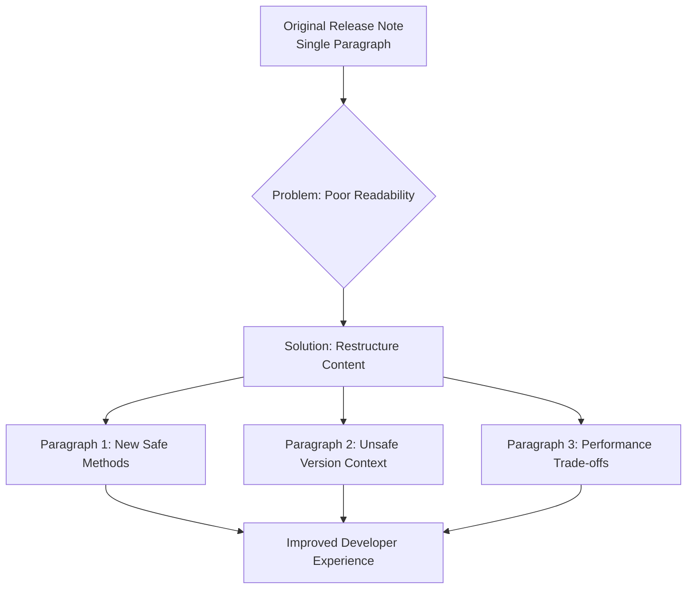

+++
title = "#22162 Revise release_notes/get_components_mut.md"
date = "2025-12-17T00:00:00"
draft = false
template = "pull_request_page.html"
in_search_index = true

[taxonomies]
list_display = ["show"]

[extra]
current_language = "en"
available_languages = {"en" = { name = "English", url = "/pull_request/bevy/2025-12/pr-22162-en-20251217" }, "zh-cn" = { name = "中文", url = "/pull_request/bevy/2025-12/pr-22162-zh-cn-20251217" }}
labels = ["C-Docs", "A-ECS"]
+++

# Title

## Basic Information
- **Title**: Revise release_notes/get_components_mut.md
- **PR Link**: https://github.com/bevyengine/bevy/pull/22162
- **Author**: Architector4
- **Status**: MERGED
- **Labels**: C-Docs, A-ECS, S-Ready-For-Final-Review
- **Created**: 2025-12-17T12:22:01Z
- **Merged**: 2025-12-17T19:01:50Z
- **Merged By**: alice-i-cecile

## Description Translation
# Objective

This release note provides useful information, but it is written as a single long paragraph with subpar grammar and at times unclear meaning.

# Solution

Revise the text in this release note: split into three paragraphs, each delivering its own point separately.

(for the record, no i don't use LLMs, don't @ me about the hyphens lmao)

## The Story of This Pull Request

This PR addresses a documentation clarity issue in the Bevy game engine's release notes. The problem was straightforward: a release note describing a new API addition was difficult to read and understand due to poor grammatical structure and formatting. The existing documentation contained all necessary technical information, but it was compressed into a single dense paragraph, making it hard for developers to quickly grasp the key points about the new `get_components_mut` methods.

The developer approached this problem by restructuring the content into logical paragraphs. The original release note attempted to explain three distinct concepts in one continuous block: 1) the addition of the new safe methods, 2) why the previous unsafe versions were necessary, and 3) the performance trade-offs of the new safe implementation. By separating these concepts into three paragraphs, the revision creates a much clearer progression of information.

Looking at the implementation, we can see the developer made several key improvements beyond just paragraph breaks. The revised text uses clearer terminology and more precise language. For example, the original stated that the unsafe version "needed to be unsafe because specifying (&mut T, &mut T) is possible which would return multiple mutable references to the same component." The revised version explains this more clearly: "They are not safe because they allow retrieving `(&mut T, &mut T)` - two mutable references to a single component - which breaks Rust's pointer aliasing rules." This phrasing is more technically accurate and explicitly references Rust's safety guarantees.

The developer also improved the explanation of the performance considerations. The original note mentioned "a O(n^2) check for conflicts" and warned that "if your code is performance sensitive it may make sense to keep using `get_components_mut_unchecked`." The revised version clarifies this with "The new methods work around this via performing a quadratic time complexity check between all specified components for conflicts" and adds the important caveat "if you can guarantee that no aliasing would occur." This gives developers clearer guidance about when to use each version.

This documentation change has a significant impact on developer experience. Clear release notes are essential for a project like Bevy where developers need to understand API changes quickly and accurately. Well-structured documentation reduces the cognitive load on developers trying to understand new features or changes. The three-paragraph structure creates natural breaking points that allow developers to process each piece of information separately, making the entire feature easier to understand and apply correctly in their own code.

The technical insight here is that even simple documentation improvements can have substantial impact on a project's usability. While this PR doesn't change any functional code, it improves the quality of information available to developers working with Bevy's Entity Component System. The clearer explanation of the safety versus performance trade-off helps developers make more informed decisions about which API to use in different situations, potentially preventing bugs or performance issues in their games.

## Visual Representation



## Key Files Changed

**File: `release-content/release-notes/get_components_mut.md`**

This file contains the release note documentation for the `get_components_mut` API addition. The changes improve readability by restructuring a single paragraph into three logically separated paragraphs with clearer language and better grammar.

**Before:**
```markdown
A safe version of `EntityMut::get_components_mut` and `EntityWorldMut::get_components_mut`
was added. Previously a unsafe version was added `get_components_mut_unchecked`. It needed
to be unsafe because specifying (&mut T, &mut T) is possible which would return multiple
mutable references to the same component. This was done by adding a O(n^2) check for
conflicts which returns a `QueryAccessError::Conflict`. Because of the cost of the checks
if your code is performance sensitive it may make sense to keep using
`get_components_mut_unchecked`.
```

**After:**
```markdown
Methods `EntityMut::get_components_mut` and `EntityWorldMut::get_components_mut` are now
added, providing a safe API for retrieving mutable references to multiple components via
these entity access APIs.

Previously, only the unsafe variants of these methods, called
`get_components_mut_unchecked`, were present. They are not safe because they allow
retrieving `(&mut T, &mut T)` - two mutable references to a single component - which
breaks Rust's pointer aliasing rules.

The new methods work around this via performing a quadratic time complexity check between
all specified components for conflicts, returning `QueryAccessError::Conflict` if such
occurs. This potentially has a runtime performance cost, so it might be favorable to still
use `get_components_mut_unchecked` if you can guarantee that no aliasing would occur.
```

The changes transform a single, dense paragraph into three clear sections:
1. **Introduction of new safe methods** - Clearly states what was added
2. **Context about unsafe versions** - Explains why unsafe versions were necessary
3. **Performance considerations** - Details the implementation trade-off and when to use which version

## Further Reading

1. **Rust's Aliasing Rules**: The Rustonomicon section on aliasing explains why having multiple mutable references to the same data is unsafe (https://doc.rust-lang.org/nomicon/aliasing.html)

2. **Bevy ECS Documentation**: The Bevy ECS guide provides background on entity-component systems and how to work with entities and components (https://bevy-cheatbook.github.io/programming/ecs-intro.html)

3. **API Design for Safety and Performance**: This article discusses trade-offs between safety and performance in API design, relevant to the decision to provide both safe and unsafe versions of the method (https://rust-lang.github.io/api-guidelines/)

4. **Quadratic Time Complexity**: Big O notation explanation for understanding the O(n²) performance characteristic mentioned in the release notes (https://en.wikipedia.org/wiki/Time_complexity)

5. **Bevy Release Notes Structure**: Understanding how Bevy organizes its release notes can help contributors write better documentation (https://github.com/bevyengine/bevy/blob/main/RELEASES.md)

# Full Code Diff
diff --git a/release-content/release-notes/get_components_mut.md b/release-content/release-notes/get_components_mut.md
index 85a300e9f1496..c7d72563d9c26 100644
--- a/release-content/release-notes/get_components_mut.md
+++ b/release-content/release-notes/get_components_mut.md
@@ -4,10 +4,16 @@ authors: ["@hymm"]
 pull_requests: [21780]
 ---
 
-A safe version of `EntityMut::get_components_mut` and `EntityWorldMut::get_components_mut`
-was added. Previously a unsafe version was added `get_components_mut_unchecked`. It needed
-to be unsafe because specifying (&mut T, &mut T) is possible which would return multiple
-mutable references to the same component. This was done by adding a O(n^2) check for
-conflicts which returns a `QueryAccessError::Conflict`. Because of the cost of the checks
-if your code is performance sensitive it may make sense to keep using
-`get_components_mut_unchecked`.
+Methods `EntityMut::get_components_mut` and `EntityWorldMut::get_components_mut` are now
+added, providing a safe API for retrieving mutable references to multiple components via
+these entity access APIs.
+
+Previously, only the unsafe variants of these methods, called
+`get_components_mut_unchecked`, were present. They are not safe because they allow
+retrieving `(&mut T, &mut T)` - two mutable references to a single component - which
+breaks Rust's pointer aliasing rules.
+
+The new methods work around this via performing a quadratic time complexity check between
+all specified components for conflicts, returning `QueryAccessError::Conflict` if such
+occurs. This potentially has a runtime performance cost, so it might be favorable to still
+use `get_components_mut_unchecked` if you can guarantee that no aliasing would occur.