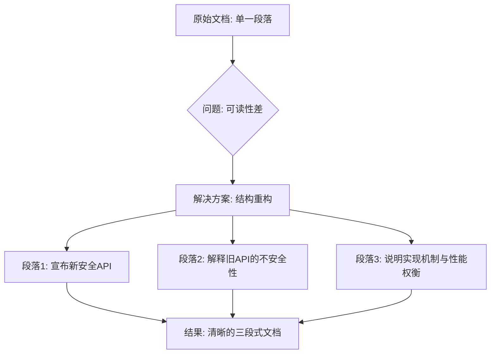

+++
title = "#22162 Revise release_notes/get_components_mut.md"
date = "2025-12-17T00:00:00"
draft = false
template = "pull_request_page.html"
in_search_index = false

[extra]
current_language = "zh-cn"
available_languages = {"en" = { name = "English", url = "/pull_request/bevy/2025-12/pr-22162-en-20251217" }, "zh-cn" = { name = "中文", url = "/pull_request/bevy/2025-12/pr-22162-zh-cn-20251217" }}
+++

# Title

## 基本信息
- **标题**: Revise release_notes/get_components_mut.md
- **PR 链接**: https://github.com/bevyengine/bevy/pull/22162
- **作者**: Architector4
- **状态**: 已合并
- **标签**: C-Docs, A-ECS, S-Ready-For-Final-Review
- **创建时间**: 2025-12-17T12:22:01Z
- **合并时间**: 2025-12-17T19:01:50Z
- **合并者**: alice-i-cecile

## 描述翻译

### 目标
这份发布说明提供了有用的信息，但它写成了一个单一的长段落，语法不佳，有时含义不清晰。

### 解决方案
修订这份发布说明的文本：将其拆分为三个段落，每个段落独立传达其要点。

（特此声明，我不使用LLM，别因为连字符的事儿@我，笑）

## 本次 PR 的故事

这个 PR 是关于改进文档的，核心问题是提升一份技术发布说明的可读性和清晰度。故事始于一个对开发者体验有直接影响但未被优先处理的问题：一份描述重要新功能的技术说明因其结构而难以阅读。

**问题的核心** 在于 PR #21780 为 Bevy 的 ECS (Entity Component System) 系统引入了新的安全 API：`EntityMut::get_components_mut` 和 `EntityWorldMut::get_components_mut`。相关的发布说明文档虽然包含了关键技术细节——例如解释为什么之前只有不安全的版本 (`get_components_mut_unchecked`)，以及新安全版本通过 O(n²) 冲突检查实现的机制和性能权衡——但这些信息被塞进了一个冗长、语法不规范的单一段落中。这种格式对于开发者快速扫描和理解要点构成了障碍。可读性差的文档会降低信息的传递效率，可能导致开发者误解 API 的用途、风险或适用场景，尤其是在涉及“安全”(safe) 与“不安全”(unsafe) 这种关键抉择时。

**解决方案** 采取了直接且有效的工程方法：重构文档结构，而非重写内容。开发者没有改变文档的技术实质，而是聚焦于信息架构。主要策略是将原先的“信息块”按逻辑拆解。原段落混合了三个主要信息点：1) 新安全 API 的引入，2) 旧不安全 API 的存在原因，3) 新 API 的实现机制与性能权衡。改进后的版本为每个信息点创建了独立的段落。这种分离使得每个论点都能被清晰地陈述，读者可以逐点消化，而不会被淹没在连续的文本流中。

**具体的文本改进** 体现了对技术写作细节的关注。例如：
- 开篇语句从描述性 (“A safe version ... was added”) 改为更直接、更像公告的陈述 (“Methods ... are now added”)。
- 对不安全原因的解释更加精确，明确指出了 `(&mut T, &mut T)` 会违反 Rust 的别名规则 (aliasing rules)，而不仅仅是模糊地说“可能返回多个可变引用”。
- 性能权衡的表述也从“因为检查的成本”这种模糊说法，明确为“二次时间复杂度检查”和“运行时性能成本”，并更清晰地指出了使用不安全版本的前提是“你能保证不会发生别名引用”。

**最终的影响** 是一份显著提升的发布说明。它保留了所有必要的技术细节，但通过更好的组织结构使其更易于访问。对于 Bevy 这样的开源项目，清晰的文档对于社区采用新特性、理解安全边界以及做出明智的性能权衡决策至关重要。这次修改虽然不涉及任何运行时代码，但对项目的整体健康度和用户体验有直接的正面贡献。它展示了即使在纯文档工作中，应用软件工程中的“关注点分离”和“清晰接口”原则同样有价值。

## 可视化表示



## 关键文件变更

- `release-content/release-notes/get_components_mut.md` (+13/-7)

**变更描述**：此文件是本次 PR 修改的唯一文件。变更内容是对该发布说明文档的纯文本重构，目的是提升可读性和清晰度，技术内容保持不变。

**代码片段 (Diff)**:
```markdown
- A safe version of `EntityMut::get_components_mut` and `EntityWorldMut::get_components_mut`
- was added. Previously a unsafe version was added `get_components_mut_unchecked`. It needed
- to be unsafe because specifying (&mut T, &mut T) is possible which would return multiple
- mutable references to the same component. This was done by adding a O(n^2) check for
- conflicts which returns a `QueryAccessError::Conflict`. Because of the cost of the checks
- if your code is performance sensitive it may make sense to keep using
- `get_components_mut_unchecked`.
+ Methods `EntityMut::get_components_mut` and `EntityWorldMut::get_components_mut` are now
+ added, providing a safe API for retrieving mutable references to multiple components via
+ these entity access APIs.
+
+ Previously, only the unsafe variants of these methods, called
+ `get_components_mut_unchecked`, were present. They are not safe because they allow
+ retrieving `(&mut T, &mut T)` - two mutable references to a single component - which
+ breaks Rust's pointer aliasing rules.
+
+ The new methods work around this via performing a quadratic time complexity check between
+ all specified components for conflicts, returning `QueryAccessError::Conflict` if such
+ occurs. This potentially has a runtime performance cost, so it might be favorable to still
+ use `get_components_mut_unchecked` if you can guarantee that no aliasing would occur.
```
**与 PR 目标的关联**：这些变更直接实现了 PR 描述中的目标，将原先单一、语法不佳的长段落，拆分并重构成了三个逻辑清晰的段落，分别阐述了新 API 的引入、旧 API 不安全的根本原因，以及新 API 的实现与性能权衡。

## 延伸阅读

1.  **相关 PR**: 实现 `get_components_mut` 功能的原始 PR #21780，其中包含了具体的 API 设计和实现代码。
2.  **Bevy 官方文档 - ECS**: 了解 Bevy 实体组件系统的基本概念和工作原理。
3.  **Rust 参考 - 别名与借用检查**: 深入理解 Rust 的所有权系统和为何 `&mut T` 不能别名化，这是理解为什么需要 `get_components_mut_unchecked` 以及新的安全检查机制的根本原因。
4.  **技术写作指南** (如 *Google Developer Documentation Style Guide*): 了解如何编写清晰、有效、对开发者友好的技术文档。