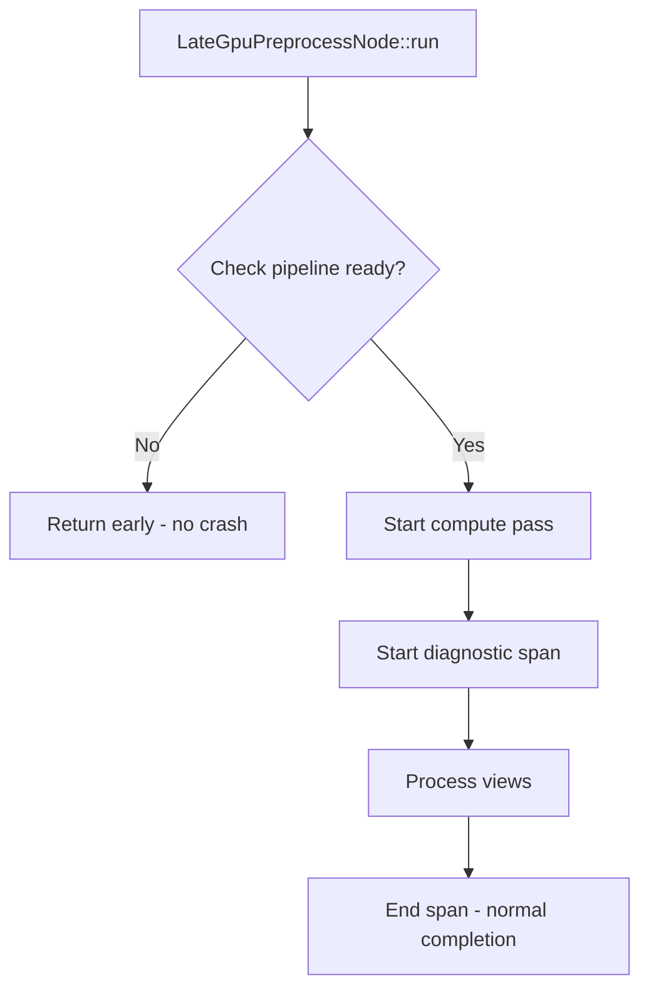

+++
title = "#22164 Fix a crash in late_mesh_preprocessing"
date = "2025-12-17T00:00:00"
draft = false
template = "pull_request_page.html"
in_search_index = true

[taxonomies]
list_display = ["show"]

[extra]
current_language = "en"
available_languages = {"en" = { name = "English", url = "/pull_request/bevy/2025-12/pr-22164-en-20251217" }, "zh-cn" = { name = "中文", url = "/pull_request/bevy/2025-12/pr-22164-zh-cn-20251217" }}
labels = ["C-Bug", "A-Rendering", "P-Crash"]
+++

# Title
Fix a crash in late_mesh_preprocessing

## Basic Information
- **Title**: Fix a crash in late_mesh_preprocessing 
- **PR Link**: https://github.com/bevyengine/bevy/pull/22164
- **Author**: atlv24
- **Status**: MERGED
- **Labels**: C-Bug, A-Rendering, P-Crash, S-Ready-For-Final-Review
- **Created**: 2025-12-17T14:00:04Z
- **Merged**: 2025-12-17T19:12:15Z
- **Merged By**: alice-i-cecile

## Description Translation
# Objective

- Early return obviates a diagnostics span end call, which panics on drop

## Solution

- Early return before starting the diagnostic span

## Testing

- This was causing crashes in the occlusion_culling example. It no longer crashes

## The Story of This Pull Request

This PR addresses a crash that was occurring in the occlusion_culling example, specifically within the `late_mesh_preprocessing` system. The crash was a panic that happened when a diagnostics span was being dropped without being properly ended.

The core issue was in the execution order of the `LateGpuPreprocessNode::run()` method. The original implementation had a problematic flow: it would start a compute pass with an associated diagnostic span, then iterate through views to process them. Within this view iteration loop, there were early return conditions that could trigger if the required compute pipeline wasn't ready yet.

The problem occurs because when these early returns execute, they exit the function while the diagnostic span (`pass_span`) is still active. Diagnostic spans in Bevy's rendering system have a specific lifecycle - they need to be explicitly ended. When a span is dropped without being ended, it triggers a panic as a safety mechanism to prevent instrumentation errors.

The fix is straightforward but important for correctness: move the pipeline availability checks to occur before we start the compute pass and its associated diagnostic span. This ensures that if we need to return early because the pipeline isn't ready, we do so before any diagnostic spans are created. This eliminates the possibility of leaving an active span when exiting the function.

This pattern of ensuring resource readiness before starting instrumentation is a common best practice in systems programming. It prevents resource leaks and ensures proper cleanup. The crash was particularly noticeable in the occlusion_culling example because that example exercises the late mesh preprocessing path where pipelines might still be compiling during the initial frames.

The implementation change demonstrates good defensive programming. By checking for pipeline readiness upfront, we avoid starting any work that we can't complete properly. This also aligns with the principle of failing fast - if we can't do the work due to missing dependencies, we should exit early without performing any partial work that would need cleanup.

From a broader perspective, this fix highlights an important aspect of working with RAII (Resource Acquisition Is Initialization) patterns in Rust. When resources have specific cleanup requirements (like ending diagnostic spans), the code must ensure that early returns don't bypass these cleanup steps. The solution here follows the standard approach of acquiring resources only after we're certain we can complete the operation.

## Visual Representation



## Key Files Changed

### `crates/bevy_pbr/src/render/gpu_preprocess.rs` (+17/-17)

This file contains the rendering logic for GPU preprocessing in Bevy's PBR (Physically Based Rendering) system. The changes fix a crash by reordering operations to ensure diagnostic spans are properly managed.

**Key Modification**: Moved pipeline availability checks before compute pass and diagnostic span creation.

Before the fix:
```rust
let mut compute_pass =
    render_context
        .command_encoder()
        .begin_compute_pass(&ComputePassDescriptor {
            label: Some("late_mesh_preprocessing"),
            timestamp_writes: None,
        });
let pass_span = diagnostics.pass_span(&mut compute_pass, "late_mesh_preprocessing");

// Run the compute passes.
for (view, bind_groups, view_uniform_offset) in self.view_query.iter_manual(world) {
    let maybe_pipeline_id = preprocess_pipelines
        .late_gpu_occlusion_culling_preprocess
        .pipeline_id;

    // Fetch the pipeline.
    let Some(preprocess_pipeline_id) = maybe_pipeline_id else {
        warn!("The build mesh uniforms pipeline wasn't ready");
        return Ok(());
    };

    let Some(preprocess_pipeline) =
        pipeline_cache.get_compute_pipeline(preprocess_pipeline_id)
    else {
        // This will happen while the pipeline is being compiled and is fine.
        return Ok(());
    };
    // ... rest of the processing
}
```

After the fix:
```rust
let maybe_pipeline_id = preprocess_pipelines
    .late_gpu_occlusion_culling_preprocess
    .pipeline_id;

// Fetch the pipeline.
let Some(preprocess_pipeline_id) = maybe_pipeline_id else {
    warn!("The build mesh uniforms pipeline wasn't ready");
    return Ok(());
};

let Some(preprocess_pipeline) = pipeline_cache.get_compute_pipeline(preprocess_pipeline_id)
else {
    // This will happen while the pipeline is being compiled and is fine.
    return Ok(());
};

let mut compute_pass =
    render_context
        .command_encoder()
        .begin_compute_pass(&ComputePassDescriptor {
            label: Some("late_mesh_preprocessing"),
            timestamp_writes: None,
        });

let pass_span = diagnostics.pass_span(&mut compute_pass, "late_mesh_preprocessing");

// Run the compute passes.
for (view, bind_groups, view_uniform_offset) in self.view_query.iter_manual(world) {
    compute_pass.set_pipeline(preprocess_pipeline);
    // ... rest of the processing
}
```

The changes ensure that:
1. Pipeline availability is checked before any compute pass or diagnostic span is created
2. Early returns happen without leaving active diagnostic spans
3. The compute pass is only started when we know we have a valid pipeline to use

## Further Reading

1. **Rust RAII Patterns**: Understanding how Rust uses RAII for resource management is key to avoiding similar issues. The Rust Book's section on destructors and the `Drop` trait provides foundational knowledge.

2. **Bevy Render Graph**: The Bevy render graph system where this code operates is documented in Bevy's official documentation, particularly the sections on custom render nodes and compute passes.

3. **wgpu Compute Passes**: Since this code uses wgpu compute passes, the wgpu documentation on compute pipelines and passes provides context for the underlying APIs being used.

4. **Diagnostic Instrumentation**: Bevy's diagnostic and instrumentation system, which includes the span functionality that was causing the crash, is part of Bevy's observability features for performance profiling.

5. **Error Handling in Rendering**: General patterns for error handling in real-time rendering systems, particularly around resource loading and pipeline compilation, are relevant to understanding why early returns are necessary in this context.