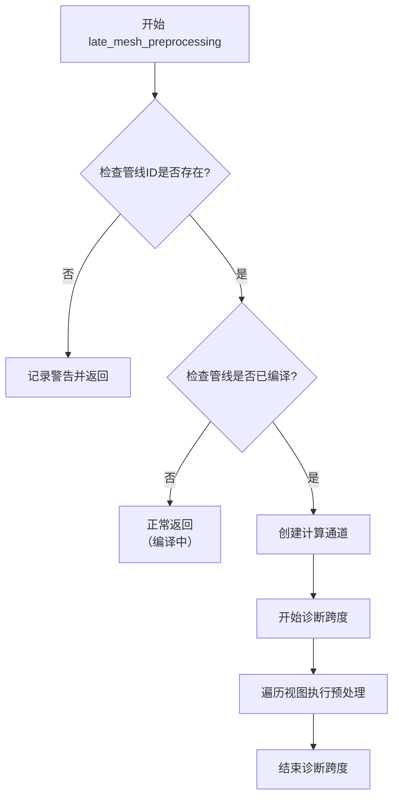

+++
title = "#22164 Fix a crash in late_mesh_preprocessing"
date = "2025-12-17T00:00:00"
draft = false
template = "pull_request_page.html"
in_search_index = false

[extra]
current_language = "zh-cn"
available_languages = {"en" = { name = "English", url = "/pull_request/bevy/2025-12/pr-22164-en-20251217" }, "zh-cn" = { name = "中文", url = "/pull_request/bevy/2025-12/pr-22164-zh-cn-20251217" }}
+++

# 修复 late_mesh_preprocessing 中的崩溃问题

## 基本信息
- **标题**: Fix a crash in late_mesh_preprocessing
- **PR链接**: https://github.com/bevyengine/bevy/pull/22164
- **作者**: atlv24
- **状态**: 已合并
- **标签**: C-Bug, A-Rendering, P-Crash, S-Ready-For-Final-Review
- **创建时间**: 2025-12-17T14:00:04Z
- **合并时间**: 2025-12-17T19:12:15Z
- **合并人**: alice-i-cecile

## 描述翻译
### 目标
- 提前返回会省略诊断跨度的结束调用，这会导致在丢弃时发生恐慌(panic)

### 解决方案
- 在开始诊断跨度之前提前返回

### 测试
- 这个问题在 occlusion_culling 示例中导致崩溃。修复后不再崩溃

## PR的技术故事

这个PR解决了一个直接的崩溃问题，涉及Bevy渲染系统中的诊断工具(diagnostics)使用。问题的根源在于`late_mesh_preprocessing`节点的执行逻辑顺序不当。

具体来说，原代码在`LateGpuPreprocessNode`的`run`方法中存在一个逻辑缺陷。当计算管线(pipeline)尚未准备就绪时，代码会提前返回，但此时已经创建了一个诊断跨度(diagnostic span)。诊断工具需要明确的开始和结束调用来正确管理跨度的生命周期，如果没有调用`pass_span.end()`就直接丢弃跨度对象，会导致恐慌。

原代码的执行顺序是：
1. 创建计算通道(compute pass)和诊断跨度
2. 开始遍历视图(view)以执行预处理
3. 在循环内部检查管线可用性
4. 如果管线不可用，直接返回而不结束诊断跨度

问题的关键在于第4步：当管线不可用时，函数直接返回，没有正确处理诊断跨度的结束。在Rust中，当对象被丢弃(dropped)时，如果其`Drop`实现中有可能触发恐慌的代码，就会导致程序崩溃。

修复方案将管线可用性检查提前到创建计算通道和诊断跨度之前：
1. 首先检查管线ID是否存在
2. 然后检查管线是否已编译完成
3. 只有在管线可用的情况下，才创建计算通道和诊断跨度
4. 然后正常执行后续处理逻辑

这个修复展示了处理资源依赖时的基本原则：应该在创建需要清理的资源之前进行可行性检查。这种模式在图形编程中很常见，因为GPU资源（如管线、缓冲区等）的创建和编译通常是异步的，代码需要能够优雅地处理资源尚未准备好的情况。

从实现角度看，这个修复不改变任何功能逻辑，只是调整了检查的顺序。代码的其余部分保持不变，包括计算通道的配置、绑定的设置和工作组的调度。这种最小化的变更降低了引入新错误的风险，同时有效解决了崩溃问题。

在性能方面，这个修复没有负面影响。实际上，由于避免了不必要的诊断跨度创建，在管线未准备好的情况下还可能略微提高性能。诊断工具对于调试和性能分析很有用，但不应该影响程序的正常执行流程。

这个问题的出现也提示了一个编码最佳实践：当使用RAII（Resource Acquisition Is Initialization，资源获取即初始化）模式的工具时，特别是那些在析构时需要执行重要操作的组件，应该确保在获取资源之前满足所有前置条件。

## 可视化表示



## 关键文件变更

### `crates/bevy_pbr/src/render/gpu_preprocess.rs` (+17/-17)

这是唯一修改的文件，修复了`LateGpuPreprocessNode`的`run`方法中的逻辑顺序问题。

#### 修改详情：
**修复前的问题代码**：
```rust
let mut compute_pass =
    render_context
        .command_encoder()
        .begin_compute_pass(&ComputePassDescriptor {
            label: Some("late_mesh_preprocessing"),
            timestamp_writes: None,
        });
let pass_span = diagnostics.pass_span(&mut compute_pass, "late_mesh_preprocessing");

// Run the compute passes.
for (view, bind_groups, view_uniform_offset) in self.view_query.iter_manual(world) {
    let maybe_pipeline_id = preprocess_pipelines
        .late_gpu_occlusion_culling_preprocess
        .pipeline_id;

    // Fetch the pipeline.
    let Some(preprocess_pipeline_id) = maybe_pipeline_id else {
        warn!("The build mesh uniforms pipeline wasn't ready");
        return Ok(());
    };

    let Some(preprocess_pipeline) =
        pipeline_cache.get_compute_pipeline(preprocess_pipeline_id)
    else {
        // This will happen while the pipeline is being compiled and is fine.
        return Ok(());
    };

    // ... 后续处理代码
}
```

**修复后的正确代码**：
```rust
let maybe_pipeline_id = preprocess_pipelines
    .late_gpu_occlusion_culling_preprocess
    .pipeline_id;

// Fetch the pipeline.
let Some(preprocess_pipeline_id) = maybe_pipeline_id else {
    warn!("The build mesh uniforms pipeline wasn't ready");
    return Ok(());
};

let Some(preprocess_pipeline) = pipeline_cache.get_compute_pipeline(preprocess_pipeline_id)
else {
    // This will happen while the pipeline is being compiled and is fine.
    return Ok(());
};

let mut compute_pass =
    render_context
        .command_encoder()
        .begin_compute_pass(&ComputePassDescriptor {
            label: Some("late_mesh_preprocessing"),
            timestamp_writes: None,
        });

let pass_span = diagnostics.pass_span(&mut compute_pass, "late_mesh_preprocessing");

// Run the compute passes.
for (view, bind_groups, view_uniform_offset) in self.view_query.iter_manual(world) {
    compute_pass.set_pipeline(preprocess_pipeline);
    // ... 后续处理代码
}
```

#### 关键变化：
1. **管线检查提前**：将管线ID存在性检查和管线获取操作移到创建计算通道和诊断跨度之前
2. **逻辑顺序优化**：确保只有在所有必要资源都可用的情况下，才创建需要清理的资源
3. **错误处理保持不变**：在管线不可用时仍然记录相同的警告信息并正常返回
4. **功能一致性**：修复不改变任何实际的渲染逻辑，只调整执行顺序

## 进一步阅读

1. **Rust的Drop特质**：
   - Rust官方文档：[The Drop Trait](https://doc.rust-lang.org/book/ch15-03-drop.html)
   - 了解RAII模式和资源管理在Rust中的实现

2. **Bevy的诊断系统**：
   - Bevy官方文档：[Diagnostics](https://docs.rs/bevy/latest/bevy/diagnostic/index.html)
   - 学习Bevy中如何实现性能监控和调试工具

3. **wgpu计算通道**：
   - wgpu文档：[Compute Passes](https://docs.rs/wgpu/latest/wgpu/struct.ComputePassDescriptor.html)
   - 了解现代图形API中的计算着色器执行模型

4. **异步资源加载模式**：
   - Bevy资产系统：[Asset Server](https://bevy-cheatbook.github.io/features/assets.html)
   - 学习如何处理异步编译和加载的资源依赖关系

5. **防御性编程实践**：
   - 早期返回模式（early return pattern）
   - 前置条件检查在资源管理中的应用