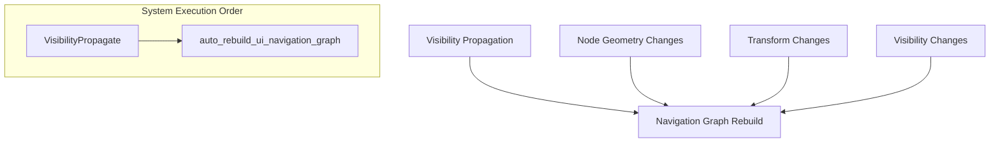

+++
title = "#22166 `auto_rebuild_ui_navigation_graph` visibility fix"
date = "2025-12-17T00:00:00"
draft = false
template = "pull_request_page.html"
in_search_index = true

[taxonomies]
list_display = ["show"]

[extra]
current_language = "en"
available_languages = {"en" = { name = "English", url = "/pull_request/bevy/2025-12/pr-22166-en-20251217" }, "zh-cn" = { name = "中文", url = "/pull_request/bevy/2025-12/pr-22166-zh-cn-20251217" }}
labels = ["C-Bug", "A-Input", "A-UI"]
+++

# Title

## Basic Information
- **Title**: `auto_rebuild_ui_navigation_graph` visibility fix
- **PR Link**: https://github.com/bevyengine/bevy/pull/22166
- **Author**: ickshonpe
- **Status**: MERGED
- **Labels**: C-Bug, A-Input, A-UI, S-Ready-For-Final-Review
- **Created**: 2025-12-17T14:03:50Z
- **Merged**: 2025-12-17T18:53:09Z
- **Merged By**: alice-i-cecile

## Description Translation
# Objective

Fixes #22163

## Solution

* Schedule `auto_rebuild_ui_navigation_graph` after `VisibilityPropagate` so node visibility is up to date before it runs.
* In `auto_rebuild_ui_navigation_graph` rebuild the navigation graphs on changes to `InheritedVisibility`.

## The Story of This Pull Request

This PR addresses a bug in Bevy's UI navigation system where hidden UI elements were incorrectly included in the navigation graph. The issue stems from a timing problem: the system that automatically rebuilds navigation graphs was running before visibility information had been fully propagated through the UI hierarchy.

### The Problem and Context

In Bevy's UI system, `InheritedVisibility` components determine whether a UI element is visible by inheriting visibility state from parent elements. The `auto_rebuild_ui_navigation_graph` system was responsible for automatically generating navigation edges between focusable UI elements when certain components changed, but it had two issues:

1. **Timing issue**: The system ran in the `PostUpdate` schedule as part of `UiSystems::PostLayout`, but visibility propagation (`VisibilitySystems::VisibilityPropagate`) happens in the same schedule. Without explicit ordering, the navigation graph could be rebuilt using stale visibility data.

2. **Missing dependency**: The system wasn't monitoring changes to `InheritedVisibility`, so if only visibility changed (without changes to node geometry or transforms), the navigation graph wouldn't update to reflect which elements were actually focusable.

This resulted in hidden UI elements remaining in the navigation graph, which could break keyboard/gamepad navigation as users could navigate to invisible elements that shouldn't be interactable.

### The Solution Approach

The fix involved two coordinated changes to ensure visibility information is always up-to-date when building navigation graphs:

1. **Schedule ordering**: Explicitly schedule `auto_rebuild_ui_navigation_graph` to run after `VisibilitySystems::VisibilityPropagate`. This ensures that by the time navigation graphs are rebuilt, all UI elements have their correct `InheritedVisibility` values.

2. **Additional change detection**: Add `Changed<InheritedVisibility>` to the query that triggers navigation graph rebuilds. This ensures that visibility changes alone are sufficient to trigger a navigation graph update.

### The Implementation

The implementation simplifies the visibility checking logic while fixing both issues. Previously, the system had to check both `Visibility` and `InheritedVisibility` components, handling multiple cases of explicit and inherited visibility. The new approach relies entirely on `InheritedVisibility`, which represents the final computed visibility after propagation.

Here's how the system query changed:

**Before**: The query fetched optional `Visibility` and optional `InheritedVisibility` components, requiring complex conditional logic to determine actual visibility state.

**After**: The query now requires `&InheritedVisibility` (non-optional), and the filtering logic simply checks `inherited_visibility.get()` for a boolean visibility result.

This simplification is possible because:
- By running after `VisibilityPropagate`, `InheritedVisibility` is guaranteed to be present and up-to-date
- `InheritedVisibility.get()` returns the final computed visibility after considering both local `Visibility` and inherited visibility

The schedule ordering change uses Bevy's system ordering API with `.after()` to explicitly depend on the visibility propagation system.

### Technical Insights

This fix demonstrates important concepts in Bevy's ECS architecture:

1. **System ordering**: Bevy's scheduling system allows explicit dependencies between systems to ensure data dependencies are respected. Without explicit ordering, systems in the same set run in parallel when possible, which can lead to race conditions when one system depends on another's output.

2. **Visibility propagation**: Bevy uses a two-component system for visibility:
   - `Visibility`: Local visibility state (Visible, Hidden, Inherited)
   - `InheritedVisibility`: Computed visibility after propagation from parents
   The propagation happens in `VisibilityPropagate`, which updates `InheritedVisibility` based on the hierarchy.

3. **Change detection**: Bevy's `Changed<T>` query filter efficiently detects when components have been modified, allowing systems to run only when relevant data changes. Adding `Changed<InheritedVisibility>` ensures the navigation system responds to visibility changes.

### The Impact

These changes ensure that UI navigation graphs accurately reflect only visible, focusable elements. The fix:

1. **Eliminates navigation to hidden elements**: Users can no longer navigate to UI elements that are hidden via visibility settings.
2. **Simplifies visibility checking**: The system now uses a single, authoritative source for visibility information.
3. **Maintains performance**: By only rebuilding navigation graphs when necessary (including on visibility changes), unnecessary rebuilds are avoided.

The fix is minimal and focused, changing only what's necessary to solve the problem while simplifying the implementation. This approach reduces maintenance burden and makes the system's behavior more predictable.

## Visual Representation



## Key Files Changed

### `crates/bevy_input_focus/src/directional_navigation.rs` (+19/-22)

This file contains the directional navigation system for UI elements. The changes fix visibility handling in automatic navigation graph generation.

**Key changes:**

1. **Schedule ordering**: Added explicit ordering to run after visibility propagation
```rust
// Before:
.add_systems(
    PostUpdate,
    auto_rebuild_ui_navigation_graph.in_set(UiSystems::PostLayout),
);

// After:
.add_systems(
    PostUpdate,
    auto_rebuild_ui_navigation_graph
        .in_set(UiSystems::PostLayout)
        .after(bevy_camera::visibility::VisibilitySystems::VisibilityPropagate),
);
```

2. **Updated query triggers**: Added `Changed<InheritedVisibility>` to the change detection query
```rust
// Before:
Or<(Added<AutoDirectionalNavigation>, Changed<ComputedNode>, Changed<UiGlobalTransform>)>,

// After:
Or<(
    Added<AutoDirectionalNavigation>,
    Changed<ComputedNode>,
    Changed<UiGlobalTransform>,
    Changed<InheritedVisibility>,
)>,
```

3. **Simplified node query**: Removed optional visibility components, now requiring only `InheritedVisibility`
```rust
// Before:
(Entity, &ComputedNode, &UiGlobalTransform, Option<&Visibility>, Option<&InheritedVisibility>)

// After:
(Entity, &ComputedNode, &UiGlobalTransform, &InheritedVisibility)
```

4. **Simplified visibility checking**: Replaced complex visibility logic with simple inherited visibility check
```rust
// Before:
// Skip hidden or zero-size nodes
if computed.is_empty()
    || matches!(visibility, Some(Visibility::Hidden))
    || (matches!(visibility, Some(Visibility::Inherited))
        && matches!(inherited_visibility, Some(&InheritedVisibility::HIDDEN)))
{
    return None;
}

// After:
// Skip hidden or zero-size nodes
if computed.is_empty() || !inherited_visibility.get() {
    return None;
}
```

These changes work together to ensure navigation graphs are always built with current visibility information, fixing the bug where hidden elements remained navigable.

## Further Reading

1. **Bevy Visibility System**: The [Bevy documentation on visibility](https://docs.rs/bevy/latest/bevy/render/view/visibility/index.html) explains how visibility propagation works in the engine.

2. **System Scheduling in Bevy**: The [Bevy system scheduling guide](https://bevy-cheatbook.github.io/programming/systems.html) covers system ordering, sets, and dependencies.

3. **UI Navigation in Bevy**: The [Bevy UI navigation example](https://github.com/bevyengine/bevy/blob/main/examples/ui/directional_navigation.rs) demonstrates how to use the directional navigation system.

4. **Change Detection in Bevy**: The [Bevy change detection documentation](https://docs.rs/bevy/latest/bevy/ecs/query/struct.Query.html#method.changed) explains how `Changed<T>` filters work in queries.

5. **Issue #22163**: The original bug report provides context on the specific problem this PR solves.