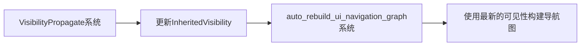

+++
title = "#22166 `auto_rebuild_ui_navigation_graph` visibility fix"
date = "2025-12-17T00:00:00"
draft = false
template = "pull_request_page.html"
in_search_index = false

[extra]
current_language = "zh-cn"
available_languages = {"en" = { name = "English", url = "/pull_request/bevy/2025-12/pr-22166-en-20251217" }, "zh-cn" = { name = "中文", url = "/pull_request/bevy/2025-12/pr-22166-zh-cn-20251217" }}
labels = ["C-Bug", "A-Input", "A-UI"]
+++

# Title

## Basic Information
- **Title**: `auto_rebuild_ui_navigation_graph` visibility fix
- **PR Link**: https://github.com/bevyengine/bevy/pull/22166
- **Author**: ickshonpe
- **Status**: MERGED
- **Labels**: C-Bug, A-Input, A-UI, S-Ready-For-Final-Review
- **Created**: 2025-12-17T14:03:50Z
- **Merged**: 2025-12-17T18:53:09Z
- **Merged By**: alice-i-cecile

## Description Translation

### 目标
修复 #22163

### 解决方案
* 将 `auto_rebuild_ui_navigation_graph` 安排在 `VisibilityPropagate` 之后运行，这样在它执行时节点的可见性状态已经是最新的。
* 在 `auto_rebuild_ui_navigation_graph` 中，当 `InheritedVisibility` 发生变化时重建导航图。

# The Story of This Pull Request

这个 PR 修复了 Bevy 引擎中 UI 导航系统的一个 bug。问题的核心在于系统执行顺序的依赖关系没有正确处理，导致导航图包含了不可见的 UI 节点。

具体来说，Bevy 的方向导航（directional navigation）系统允许用户通过键盘方向键在 UI 元素之间移动焦点。系统会为 UI 节点自动构建导航图，但这个构建过程需要正确的节点可见性信息。

原始代码中，`auto_rebuild_ui_navigation_graph` 系统在 `PostUpdate` 阶段运行，但它在 `VisibilityPropagate` 系统之前执行。这意味着当导航图重建时，节点的 `InheritedVisibility` 组件还没有被更新到最新状态。结果就是，隐藏的 UI 节点仍然被包含在导航图中，用户可以通过键盘导航到这些不可见的元素，这显然是不正确的。

从工程角度看，这是一个典型的系统顺序依赖问题。在 ECS 架构中，当多个系统操作相同的数据时，必须明确指定它们的执行顺序，以确保数据的一致性。

解决方案采取了两个步骤：

首先，调整系统的调度顺序。修改了 `DirectionalNavigationPlugin` 的构建代码，明确指定 `auto_rebuild_ui_navigation_graph` 在 `VisibilityPropagate` 之后运行。这个改动确保了可见性系统已经完成了所有可见性信息的传播。

```rust
// 修改后：
.add_systems(
    PostUpdate,
    auto_rebuild_ui_navigation_graph
        .in_set(UiSystems::PostLayout)
        .after(bevy_camera::visibility::VisibilitySystems::VisibilityPropagate),
);
```

其次，更新了系统触发的条件。在 `auto_rebuild_ui_navigation_graph` 的函数签名中，添加了对 `Changed<InheritedVisibility>` 的检测。这意味着当节点的继承可见性发生变化时，导航图也会被重建。

```rust
// 修改后：
Or<(
    Added<AutoDirectionalNavigation>,
    Changed<ComputedNode>,
    Changed<UiGlobalTransform>,
    Changed<InheritedVisibility>,  // 新增
)>,
```

除了调度顺序的调整，这个 PR 还简化了节点过滤的逻辑。原来的代码需要检查 `Visibility` 和 `InheritedVisibility` 两个组件来判断节点是否可见，现在只需要检查 `InheritedVisibility`。这是因为在可见性系统正确执行后，`InheritedVisibility` 已经包含了完整的可见性信息，无需额外的检查。

```rust
// 修改前：
if computed.is_empty()
    || matches!(visibility, Some(Visibility::Hidden))
    || (matches!(visibility, Some(Visibility::Inherited))
        && matches!(inherited_visibility, Some(&InheritedVisibility::HIDDEN)))
{
    return None;
}

// 修改后：
if computed.is_empty() || !inherited_visibility.get() {
    return None;
}
```

这个简化不仅使代码更清晰，也避免了潜在的逻辑错误。通过依赖 `InheritedVisibility::get()` 方法，代码直接使用系统维护的可见性状态，而不是尝试手动解析可见性层级。

从技术角度看，这个修复展示了在 Bevy ECS 架构中处理系统依赖的正确模式。当系统 B 依赖系统 A 产生的数据时，必须使用 `.after()` 约束来确保正确的执行顺序。同时，这个 PR 也体现了良好的数据驱动设计原则：通过监听组件变化来触发相关系统的执行，而不是每帧都进行昂贵的计算。

## Visual Representation



## Key Files Changed

### `crates/bevy_input_focus/src/directional_navigation.rs`
这个文件包含了方向导航系统的核心实现。主要改动包括：

1. **系统调度顺序调整**：确保导航图重建系统在可见性传播之后运行
2. **触发条件扩展**：当 `InheritedVisibility` 变化时也重建导航图
3. **代码简化**：移除对 `Visibility` 组件的直接检查，只使用 `InheritedVisibility`

关键代码修改：

```rust
// 系统调度顺序调整
// 修改前：
.add_systems(
    PostUpdate,
    auto_rebuild_ui_navigation_graph.in_set(UiSystems::PostLayout),
);

// 修改后：
.add_systems(
    PostUpdate,
    auto_rebuild_ui_navigation_graph
        .in_set(UiSystems::PostLayout)
        .after(bevy_camera::visibility::VisibilitySystems::VisibilityPropagate),
);
```

```rust
// 系统查询参数简化
// 修改前：
all_nodes: Query<
    (
        Entity,
        &ComputedNode,
        &UiGlobalTransform,
        Option<&Visibility>,
        Option<&InheritedVisibility>,
    ),
    With<AutoDirectionalNavigation>,
>,

// 修改后：
all_nodes: Query<
    (
        Entity,
        &ComputedNode,
        &UiGlobalTransform,
        &InheritedVisibility,
    ),
    With<AutoDirectionalNavigation>,
>,
```

```rust
// 节点过滤逻辑简化
// 修改前：
let nodes: Vec<FocusableArea> = all_nodes
    .iter()
    .filter_map(
        |(entity, computed, transform, visibility, inherited_visibility)| {
            if computed.is_empty()
                || matches!(visibility, Some(Visibility::Hidden))
                || (matches!(visibility, Some(Visibility::Inherited))
                    && matches!(inherited_visibility, Some(&InheritedVisibility::HIDDEN)))
            {
                return None;
            }
            // ...
        },
    )

// 修改后：
let nodes: Vec<FocusableArea> = all_nodes
    .iter()
    .filter_map(|(entity, computed, transform, inherited_visibility)| {
        if computed.is_empty() || !inherited_visibility.get() {
            return None;
        }
        // ...
    })
```

## Further Reading

- Bevy 官方文档中的系统顺序管理：[System Order](https://bevyengine.org/learn/book/next/quick-start/system-order/)
- Bevy 的可见性系统：[Visibility](https://bevyengine.org/learn/book/next/quick-start/visibility/)
- ECS 架构中的数据驱动设计模式
- Bevy 输入系统的实现原理