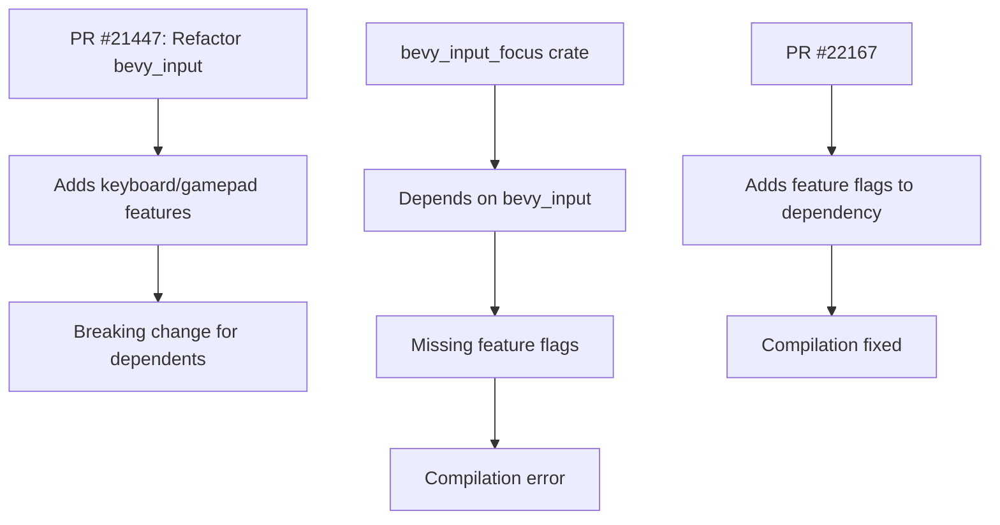

+++
title = "#22167 Enable the necessary features for `bevy_input` for `bevy_input_focus`"
date = "2025-12-17T00:00:00"
draft = false
template = "pull_request_page.html"
in_search_index = true

[taxonomies]
list_display = ["show"]

[extra]
current_language = "en"
available_languages = {"en" = { name = "English", url = "/pull_request/bevy/2025-12/pr-22167-en-20251217" }, "zh-cn" = { name = "中文", url = "/pull_request/bevy/2025-12/pr-22167-zh-cn-20251217" }}
labels = ["C-Bug", "D-Trivial", "A-Input", "A-UI"]
+++

# Title
Enable the necessary features for `bevy_input` for `bevy_input_focus`

## Basic Information
- **Title**: Enable the necessary features for `bevy_input` for `bevy_input_focus`
- **PR Link**: https://github.com/bevyengine/bevy/pull/22167
- **Author**: Shatur
- **Status**: MERGED
- **Labels**: C-Bug, D-Trivial, A-Input, A-UI, S-Ready-For-Final-Review
- **Created**: 2025-12-17T16:03:27Z
- **Merged**: 2025-12-17T18:50:46Z
- **Merged By**: alice-i-cecile

## Description Translation

# Objective

- Features added for `bevy_input` in #21447 wasn't enabled for `bevy_input_focus` which causes compilation error.

## Solution

- Enable them.

## Testing

- I checked that `cargo check -p bevy_input_focus` no longer fails.

## The Story of This Pull Request

This PR fixes a straightforward build issue that emerged from a recent change to the Bevy input system. The problem was essentially a missing feature flag dependency that caused a compilation failure in the `bevy_input_focus` crate.

The issue originated from PR #21447, which restructured the `bevy_input` crate by splitting its functionality into separate Cargo features. This modularization approach allows users to enable only the input functionality they need, reducing compile times and binary size for projects that don't require all input capabilities. The specific features introduced were `keyboard` and `gamepad`, which separate keyboard and gamepad input handling from the core input system.

However, when these features were introduced, they weren't properly enabled for downstream crates that depend on them. The `bevy_input_focus` crate, which handles input focus management for UI elements, relies on keyboard input functionality. Without the `keyboard` feature explicitly enabled, the compilation fails because the code references types and functions that are now gated behind this feature flag.

The fix is minimal and surgical: update the dependency declaration in `bevy_input_focus`'s Cargo.toml to enable the required features. This is a common pattern in Rust's Cargo ecosystem where features must be explicitly propagated through the dependency chain. When a library splits functionality into features, downstream users must opt into those features even if they're indirect dependencies.

The implementation change is exactly one line modified in the Cargo.toml file, adding the `keyboard` and `gamepad` features to the `bevy_input` dependency. The `bevy_input_focus` crate likely needs both features because it may handle focus for both keyboard and gamepad navigation, though keyboard is the primary use case for most UI interactions.

This kind of issue is typical in large Rust codebases using feature flags. When a library introduces optional features, all dependent crates must update their feature requirements. The fact that this slipped through indicates either a missing CI check or that the `bevy_input_focus` crate wasn't tested as part of the initial feature flag implementation in PR #21447.

From an engineering perspective, this PR highlights several important patterns:
1. Feature flag propagation in Rust dependencies
2. The importance of comprehensive CI testing across all dependent crates when introducing feature flags
3. How modular architecture decisions in one crate (splitting functionality into features) can create downstream maintenance requirements

The fix ensures that `bevy_input_focus` continues to work correctly with the modularized input system, maintaining the benefits of feature-based compilation while fixing the broken dependency chain.

## Visual Representation



## Key Files Changed

### `crates/bevy_input_focus/Cargo.toml`

**What changed and why**: Added the `keyboard` and `gamepad` features to the `bevy_input` dependency. These features were introduced in PR #21447 but weren't enabled for the `bevy_input_focus` crate, causing compilation errors.

**Code snippets**:
```toml
# Before:
bevy_input = { path = "../bevy_input", version = "0.18.0-dev", default-features = false }

# After:
bevy_input = { path = "../bevy_input", version = "0.18.0-dev", default-features = false, features = [
  "keyboard",
  "gamepad",
] }
```

**Relationship to overall purpose**: This single change fixes the compilation error by ensuring that `bevy_input_focus` has access to the keyboard and gamepad functionality it needs from the `bevy_input` crate. The change is minimal but essential for maintaining a working build.

## Further Reading

1. [The Cargo Book: Features](https://doc.rust-lang.org/cargo/reference/features.html) - Official documentation on Cargo features and dependency management
2. [Conditional Compilation in Rust](https://doc.rust-lang.org/reference/conditional-compilation.html) - How Rust uses features for conditional compilation
3. [Bevy Engine Documentation on Input](https://bevyengine.org/learn/book/input/) - Bevy's input handling system
4. [Rust Dependency Management Patterns](https://rust-lang.github.io/api-guidelines/dependencies.html) - Best practices for managing dependencies in Rust

# Full Code Diff
diff --git a/crates/bevy_input_focus/Cargo.toml b/crates/bevy_input_focus/Cargo.toml
index 80c355c82292d..60ca101301436 100644
--- a/crates/bevy_input_focus/Cargo.toml
+++ b/crates/bevy_input_focus/Cargo.toml
@@ -63,7 +63,10 @@ libm = ["bevy_math/libm", "bevy_window/libm"]
 bevy_app = { path = "../bevy_app", version = "0.18.0-dev", default-features = false }
 bevy_camera = { path = "../bevy_camera", version = "0.18.0-dev", default-features = false }
 bevy_ecs = { path = "../bevy_ecs", version = "0.18.0-dev", default-features = false }
-bevy_input = { path = "../bevy_input", version = "0.18.0-dev", default-features = false }
+bevy_input = { path = "../bevy_input", version = "0.18.0-dev", default-features = false, features = [
+  "keyboard",
+  "gamepad",
+] }
 bevy_math = { path = "../bevy_math", version = "0.18.0-dev", default-features = false }
 bevy_picking = { path = "../bevy_picking", version = "0.18.0-dev", default-features = false, optional = true }
 bevy_ui = { path = "../bevy_ui", version = "0.18.0-dev", default-features = false }