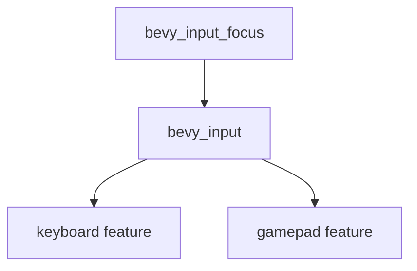

+++
title = "#22167 Enable the necessary features for `bevy_input` for `bevy_input_focus"
date = "2025-12-17T00:00:00"
draft = false
template = "pull_request_page.html"
in_search_index = false

[extra]
current_language = "zh-cn"
available_languages = {"en" = { name = "English", url = "/pull_request/bevy/2025-12/pr-22167-en-20251217" }, "zh-cn" = { name = "中文", url = "/pull_request/bevy/2025-12/pr-22167-zh-cn-20251217" }}
+++

# Title
Enable the necessary features for `bevy_input` for `bevy_input_focus`

## 基本信息
- **标题**: Enable the necessary features for `bevy_input` for `bevy_input_focus`
- **PR链接**: https://github.com/bevyengine/bevy/pull/22167
- **作者**: Shatur
- **状态**: 已合并
- **标签**: C-Bug, D-Trivial, A-Input, A-UI, S-Ready-For-Final-Review
- **创建时间**: 2025-12-17T16:03:27Z
- **合并时间**: 2025-12-17T18:50:46Z
- **合并者**: alice-i-cecile

## 描述翻译

### Objective
- 在 #21447 中为 `bevy_input` 添加的特性（features）未在 `bevy_input_focus` 中启用，导致编译错误。

### Solution
- 启用这些特性。

### Testing
- 我确认了 `cargo check -p bevy_input_focus` 不再失败。

## 这个PR的故事

这个PR解决了一个由依赖特性配置不完整引起的编译错误问题。故事始于PR #21447，该PR为`bevy_input` crate引入了可选的`keyboard`和`gamepad`特性。这些特性旨在模块化输入处理，允许用户根据需求选择启用或禁用特定的输入设备支持。

然而，在`bevy_input_focus` crate中，对`bevy_input`的依赖声明没有明确启用这些新特性。`bevy_input_focus`是一个处理输入焦点（例如，哪个UI元素当前获得键盘输入）的模块，它依赖于`bevy_input`提供的键盘和游戏板输入状态。由于特性是默认关闭的，而`bevy_input_focus`需要它们的功能，这导致了编译错误。

这个问题凸显了在Rust的Cargo工作区中管理特性传递的挑战。当一个crate依赖于另一个crate的特定特性时，必须在依赖声明中明确启用这些特性，否则相关的代码路径在编译时不可用。在本例中，`bevy_input_focus`使用了`bevy_input`中需要`keyboard`和`gamepad`特性的功能，因此必须启用它们。

修复方案直接明了：修改`bevy_input_focus`的`Cargo.toml`文件，在依赖`bevy_input`时显式启用`keyboard`和`gamepad`特性。这是一个简单的配置更改，但它确保了编译时所有必要的代码都被包含进来。

这个PR的测试也很直接：运行`cargo check -p bevy_input_focus`来验证编译错误是否消失。这种测试方法对于配置更改是足够的，因为它确认了依赖解析和特性启用的正确性。

从工程角度来看，这个PR强调了在大型项目中保持特性一致性的重要性。当向基础库添加可选特性时，必须检查所有依赖该库的组件，并更新它们的依赖声明以确保功能的完整性。这种维护工作通常是琐碎的，但对于项目的健康至关重要。

## 视觉表示



## 关键文件更改

### `crates/bevy_input_focus/Cargo.toml`
**更改描述**：修改了对`bevy_input`的依赖声明，显式启用了`keyboard`和`gamepad`特性，以修复因PR #21447引入的特性未启用而导致的编译错误。

**代码变更**：
```toml
# 修改前：
bevy_input = { path = "../bevy_input", version = "0.18.0-dev", default-features = false }

# 修改后：
bevy_input = { path = "../bevy_input", version = "0.18.0-dev", default-features = false, features = [
  "keyboard",
  "gamepad",
] }
```

这个更改直接对应了PR的目标。通过添加`features`列表，`bevy_input_focus`现在能够访问`bevy_input`中与键盘和游戏板相关的功能，从而解决了编译错误。

## 延伸阅读

- [PR #21447](https://github.com/bevyengine/bevy/pull/21447): 引入了`bevy_input`的`keyboard`和`gamepad`特性。
- [Cargo文档：特性](https://doc.rust-lang.org/cargo/reference/features.html): 了解Rust中Cargo特性的工作原理。
- [Bevy引擎输入系统](https://bevyengine.org/learn/book/input/): Bevy官方文档中关于输入系统的部分。