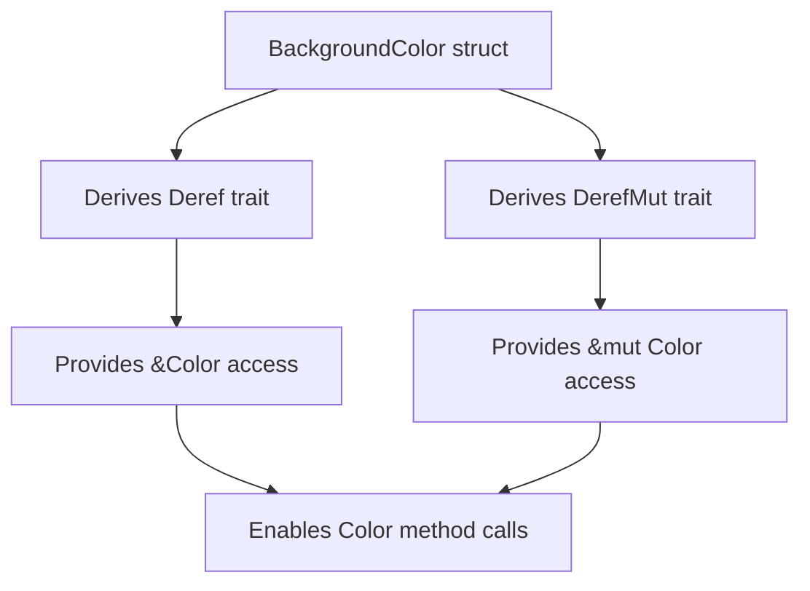

+++
title = "#22172 impl Deref for BackgroundColor"
date = "2025-12-17T00:00:00"
draft = false
template = "pull_request_page.html"
in_search_index = true

[taxonomies]
list_display = ["show"]

[extra]
current_language = "en"
available_languages = {"en" = { name = "English", url = "/pull_request/bevy/2025-12/pr-22172-en-20251217" }, "zh-cn" = { name = "中文", url = "/pull_request/bevy/2025-12/pr-22172-zh-cn-20251217" }}
labels = ["D-Trivial", "A-UI", "C-Usability"]
+++

# Title: impl Deref for BackgroundColor

## Basic Information
- **Title**: impl Deref for BackgroundColor
- **PR Link**: https://github.com/bevyengine/bevy/pull/22172
- **Author**: IWonderWhatThisAPIDoes
- **Status**: MERGED
- **Labels**: D-Trivial, A-UI, C-Usability, S-Ready-For-Final-Review
- **Created**: 2025-12-17T20:40:27Z
- **Merged**: 2025-12-17T21:37:14Z
- **Merged By**: alice-i-cecile

## Description Translation
Many newtypes in Bevy implement `Deref` and `DerefMut` for convenience. Let us extend that to `BackgroundColor`.

## Solution

Derived `Deref` and `DerefMut` for `BackgroundColor`.

## The Story of This Pull Request

This pull request addresses a consistency issue in the Bevy UI system's API design. The `BackgroundColor` struct, which wraps a `Color` value to serve as the fill color for UI nodes, was missing the standard convenience traits that similar "newtype" wrapper structs in Bevy typically implement.

The core problem was that `BackgroundColor` didn't implement the `Deref` and `DerefMut` traits. In Rust, newtype wrappers (structs with a single field) often implement these traits to provide automatic dereferencing to their inner type. This pattern allows users to work with the wrapper type as if it were the inner type in many contexts, reducing boilerplate and improving ergonomics.

The context here is that Bevy follows a common Rust idiom where newtype wrappers implement `Deref` and `DerefMut` to expose the methods of the wrapped type. For example, if you have a `BackgroundColor` instance, you should be able to call methods on the underlying `Color` directly without having to access the inner field each time.

Without these traits, developers working with `BackgroundColor` would need to either:
1. Explicitly access the `.0` field every time they wanted to work with the `Color`
2. Manually dereference using `*background_color` (which wouldn't work without `Deref`)
3. Write additional helper methods or conversion code

The solution was straightforward: add `Deref` and `DerefMut` to the existing derive macro list for `BackgroundColor`. This is a minimal change that follows established patterns in the codebase.

Looking at the implementation, `BackgroundColor` is defined as a tuple struct with a single `Color` field:
```rust
pub struct BackgroundColor(pub Color);
```

By adding `#[derive(Deref, DerefMut)]` to this struct, the compiler automatically generates implementations that:
- `Deref` provides an immutable reference to the inner `Color`
- `DerefMut` provides a mutable reference to the inner `Color`

This means that after the change, all methods available on `Color` become available on `BackgroundColor` through deref coercion. For example, users can now write:
```rust
let mut bg_color = BackgroundColor(Color::RED);
bg_color.set_a(0.5); // set_a is a method on Color, now accessible on BackgroundColor
```

The technical implementation is simple but follows an important principle: consistency in API design. When similar types in a library follow consistent patterns, developers can make reasonable assumptions about how to use them. This reduces cognitive load and makes the API more predictable.

The impact of this change is primarily improved developer ergonomics. While it doesn't add new functionality, it makes existing functionality more accessible. Developers can now work with `BackgroundColor` more naturally, using the same patterns they're familiar with from other Bevy newtypes.

One important consideration with `Deref` is that it should generally only be used for smart pointers and newtype wrappers where the wrapper is essentially just the inner type with additional semantics. This is exactly the case with `BackgroundColor` - it's a `Color` with the additional semantic meaning of being a background color for UI nodes.

The change was reviewed and merged quickly (within an hour), indicating that it was a clear improvement that aligned with existing patterns. The labels "D-Trivial" and "C-Usability" accurately reflect the nature of the change: a minor implementation detail that improves usability.

## Visual Representation



## Key Files Changed

**File: `crates/bevy_ui/src/ui_node.rs`**
This file contains the `BackgroundColor` struct definition in the Bevy UI module. The change adds `Deref` and `DerefMut` to the derive macro list.

Before:
```rust
#[derive(Component, Copy, Clone, Debug, PartialEq, Reflect)]
#[reflect(Component, Default, Debug, PartialEq, Clone)]
#[cfg_attr(
    feature = "serialize",
    derive(serde::Serialize, serde::Deserialize),
    reflect(Serialize, Deserialize)
)]
pub struct BackgroundColor(pub Color);
```

After:
```rust
#[derive(Component, Copy, Clone, Debug, Deref, DerefMut, PartialEq, Reflect)]
#[reflect(Component, Default, Debug, PartialEq, Clone)]
#[cfg_attr(
    feature = "serialize",
    derive(serde::Serialize, serde::Deserialize),
    reflect(Serialize, Deserialize)
)]
pub struct BackgroundColor(pub Color);
```

The change adds `Deref` and `DerefMut` to the derive list, making all methods of the inner `Color` type automatically available on `BackgroundColor` instances through deref coercion.

## Further Reading

1. **Rust Documentation on Deref Trait**: https://doc.rust-lang.org/std/ops/trait.Deref.html
2. **The Newtype Pattern in Rust**: https://doc.rust-lang.org/rust-by-example/generics/new_types.html
3. **Bevy's Component Documentation**: https://bevyengine.org/learn/book/getting-started/ecs/
4. **Rust Deref Coercion**: https://doc.rust-lang.org/book/ch15-02-deref.html#implicit-deref-coercions-with-functions-and-methods

# Full Code Diff
```diff
diff --git a/crates/bevy_ui/src/ui_node.rs b/crates/bevy_ui/src/ui_node.rs
index e3cf6feae28d1..4f672126e4800 100644
--- a/crates/bevy_ui/src/ui_node.rs
+++ b/crates/bevy_ui/src/ui_node.rs
@@ -2205,7 +2205,7 @@ pub enum GridPlacementError {
 /// The background color of the node
 ///
 /// This serves as the "fill" color.
-#[derive(Component, Copy, Clone, Debug, PartialEq, Reflect)]
+#[derive(Component, Copy, Clone, Debug, Deref, DerefMut, PartialEq, Reflect)]
 #[reflect(Component, Default, Debug, PartialEq, Clone)]
 #[cfg_attr(
     feature = "serialize",
```