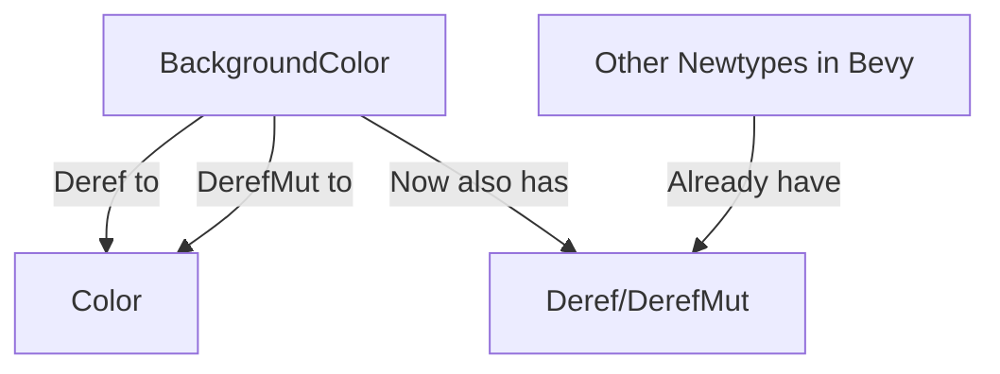

+++
title = "#22172 impl Deref for BackgroundColor"
date = "2025-12-17T00:00:00"
draft = false
template = "pull_request_page.html"
in_search_index = false

[extra]
current_language = "zh-cn"
available_languages = {"en" = { name = "English", url = "/pull_request/bevy/2025-12/pr-22172-en-20251217" }, "zh-cn" = { name = "中文", url = "/pull_request/bevy/2025-12/pr-22172-zh-cn-20251217" }}
+++

# Title

## 基本信息
- **标题**: impl Deref for BackgroundColor
- **PR链接**: https://github.com/bevyengine/bevy/pull/22172
- **作者**: IWonderWhatThisAPIDoes
- **状态**: 已合并
- **标签**: D-Trivial, A-UI, C-Usability, S-Ready-For-Final-Review
- **创建时间**: 2025-12-17T20:40:27Z
- **合并时间**: 2025-12-17T21:37:14Z
- **合并人**: alice-i-cecile

## 描述翻译

### 目标

Bevy 中的许多新类型（newtypes）为了方便都实现了 `Deref` 和 `DerefMut`。让我们将这个便利性扩展到 `BackgroundColor`。

### 解决方案

为 `BackgroundColor` 派生（derive）了 `Deref` 和 `DerefMut` 特性（trait）。

## PR背后的故事

这个 PR 解决了一个非常具体但常见的痛点：为 `BackgroundColor` 类型提供更方便的访问方式。`BackgroundColor` 是一个典型的"新类型模式"（newtype pattern）应用，它包装了一个 `Color` 值，为其提供特定语义和类型安全。

在当前的 Bevy 代码库中，许多类似的包装类型（如 `ComputedVisibility`、`GlobalTransform` 等）都通过实现 `Deref` 和 `DerefMut` 来提供对内部值的便捷访问。这种设计模式允许开发者像使用内部类型一样使用包装类型，同时保持类型系统的安全性。然而，`BackgroundColor` 却遗漏了这个实现。

没有 `Deref` 实现时，开发者必须显式地通过 `.0` 语法访问内部的 `Color` 值。这种不一致性会增加认知负担，并可能导致代码库中的使用模式不统一。当开发者看到其他包装类型可以直接解引用（dereference），但 `BackgroundColor` 不行时，会产生困惑。

解决方案非常直接：在 `BackgroundColor` 的派生宏列表中添加 `Deref` 和 `DerefMut`。这使得 `BackgroundColor` 实例可以像 `Color` 一样被使用，例如，在需要 `Color` 的地方可以直接传递 `BackgroundColor` 实例，编译器会自动进行解引用转换。

从技术实现角度看，`Deref` 和 `DerefMut` 的实现是由 Rust 的派生宏自动生成的，它们会为包装类型提供指向内部字段 `.0` 的引用。具体到 `BackgroundColor`，这相当于自动实现了：
- `Deref<Target = Color>`
- `DerefMut<Target = Color>`

这意味着现在可以编写如下代码：
```rust
let bg_color = BackgroundColor(Color::RED);
// 以前需要：bg_color.0
// 现在可以直接：bg_color
```

这种变化虽然微小，但体现了 API 设计的一致性原则。一致的 API 设计减少了学习成本，使代码更可预测。对于像 Bevy 这样的大型游戏引擎，API 的一致性对开发者体验至关重要。

值得注意的是，这个 PR 被标记为 "Trivial" 和 "Usability"，这准确地反映了它的性质：改动很小但提升了使用便利性。快速审查和合并（不到一小时）也表明了社区对这种一致性改进的认可。

## 可视化表示



## 关键文件变更

- `crates/bevy_ui/src/ui_node.rs` (+1/-1)

**变更描述**：
这个 PR 只修改了一个文件中的一行代码，为 `BackgroundColor` 结构体添加了 `Deref` 和 `DerefMut` 的派生宏。

**代码对比**：
```rust
// 文件: crates/bevy_ui/src/ui_node.rs
// 修改前：
#[derive(Component, Copy, Clone, Debug, PartialEq, Reflect)]
#[reflect(Component, Default, Debug, PartialEq, Clone)]

// 修改后：
#[derive(Component, Copy, Clone, Debug, Deref, DerefMut, PartialEq, Reflect)]
#[reflect(Component, Default, Debug, PartialEq, Clone)]
```

这个微小的变更使 `BackgroundColor` 与其他 Bevy 中的新类型保持一致，允许开发者直接解引用到其内部的 `Color` 值，从而提高了代码的简洁性和一致性。

## 延伸阅读

- [Rust 官方文档 - Deref trait](https://doc.rust-lang.org/std/ops/trait.Deref.html)
- [Rust 设计模式 - Newtype 模式](https://rust-unofficial.github.io/patterns/patterns/behavioural/newtype.html)
- [Bevy 官方文档 - Components](https://docs.rs/bevy/latest/bevy/ecs/component/trait.Component.html)
- [Rust 编程语言中文社区 - Deref 解引用强制多态](https://rustwiki.org/zh-CN/book/ch15-02-deref.html)

# Full Code Diff
diff --git a/crates/bevy_ui/src/ui_node.rs b/crates/bevy_ui/src/ui_node.rs
index e3cf6feae28d1..4f672126e4800 100644
--- a/crates/bevy_ui/src/ui_node.rs
+++ b/crates/bevy_ui/src/ui_node.rs
@@ -2205,7 +2205,7 @@ pub enum GridPlacementError {
 /// The background color of the node
 ///
 /// This serves as the "fill" color.
-#[derive(Component, Copy, Clone, Debug, PartialEq, Reflect)]
+#[derive(Component, Copy, Clone, Debug, Deref, DerefMut, PartialEq, Reflect)]
 #[reflect(Component, Default, Debug, PartialEq, Clone)]
 #[cfg_attr(
     feature = "serialize",