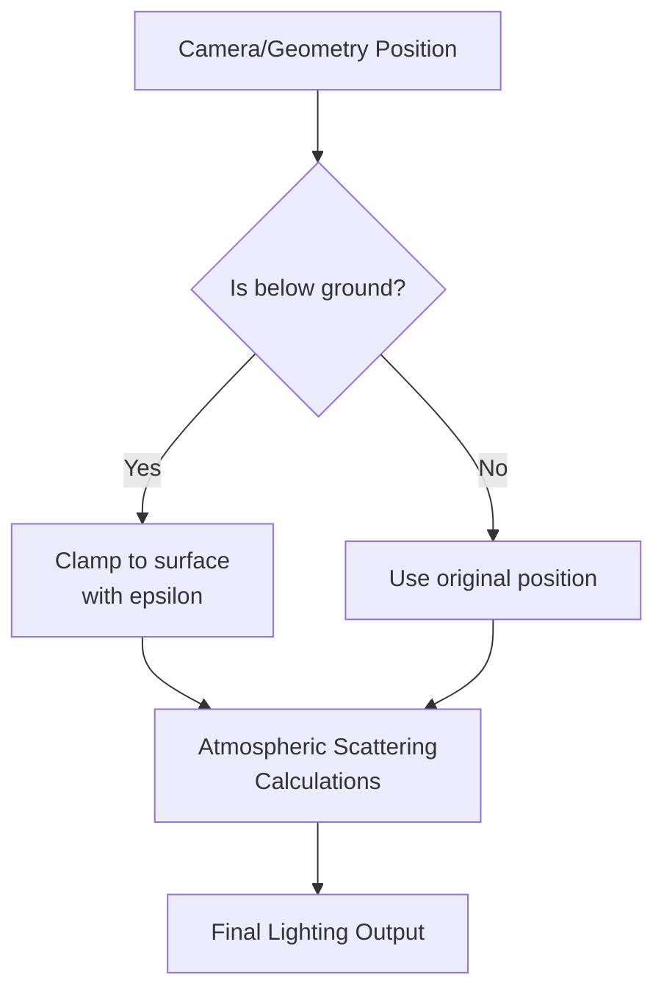

+++
title = "#22173 Fix atmosphere lighting issue for below ground geo"
date = "2025-12-17T00:00:00"
draft = false
template = "pull_request_page.html"
in_search_index = true

[taxonomies]
list_display = ["show"]

[extra]
current_language = "en"
available_languages = {"en" = { name = "English", url = "/pull_request/bevy/2025-12/pr-22173-en-20251217" }, "zh-cn" = { name = "中文", url = "/pull_request/bevy/2025-12/pr-22173-zh-cn-20251217" }}
labels = ["C-Bug", "A-Rendering", "D-Straightforward"]
+++

# Title
## Fix atmosphere lighting issue for below ground geo

## Basic Information
- **Title**: Fix atmosphere lighting issue for below ground geo
- **PR Link**: https://github.com/bevyengine/bevy/pull/22173
- **Author**: mate-h
- **Status**: MERGED
- **Labels**: C-Bug, A-Rendering, S-Ready-For-Final-Review, D-Straightforward
- **Created**: 2025-12-17T22:03:14Z
- **Merged**: 2025-12-17T23:36:11Z
- **Merged By**: alice-i-cecile

## Description Translation
### Objective

- Fix atmosphere lighting issue for below ground geo

Issue reported in discord channel for `rendering-dev` by Jondolf@


Repro on [f8a9f29](https://github.com/bevyengine/bevy/commit/f8a9f296bf45584feb987d626dbf331ac9b01918)

```rs
use bevy::{pbr::EarthlikeAtmosphere, prelude::*};

fn main() {
    App::new()
        .add_plugins(DefaultPlugins)
        .add_systems(Startup, setup)
        .run();
}

fn setup(
    mut commands: Commands,
    mut meshes: ResMut<Assets<Mesh>>,
    mut materials: ResMut<Assets<StandardMaterial>>,
    earthlike_atmosphere: Res<EarthlikeAtmosphere>,
) {
    commands.spawn((
        Mesh3d(meshes.add(Capsule3d::new(0.5, 1.0))),
        MeshMaterial3d(materials.add(Color::WHITE)),
    ));

    // Directional light
    commands.spawn((
        DirectionalLight {
            illuminance: 5000.0,
            shadows_enabled: true,
            ..default()
        },
        Transform::from_xyz(1.0, 2.0, 2.0).looking_at(Vec3::ZERO, Vec3::Y),
    ));

    // Camera and atmosphere
    commands.spawn((
        Camera3d::default(),
        earthlike_atmosphere.get(),
        Transform::from_xyz(10.0, 2.0, 15.0).looking_at(Vec3::new(0.0, 0.0, 0.0), Vec3::Y),
    ));
}
```

## Solution

- Clamp the position to the ground surface with a small epsilon before calculating occlusion from the planet

## Testing

- Ran the atmosphere example with local changes to put geo below-ground

---

## Showcase

Before


After


## The Story of This Pull Request

This PR addresses a specific rendering artifact in Bevy's physically-based atmosphere system. When geometry is positioned below the planet's surface in scenes using Earth-like atmospheric scattering, incorrect lighting calculations produce visual artifacts where objects appear unnaturally dark or incorrectly illuminated.

The problem was reported in the rendering-dev Discord channel by Jondolf@, who provided both a visual example showing the issue and a minimal reproduction case. The reproduction code places a simple capsule below ground level in a scene with Earth-like atmosphere rendering enabled. The atmospheric scattering calculations in Bevy's PBR system weren't handling sub-surface geometry correctly.

At the core of the issue is how atmospheric scattering calculations treat points below the planet's surface. The atmosphere system needs to compute lighting occlusion based on the line of sight from a point on or above the planet's surface to the sun. When a point is below the surface, the mathematical model breaks down because atmospheric scattering equations assume you're looking through atmosphere, not solid ground.

The developer identified two places in the rendering pipeline where this needed fixing: camera/view calculations and fragment lighting calculations. Both locations required the same fundamental correction: when computing atmospheric effects for a point, if that point is below the planet's surface, it should be treated as being on the surface instead.

The solution implements this by creating a reusable `clamp_to_surface` function that takes a position and ensures it's at or above the planet's surface with a small epsilon. The epsilon value (`EPSILON`) is crucial - it prevents numerical precision issues that could cause division by zero or other artifacts when points are exactly at the surface boundary.

In the camera/view calculations (`get_view_position` function), the fix ensures that even if the camera is positioned below ground (which might happen during camera animation or in certain game scenarios), atmospheric rendering calculations use a surface-level position instead. This prevents the camera from seeing incorrect atmospheric effects when looking from underground positions.

For fragment lighting calculations, the same clamping is applied to the fragment's world position before computing atmospheric occlusion. This ensures that objects below ground receive lighting as if they were on the surface, which is physically reasonable since any object truly underground wouldn't be visible anyway.

The implementation demonstrates good code organization by extracting the clamping logic into a reusable function rather than duplicating it. This follows the DRY principle and makes the codebase more maintainable. The function is documented with a clear comment explaining its purpose: "Clamp a position to the planet surface (with a small epsilon) to avoid underground artifacts."

An important technical consideration here is that the fix doesn't actually move the camera or objects in the scene - it only adjusts the positions used for atmospheric scattering calculations. This means the visual representation of object positions remains accurate, while the atmospheric lighting calculations use corrected positions.

The testing approach was straightforward: the developer modified the existing atmosphere example to position geometry below ground and verified that the visual artifacts were resolved. The before-and-after screenshots clearly show the improvement: objects below ground now receive correct atmospheric lighting instead of appearing as dark silhouettes against the sky.

## Visual Representation



## Key Files Changed

1. **`crates/bevy_pbr/src/atmosphere/functions.wgsl`** (+12/-12)
   
   This file contains WebGPU Shading Language (WGSL) functions for atmospheric calculations. The change adds a new utility function and refactors an existing one to use it.
   
   **Key changes:**
   - Added `clamp_to_surface` function that ensures positions are at or above planet surface
   - Refactored `get_view_position` to use the new utility function
   
   **Code snippets:**
   ```wgsl
   // New function added
   /// Clamp a position to the planet surface (with a small epsilon) to avoid underground artifacts.
   fn clamp_to_surface(atmosphere: Atmosphere, position: vec3<f32>) -> vec3<f32> {
       let min_radius = atmosphere.bottom_radius + EPSILON;
       let r = length(position);
       if r < min_radius {
           let up = normalize(position);
           return up * min_radius;
       }
       return position;
   }
   
   // Updated function
   fn get_view_position() -> vec3<f32> {
       var world_pos = view.world_position * settings.scene_units_to_m + vec3(0.0, atmosphere.bottom_radius, 0.0);
       return clamp_to_surface(atmosphere, world_pos);  // Now uses the utility function
   }
   ```

2. **`crates/bevy_pbr/src/render/pbr_lighting.wgsl`** (+4/-3)

   This file handles PBR lighting calculations including atmospheric effects. The change applies the same clamping logic to fragment positions during lighting calculations.
   
   **Key changes:**
   - Added import for the new `clamp_to_surface` function
   - Applied position clamping before atmospheric occlusion calculations
   
   **Code snippets:**
   ```wgsl
   // Updated import
   #import bevy_pbr::{
       mesh_view_types::POINT_LIGHT_FLAGS_SPOT_LIGHT_Y_NEGATIVE,
       mesh_view_bindings as view_bindings,
       atmosphere::functions::{calculate_visible_sun_ratio, clamp_to_surface},  // Added clamp_to_surface
       atmosphere::bruneton_functions::transmittance_lut_r_mu_to_uv,
   }
   
   // Updated position handling in lighting calculations
   let O = vec3(0.0, atmosphere.bottom_radius, 0.0);
   let P_scaled = P * vec3(view_bindings::atmosphere_data.settings.scene_units_to_m);
   let P_as = P_scaled + O;
   let P_clamped = clamp_to_surface(atmosphere, P_as);  // New: clamp position
   let r = length(P_clamped);                           // Now uses clamped position
   let local_up = normalize(P_clamped);                 // Now uses clamped position
   ```

## Further Reading

1. **Bevy's PBR and Atmosphere Documentation**: For understanding Bevy's physically-based rendering pipeline and atmospheric scattering implementation
2. **WebGPU Shading Language (WGSL) Specification**: For understanding the shader language used in these changes
3. **Bruneton's Precomputed Atmospheric Scattering**: The original paper that describes the atmospheric model Bevy implements (referenced in the code as `bruneton_functions`)
4. **Numerical Stability in Graphics Programming**: For understanding why epsilon values are important in floating-point calculations
5. **Bevy's Rendering Architecture**: To understand how shader functions fit into Bevy's overall rendering system