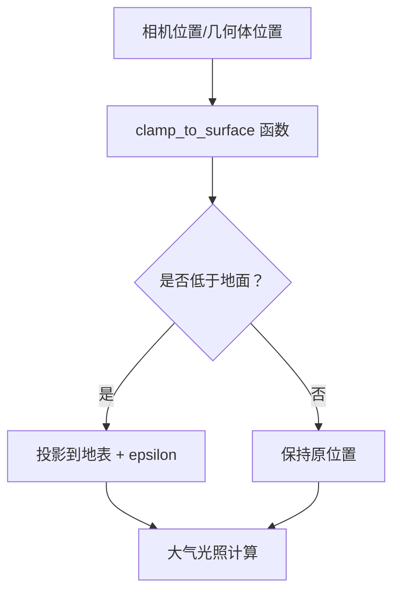

+++
title = "#22173 Fix atmosphere lighting issue for below ground geo"
date = "2025-12-17T00:00:00"
draft = false
template = "pull_request_page.html"
in_search_index = false

[extra]
current_language = "zh-cn"
available_languages = {"en" = { name = "English", url = "/pull_request/bevy/2025-12/pr-22173-en-20251217" }, "zh-cn" = { name = "中文", url = "/pull_request/bevy/2025-12/pr-22173-zh-cn-20251217" }}
+++

# Title

## 基本信息
- **标题**: Fix atmosphere lighting issue for below ground geo
- **PR链接**: https://github.com/bevyengine/bevy/pull/22173
- **作者**: mate-h
- **状态**: 已合并
- **标签**: C-Bug, A-Rendering, S-Ready-For-Final-Review, D-Straightforward
- **创建时间**: 2025-12-17T22:03:14Z
- **合并时间**: 2025-12-17T23:36:11Z
- **合并者**: alice-i-cecile

## 描述翻译

### 目标

- 修复位于地面以下几何体的 atmosphere（大气）光照问题

在 `rendering-dev` Discord 频道中由 Jondolf@ 报告的问题


在 [f8a9f29](https://github.com/bevyengine/bevy/commit/f8a9f296bf45584feb987d626dbf331ac9b01918) 版本上重现

```rs
use bevy::{pbr::EarthlikeAtmosphere, prelude::*};

fn main() {
    App::new()
        .add_plugins(DefaultPlugins)
        .add_systems(Startup, setup)
        .run();
}

fn setup(
    mut commands: Commands,
    mut meshes: ResMut<Assets<Mesh>>,
    mut materials: ResMut<Assets<StandardMaterial>>,
    earthlike_atmosphere: Res<EarthlikeAtmosphere>,
) {
    commands.spawn((
        Mesh3d(meshes.add(Capsule3d::new(0.5, 1.0))),
        MeshMaterial3d(materials.add(Color::WHITE)),
    ));

    // 方向光
    commands.spawn((
        DirectionalLight {
            illuminance: 5000.0,
            shadows_enabled: true,
            ..default()
        },
        Transform::from_xyz(1.0, 2.0, 2.0).looking_at(Vec3::ZERO, Vec3::Y),
    ));

    // 相机和大气
    commands.spawn((
        Camera3d::default(),
        earthlike_atmosphere.get(),
        Transform::from_xyz(10.0, 2.0, 15.0).looking_at(Vec3::new(0.0, 0.0, 0.0), Vec3::Y),
    ));
}
```

### 解决方案

- 在计算行星遮挡之前，将位置钳制到地面表面，并添加一个小的 epsilon 值

### 测试

- 运行了 atmosphere 示例，并通过本地修改将几何体放置在地面以下

---

### 展示

修复前


修复后


## 这个 Pull Request 的故事

这个 PR 解决了 Bevy 引擎中大气渲染系统的一个具体问题。问题出现在当几何体位于行星表面以下时，大气光照计算会产生异常的黑像素。

问题的本质是大气系统基于 Bruneton 的物理模型，该模型假设观察点总是在大气层内。当几何体或相机的位置低于地面时，数学计算会出现问题，特别是涉及平方根的计算。这会导致出现零长度片段，在渲染中表现为黑色像素。

开发者 mate-h 采用了直接且有效的解决方案：创建一个名为 `clamp_to_surface` 的通用函数，将任何低于地面的位置投影到地表，并添加一个小的 epsilon 值（`EPSILON`）来避免数值不稳定性。这个 epsilon 值至关重要，因为它防止了位置恰好等于地面半径时可能出现的数值计算问题。

关键的技术决策是将这个逻辑抽象为一个独立的函数，然后在两个不同的位置调用它：
1. 在 `get_view_position()` 中处理相机位置
2. 在 `pbr_lighting.wgsl` 中处理几何体位置用于光照计算

这个解决方案展示了良好的软件工程实践。与其在两个地方重复相同的钳制逻辑，开发者创建了一个可重用的函数。这不仅减少了代码重复，还确保了整个大气系统中处理地下位置的一致性。

从技术角度来看，钳制操作是在将位置从场景单位（scene units）转换到米（meters）之后执行的。这是合理的，因为大气模型基于物理测量，使用米作为单位。添加 epsilon 值的技巧是处理边界条件的常见方法，可以避免除以零或平方根函数的数值问题。

实现简洁明了：计算位置到原点的距离（半径 `r`），如果小于地面半径加上 epsilon，则将位置沿其法线方向投影到最小半径的球面上。否则，返回原始位置。

这个修复的影响是显著的：现在位于地面以下的几何体能够正确接收大气光照，而不是显示为黑色。这对于需要地下结构或洞穴的游戏场景特别重要，或者当物体由于物理模拟等原因暂时陷入地面时。

值得注意的是，这个解决方案是一个近似方法，但它是一个实用的权衡。从物理上讲，地面以下的点不应该接收大气光照，但游戏引擎通常需要容忍一些非物理情况。通过钳制位置到地面，我们获得了视觉上合理的结果，而计算开销最小。

## 视觉表示



## 关键文件更改

### 1. `crates/bevy_pbr/src/atmosphere/functions.wgsl` (+12/-12)

**变化说明**：添加了 `clamp_to_surface` 函数，并重构了 `get_view_position` 函数来使用这个新函数。

**关键代码**：
```wgsl
/// Clamp a position to the planet surface (with a small epsilon) to avoid underground artifacts.
fn clamp_to_surface(atmosphere: Atmosphere, position: vec3<f32>) -> vec3<f32> {
    let min_radius = atmosphere.bottom_radius + EPSILON;
    let r = length(position);
    if r < min_radius {
        let up = normalize(position);
        return up * min_radius;
    }
    return position;
}

fn get_view_position() -> vec3<f32> {
    var world_pos = view.world_position * settings.scene_units_to_m + vec3(0.0, atmosphere.bottom_radius, 0.0);
    return clamp_to_surface(atmosphere, world_pos);
}
```

**与 PR 目的的关系**：这是核心修复的一部分，确保相机位置始终在地面或以上，避免大气计算中的数值问题。

### 2. `crates/bevy_pbr/src/render/pbr_lighting.wgsl` (+4/-3)

**变化说明**：在光照计算中导入并使用 `clamp_to_surface` 函数来处理几何体位置。

**关键代码**：
```wgsl
#import bevy_pbr::{
    mesh_view_types::POINT_LIGHT_FLAGS_SPOT_LIGHT_Y_NEGATIVE,
    mesh_view_bindings as view_bindings,
    atmosphere::functions::{calculate_visible_sun_ratio, clamp_to_surface},
    atmosphere::bruneton_functions::transmittance_lut_r_mu_to_uv,
}

// ... 在光照计算中 ...
let P_clamped = clamp_to_surface(atmosphere, P_as);
let r = length(P_clamped);
let local_up = normalize(P_clamped);
```

**与 PR 目的的关系**：扩展修复范围到几何体位置，确保地面以下的物体也能正确接收大气光照。

## 扩展阅读

1. **Bevy 大气渲染系统**：了解 Bevy 中大气渲染的实现原理
2. **WGSL 着色器语言**：学习 WebGPU Shading Language 的基础知识
3. **Bruneton 大气模型**：研究物理基础的大气渲染算法
   - Bruneton, E., & Neyret, F. (2008). Precomputed Atmospheric Scattering
4. **数值稳定性技巧**：学习计算机图形学中处理边界条件和数值问题的常见方法
5. **WebGPU 图形编程**：深入了解现代 GPU 图形 API 的使用