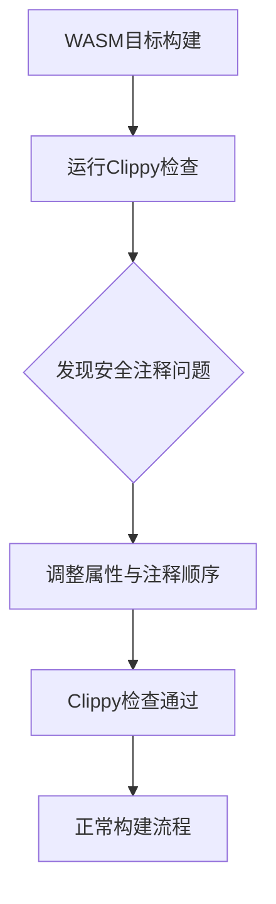

+++
title = "#22174 safety lint in bevy_reflect on wasm"
date = "2025-12-18T00:00:00"
draft = false
template = "pull_request_page.html"
in_search_index = false

[extra]
current_language = "zh-cn"
available_languages = {"en" = { name = "English", url = "/pull_request/bevy/2025-12/pr-22174-en-20251218" }, "zh-cn" = { name = "中文", url = "/pull_request/bevy/2025-12/pr-22174-zh-cn-20251218" }}
labels = ["C-Docs", "D-Trivial", "A-Reflection"]
+++

# Title: safety lint in bevy_reflect on wasm

## Basic Information
- **Title**: safety lint in bevy_reflect on wasm
- **PR Link**: https://github.com/bevyengine/bevy/pull/22174
- **Author**: mockersf
- **Status**: MERGED
- **Labels**: C-Docs, D-Trivial, S-Ready-For-Final-Review, A-Reflection
- **Created**: 2025-12-17T22:24:51Z
- **Merged**: 2025-12-18T18:48:42Z
- **Merged By**: alice-i-cecile

## Description Translation

# 目标

- `cargo clippy --target wasm32-unknown-unknown -p bevy_reflect --no-deps -- -D warnings` 命令失败并显示以下错误：
```
error: unsafe block missing a safety comment
   --> crates/bevy_reflect/src/lib.rs:804:21
    |
804 |                     unsafe {
    |                     ^^^^^^^^
    |
```

## 解决方案

- 调整 lint 属性与安全注释的顺序

## The Story of This Pull Request

开发者在使用 Clippy 对 WebAssembly 目标进行代码检查时遇到了一个问题。当对 `bevy_reflect` 模块运行 `cargo clippy --target wasm32-unknown-unknown` 命令时，Clippy 报告了一个关于 unsafe 块缺少安全注释的错误。这个问题虽然简单，但影响了项目的 CI/CD 流程，因为工具链检查失败会阻碍代码合并。

从技术角度看，这个问题源于代码中属性宏和安全注释的相对位置。在 Rust 中，当使用 `#[expect]` 或类似的 lint 控制属性时，Clippy 期望安全注释直接位于 unsafe 块之前，这样才能正确识别安全注释与对应的 unsafe 代码块。如果在这两者之间插入了其他属性，Clippy 就会认为安全注释缺失。

具体来说，在 `bevy_reflect` 的 lib.rs 文件中，有一个专门用于 WASM 平台的初始化函数。这个函数使用了 unsafe 代码块来调用 `__wasm_call_ctors()` 函数，这是一个在 WASM 环境中必要的初始化步骤。代码原本有一个详细的安全注释，解释了为什么这个调用是安全的，但由于 `#[expect(unsafe_code)]` 属性被放在了安全注释和 unsafe 块之间，Clippy 无法正确识别这种关联。

解决方案很简单但重要：调整代码顺序，将 `#[expect]` 属性移到安全注释之前。这样，安全注释就直接位于 unsafe 块前面，符合 Clippy 的期望。这种修改不改变代码的任何功能行为，只影响代码的组织结构和工具链的解析。

从工程角度看，这个 PR 体现了对工具链兼容性的重视。虽然问题本身很直接，但它确保了项目在不同目标架构上都能通过代码质量检查。特别是对于 WASM 这样的跨平台目标，保持工具链正常工作很重要，因为 WASM 在游戏引擎中有重要的应用场景，如 web 游戏和跨平台部署。

这个修改也展示了 Rust 生态系统中的一个细节：工具链对代码格式和注释位置有特定要求。安全注释是 Rust 中管理 unsafe 代码的重要机制，它要求开发者明确解释为什么特定的 unsafe 操作是安全的。工具链对这类注释的位置有严格要求，以确保代码的可读性和安全性验证。

## Visual Representation



## Key Files Changed

### `crates/bevy_reflect/src/lib.rs` (+4/-4)

这个文件包含了一个专门为 WASM 平台设计的初始化模块。修改只涉及几行代码，目的是解决 Clippy 工具的安全注释检查问题。

```rust
// 修改前：
// SAFETY:
// This will call constructors on wasm platforms at most once (as long as `init` is the only function that calls `__wasm_call_ctors`).
//
// For more information see: https://docs.rs/inventory/latest/inventory/#webassembly-and-constructors
#[expect(
    unsafe_code,
    reason = "This function must be called to use inventory on wasm."
)]
unsafe {
    __wasm_call_ctors();
}

// 修改后：
#[expect(
    unsafe_code,
    reason = "This function must be called to use inventory on wasm."
)]
// SAFETY:
// This will call constructors on wasm platforms at most once (as long as `init` is the only function that calls `__wasm_call_ctors`).
//
// For more information see: https://docs.rs/inventory/latest/inventory/#webassembly-and-constructors
unsafe {
    __wasm_call_ctors();
}
```

修改内容：仅将 `#[expect]` 属性从安全注释之后移动到了安全注释之前。这样 Clippy 就能正确识别安全注释与 unsafe 块的关联关系。

## Further Reading

1. **Rust Clippy 文档** - 了解 Clippy 的各种 lint 规则和配置：https://doc.rust-lang.org/clippy/
2. **Rust Unsafe 代码指南** - 学习如何安全地使用 unsafe Rust：https://doc.rust-lang.org/nomicon/
3. **WebAssembly 与 Rust** - 了解如何在 Rust 项目中集成 WASM：https://rustwasm.github.io/docs/book/
4. **Rust 属性宏文档** - 深入了解 `#[expect]` 等属性宏的用法：https://doc.rust-lang.org/reference/attributes.html
5. **Bevy 引擎的反射系统** - 了解 `bevy_reflect` 模块在游戏引擎中的作用：https://bevyengine.org/learn/book/reflection/