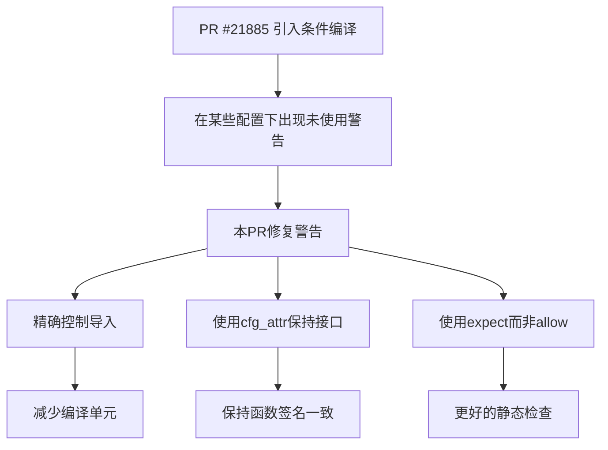

+++
title = "#22175 fix unused warnings in bevy_dev_tools on wasm"
date = "2025-12-18T00:00:00"
draft = false
template = "pull_request_page.html"
in_search_index = false

[extra]
current_language = "zh-cn"
available_languages = {"en" = { name = "English", url = "/pull_request/bevy/2025-12/pr-22175-en-20251218" }, "zh-cn" = { name = "中文", url = "/pull_request/bevy/2025-12/pr-22175-zh-cn-20251218" }}
labels = ["C-Code-Quality", "A-Dev-Tools", "D-Straightforward"]
+++

# fix unused warnings in bevy_dev_tools on wasm

## Basic Information
- **Title**: fix unused warnings in bevy_dev_tools on wasm
- **PR Link**: https://github.com/bevyengine/bevy/pull/22175
- **Author**: mockersf
- **Status**: MERGED
- **Labels**: C-Code-Quality, S-Ready-For-Final-Review, A-Dev-Tools, D-Straightforward
- **Created**: 2025-12-17T22:33:09Z
- **Merged**: 2025-12-18T18:48:42Z
- **Merged By**: alice-i-cecile

## Description Translation
### 目标

- 在 https://github.com/bevyengine/bevy/pull/21885 之后，FPS overlay 在为 wasm 构建（没有 webgpu）时出现了一些未使用的警告

### 解决方案

- 修复这些警告

## The Story of This Pull Request

这个 PR 是关于修复在 WebAssembly (wasm) 目标上构建 bevy_dev_tools 时出现的编译警告。问题源于之前的 PR #21885，它引入了针对不同平台的条件编译逻辑，但在某些特定配置组合下，编译器会检测到未使用的变量和导入。

问题的核心在于条件编译的逻辑不够精确。在之前的 PR #21885 中，开发者添加了条件编译支持，以便在没有 WebGPU 支持的 wasm 平台上禁用某些图形功能。然而，这种条件编译是通过 `#[cfg]` 属性实现的，这些属性控制了整个代码块的编译。当某些导入和变量只在特定条件下使用时，但它们的定义却出现在所有编译配置中时，编译器就会发出未使用警告。

具体来说，在 `fps_overlay.rs` 文件中，有几个与图形渲染相关的导入和变量在 wasm（没有 webgpu）配置下是不需要的。例如：
- `MaterialNode` 来自 `bevy_ui_render`，它依赖于 GPU 功能
- `FrameTimeGraphConfigUniform` 是一个用于着色器的统一缓冲区
- `frame_time_graph_materials` 和 `buffers` 是用于管理图形资源的句柄

当针对 wasm32 架构编译，并且没有启用 `webgpu` 特性时，使用这些功能的代码路径会被条件编译排除。然而，这些导入和函数参数的定义仍然存在，导致编译器警告它们未被使用。

解决方案采用了更细粒度的条件编译。主要做了三处修改：

首先，对 `MaterialNode` 的导入添加了条件编译属性，确保它只在需要的配置下被导入：
```rust
#[cfg(not(all(target_arch = "wasm32", not(feature = "webgpu"))))]
use bevy_ui_render::prelude::MaterialNode;
```

其次，对 `FrameTimeGraphConfigUniform` 的导入做了同样的处理：
```rust
#[cfg(not(all(target_arch = "wasm32", not(feature = "webgpu"))))]
use crate::frame_time_graph::FrameTimeGraphConfigUniform;
```

第三处修改更有意思。函数 `setup` 接收两个参数：`frame_time_graph_materials` 和 `buffers`。在 wasm（没有 webgpu）配置下，整个函数体中不会使用这些参数。但简单地用 `#[cfg]` 包装整个函数或参数列表会破坏函数的签名一致性。因此，开发者采用了 `#[cfg_attr]` 属性来在特定条件下添加 `#[expect(unused)]` 属性：
```rust
#[cfg_attr(
    all(target_arch = "wasm32", not(feature = "webgpu")),
    expect(unused, reason = "Unused variables in wasm32 without webgpu feature")
)]
(mut frame_time_graph_materials, mut buffers): (
    ResMut<Assets<FrametimeGraphMaterial>>,
    ResMut<Assets<ShaderStorageBuffer>>,
),
```

这里使用了 Rust 的 `#[expect(unused)]` 属性，这是一个相对较新的特性，它告诉编译器预期这些变量可能不会被使用，并且解释了原因。这比使用 `#[allow(unused)]` 更好，因为它会在变量实际上被使用时仍然发出警告，而 `#[expect]` 会在预期未使用但实际上被使用时产生警告，反之则静默。

这种方法的优势在于保持了函数签名在不同配置下的一致性，同时明确记录了为什么这些参数在特定条件下可能未使用。代码注释清晰地解释了原因："Unused variables in wasm32 without webgpu feature"。

从工程角度看，这个修复展示了良好的条件编译实践：
1. 精确控制导入，避免不必要的编译单元
2. 使用 `#[cfg_attr]` 保持接口一致性同时处理平台差异
3. 利用 `#[expect]` 而非 `#[allow]` 来获得更好的静态检查

这些更改是防御性的，不会影响功能，但提高了代码质量并消除了开发过程中的干扰性警告。对于跨平台项目如 Bevy 来说，保持清晰的编译输出对于开发者体验很重要，特别是在复杂的条件编译场景中。

## Visual Representation



## Key Files Changed

### `crates/bevy_dev_tools/src/fps_overlay.rs` (+12/-5)

这个文件包含了 FPS overlay 功能的实现。更改的目的是消除在 wasm（没有 webgpu）配置下的编译警告。

#### 关键修改：

1. **条件导入 MaterialNode**：
```rust
// 之前：
use bevy_ui_render::prelude::MaterialNode;

// 之后：
#[cfg(not(all(target_arch = "wasm32", not(feature = "webgpu"))))]
use bevy_ui_render::prelude::MaterialNode;
```

2. **条件导入 FrameTimeGraphConfigUniform**：
```rust
// 之前：
use crate::frame_time_graph::{
    FrameTimeGraphConfigUniform, FrameTimeGraphPlugin, FrametimeGraphMaterial,
};

// 之后：
#[cfg(not(all(target_arch = "wasm32", not(feature = "webgpu"))))]
use crate::frame_time_graph::FrameTimeGraphConfigUniform;
use crate::frame_time_graph::{FrameTimeGraphPlugin, FrametimeGraphMaterial};
```

3. **使用 cfg_attr 处理函数参数**：
```rust
// 之前：
fn setup(
    mut commands: Commands,
    overlay_config: Res<FpsOverlayConfig>,
    mut frame_time_graph_materials: ResMut<Assets<FrametimeGraphMaterial>>,
    mut buffers: ResMut<Assets<ShaderStorageBuffer>>,
) {

// 之后：
fn setup(
    mut commands: Commands,
    overlay_config: Res<FpsOverlayConfig>,
    #[cfg_attr(
        all(target_arch = "wasm32", not(feature = "webgpu")),
        expect(unused, reason = "Unused variables in wasm32 without webgpu feature")
    )]
    (mut frame_time_graph_materials, mut buffers): (
        ResMut<Assets<FrametimeGraphMaterial>>,
        ResMut<Assets<ShaderStorageBuffer>>,
    ),
) {
```

这些更改确保在 wasm（没有 webgpu）配置下，不必要的导入不会被包含，而仍然需要的参数则通过 `#[expect(unused)]` 属性标记，以消除编译警告。

## Further Reading

1. Rust 条件编译文档：https://doc.rust-lang.org/reference/conditional-compilation.html
2. Rust 属性系统，特别是 `#[cfg]` 和 `#[cfg_attr]`：https://doc.rust-lang.org/reference/attributes.html
3. Rust lint 检查器属性，如 `#[allow]`、`#[warn]`、`#[deny]` 和 `#[expect]`：https://doc.rust-lang.org/rustc/lints/levels.html
4. Bevy 引擎的跨平台支持策略：https://bevyengine.org/learn/book/getting-started/setup/#platform-specific-setup

# Full Code Diff
```diff
diff --git a/crates/bevy_dev_tools/src/fps_overlay.rs b/crates/bevy_dev_tools/src/fps_overlay.rs
index f6a3c10269856..47729573e1513 100644
--- a/crates/bevy_dev_tools/src/fps_overlay.rs
+++ b/crates/bevy_dev_tools/src/fps_overlay.rs
@@ -20,13 +20,14 @@ use bevy_ui::{
     widget::{Text, TextUiWriter},
     FlexDirection, GlobalZIndex, Node, PositionType, Val,
 };
+#[cfg(not(all(target_arch = "wasm32", not(feature = "webgpu"))))]
 use bevy_ui_render::prelude::MaterialNode;
 use core::time::Duration;
 use tracing::warn;
 
-use crate::frame_time_graph::{
-    FrameTimeGraphConfigUniform, FrameTimeGraphPlugin, FrametimeGraphMaterial,
-};
+#[cfg(not(all(target_arch = "wasm32", not(feature = "webgpu"))))]
+use crate::frame_time_graph::FrameTimeGraphConfigUniform;
+use crate::frame_time_graph::{FrameTimeGraphPlugin, FrametimeGraphMaterial};
 
 /// [`GlobalZIndex`] used to render the fps overlay.
 ///
@@ -163,8 +164,14 @@ struct FrameTimeGraph;
 fn setup(
     mut commands: Commands,
     overlay_config: Res<FpsOverlayConfig>,
-    mut frame_time_graph_materials: ResMut<Assets<FrametimeGraphMaterial>>,
-    mut buffers: ResMut<Assets<ShaderStorageBuffer>>,
+    #[cfg_attr(
+        all(target_arch = "wasm32", not(feature = "webgpu")),
+        expect(unused, reason = "Unused variables in wasm32 without webgpu feature")
+    )]
+    (mut frame_time_graph_materials, mut buffers): (
+        ResMut<Assets<FrametimeGraphMaterial>>,
+        ResMut<Assets<ShaderStorageBuffer>>,
+    ),
 ) {
     commands
         .spawn((
```