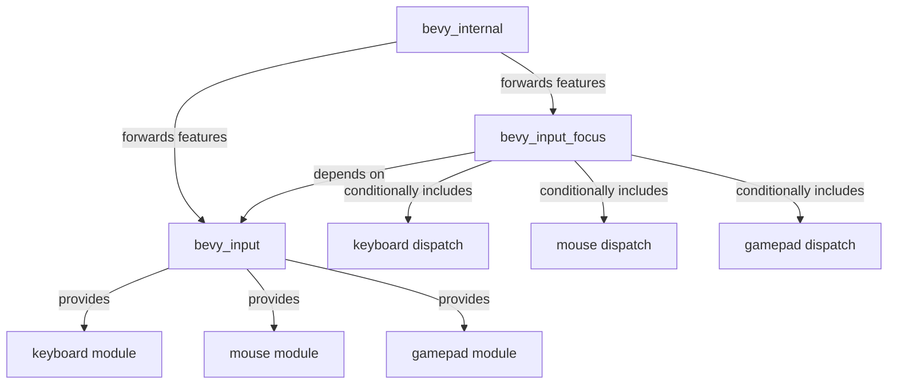

+++
title = "#22177 add features in bevy_input_focus matching bevy_input"
date = "2025-12-18T00:00:00"
draft = false
template = "pull_request_page.html"
in_search_index = true

[taxonomies]
list_display = ["show"]

[extra]
current_language = "en"
available_languages = {"en" = { name = "English", url = "/pull_request/bevy/2025-12/pr-22177-en-20251218" }, "zh-cn" = { name = "中文", url = "/pull_request/bevy/2025-12/pr-22177-zh-cn-20251218" }}
labels = ["A-Input", "D-Straightforward"]
+++

# Title

## Basic Information
- **Title**: add features in bevy_input_focus matching bevy_input
- **PR Link**: https://github.com/bevyengine/bevy/pull/22177
- **Author**: mockersf
- **Status**: MERGED
- **Labels**: A-Input, S-Ready-For-Final-Review, D-Straightforward
- **Created**: 2025-12-17T22:47:25Z
- **Merged**: 2025-12-18T19:11:19Z
- **Merged By**: alice-i-cecile

## Description Translation

# Objective

- #21447 gated input source in bevy_input but not in bevy_input_focus
- #22167 enabled some of them unconditionally, and missed `mouse`

## Solution

- Add features, and forward them between crates

## The Story of This Pull Request

This PR addresses an inconsistency in Bevy's input system feature gating. The problem started when PR #21447 introduced feature flags for input sources (keyboard, mouse, gamepad) in the `bevy_input` crate, allowing users to conditionally compile only the input sources they need. This was a sensible architectural improvement that reduces binary size and compilation time for projects that don't require all input methods.

However, this change created a problem for the `bevy_input_focus` crate, which handles input dispatch to focused entities. While `bevy_input` got proper feature gating, `bevy_input_focus` continued to unconditionally include all input systems. This meant that even if a user disabled the `mouse` feature in `bevy_input`, the mouse-related code in `bevy_input_focus` would still try to compile, leading to compilation errors due to missing dependencies.

PR #22167 attempted to fix this by partially enabling features, but it missed the `mouse` input source and didn't properly forward the features. This left the system in a broken state where disabling certain input features would still cause compilation failures.

The solution implemented here is straightforward and consistent with Rust's feature flag patterns. First, the `bevy_input_focus` crate needs to define the same feature flags as `bevy_input`: `keyboard`, `mouse`, and `gamepad`. Each feature should depend on the corresponding feature in `bevy_input`, creating a proper dependency chain.

The implementation adds these three features to `bevy_input_focus`'s Cargo.toml and makes them dependencies of the default features. This maintains backward compatibility - existing users who don't modify their feature flags will continue to have all input sources available. The `bevy_input` dependency is updated to remove the unconditional feature enabling that was previously hardcoded.

In the Rust code, conditional compilation attributes (`#[cfg(feature = "...")]`) are added around the imports and system registrations for each input type. This ensures that when a feature is disabled, the related code is completely excluded from compilation:

```rust
#[cfg(feature = "gamepad")]
use bevy_input::gamepad::GamepadButtonChangedEvent;
```

The plugin's system registration is similarly gated, so disabled input systems don't get added to the app:

```rust
#[cfg(feature = "keyboard")]
dispatch_focused_input::<KeyboardInput>,
```

Finally, the `bevy_internal` crate, which acts as a meta-crate that re-exports features from multiple Bevy crates, needs to forward these features properly. The changes here use the `?` syntax (`bevy_input_focus?/mouse`) which means the feature is optional - if `bevy_input_focus` isn't included in the build, the feature forwarding is ignored. This is important because `bevy_input_focus` itself might be optional in some configurations.

The architectural pattern here demonstrates proper feature propagation in Rust workspace setups. When a user enables the `keyboard` feature in `bevy_internal`, it now correctly enables:
1. `bevy_input/keyboard` (for the input handling itself)
2. `bevy_input_focus/keyboard` (for focused input dispatch)

This creates a clean, consistent feature hierarchy where disabling an input source removes all related code from the compiled binary, achieving the intended optimization benefits without breaking the build.

## Visual Representation



## Key Files Changed

### File: crates/bevy_input_focus/Cargo.toml
**Changes:** Added feature flags matching bevy_input and updated dependencies
**Why:** To enable conditional compilation of input sources
```toml
# Before:
[features]
default = ["std", "bevy_reflect", "bevy_ecs/async_executor"]

[dependencies]
bevy_input = { path = "../bevy_input", version = "0.18.0-dev", default-features = false, features = [
  "keyboard",
  "gamepad",
] }

# After:
[features]
default = [
  "std",
  "bevy_reflect",
  "bevy_ecs/async_executor",
  "gamepad",
  "keyboard",
  "mouse",
]
gamepad = ["bevy_input/gamepad"]
keyboard = ["bevy_input/keyboard"]
mouse = ["bevy_input/mouse"]

[dependencies]
bevy_input = { path = "../bevy_input", version = "0.18.0-dev", default-features = false }
```

### File: crates/bevy_input_focus/src/lib.rs
**Changes:** Added conditional compilation around input-specific imports and systems
**Why:** To exclude code when features are disabled
```rust
// Before:
use bevy_input::{gamepad::GamepadButtonChangedEvent, keyboard::KeyboardInput, mouse::MouseWheel};

// After:
#[cfg(feature = "gamepad")]
use bevy_input::gamepad::GamepadButtonChangedEvent;
#[cfg(feature = "keyboard")]
use bevy_input::keyboard::KeyboardInput;
#[cfg(feature = "mouse")]
use bevy_input::mouse::MouseWheel;

// System registration before:
.add_systems(
    PreUpdate,
    (
        dispatch_focused_input::<KeyboardInput>,
        dispatch_focused_input::<GamepadButtonChangedEvent>,
        dispatch_focused_input::<MouseWheel>,
    )
)

// System registration after:
.add_systems(
    PreUpdate,
    (
        #[cfg(feature = "keyboard")]
        dispatch_focused_input::<KeyboardInput>,
        #[cfg(feature = "gamepad")]
        dispatch_focused_input::<GamepadButtonChangedEvent>,
        #[cfg(feature = "mouse")]
        dispatch_focused_input::<MouseWheel>,
    )
)
```

### File: crates/bevy_internal/Cargo.toml
**Changes:** Updated feature forwarding to include bevy_input_focus
**Why:** To ensure features propagate correctly through the crate hierarchy
```toml
# Before:
mouse = ["bevy_input/mouse"]
keyboard = ["bevy_input/keyboard"]
gamepad = ["bevy_input/gamepad"]

# After:
mouse = ["bevy_input/mouse", "bevy_input_focus?/mouse"]
keyboard = ["bevy_input/keyboard", "bevy_input_focus?/keyboard"]
gamepad = ["bevy_input/gamepad", "bevy_input_focus?/gamepad"]
```

## Further Reading

- [Cargo Features Documentation](https://doc.rust-lang.org/cargo/reference/features.html) - Official Rust documentation on feature flags
- [Conditional Compilation in Rust](https://doc.rust-lang.org/reference/conditional-compilation.html) - Guide to `#[cfg]` attributes
- [Bevy's Module Organization](https://bevyengine.org/learn/book/getting-started/ecs/) - Understanding Bevy's crate structure
- [Feature Unification in Cargo](https://doc.rust-lang.org/cargo/reference/features.html#feature-unification) - How Cargo handles feature resolution across dependencies