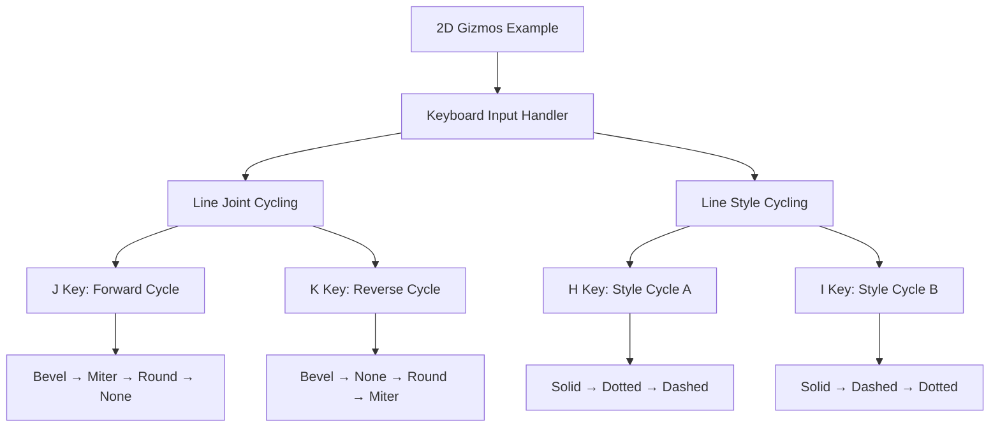

+++
title = "#22178 Add missing keybind to gizmos example"
date = "2025-12-18T00:00:00"
draft = false
template = "pull_request_page.html"
in_search_index = true

[taxonomies]
list_display = ["show"]

[extra]
current_language = "en"
available_languages = {"en" = { name = "English", url = "/pull_request/bevy/2025-12/pr-22178-en-20251218" }, "zh-cn" = { name = "中文", url = "/pull_request/bevy/2025-12/pr-22178-zh-cn-20251218" }}
labels = ["C-Examples", "A-Gizmos", "D-Straightforward"]
+++

# Title

## Basic Information
- **Title**: Add missing keybind to gizmos example
- **PR Link**: https://github.com/bevyengine/bevy/pull/22178
- **Author**: pablo-lua
- **Status**: MERGED
- **Labels**: C-Examples, S-Ready-For-Final-Review, A-Gizmos, D-Straightforward
- **Created**: 2025-12-17T22:49:57Z
- **Merged**: 2025-12-18T18:45:30Z
- **Merged By**: alice-i-cecile

## Description Translation

# Objective

- I noticed that the example 2d_gizmos said about pressing J or K to cycle between joints, but letter K wasn't working, same with letter I

## Solution

- Just add the keybinds and make them cycle in reverse.

Other possible solution would be removing the mention to such letters entirely, but the example looks cooler with those.

## The Story of This Pull Request

This pull request addresses a straightforward but important issue in the Bevy game engine's examples: the 2D gizmos example had documentation that didn't match its actual functionality. The problem was a simple case of missing keyboard bindings that were referenced in the example's user interface or documentation.

The 2D gizmos example demonstrates Bevy's graphical debugging tools, allowing developers to visualize various geometric primitives and their rendering options. Like many interactive examples in Bevy, it uses keyboard input to let users dynamically adjust parameters and see the effects in real-time. Specifically, the example documented that pressing the "J" and "K" keys would cycle between different line joint types (how lines connect at corners), and the "I" key would cycle through line styles. However, only the "J" key binding was actually implemented.

The developer identified this discrepancy by testing the example and finding that pressing "K" and "I" had no effect, despite the documentation suggesting they should. This creates a poor user experience because it breaks the example's interactive nature and undermines the reliability of Bevy's documentation. From an educational perspective, incomplete examples can confuse developers trying to learn the engine.

The solution implemented in this PR is minimal and pragmatic: add the missing key bindings with appropriate functionality. For the "K" key, the developer implemented a reverse cycle through the joint types compared to the "J" key. This makes intuitive sense - having one key cycle forward and another cycle backward provides better usability than having both keys cycle in the same direction.

The implementation uses Rust's `match` expression pattern to handle state transitions elegantly. For the line joints, the existing "J" key binding cycled through four joint types: `Bevel → Miter → Round(4) → None → Bevel`. The new "K" key binding implements the reverse cycle: `Bevel → None → Round(4) → Miter → Bevel`. This creates a symmetrical pair of controls where users can navigate in either direction through the available options.

Similarly, for the "I" key binding for line styles, the developer implemented a cycle through three styles: `Solid → Dashed → Dotted → Solid`. The existing "H" key binding already cycled through styles in a different order (`Solid → Dotted → Dashed → Solid`), so the new binding provides an alternative navigation pattern.

From an engineering perspective, this fix demonstrates several good practices:
1. **Consistency in API design**: The example now delivers on its documented promises
2. **User experience considerations**: Providing both forward and reverse cycling improves usability
3. **Minimal, focused changes**: The PR modifies only what's necessary without introducing unnecessary complexity
4. **Preservation of existing behavior**: The fix doesn't break or alter the existing working functionality

The alternative solution mentioned in the PR description - removing the documentation references to the non-functional keys - was considered but rejected because it would make the example "less cool." This reflects a good understanding of developer experience: interactive examples with rich functionality are more engaging and educational than pared-down versions.

The changes are self-contained within the example file and don't affect the core Bevy engine. However, they're important for maintaining the quality of Bevy's educational materials. Examples serve as both documentation and sandboxes for learning, so their accuracy directly impacts developer onboarding and satisfaction.

## Visual Representation



## Key Files Changed

### `examples/gizmos/2d_gizmos.rs` (+19/-0)

This file contains the 2D gizmos example that demonstrates Bevy's debugging visualization tools. The changes add missing keyboard bindings that were documented but not implemented.

**Key modifications:**

1. **Added "I" key binding for line style cycling:**
```rust
if keyboard.just_pressed(KeyCode::KeyI) {
    config.line.style = match config.line.style {
        GizmoLineStyle::Solid => GizmoLineStyle::Dashed {
            gap_scale: 3.0,
            line_scale: 5.0,
        },
        GizmoLineStyle::Dotted => GizmoLineStyle::Solid,
        _ => GizmoLineStyle::Dotted,
    };
}
```

2. **Added "K" key binding for reverse joint cycling:**
```rust
if keyboard.just_pressed(KeyCode::KeyK) {
    config.line.joints = match config.line.joints {
        GizmoLineJoint::Bevel => GizmoLineJoint::None,
        GizmoLineJoint::Miter => GizmoLineJoint::Bevel,
        GizmoLineJoint::Round(_) => GizmoLineJoint::Miter,
        GizmoLineJoint::None => GizmoLineJoint::Round(4),
    };
}
```

These changes complete the keyboard controls described in the example, providing symmetrical navigation (forward/reverse) through available options and improving the interactive learning experience.

## Further Reading

1. **Bevy Gizmos Documentation**: The official Bevy documentation on gizmos and debugging tools
2. **Bevy Input Handling**: Understanding how Bevy processes keyboard and mouse input through the `Input` system
3. **Rust Pattern Matching**: The `match` expression pattern used extensively in this implementation for state transitions
4. **Game Engine Example Design**: Best practices for creating educational examples in game engine documentation