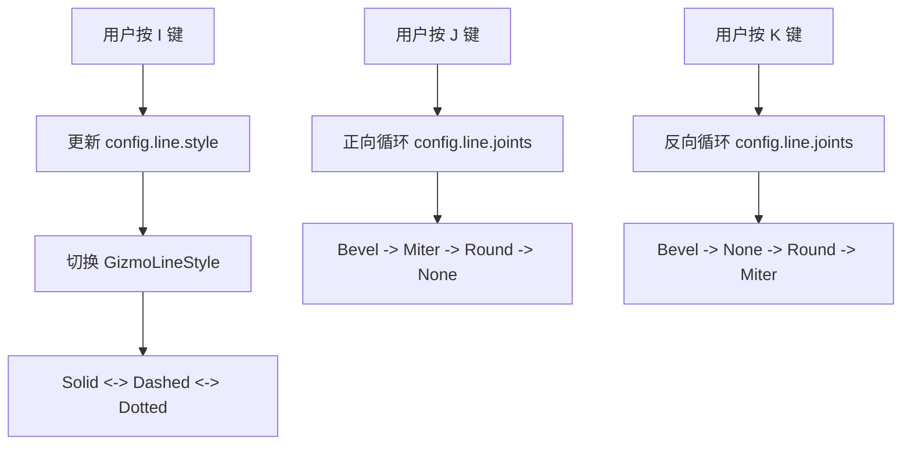

+++
title = "#22178 Add missing keybind to gizmos example"
date = "2025-12-18T00:00:00"
draft = false
template = "pull_request_page.html"
in_search_index = false

[extra]
current_language = "zh-cn"
available_languages = {"en" = { name = "English", url = "/pull_request/bevy/2025-12/pr-22178-en-20251218" }, "zh-cn" = { name = "中文", url = "/pull_request/bevy/2025-12/pr-22178-zh-cn-20251218" }}
+++

# Title

## 基本信息
- **标题**: Add missing keybind to gizmos example
- **PR链接**: https://github.com/bevyengine/bevy/pull/22178
- **作者**: pablo-lua
- **状态**: MERGED
- **标签**: C-Examples, S-Ready-For-Final-Review, A-Gizmos, D-Straightforward
- **创建时间**: 2025-12-17T22:49:57Z
- **合并时间**: 2025-12-18T18:45:30Z
- **合并者**: alice-i-cecile

## 描述翻译
- 我注意到 2d_gizmos 示例中提到了按 J 或 K 来在关节类型之间切换，但 K 键不起作用，I 键也一样。

### 解决方案
- 只需添加这些键位绑定并让它们反向循环。

另一种可能的解决方案是完全移除对这些字母的提及，但示例包含这些功能看起来更酷。

---

## 这个 PR 的故事

这个 PR 是关于修复 Bevy 引擎中一个示例项目的一个小问题。用户 pablo-lua 在运行 `2d_gizmos` 示例时发现了一个功能与文档不符的 bug。

问题的核心很简单：代码注释说明了按 `J` 或 `K` 键可以循环切换线条关节（`GizmoLineJoint`）类型，按 `I` 键可以循环切换线条样式（`GizmoLineStyle`）。然而，实际的代码只实现了 `J` 键的功能，`K` 和 `I` 键的响应逻辑缺失了。

从工程角度看，这是一个典型的示例代码与功能说明不同步的问题。示例代码不仅是功能的展示，也是用户学习 API 用法的重要资料。这种不一致会误导用户，让他们以为某个功能存在但实际上不可用，从而可能花费不必要的时间排查问题。

开发者采取了最直接的解决方案：补全缺失的逻辑。他们添加了两个新的 `if` 分支来响应 `KeyCode::KeyI` 和 `KeyCode::KeyK` 按键事件。

对于 `I` 键（控制线条样式）的修复逻辑是：它在 `Solid`、`Dashed` 和 `Dotted` 三种样式之间循环。之前的代码只处理了 `J` 键（正向循环关节），因此修复 `K` 键时需要实现一个反向循环的逻辑，以提供更丰富的交互方式。这样 `J` 和 `K` 键分别提供了正向和反向浏览关节选项的功能，提升了示例的交互性和教学价值。

这种修复方式有几个优点：
1.  **完整性**：使示例代码的功能与其描述完全一致。
2.  **用户体验**：提供了双向导航，用户操作更灵活。
3.  **代码清晰**：逻辑简单明了，易于理解。

从代码质量角度看，这个 PR 也遵循了良好的实践。新增的代码结构与已有的 `J` 键处理逻辑高度一致，都使用了 `match` 表达式来定义状态循环，保持了代码风格统一。同时，开发者考虑到了边缘情况，在每个 `match` 表达式中都使用了 `_` 分支作为兜底，确保状态切换的鲁棒性。

这个更改虽然很小，但它体现了对细节的关注。对于开源项目，尤其是像 Bevy 这样的游戏引擎，示例代码的质量直接影响开发者的学习体验和上手难度。及时修复这类文档与实现不一致的问题，有助于维护项目的专业性和可信度。

---

## 视觉表示



---

## 关键文件更改

**文件**: `examples/gizmos/2d_gizmos.rs` (+19/-0)

**更改说明**: 为 `2d_gizmos` 示例添加了缺失的按键绑定功能，使 `I` 键可以切换线条样式，`K` 键可以反向切换线条关节类型。

**关键代码片段**:
```rust
// 这是新增的 I 键处理逻辑，用于切换线条样式
if keyboard.just_pressed(KeyCode::KeyI) {
    config.line.style = match config.line.style {
        GizmoLineStyle::Solid => GizmoLineStyle::Dashed {
            gap_scale: 3.0,
            line_scale: 5.0,
        },
        GizmoLineStyle::Dotted => GizmoLineStyle::Solid,
        _ => GizmoLineStyle::Dotted,
    };
}

// 这是新增的 K 键处理逻辑，用于反向切换线条关节类型
if keyboard.just_pressed(KeyCode::KeyK) {
    config.line.joints = match config.line.joints {
        GizmoLineJoint::Bevel => GizmoLineJoint::None,
        GizmoLineJoint::Miter => GizmoLineJoint::Bevel,
        GizmoLineJoint::Round(_) => GizmoLineJoint::Miter,
        GizmoLineJoint::None => GizmoLineJoint::Round(4),
    };
}
```

**关系说明**: 这些新增的代码块与现有的 `J` 键处理逻辑共同构成了完整的按键交互系统，实现了示例描述中承诺的所有功能。

---

## 延伸阅读

- [Bevy Gizmos 官方文档](https://docs.rs/bevy/latest/bevy/gizmos/index.html) - 了解 Bevy 中 Gizmos 系统的完整功能
- [Bevy 输入处理指南](https://bevy-cheatbook.github.io/input/index.html) - 学习如何在 Bevy 中处理键盘、鼠标等输入事件
- [Rust 的 match 表达式](https://doc.rust-lang.org/book/ch06-02-match.html) - 理解代码中使用的模式匹配机制
- [示例代码的重要性](https://documentation.divio.com/) - 了解优秀文档和示例代码在软件开发中的作用

---

# 完整代码差异
```diff
diff --git a/examples/gizmos/2d_gizmos.rs b/examples/gizmos/2d_gizmos.rs
index 0db7e6ac55a7e..2485b12d6fdc5 100644
--- a/examples/gizmos/2d_gizmos.rs
+++ b/examples/gizmos/2d_gizmos.rs
@@ -149,6 +149,16 @@ fn update_config(
             _ => GizmoLineStyle::Solid,
         };
     }
+    if keyboard.just_pressed(KeyCode::KeyI) {
+        config.line.style = match config.line.style {
+            GizmoLineStyle::Solid => GizmoLineStyle::Dashed {
+                gap_scale: 3.0,
+                line_scale: 5.0,
+            },
+            GizmoLineStyle::Dotted => GizmoLineStyle::Solid,
+            _ => GizmoLineStyle::Dotted,
+        };
+    }
     if keyboard.just_pressed(KeyCode::KeyJ) {
         config.line.joints = match config.line.joints {
             GizmoLineJoint::Bevel => GizmoLineJoint::Miter,
@@ -158,6 +168,15 @@ fn update_config(
         };
     }
 
+    if keyboard.just_pressed(KeyCode::KeyK) {
+        config.line.joints = match config.line.joints {
+            GizmoLineJoint::Bevel => GizmoLineJoint::None,
+            GizmoLineJoint::Miter => GizmoLineJoint::Bevel,
+            GizmoLineJoint::Round(_) => GizmoLineJoint::Miter,
+            GizmoLineJoint::None => GizmoLineJoint::Round(4),
+        };
+    }
+
     let (my_config, _) = config_store.config_mut::<MyRoundGizmos>();
     if keyboard.pressed(KeyCode::ArrowUp) {
         my_config.line.width += 5. * time.delta_secs();
```