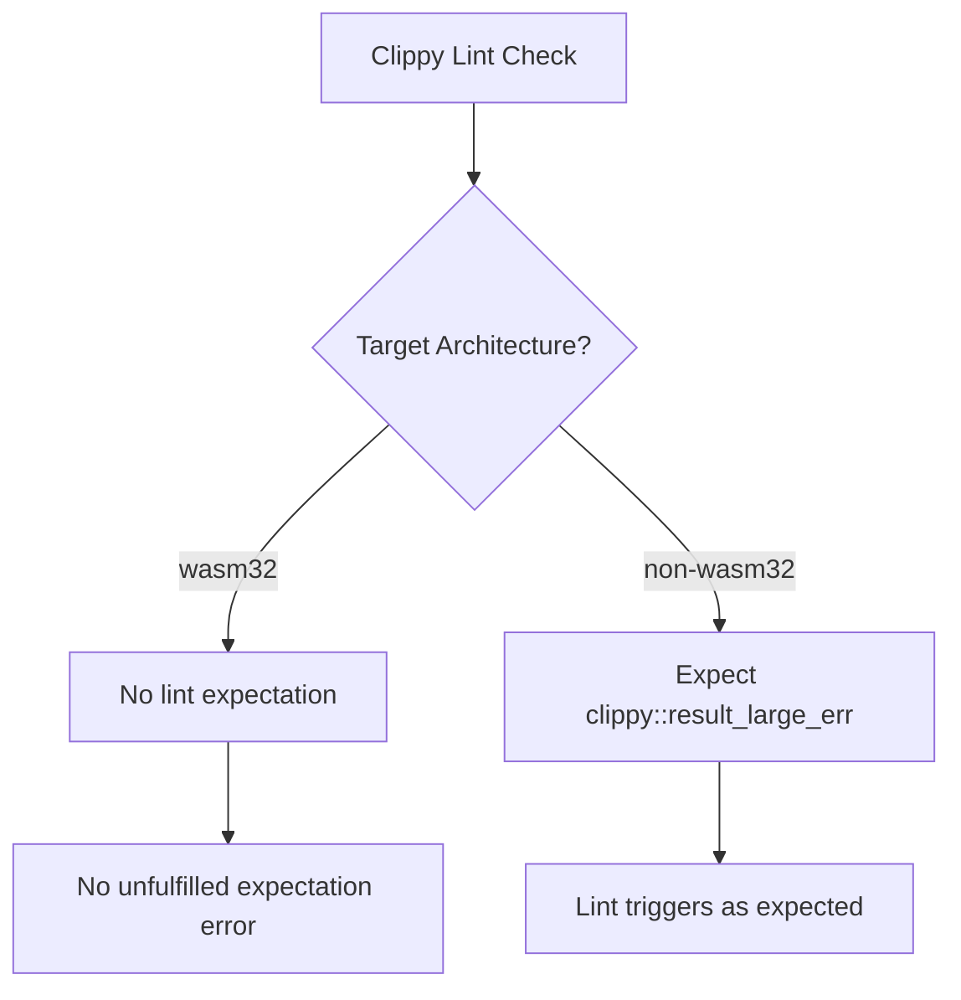

+++
title = "#22181 bevy_asset fails lint expectation in wasm on ProcessError"
date = "2025-12-18T00:00:00"
draft = false
template = "pull_request_page.html"
in_search_index = true

[taxonomies]
list_display = ["show"]

[extra]
current_language = "en"
available_languages = {"en" = { name = "English", url = "/pull_request/bevy/2025-12/pr-22181-en-20251218" }, "zh-cn" = { name = "中文", url = "/pull_request/bevy/2025-12/pr-22181-zh-cn-20251218" }}
labels = ["A-Assets", "C-Code-Quality"]
+++

# bevy_asset fails lint expectation in wasm on ProcessError

## Basic Information
- **Title**: bevy_asset fails lint expectation in wasm on ProcessError
- **PR Link**: https://github.com/bevyengine/bevy/pull/22181
- **Author**: mockersf
- **Status**: MERGED
- **Labels**: A-Assets, C-Code-Quality, S-Ready-For-Final-Review
- **Created**: 2025-12-17T23:56:01Z
- **Merged**: 2025-12-18T18:45:30Z
- **Merged By**: alice-i-cecile

## Description
**Objective**

- `cargo clippy --target wasm32-unknown-unknown -p bevy_asset --no-deps -- -D warnings` fails with
```
error: this lint expectation is unfulfilled
   --> crates/bevy_asset/src/processor/process.rs:235:9
    |
235 |         clippy::result_large_err,
    |         ^^^^^^^^^^^^^^^^^^^^^^^^
    |
```

**Solution**

- don't expect the lint in wasm

## The Story of This Pull Request

This pull request addresses a specific issue with Clippy lint expectations when building for WebAssembly (wasm) targets. The problem occurred when running Clippy with the wasm32-unknown-unknown target on the bevy_asset crate.

The issue was straightforward: the codebase had an `#[expect]` attribute for the `clippy::result_large_err` lint on line 235 of `crates/bevy_asset/src/processor/process.rs`. When building for native targets, this lint would trigger as expected, and the `#[expect]` attribute would suppress the warning. However, when building for WebAssembly, the lint condition that would normally trigger this warning didn't occur, leading to Clippy reporting an error about an "unfulfilled lint expectation."

The `#[expect]` attribute in Rust is a relatively new feature that allows developers to explicitly mark that they expect a particular lint to trigger at a specific location. This is useful for tracking technical debt or known issues that need to be addressed later. When the expected lint doesn't trigger, Clippy reports an error to ensure that the expectation is either removed (if the issue is fixed) or remains relevant.

In this case, the `clippy::result_large_err` lint warns when a function returns a `Result` with a large `Err` variant. The concern is that returning large errors by value can be inefficient due to stack usage. However, this behavior might differ on wasm targets due to different memory models or optimization characteristics.

The solution was to conditionally apply the `#[expect]` attribute only when not targeting wasm32. This was done using Rust's conditional compilation attribute `#[cfg_attr]`, which applies attributes based on compile-time conditions. The change ensures that the lint expectation is only active for non-wasm targets, preventing the unfulfilled expectation error when building for WebAssembly.

This fix demonstrates careful consideration of cross-platform compatibility in Rust projects. It shows how different compilation targets can affect static analysis tools like Clippy, and how conditional compilation can be used to handle target-specific differences in code quality expectations.

## Visual Representation



## Key Files Changed

### `crates/bevy_asset/src/processor/process.rs` (+6/-3)

**What changed and why**: The change modifies a lint expectation attribute to only apply when not targeting WebAssembly. This prevents Clippy from reporting an unfulfilled lint expectation error when building for wasm32 targets.

**Code snippet showing the change**:

```rust
// Before:
#[expect(
    clippy::result_large_err,
    reason = "this is only an error here because this isn't a future"
)]

// After:
#[cfg_attr(
    not(target_arch = "wasm32"),
    expect(
        clippy::result_large_err,
        reason = "this is only an error here because this isn't a future"
    )
)]
```

**How these changes relate to the overall purpose**: The change directly addresses the reported issue by ensuring the lint expectation is only active for non-wasm targets, eliminating the unfulfilled expectation error when building for WebAssembly.

## Further Reading

1. **Rust Conditional Compilation**: The Rust Reference documentation on conditional compilation using `#[cfg]` and `#[cfg_attr]` attributes.
2. **Clippy's `expect` attribute**: Documentation on Clippy's `#[expect]` attribute for managing lint expectations.
3. **WebAssembly target in Rust**: Information about building Rust code for WebAssembly targets and target-specific considerations.
4. **`result_large_err` lint**: Details about the Clippy lint that warns about returning large `Err` variants in `Result` types.