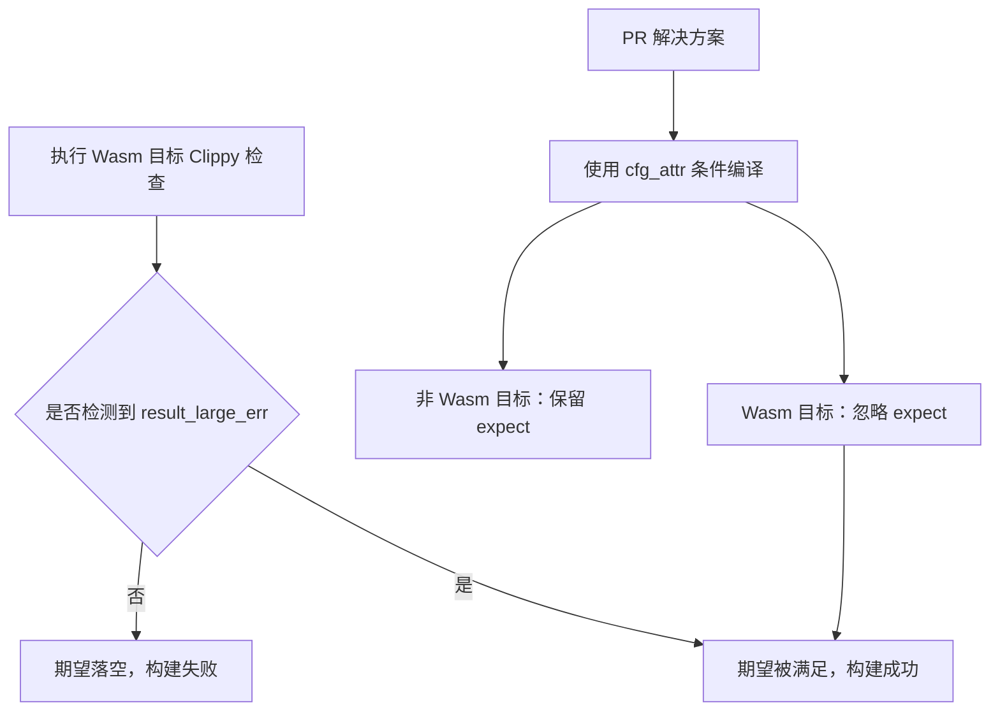

+++
title = "#22181 bevy_asset fails lint expectation in wasm on ProcessError"
date = "2025-12-18T00:00:00"
draft = false
template = "pull_request_page.html"
in_search_index = false

[extra]
current_language = "zh-cn"
available_languages = {"en" = { name = "English", url = "/pull_request/bevy/2025-12/pr-22181-en-20251218" }, "zh-cn" = { name = "中文", url = "/pull_request/bevy/2025-12/pr-22181-zh-cn-20251218" }}
+++

# Title

## Basic Information
- **Title**: bevy_asset fails lint expectation in wasm on ProcessError
- **PR链接**: https://github.com/bevyengine/bevy/pull/22181
- **作者**: mockersf
- **状态**: 已合并
- **标签**: A-Assets, C-Code-Quality, S-Ready-For-Final-Review
- **创建时间**: 2025-12-17T23:56:01Z
- **合并时间**: 2025-12-18T18:45:30Z
- **合并者**: alice-i-cecile

## 描述翻译

### 目标
- 执行 `cargo clippy --target wasm32-unknown-unknown -p bevy_asset --no-deps -- -D warnings` 命令失败，错误信息如下：
```
error: this lint expectation is unfulfilled
   --> crates/bevy_asset/src/processor/process.rs:235:9
    |
235 |         clippy::result_large_err,
    |         ^^^^^^^^^^^^^^^^^^^^^^^^
    |
```

### 解决方案
- 在 WebAssembly (Wasm) 目标下不期望 (expect) 该 lint 规则生效。

## 这个 PR 的故事

这是一个关于条件编译 (conditional compilation) 和构建工具链兼容性的典型案例。开发者在尝试为 `bevy_asset` 模块的 WebAssembly 目标运行 Clippy 静态分析时遇到了构建失败。问题并不在于代码逻辑错误，而在于代码质量工具 (linter) 的期望配置与实际执行结果不匹配。

**问题的本质** 是 `#[expect(clippy::result_large_err)]` 属性的工作原理。这个属性告诉 Clippy：“我期望这里会触发 `result_large_err` 这个 lint 警告，请检查”。如果 Clippy 运行后确实在这个位置检测到了该 lint 违规，它会抑制这个警告，因为开发者已经明确表示“我知道这里有问题”。然而，如果 Clippy 运行后没有检测到这个 lint 违规，那么“期望”就落空了，这本身会被视为一个错误 (在 `-D warnings` 标志下)。

在非 Wasm 目标上，这个 `ProcessError` 类型可能因为包含了较大的类型 (如 `Box<dyn std::error::Error + Send + Sync>`) 而触发 `result_large_err` 警告。但是，当目标架构是 `wasm32` 时，编译环境可能不同，例如某些 trait 对象的实现细节或大小可能发生变化，导致 Clippy 不再认为这个 `Result` 的 `Err` 变体过大。因此，同一个 `#[expect]` 属性在 Wasm 目标下变得“不被满足”。

**解决方案** 直接而精确：使用条件编译属性 `#[cfg_attr(...)]` 将 `#[expect]` 属性包裹起来。修改后，只有在**非** wasm32 架构的目标上编译时，这个 `#[expect]` 属性才会生效。对于 wasm32 目标，该属性根本不会被包含在代码中，因此也就没有“期望落空”的问题。

这个修复展示了处理跨平台代码质量检查的常见模式。当某些 lint 规则在不同平台上的行为不一致时，使用条件编译来调整 lint 配置是一种标准做法。这确保了在保持代码质量检查的同时，不破坏任何目标平台的构建流程。

## 关系图



## 主要文件更改

**文件**: `crates/bevy_asset/src/processor/process.rs` (+6/-3)

这是本次 PR 修改的唯一文件，目的是解决针对 WebAssembly 目标的 Clippy 检查失败问题。

### 修改详情与原因

修改位于一个 trait 方法 `reader_required_features` 的属性上。原始代码使用 `#[expect]` 属性来抑制一个已知的、但暂时可以接受的 lint 警告。然而，这个警告在 Wasm 目标下不会触发，导致“期望落空”的错误。

**修改前**:
```rust
    #[expect(
        clippy::result_large_err,
        reason = "this is only an error here because this isn't a future"
    )]
```

**修改后**:
```rust
    #[cfg_attr(
        not(target_arch = "wasm32"),
        expect(
            clippy::result_large_err,
            reason = "this is only an error here because this isn't a future"
        )
    )]
```

**关键点**:
1.  **技术细节**：`#[cfg_attr(condition, attribute)]` 是一个元属性，它仅在满足 `condition` 时才将 `attribute` 应用到代码项上。
2.  **条件**：`not(target_arch = "wasm32")` 表示“当目标架构不等于 `wasm32` 时”。
3.  **效果**：对于 Wasm 目标，`#[expect]` 属性被完全移除，因此 Clippy 不会检查其是否满足。对于其他目标，属性保持不变，继续抑制 `result_large_err` 警告。
4.  **注释保留**：`reason` 字符串也一并被条件编译保护，确保了注释只在相关场景下存在。

这个修改与 PR 的总体目标完全一致：解决 Wasm 目标下的构建错误，同时保留对非 Wasm 目标的原有 lint 检查行为。

## 延伸阅读

1.  **Rust 条件编译**:
    - [Rust 官方文档：Conditional compilation](https://doc.rust-lang.org/reference/conditional-compilation.html)
    - 重点关注 `cfg` 和 `cfg_attr` 属性的使用。

2.  **Clippy Lint 工具**:
    - [Clippy 官方文档](https://doc.rust-lang.org/stable/clippy/)
    - 了解 `#[allow]`, `#[warn]`, `#[deny]`, 和 `#[expect]` 这些 lint 控制属性的区别和用途。

3.  **Rust 和 WebAssembly**:
    - [The Rust and WebAssembly Book](https://rustwasm.github.io/docs/book/)
    - 了解 Rust 代码在编译到 Wasm 时可能遇到的平台差异。

4.  **关于 result_large_err**:
    - [Clippy lint: result_large_err](https://rust-lang.github.io/rust-clippy/master/index.html#result_large_err)
    - 理解这个 lint 规则检查什么（返回的 `Result` 类型的 `Err` 变体过大可能影响性能），以及为何在特定场景下需要抑制它。

# Full Code Diff
diff --git a/crates/bevy_asset/src/processor/process.rs b/crates/bevy_asset/src/processor/process.rs
index d4398af78c540..925aa8a8afb0b 100644
--- a/crates/bevy_asset/src/processor/process.rs
+++ b/crates/bevy_asset/src/processor/process.rs
@@ -231,9 +231,12 @@ pub trait ErasedProcessor: Send + Sync {
     ) -> BoxedFuture<'a, Result<Box<dyn AssetMetaDyn>, ProcessError>>;
     /// Type-erased variant of [`Process::reader_required_features`].
     // Note: This takes &self just to be dyn compatible.
-    #[expect(
-        clippy::result_large_err,
-        reason = "this is only an error here because this isn't a future"
+    #[cfg_attr(
+        not(target_arch = "wasm32"),
+        expect(
+            clippy::result_large_err,
+            reason = "this is only an error here because this isn't a future"
+        )
     )]
     fn reader_required_features(
         &self,