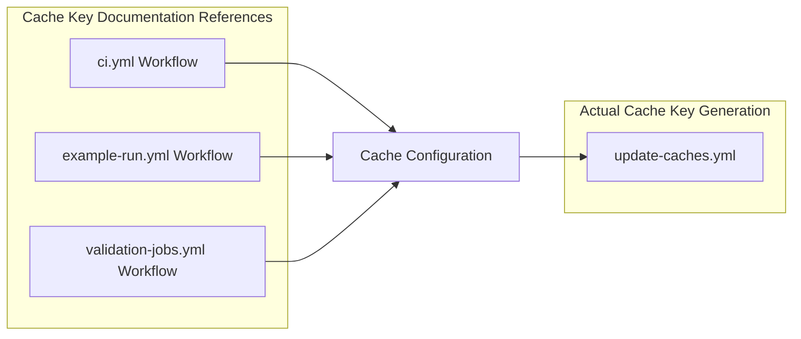

+++
title = "#22186 Update the key creation for `cache-restore` is done on `update-cachesyml`"
date = "2025-12-18T00:00:00"
draft = false
template = "pull_request_page.html"
in_search_index = true

[taxonomies]
list_display = ["show"]

[extra]
current_language = "en"
available_languages = {"en" = { name = "English", url = "/pull_request/bevy/2025-12/pr-22186-en-20251218" }, "zh-cn" = { name = "中文", url = "/pull_request/bevy/2025-12/pr-22186-zh-cn-20251218" }}
labels = ["C-Docs", "D-Trivial", "A-Build-System"]
+++

# Title
Update the key creation for `cache-restore` is done on `update-cachesyml`

## Basic Information
- **Title**: Update the key creation for `cache-restore` is done on `update-cachesyml`
- **PR Link**: https://github.com/bevyengine/bevy/pull/22186
- **Author**: WaterWhisperer
- **Status**: MERGED
- **Labels**: C-Docs, D-Trivial, A-Build-System, S-Ready-For-Final-Review
- **Created**: 2025-12-18T11:16:30Z
- **Merged**: 2025-12-18T18:43:09Z
- **Merged By**: alice-i-cecile

## Description Translation
# Objective

Fixes #22055 

## Solution

Replace `See .github/workflows/validation-jobs.yml for how keys are generated` with `See .github/workflows/update-caches.yml for how keys are generated` 

## Testing

None (comment)

## The Story of This Pull Request

This PR addresses a documentation issue in the Bevy engine's GitHub Actions workflows. The problem was straightforward: several workflow files contained outdated comments that referenced the wrong file for understanding how cache keys are generated.

When developers or contributors look at the cache restoration configuration in GitHub Actions, they need to understand how cache keys are structured to troubleshoot caching issues or modify the caching strategy. The comments in multiple workflow files were pointing to `.github/workflows/validation-jobs.yml`, but the actual cache key generation logic had been moved to a dedicated file called `.github/workflows/update-caches.yml`. This mismatch created confusion and wasted time for anyone trying to understand the cache key generation process.

The solution was simple but important: update all incorrect references to point to the correct file. This involved changing 19 lines across 3 different workflow files. Each change followed the same pattern - replacing the outdated file reference in a comment with the correct one. While the change itself was minimal, it significantly improved the developer experience by providing accurate documentation.

The technical context here involves GitHub Actions caching strategies. In Bevy's CI setup, cache keys are constructed using a combination of factors: the operating system, toolchain version, target architecture, and a hash of the Cargo.toml files. The `restore-keys` configuration uses partial key matching to find the most recent compatible cache. The comment being updated explains where to find the logic that generates these cache keys, which is essential for understanding why specific cache keys are chosen and how they might need to be adjusted when the project's dependencies or build configuration changes.

This fix doesn't change any functional code - it only updates comments. However, accurate documentation is critical in complex CI/CD pipelines where caching can significantly impact build times. Incorrect documentation could lead to developers looking in the wrong place when trying to debug cache misses or optimize build performance.

The implementation shows good attention to detail. The developer didn't just fix one instance but systematically updated all occurrences across the codebase. This comprehensive approach prevents the issue from reoccurring in different workflow files and ensures consistency throughout the CI configuration.

From an engineering perspective, this PR demonstrates the importance of maintaining accurate documentation, especially in distributed configuration files. When logic is refactored or moved (as apparently happened when cache key generation was extracted to `update-caches.yml`), all references to that logic need to be updated. This is a common maintenance task in large codebases, and doing it thoroughly prevents confusion down the line.

## Visual Representation



## Key Files Changed

### `.github/workflows/ci.yml` (+11/-11)
This is the main CI workflow file that runs tests and builds. The changes update comments in multiple cache restoration steps to point to the correct file for understanding cache key generation.

**Example change:**
```yaml
# Before:
# See .github/workflows/validation-jobs.yml for how keys are generated

# After:
# See .github/workflows/update-caches.yml for how keys are generated
```

The file contains multiple jobs with cache restoration steps, each with this comment. All 11 occurrences were updated consistently.

### `.github/workflows/validation-jobs.yml` (+5/-5)
This workflow runs validation jobs for different targets. It had the same documentation issue - comments pointing to itself for cache key generation information when the actual logic is in `update-caches.yml`.

**Example change:**
```yaml
# Before:
# See .github/workflows/validation-jobs.yml for how keys are generated

# After:
# See .github/workflows/update-caches.yml for how keys are generated
```

The file contains cache restoration steps for various targets like iOS simulator, Android, and WebAssembly, all with updated comments.

### `.github/workflows/example-run.yml` (+3/-3)
This workflow runs example builds. Like the other files, it had outdated documentation comments that needed correction.

**Example change:**
```yaml
# Before:
# See .github/workflows/validation-jobs.yml for how keys are generated

# After:
# See .github/workflows/update-caches.yml for how keys are generated
```

The changes in this file follow the same pattern as the others, ensuring consistency across all workflow files.

## Further Reading

1. [GitHub Actions Caching Documentation](https://docs.github.com/en/actions/using-workflows/caching-dependencies-to-speed-up-workflows) - Official documentation on how caching works in GitHub Actions
2. [Bevy Engine CI/CD Documentation](https://github.com/bevyengine/bevy/tree/main/.github/workflows) - The actual workflow files in the Bevy repository
3. [GitHub Actions Workflow Syntax](https://docs.github.com/en/actions/using-workflows/workflow-syntax-for-github-actions) - Reference for understanding YAML structure in GitHub Actions
4. [Cache Key Strategies in CI/CD](https://www.atlassian.com/continuous-delivery/continuous-integration/build-caching-strategies) - General concepts about caching in continuous integration systems

# Full Code Diff
<details>
<summary>View full diff</summary>

```diff
diff --git a/.github/workflows/ci.yml b/.github/workflows/ci.yml
index 6158060c0299a..17d601631a5d9 100644
--- a/.github/workflows/ci.yml
+++ b/.github/workflows/ci.yml
@@ -37,7 +37,7 @@ jobs:
         with:
           # key won't match, will rely on restore-keys
           key: ${{ runner.os }}-stable--${{ hashFiles('**/Cargo.toml') }}-
-          # See .github/workflows/validation-jobs.yml for how keys are generated
+          # See .github/workflows/update-caches.yml for how keys are generated
           restore-keys: |
             ${{ runner.os }}-stable--${{ hashFiles('**/Cargo.toml') }}-
             ${{ runner.os }}-stable--
@@ -65,7 +65,7 @@ jobs:
         with:
           # key won't match, will rely on restore-keys
           key: ${{ runner.os }}-stable--${{ hashFiles('**/Cargo.toml') }}-
-          # See .github/workflows/validation-jobs.yml for how keys are generated
+          # See .github/workflows/update-caches.yml for how keys are generated
           restore-keys: |
             ${{ runner.os }}-stable--${{ hashFiles('**/Cargo.toml') }}-
             ${{ runner.os }}-stable--
@@ -97,7 +97,7 @@ jobs:
         with:
           # key won't match, will rely on restore-keys
           key: ${{ runner.os }}-${{ env.NIGHTLY_TOOLCHAIN }}--${{ hashFiles('**/Cargo.toml') }}-
-          # See .github/workflows/validation-jobs.yml for how keys are generated
+          # See .github/workflows/update-caches.yml for how keys are generated
           restore-keys: |
             ${{ runner.os }}-${{ env.NIGHTLY_TOOLCHAIN }}--${{ hashFiles('**/Cargo.toml') }}-
             ${{ runner.os }}-${{ env.NIGHTLY_TOOLCHAIN }}--
@@ -133,7 +133,7 @@ jobs:
         with:
           # key won't match, will rely on restore-keys
           key: ${{ runner.os }}-stable--${{ hashFiles('**/Cargo.toml') }}-
-          # See .github/workflows/validation-jobs.yml for how keys are generated
+          # See .github/workflows/update-caches.yml for how keys are generated
           restore-keys: |
             ${{ runner.os }}-stable--${{ hashFiles('**/Cargo.toml') }}-
             ${{ runner.os }}-stable--
@@ -162,7 +162,7 @@ jobs:
         with:
           # key won't match, will rely on restore-keys
           key: ${{ runner.os }}-stable-x86_64-unknown-none-${{ hashFiles('**/Cargo.toml') }}-
-          # See .github/workflows/validation-jobs.yml for how keys are generated
+          # See .github/workflows/update-caches.yml for how keys are generated
           restore-keys: |
             ${{ runner.os }}-stable-x86_64-unknown-none-${{ hashFiles('**/Cargo.toml') }}-
             ${{ runner.os }}-stable-x86_64-unknown-none-
@@ -190,7 +190,7 @@ jobs:
         with:
           # key won't match, will rely on restore-keys
           key: ${{ runner.os }}-stable-thumbv6m-none-eabi-${{ hashFiles('**/Cargo.toml') }}-
-          # See .github/workflows/validation-jobs.yml for how keys are generated
+          # See .github/workflows/update-caches.yml for how keys are generated
           restore-keys: |
             ${{ runner.os }}-stable-thumbv6m-none-eabi-${{ hashFiles('**/Cargo.toml') }}-
             ${{ runner.os }}-stable-thumbv6m-none-eabi-
@@ -218,7 +218,7 @@ jobs:
         with:
           # key won't match, will rely on restore-keys
           key: ${{ runner.os }}-stable-x86_64-unknown-none-${{ hashFiles('**/Cargo.toml') }}-
-          # See .github/workflows/validation-jobs.yml for how keys are generated
+          # See .github/workflows/update-caches.yml for how keys are generated
           restore-keys: |
             ${{ runner.os }}-stable-x86_64-unknown-none-${{ hashFiles('**/Cargo.toml') }}-
             ${{ runner.os }}-stable-x86_64-unknown-none-
@@ -246,7 +246,7 @@ jobs:
         with:
           # key won't match, will rely on restore-keys
           key: ${{ runner.os }}-stable-wasm32-unknown-unknown-${{ hashFiles('**/Cargo.toml') }}-
-          # See .github/workflows/validation-jobs.yml for how keys are generated
+          # See .github/workflows/update-caches.yml for how keys are generated
           restore-keys: |
             ${{ runner.os }}-stable-wasm32-unknown-unknown-${{ hashFiles('**/Cargo.toml') }}-
             ${{ runner.os }}-stable-wasm32-unknown-unknown-
@@ -274,7 +274,7 @@ jobs:
         with:
           # key won't match, will rely on restore-keys
           key: ${{ runner.os }}-${{ env.NIGHTLY_TOOLCHAIN }}-wasm32-unknown-unknown-${{ hashFiles('**/Cargo.toml') }}-
-          # See .github/workflows/validation-jobs.yml for how keys are generated
+          # See .github/workflows/update-caches.yml for how keys are generated
           restore-keys: |
             ${{ runner.os }}-${{ env.NIGHTLY_TOOLCHAIN }}-wasm32-unknown-unknown-${{ hashFiles('**/Cargo.toml') }}-
             ${{ runner.os }}-${{ env.NIGHTLY_TOOLCHAIN }}-wasm32-unknown-unknown-
@@ -356,7 +356,7 @@ jobs:
         with:
           # key won't match, will rely on restore-keys
           key: ${{ runner.os }}-stable--${{ hashFiles('**/Cargo.toml') }}-
-          # See .github/workflows/validation-jobs.yml for how keys are generated
+          # See .github/workflows/update-caches.yml for how keys are generated
           restore-keys: |
             ${{ runner.os }}-stable--${{ hashFiles('**/Cargo.toml') }}-
             ${{ runner.os }}-stable--
@@ -474,7 +474,7 @@ jobs:
         with:
           # key won't match, will rely on restore-keys
           key: ${{ runner.os }}-${{ steps.msrv.outputs.msrv }}--${{ hashFiles('**/Cargo.toml') }}-
-          # See .github/workflows/validation-jobs.yml for how keys are generated
+          # See .github/workflows/update-caches.yml for how keys are generated
           restore-keys: |
             ${{ runner.os }}-${{ steps.msrv.outputs.msrv }}--${{ hashFiles('**/Cargo.toml') }}-
             ${{ runner.os }}-${{ steps.msrv.outputs.msrv }}--
diff --git a/.github/workflows/example-run.yml b/.github/workflows/example-run.yml
index 289c2b6ff2852..ced37aaa9b473 100644
--- a/.github/workflows/example-run.yml
+++ b/.github/workflows/example-run.yml
@@ -32,7 +32,7 @@ jobs:
         with:
           # key won't match, will rely on restore-keys
           key: ${{ runner.os }}-stable--${{ hashFiles('**/Cargo.toml') }}-
-          # See .github/workflows/validation-jobs.yml for how keys are generated
+          # See .github/workflows/update-caches.yml for how keys are generated
           restore-keys: |
             ${{ runner.os }}-stable--${{ hashFiles('**/Cargo.toml') }}-
             ${{ runner.os }}-stable--
@@ -107,7 +107,7 @@ jobs:
         with:
           # key won't match, will rely on restore-keys
           key: ${{ runner.os }}-stable--${{ hashFiles('**/Cargo.toml') }}-
-          # See .github/workflows/validation-jobs.yml for how keys are generated
+          # See .github/workflows/update-caches.yml for how keys are generated
           restore-keys: |
             ${{ runner.os }}-stable--${{ hashFiles('**/Cargo.toml') }}-
             ${{ runner.os }}-stable--
@@ -170,7 +170,7 @@ jobs:
         with:
           # key won't match, will rely on restore-keys
           key: ${{ runner.os }}-stable--${{ hashFiles('**/Cargo.toml') }}-
-          # See .github/workflows/validation-jobs.yml for how keys are generated
+          # See .github/workflows/update-caches.yml for how keys are generated
           restore-keys: |
             ${{ runner.os }}-stable--${{ hashFiles('**/Cargo.toml') }}-
             ${{ runner.os }}-stable--
diff --git a/.github/workflows/validation-jobs.yml b/.github/workflows/validation-jobs.yml
index c8035650c761a..df92a7ac985a1 100644
--- a/.github/workflows/validation-jobs.yml
+++ b/.github/workflows/validation-jobs.yml
@@ -37,7 +37,7 @@ jobs:
         with:
           # key won't match, will rely on restore-keys
           key: ${{ runner.os }}-stable-aarch64-apple-ios-sim-${{ hashFiles('**/Cargo.toml') }}-
-          # See .github/workflows/validation-jobs.yml for how keys are generated
+          # See .github/workflows/update-caches.yml for how keys are generated
           restore-keys: |
             ${{ runner.os }}-stable-aarch64-apple-ios-sim-${{ hashFiles('**/Cargo.toml') }}-
             ${{ runner.os }}-stable-aarch64-apple-ios-sim-
@@ -73,7 +73,7 @@ jobs:
         with:
           # key won't match, will rely on restore-keys
           key: ${{ runner.os }}-stable-aarch64-linux-android-${{ hashFiles('**/Cargo.toml') }}-
-          # See .github/workflows/validation-jobs.yml for how keys are generated
+          # See .github/workflows/update-caches.yml for how keys are generated
           restore-keys: |
             ${{ runner.os }}-stable-aarch64-linux-android-${{ hashFiles('**/Cargo.toml') }}-
             ${{ runner.os }}-stable-aarch64-linux-android-
@@ -111,7 +111,7 @@ jobs:
         with:
           # key won't match, will rely on restore-keys
           key: ${{ runner.os }}-stable-wasm32-unknown-unknown-${{ hashFiles('**/Cargo.toml') }}-
-          # See .github/workflows/validation-jobs.yml for how keys are generated
+          # See .github/workflows/update-caches.yml for how keys are generated
           restore-keys: |
             ${{ runner.os }}-stable-wasm32-unknown-unknown-${{ hashFiles('**/Cargo.toml') }}-
             ${{ runner.os }}-stable-wasm32-unknown-unknown-
@@ -197,7 +197,7 @@ jobs:
         with:
           # key won't match, will rely on restore-keys
           key: ${{ runner.os }}-${{ env.NIGHTLY_TOOLCHAIN }}--${{ hashFiles('**/Cargo.toml') }}-
-          # See .github/workflows/validation-jobs.yml for how keys are generated
+          # See .github/workflows/update-caches.yml for how keys are generated
           restore-keys: |
             ${{ runner.os }}-${{ env.NIGHTLY_TOOLCHAIN }}--${{ hashFiles('**/Cargo.toml') }}-
             ${{ runner.os }}-${{ env.NIGHTLY_TOOLCHAIN }}--
@@ -225,7 +225,7 @@ jobs:
         with:
           # key won't match, will rely on restore-keys
           key: ${{ runner.os }}-stable--${{ hashFiles('**/Cargo.toml') }}-
-          # See .github/workflows/validation-jobs.yml for how keys are generated
+          # See .github/workflows/update-caches.yml for how keys are generated
           restore-keys: |
             ${{ runner.os }}-stable--${{ hashFiles('**/Cargo.toml') }}-
             ${{ runner.os }}-stable--
```
</details>