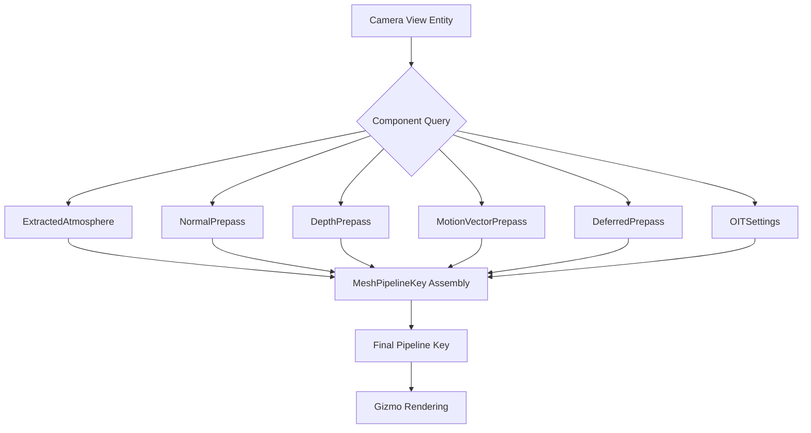

+++
title = "#22190 Fix 3d gizmo pipeline when atmosphere present"
date = "2025-12-29T00:00:00"
draft = false
template = "pull_request_page.html"
in_search_index = true

[taxonomies]
list_display = ["show"]

[extra]
current_language = "en"
available_languages = {"en" = { name = "English", url = "/pull_request/bevy/2025-12/pr-22190-en-20251229" }, "zh-cn" = { name = "中文", url = "/pull_request/bevy/2025-12/pr-22190-zh-cn-20251229" }}
labels = ["C-Bug", "A-Rendering", "D-Straightforward"]
+++

# Title
## Fix 3d gizmo pipeline when atmosphere present

## Basic Information
- **Title**: Fix 3d gizmo pipeline when atmosphere present
- **PR Link**: https://github.com/bevyengine/bevy/pull/22190
- **Author**: mate-h
- **Status**: MERGED
- **Labels**: C-Bug, A-Rendering, S-Ready-For-Final-Review, D-Straightforward
- **Created**: 2025-12-18T21:16:26Z
- **Merged**: 2025-12-29T20:05:48Z
- **Merged By**: mockersf

## Description Translation
The PR description is in English and reads as follows:

# Objective

- Fixes https://github.com/bevyengine/bevy/issues/21784

## Solution

- Add missing atmosphere pipeline key in the gizmo pipeline.

## Testing

- Ran the 3d gizmo example with local changes to add the atmosphere to the camera and a directional light

---

## Showcase


## The Story of This Pull Request

This PR addresses a bug in Bevy's 3D gizmo rendering pipeline when atmosphere rendering is enabled. The issue was reported in GitHub issue #21784, where users experienced rendering problems with 3D gizmos in scenes that included atmospheric effects.

The core problem was that the gizmo rendering pipeline wasn't accounting for whether the camera view had an atmosphere component. When rendering gizmos, the system queries various view components to determine the correct rendering pipeline configuration. This configuration is built using a `MeshPipelineKey` bitmask that encodes various rendering features and settings. The atmosphere feature is one of these settings, but the gizmo pipeline wasn't checking for it.

The implementation follows a pattern already established in other parts of the rendering system. The `queue_line_gizmos_3d` function needed to include `ExtractedAtmosphere` in its query to determine if the current view has an atmosphere, and then set the corresponding `MeshPipelineKey::ATMOSPHERE` flag in the view key.

The fix is minimal and focused: it adds the missing component check and flag setting without changing any other behavior. This approach aligns with how other rendering features like motion vectors, depth prepass, and order-independent transparency are handled in the same function.

From a technical perspective, this bug demonstrates the importance of consistency when handling rendering pipeline keys. The `MeshPipelineKey` acts as a configuration bitmask that must include all relevant features for correct shader selection and rendering behavior. When a new feature like atmosphere rendering is added to the engine, all rendering pipelines that use the mesh pipeline need to be updated to handle it.

The impact of this fix is straightforward: 3D gizmos now render correctly in scenes with atmospheric effects. Without this fix, the rendering pipeline would use an incorrect configuration, potentially leading to shader compilation errors, incorrect rendering, or crashes when atmosphere is enabled.

The testing approach described in the PR is pragmatic: the author modified the 3D gizmo example to include atmosphere components on the camera and a directional light, then verified that the gizmos rendered correctly. This is sufficient for this type of fix since it's adding missing functionality rather than changing existing behavior.

## Visual Representation



## Key Files Changed

### `crates/bevy_gizmos_render/src/pipeline_3d.rs` (+7/-2)

This is the only file modified in the PR. The changes add support for atmosphere rendering in the 3D gizmo pipeline.

**Key changes:**

1. **Import addition**: Added `ExtractedAtmosphere` to the imports from `bevy_pbr`
2. **Query update**: Modified the view query to include `Has<ExtractedAtmosphere>` 
3. **Pipeline key update**: Added logic to set the `ATMOSPHERE` bit in the `MeshPipelineKey` when atmosphere is present

**Code snippets:**

```rust
// Before: Import section (line 25)
use bevy_pbr::{MeshPipeline, MeshPipelineKey, SetMeshViewBindGroup};

// After: Import section (line 25)
use bevy_pbr::{ExtractedAtmosphere, MeshPipeline, MeshPipelineKey, SetMeshViewBindGroup};
```

```rust
// Before: View query (lines 305-313)
fn queue_line_gizmos_3d(
    // ... other parameters ...
    views: Query<(
        // ... other view components ...
        Has<MotionVectorPrepass>,
        Has<DeferredPrepass>,
        Has<OrderIndependentTransparencySettings>,
    )>,
) -> Result<(), BevyError> {

// After: View query (lines 305-314)
fn queue_line_gizmos_3d(
    // ... other parameters ...
    views: Query<(
        // ... other view components ...
        Has<MotionVectorPrepass>,
        Has<DeferredPrepass>,
        Has<OrderIndependentTransparencySettings>,
        Has<ExtractedAtmosphere>,
    )>,
) -> Result<(), BevyError> {
```

```rust
// Before: Pipeline key assembly (lines 318-324)
for (
    view,
    msaa,
    render_layers,
    (normal_prepass, depth_prepass, motion_vector_prepass, deferred_prepass, oit),
) in &views
{
    // ... other code ...
    
    // Pipeline key assembly (lines 347-351)
    if oit {
        view_key |= MeshPipelineKey::OIT_ENABLED;
    }
    
    // No atmosphere handling
}

// After: Pipeline key assembly (lines 318-325)
for (
    view,
    msaa,
    render_layers,
    (normal_prepass, depth_prepass, motion_vector_prepass, deferred_prepass, oit, atmosphere),
) in &views
{
    // ... other code ...
    
    // Pipeline key assembly (lines 347-356)
    if oit {
        view_key |= MeshPipelineKey::OIT_ENABLED;
    }

    if atmosphere {
        view_key |= MeshPipelineKey::ATMOSPHERE;
    }
}
```

## Further Reading

- [Bevy Rendering Pipeline Documentation](https://bevyengine.org/learn/book/rendering/pipelines/)
- [MeshPipelineKey API Reference](https://docs.rs/bevy_pbr/latest/bevy_pbr/struct.MeshPipelineKey.html)
- [Atmospheric Scattering in Bevy](https://github.com/bevyengine/bevy/blob/main/examples/3d/atmospheric_scattering.rs)
- [Bevy Gizmos System](https://github.com/bevyengine/bevy/blob/main/crates/bevy_gizmos/src/lib.rs)

## Full Code Diff

```diff
diff --git a/crates/bevy_gizmos_render/src/pipeline_3d.rs b/crates/bevy_gizmos_render/src/pipeline_3d.rs
index 00fda49ee587b..d2731f9d62d3f 100644
--- a/crates/bevy_gizmos_render/src/pipeline_3d.rs
+++ b/crates/bevy_gizmos_render/src/pipeline_3d.rs
@@ -22,7 +22,7 @@ use bevy_ecs::{
     system::{Commands, Query, Res, ResMut},
 };
 use bevy_image::BevyDefault as _;
-use bevy_pbr::{MeshPipeline, MeshPipelineKey, SetMeshViewBindGroup};
+use bevy_pbr::{ExtractedAtmosphere, MeshPipeline, MeshPipelineKey, SetMeshViewBindGroup};
 use bevy_render::{
     render_asset::{prepare_assets, RenderAssets},
     render_phase::{
@@ -305,6 +305,7 @@ fn queue_line_gizmos_3d(
             Has<MotionVectorPrepass>,
             Has<DeferredPrepass>,
             Has<OrderIndependentTransparencySettings>,
+            Has<ExtractedAtmosphere>,
         ),
     )>,
 ) -> Result<(), BevyError> {
@@ -318,7 +319,7 @@ fn queue_line_gizmos_3d(
         view,
         msaa,
         render_layers,
-        (normal_prepass, depth_prepass, motion_vector_prepass, deferred_prepass, oit),
+        (normal_prepass, depth_prepass, motion_vector_prepass, deferred_prepass, oit, atmosphere),
     ) in &views
     {
         let Some(transparent_phase) = transparent_render_phases.get_mut(&view.retained_view_entity)
@@ -351,6 +352,10 @@ fn queue_line_gizmos_3d(
             view_key |= MeshPipelineKey::OIT_ENABLED;
         }
 
+        if atmosphere {
+            view_key |= MeshPipelineKey::ATMOSPHERE;
+        }
+
         for (entity, main_entity, config) in &line_gizmos {
             if !config.render_layers.intersects(render_layers) {
                 continue;
```