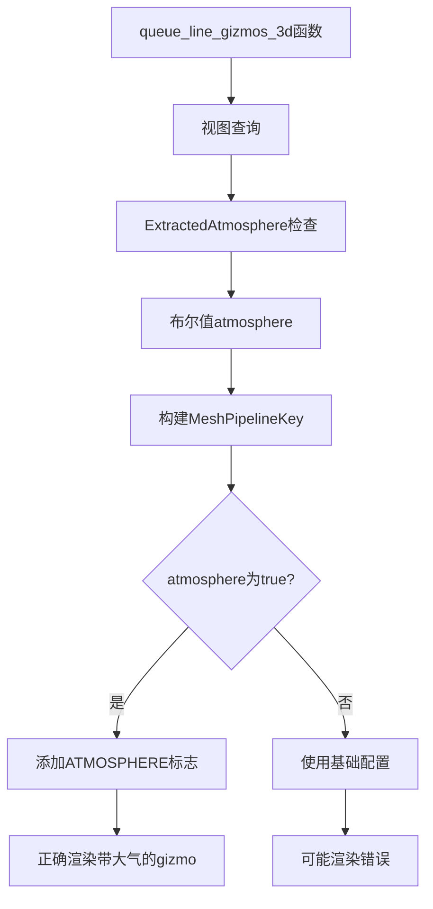

+++
title = "#22190 Fix 3d gizmo pipeline when atmosphere present"
date = "2025-12-29T00:00:00"
draft = false
template = "pull_request_page.html"
in_search_index = false

[extra]
current_language = "zh-cn"
available_languages = {"en" = { name = "English", url = "/pull_request/bevy/2025-12/pr-22190-en-20251229" }, "zh-cn" = { name = "中文", url = "/pull_request/bevy/2025-12/pr-22190-zh-cn-20251229" }}
+++

# Fix 3d gizmo pipeline when atmosphere present

## 基本信息
- **标题**: Fix 3d gizmo pipeline when atmosphere present
- **PR 链接**: https://github.com/bevyengine/bevy/pull/22190
- **作者**: mate-h
- **状态**: 已合并
- **标签**: C-Bug, A-Rendering, S-Ready-For-Final-Review, D-Straightforward
- **创建时间**: 2025-12-18T21:16:26Z
- **合并时间**: 2025-12-29T20:05:48Z
- **合并者**: mockersf

## 描述翻译

### 目标
- 修复 https://github.com/bevyengine/bevy/issues/21784

### 解决方案
- 在 gizmo pipeline 中添加缺失的 atmosphere pipeline key。

### 测试
- 运行 3d gizmo 示例，并在本地修改为相机和定向光添加大气效果

---

### 展示


## PR 分析报告

这个 PR 解决了一个渲染管道中的配置一致性问题。问题出现在 3D gizmo 渲染管线中，当场景中存在大气效果时，管线配置没有正确同步。

问题的根源在于 `queue_line_gizmos_3d` 函数中用于构建渲染视图键的查询没有包含大气效果的检查。在 Bevy 的渲染系统中，`MeshPipelineKey` 用于存储渲染管线的各种配置标志，包括大气效果。当视图中有大气效果时，需要设置 `MeshPipelineKey::ATMOSPHERE` 位，以确保渲染管线使用正确的着色器变体。

具体来说，修改涉及两个部分：

1. **导入依赖**：添加了对 `ExtractedAtmosphere` 的导入，这是提取大气效果数据的组件。

2. **查询扩展**：扩展了视图查询，添加了 `Has<ExtractedAtmosphere>` 检查。这样查询会返回一个布尔值，表示该视图是否包含大气效果。

3. **管道键更新**：在构建 `view_key` 时，如果检测到大气效果存在，就添加 `MeshPipelineKey::ATMOSPHERE` 标志。

这个修复确保了 gizmo 渲染管线与主渲染管线使用相同的配置标志。当大气效果启用时，渲染管线需要不同的着色器变体来处理大气散射效果。如果没有这个标志，gizmo 可能会使用错误的着色器，导致渲染问题。

从技术实现角度看，这个修改遵循了 Bevy 渲染系统中的模式：通过 `MeshPipelineKey` 的位标志系统来管理渲染管线的不同配置变体。每个标志对应一个特定的渲染功能，系统会根据这些标志选择正确的着色器变体。

这个问题是一个典型的配置遗漏错误。在原始的代码实现中，当大气效果功能被添加到引擎时，gizmo 渲染管线没有同步更新，导致在某些配置下出现渲染不一致。

修复后的效果在提供的截图中可以明显看到：gizmo（三维坐标系轴）现在正确地显示在带有大气效果的场景中，而之前可能会出现渲染错误或完全不可见。

这个修改虽然简单，但确保了渲染系统的一致性。它展示了在大型图形引擎中维护配置同步的重要性，特别是当多个渲染管线需要共享相同的配置标志时。

## 视觉表示



## 关键文件更改

### `crates/bevy_gizmos_render/src/pipeline_3d.rs` (+7/-2)

**修改描述**：修复了 3D gizmo 渲染管线，确保在视图包含大气效果时正确设置管道键标志。

**关键代码修改**：

```rust
// 文件: crates/bevy_gizmos_render/src/pipeline_3d.rs

// 修改前（导入部分）:
use bevy_pbr::{MeshPipeline, MeshPipelineKey, SetMeshViewBindGroup};

// 修改后（导入部分）:
use bevy_pbr::{ExtractedAtmosphere, MeshPipeline, MeshPipelineKey, SetMeshViewBindGroup};

// 修改前（查询参数）:
(
    Has<MotionVectorPrepass>,
    Has<DeferredPrepass>,
    Has<OrderIndependentTransparencySettings>,
)

// 修改后（查询参数）:
(
    Has<MotionVectorPrepass>,
    Has<DeferredPrepass>,
    Has<OrderIndependentTransparencySettings>,
    Has<ExtractedAtmosphere>,
)

// 修改前（查询模式）:
(normal_prepass, depth_prepass, motion_vector_prepass, deferred_prepass, oit),

// 修改后（查询模式）:
(normal_prepass, depth_prepass, motion_vector_prepass, deferred_prepass, oit, atmosphere),

// 新增代码:
if atmosphere {
    view_key |= MeshPipelineKey::ATMOSPHERE;
}
```

**修改说明**：
1. 添加了 `ExtractedAtmosphere` 的导入，这是大气效果的数据组件
2. 扩展了视图查询，添加了对大气效果的检查
3. 在查询模式中添加了 `atmosphere` 布尔值变量
4. 在构建 `view_key` 时，如果检测到大气效果，则添加相应的管道键标志

这些修改确保了当视图包含大气效果时，gizmo 渲染管线使用正确的着色器变体，避免了渲染错误。

## 延伸阅读

1. [Bevy 渲染管线文档](https://bevyengine.org/learn/quick-start/getting-started/systems/) - 了解 Bevy 的渲染系统架构
2. [MeshPipelineKey 源代码](https://github.com/bevyengine/bevy/blob/main/crates/bevy_pbr/src/render/mesh_pipeline.rs) - 查看管道键的所有可用标志
3. [Bevy 大气效果实现](https://github.com/bevyengine/bevy/tree/main/crates/bevy_pbr/src/atmosphere) - 了解大气效果的实现细节
4. [渲染管线状态管理](https://bevy-cheatbook.github.io/features/render-pipelines.html) - 学习 Bevy 中渲染管线的状态管理模式

# 完整代码差异

```diff
diff --git a/crates/bevy_gizmos_render/src/pipeline_3d.rs b/crates/bevy_gizmos_render/src/pipeline_3d.rs
index 00fda49ee587b..d2731f9d62d3f 100644
--- a/crates/bevy_gizmos_render/src/pipeline_3d.rs
+++ b/crates/bevy_gizmos_render/src/pipeline_3d.rs
@@ -22,7 +22,7 @@ use bevy_ecs::{
     system::{Commands, Query, Res, ResMut},
 };
 use bevy_image::BevyDefault as _;
-use bevy_pbr::{MeshPipeline, MeshPipelineKey, SetMeshViewBindGroup};
+use bevy_pbr::{ExtractedAtmosphere, MeshPipeline, MeshPipelineKey, SetMeshViewBindGroup};
 use bevy_render::{
     render_asset::{prepare_assets, RenderAssets},
     render_phase::{
@@ -305,6 +305,7 @@ fn queue_line_gizmos_3d(
             Has<MotionVectorPrepass>,
             Has<DeferredPrepass>,
             Has<OrderIndependentTransparencySettings>,
+            Has<ExtractedAtmosphere>,
         ),
     )>,
 ) -> Result<(), BevyError> {
@@ -318,7 +319,7 @@ fn queue_line_gizmos_3d(
         view,
         msaa,
         render_layers,
-        (normal_prepass, depth_prepass, motion_vector_prepass, deferred_prepass, oit),
+        (normal_prepass, depth_prepass, motion_vector_prepass, deferred_prepass, oit, atmosphere),
     ) in &views
     {
         let Some(transparent_phase) = transparent_render_phases.get_mut(&view.retained_view_entity)
@@ -351,6 +352,10 @@ fn queue_line_gizmos_3d(
             view_key |= MeshPipelineKey::OIT_ENABLED;
         }
 
+        if atmosphere {
+            view_key |= MeshPipelineKey::ATMOSPHERE;
+        }
+
         for (entity, main_entity, config) in &line_gizmos {
             if !config.render_layers.intersects(render_layers) {
                 continue;
```