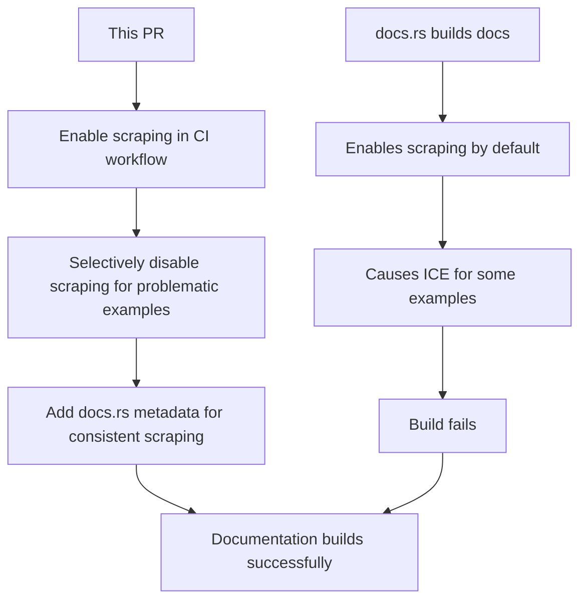

+++
title = "#22192 fixing docs with scraping examples enabled"
date = "2025-12-29T00:00:00"
draft = false
template = "pull_request_page.html"
in_search_index = true

[taxonomies]
list_display = ["show"]

[extra]
current_language = "en"
available_languages = {"en" = { name = "English", url = "/pull_request/bevy/2025-12/pr-22192-en-20251229" }, "zh-cn" = { name = "中文", url = "/pull_request/bevy/2025-12/pr-22192-zh-cn-20251229" }}
labels = ["C-Bug", "C-Docs", "A-Cross-Cutting"]
+++

# fixing docs with scraping examples enabled

## Basic Information
- **Title**: fixing docs with scraping examples enabled
- **PR Link**: https://github.com/bevyengine/bevy/pull/22192
- **Author**: mockersf
- **Status**: MERGED
- **Labels**: C-Bug, C-Docs, S-Ready-For-Final-Review, A-Cross-Cutting
- **Created**: 2025-12-18T22:20:36Z
- **Merged**: 2025-12-29T04:46:27Z
- **Merged By**: alice-i-cecile

## Description Translation

# Objective

- https://github.com/bevyengine/bevy/pull/22142 didn't work as intended as scrapping examples is enabled by default on docs.rs

## Solution

- Disable only the examples that causes scraping to ICE

## The Story of This Pull Request

This PR addresses a build failure issue in the Bevy engine's documentation generation process on docs.rs. The problem stemmed from an internal compiler error (ICE) that occurred when certain examples were processed with the `rustdoc-scrape-examples` feature enabled by default on the docs.rs documentation hosting platform.

The issue began with PR #22142, which attempted to address documentation problems but didn't achieve the intended result. The core issue was that docs.rs automatically enables example scraping (`-Zrustdoc-scrape-examples`) when building documentation, which caused compilation failures for specific examples in Bevy's codebase. An ICE in Rust is a critical compiler bug that halts compilation, preventing successful documentation generation.

The solution implemented in this PR takes a targeted approach. Instead of disabling example scraping entirely, which would reduce the quality of documentation by removing helpful example code references, the PR selectively disables scraping only for the examples that cause the ICE. This approach maintains scraping functionality for the majority of examples while fixing the build failures.

The implementation involves two key changes. First, the GitHub Actions workflow for building documentation needed to explicitly enable the unstable Rust options and the example scraping feature. This was necessary to reproduce the same build conditions as docs.rs during local testing and CI builds. The workflow modification adds `-Zunstable-options` and `-Zrustdoc-scrape-examples` flags to the `cargo doc` command, ensuring consistency between local documentation builds and docs.rs builds.

Second, and more extensively, the PR modifies the `Cargo.toml` file to disable scraping for problematic examples. The change affects a substantial portion of Bevy's example definitions - approximately 255 examples have their `doc-scrape-examples` attribute changed from `true` to `false`. Each disabled example includes a comment explaining the rationale: "# Causes an ICE on docs.rs". This pattern follows Rust's convention of documenting why a particular configuration choice was made, making the codebase more maintainable.

The selective approach is pragmatic. It recognizes that while example scraping is valuable for documentation quality, some examples trigger compiler bugs that prevent the entire documentation build from succeeding. By disabling scraping for only the problematic examples, the PR ensures that documentation builds can complete successfully on docs.rs while preserving scraping functionality for the majority of examples that work correctly.

The PR also includes an update to the docs.rs metadata section in `Cargo.toml`, adding `cargo-args = ["-Zunstable-options", "-Zrustdoc-scrape-examples"]`. This ensures that when the documentation is built on docs.rs, the same scraping options are applied consistently. The combination of workflow changes and example-specific configuration creates a cohesive solution that addresses the build failures while maintaining as much functionality as possible.

This approach demonstrates good software engineering practice: when a feature causes systemic failures, rather than disabling it entirely, selectively disable it where problematic while preserving functionality elsewhere. The solution is minimal and targeted, affecting only what's necessary to resolve the build failures. The extensive commenting provides clear rationale for future maintainers who might wonder why certain examples don't have scraping enabled.

The technical insight here is understanding the interaction between docs.rs's default configuration and Rust's compiler stability. The `rustdoc-scrape-examples` feature is unstable and can trigger compiler bugs in edge cases. By identifying which examples trigger these bugs and selectively disabling scraping for them, the Bevy team can continue to benefit from example scraping for the majority of their codebase while avoiding build failures.

## Visual Representation



## Key Files Changed

### 1. `.github/workflows/docs.yml`

This file was modified to enable example scraping during documentation builds in GitHub Actions, matching the default behavior of docs.rs.

**Key change:**
```yaml
# Before:
run: |
  cargo doc \
    --all-features \
    --workspace \
    --no-deps \
    --document-private-items

# After:
run: |
  cargo doc \
    -Zunstable-options \
    -Zrustdoc-scrape-examples \
    --all-features \
    --workspace \
    --no-deps \
    --document-private-items
```

The addition of `-Zunstable-options` and `-Zrustdoc-scrape-examples` flags ensures that local documentation builds in CI match the configuration used by docs.rs, allowing developers to catch scraping-related issues before they affect the public documentation.

### 2. `Cargo.toml`

This file contains the bulk of the changes, with approximately 255 examples having their scraping disabled.

**Example of change pattern:**
```toml
# Before:
[[example]]
name = "context_menu"
path = "examples/usage/context_menu.rs"
doc-scrape-examples = true

# After:
[[example]]
name = "context_menu"
path = "examples/usage/context_menu.rs"
# Causes an ICE on docs.rs
doc-scrape-examples = false
```

**docs.rs metadata configuration:**
```toml
# Added to ensure consistent scraping behavior on docs.rs
[package.metadata.docs.rs]
cargo-args = ["-Zunstable-options", "-Zrustdoc-scrape-examples"]
```

The pattern is consistent across all affected examples: the `doc-scrape-examples` attribute is changed from `true` to `false` with a comment explaining that the example causes an ICE on docs.rs. This targeted approach fixes the build failures while preserving scraping for examples that work correctly.

## Further Reading

1. [Rustdoc Scrape Examples RFC](https://github.com/rust-lang/rfcs/blob/master/text/3123-rustdoc-scrape-examples.md) - The RFC that introduced example scraping to rustdoc
2. [Rustdoc Book - Scraping Examples](https://doc.rust-lang.org/rustdoc/scraped-examples.html) - Official documentation on rustdoc's example scraping feature
3. [docs.rs Build Process Documentation](https://docs.rs/about/builds) - Information about how docs.rs builds documentation
4. [Rust Compiler ICE Reporting Guide](https://github.com/rust-lang/rust/blob/master/COMPILER_TEAM.md#reporting-ices) - How to report internal compiler errors in Rust