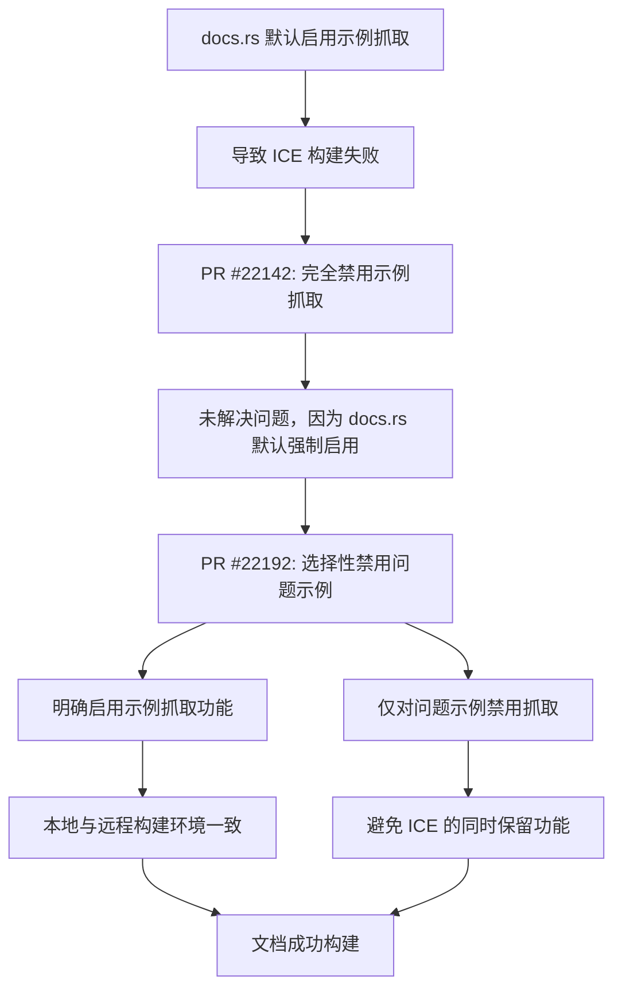

+++
title = "#22192 fixing docs with scraping examples enabled"
date = "2025-12-29T00:00:00"
draft = false
template = "pull_request_page.html"
in_search_index = false

[extra]
current_language = "zh-cn"
available_languages = {"en" = { name = "English", url = "/pull_request/bevy/2025-12/pr-22192-en-20251229" }, "zh-cn" = { name = "中文", url = "/pull_request/bevy/2025-12/pr-22192-zh-cn-20251229" }}
labels = ["C-Bug", "C-Docs", "A-Cross-Cutting"]
+++

# Title
fixing docs with scraping examples enabled

## Basic Information
- **Title**: fixing docs with scraping examples enabled
- **PR Link**: https://github.com/bevyengine/bevy/pull/22192
- **Author**: mockersf
- **Status**: MERGED
- **Labels**: C-Bug, C-Docs, S-Ready-For-Final-Review, A-Cross-Cutting
- **Created**: 2025-12-18T22:20:36Z
- **Merged**: 2025-12-29T04:46:27Z
- **Merged By**: alice-i-cecile

## Description Translation
# 目标

- https://github.com/bevyengine/bevy/pull/22142 没有按预期工作，因为在 docs.rs 上默认启用了示例抓取

## 解决方案

- 仅禁用那些导致抓取时发生 ICE 的示例

## 这个Pull Request的故事

这个PR解决了一个在构建Bevy文档时遇到的特定问题。问题源于docs.rs的文档构建系统默认启用了`-Zrustdoc-scrape-examples`功能，该功能会自动从示例代码中提取代码片段并嵌入到API文档中。然而，在构建某些特定示例时，这个功能会导致Rust编译器内部错误（ICE）。

### 问题背景

在先前的PR #22142中，开发团队尝试通过禁用示例抓取来解决docs.rs上的构建问题。但这个解决方案没有完全奏效，因为docs.rs的构建环境默认启用了示例抓取功能。即使在项目配置中禁用了此功能，docs.rs仍然会尝试执行示例抓取操作，从而导致构建失败。

ICE是Rust编译器内部错误的缩写，通常是由于编译器本身的bug或边缘情况导致的。在这种情况下，当rustdoc尝试处理某些特定示例代码时，会触发编译器的内部错误，导致整个文档构建过程失败。

### 技术解决方案

这个PR采用了更精确的方法来解决这个问题。与其完全禁用示例抓取功能，不如只对导致问题的特定示例进行禁用。这样可以在docs.rs上成功构建文档的同时，仍然为大多数示例保留代码片段提取的功能。

主要的技术修改集中在两个方面：

1. **明确启用示例抓取功能**：在GitHub Actions的文档构建工作流中，显式添加了`-Zunstable-options -Zrustdoc-scrape-examples`参数，确保本地构建环境与docs.rs的构建环境保持一致。

2. **选择性禁用问题示例**：对于每个在docs.rs上导致ICE的示例，将`doc-scrape-examples`属性从`true`改为`false`，并添加注释说明原因。

### 实施细节

这个PR对两个文件进行了修改。第一个文件是`.github/workflows/docs.yml`，修改了文档构建的工作流配置：

```yaml
# 修改前:
run: |
  cargo doc \
    --all-features \
    --workspace \
    --no-deps \
    --document-private-items

# 修改后:
run: |
  cargo doc \
    -Zunstable-options \
    -Zrustdoc-scrape-examples \
    --all-features \
    --workspace \
    --no-deps \
    --document-private-items
```

这个修改确保GitHub Actions上的文档构建使用与docs.rs相同的参数配置，包括启用示例抓取功能。

第二个文件是`Cargo.toml`，修改了几乎所有的示例配置。每个示例的修改模式基本相同：

```toml
# 修改前:
[[example]]
name = "context_menu"
path = "examples/usage/context_menu.rs"
doc-scrape-examples = true

# 修改后:
[[example]]
name = "context_menu"
path = "examples/usage/context_menu.rs"
# Causes an ICE on docs.rs
doc-scrape-examples = false
```

值得注意的是，虽然大多数示例的`doc-scrape-examples`都被设置为`false`，但仍有少数示例保持原来的配置。这表明只有特定类型的示例代码会导致ICE问题。

### 技术洞察

这种解决方案展示了如何处理与外部构建环境（如docs.rs）的配置差异。关键点在于不试图改变外部环境的默认行为，而是在项目配置中明确处理这些差异。

从工程角度看，这种方法有几个优点：
- **最小化影响**：只修改了导致问题的示例，保留了其他示例的代码片段提取功能
- **明确性**：通过添加注释说明每个修改的原因，提高了代码的可维护性
- **一致性**：确保本地构建环境与远程构建环境使用相同的配置

然而，这种解决方案也有局限性。由于几乎所有的示例都被标记为`doc-scrape-examples = false`，实际上在docs.rs上可能很少有示例会进行代码片段提取。这可能意味着需要进一步的优化，或者Rust编译器本身需要修复这些ICE问题。

### 影响

这个PR的主要影响是恢复了Bevy文档在docs.rs上的正常构建。由于docs.rs是Rust生态系统中最主要的文档托管服务，能够在那里成功构建文档对于项目的可用性和可访问性至关重要。

从技术债务的角度看，这个PR引入了大量的重复配置修改。虽然每个修改都有注释说明原因，但如果未来需要调整这些配置，维护工作可能会比较繁琐。

## 视觉表示



## 主要修改文件

### 1. `.github/workflows/docs.yml`

**修改内容**：在文档构建命令中添加了`-Zunstable-options`和`-Zrustdoc-scrape-examples`参数。

**修改原因**：确保GitHub Actions上的文档构建使用与docs.rs相同的配置参数，包括启用示例抓取功能。

**代码片段**：
```yaml
# 修改前:
run: |
  cargo doc \
    --all-features \
    --workspace \
    --no-deps \
    --document-private-items

# 修改后:
run: |
  cargo doc \
    -Zunstable-options \
    -Zrustdoc-scrape-examples \
    --all-features \
    --workspace \
    --no-deps \
    --document-private-items
```

### 2. `Cargo.toml`

**修改内容**：将几乎所有示例的`doc-scrape-examples`属性从`true`改为`false`，并添加注释说明原因。

**修改原因**：避免在docs.rs上构建文档时触发Rust编译器内部错误（ICE），同时保持示例抓取功能对其他示例的可用性。

**代码片段**（以`context_menu`示例为例）：
```toml
# 修改前:
[[example]]
name = "context_menu"
path = "examples/usage/context_menu.rs"
doc-scrape-examples = true

# 修改后:
[[example]]
name = "context_menu"
path = "examples/usage/context_menu.rs"
# Causes an ICE on docs.rs
doc-scrape-examples = false
```

## 进一步阅读

1. **Rustdoc的示例抓取功能**：
   - 官方文档：https://doc.rust-lang.org/rustdoc/unstable-features.html#scrape-examples
   - 功能设计讨论：https://github.com/rust-lang/rfcs/pull/3123

2. **docs.rs构建系统**：
   - docs.rs配置文档：https://docs.rs/about/metadata
   - 构建过程详解：https://github.com/rust-lang/docs.rs

3. **Rust编译器内部错误（ICE）**：
   - ICE处理指南：https://doc.rust-lang.org/nightly/rustc/ice.html
   - 如何报告ICE：https://github.com/rust-lang/rust/issues

4. **Bevy示例系统**：
   - Bevy示例架构：https://bevyengine.org/learn/book/getting-started/examples/
   - 示例代码组织结构：https://github.com/bevyengine/bevy/tree/main/examples

# Full Code Diff
diff --git a/.github/workflows/docs.yml b/.github/workflows/docs.yml
index 0b661e9986949..a4e319d710933 100644
--- a/.github/workflows/docs.yml
+++ b/.github/workflows/docs.yml
@@ -63,6 +63,8 @@ jobs:
           RUSTDOCFLAGS: -Zunstable-options --cfg=docsrs --generate-link-to-definition --html-after-content docs-rs/trait-tags.html
         run: |
           cargo doc \
+            -Zunstable-options \
+            -Zrustdoc-scrape-examples \
             --all-features \
             --workspace \
             --no-deps \
diff --git a/Cargo.toml b/Cargo.toml
index 7dda86c8f1418..46d7d7a7a6394 100644
--- a/Cargo.toml
+++ b/Cargo.toml
@@ -762,7 +762,8 @@ web-sys = { version = "0.3", features = ["Window"] }
 [[example]]
 name = "context_menu"
 path = "examples/usage/context_menu.rs"
-doc-scrape-examples = true
+# Causes an ICE on docs.rs
+doc-scrape-examples = false
 
 [package.metadata.example.context_menu]
 name = "Context Menu"
@@ -773,7 +774,8 @@ wasm = true
 [[example]]
 name = "hello_world"
 path = "examples/hello_world.rs"
-doc-scrape-examples = true
+# Causes an ICE on docs.rs
+doc-scrape-examples = false
 
 [package.metadata.example.hello_world]
 hidden = true
@@ -804,7 +806,8 @@ wasm = true
 [[example]]
 name = "2d_viewport_to_world"
 path = "examples/2d/2d_viewport_to_world.rs"
-doc-scrape-examples = true
+# Causes an ICE on docs.rs
+doc-scrape-examples = false
 
 [package.metadata.example.2d_viewport_to_world]
 name = "2D Viewport To World"
@@ -815,7 +818,8 @@ wasm = true
 [[example]]
 name = "rotation"
 path = "examples/2d/rotation.rs"
-doc-scrape-examples = true
+# Causes an ICE on docs.rs
+doc-scrape-examples = false
 
 [package.metadata.example.rotation]
 name = "2D Rotation"
@@ -826,7 +830,8 @@ wasm = true
 [[example]]
 name = "mesh2d"
 path = "examples/2d/mesh2d.rs"
-doc-scrape-examples = true
+# Causes an ICE on docs.rs
+doc-scrape-examples = false
 
 [package.metadata.example.mesh2d]
 name = "Mesh 2D"
@@ -837,7 +842,8 @@ wasm = true
 [[example]]
 name = "mesh2d_arcs"
 path = "examples/2d/mesh2d_arcs.rs"
-doc-scrape-examples = true
+# Causes an ICE on docs.rs
+doc-scrape-examples = false
 
 [package.metadata.example.mesh2d_arcs]
 name = "Arc 2D Meshes"
@@ -848,7 +854,8 @@ wasm = true
 [[example]]
 name = "mesh2d_manual"
 path = "examples/2d/mesh2d_manual.rs"
-doc-scrape-examples = true
+# Causes an ICE on docs.rs
+doc-scrape-examples = false
 
 [package.metadata.example.mesh2d_manual]
 name = "Manual Mesh 2D"
@@ -859,7 +866,8 @@ wasm = true
 [[example]]
 name = "mesh2d_vertex_color_texture"
 path = "examples/2d/mesh2d_vertex_color_texture.rs"
-doc-scrape-examples = true
+# Causes an ICE on docs.rs
+doc-scrape-examples = false
 
 [package.metadata.example.mesh2d_vertex_color_texture]
 name = "Mesh 2D With Vertex Colors"
@@ -870,7 +878,8 @@ wasm = true
 [[example]]
 name = "2d_shapes"
 path = "examples/2d/2d_shapes.rs"
-doc-scrape-examples = true
+# Causes an ICE on docs.rs
+doc-scrape-examples = false
 
 [package.metadata.example.2d_shapes]
 name = "2D Shapes"
@@ -881,7 +890,8 @@ wasm = true
 [[example]]
 name = "cpu_draw"
 path = "examples/2d/cpu_draw.rs"
-doc-scrape-examples = true
+# Causes an ICE on docs.rs
+doc-scrape-examples = false
 
 [package.metadata.example.cpu_draw]
 name = "CPU Drawing"
@@ -892,7 +902,8 @@ wasm = true
 [[example]]
 name = "sprite"
 path = "examples/2d/sprite.rs"
-doc-scrape-examples = true
+# Causes an ICE on docs.rs
+doc-scrape-examples = false
 
 [package.metadata.example.sprite]
 name = "Sprite"
@@ -903,7 +914,8 @@ wasm = true
 [[example]]
 name = "sprite_animation"
 path = "examples/2d/sprite_animation.rs"
-doc-scrape-examples = true
+# Causes an ICE on docs.rs
+doc-scrape-examples = false
 
 [package.metadata.example.sprite_animation]
 name = "Sprite Animation"
@@ -914,7 +926,8 @@ wasm = true
 [[example]]
 name = "sprite_scale"
 path = "examples/2d/sprite_scale.rs"
-doc-scrape-examples = true
+# Causes an ICE on docs.rs
+doc-scrape-examples = false
 
 [package.metadata.example.sprite_scale]
 name = "Sprite Scale"
@@ -925,7 +938,8 @@ wasm = true
 [[example]]
 name = "sprite_flipping"
 path = "examples/2d/sprite_flipping.rs"
-doc-scrape-examples = true
+# Causes an ICE on docs.rs
+doc-scrape-examples = false

 [package.metadata.example.sprite_flipping]
 name = "Sprite Flipping"
@@ -958,7 +972,8 @@ wasm = true
 [[example]]
 name = "sprite_slice"
 path = "examples/2d/sprite_slice.rs"
-doc-scrape-examples = true
+# Causes an ICE on docs.rs
+doc-scrape-examples = false

 [package.metadata.example.sprite_slice]
 name = "Sprite Slice"
@@ -969,7 +984,8 @@ wasm = true
 [[example]]
 name = "text2d"
 path = "examples/2d/text2d.rs"
-doc-scrape-examples = true
+# Causes an ICE on docs.rs
+doc-scrape-examples = false

 [package.metadata.example.text2d]
 name = "Text 2D"
@@ -980,7 +996,8 @@ wasm = true
 [[example]]
 name = "multi_window_text"
 path = "examples/window/multi_window_text.rs"
-doc-scrape-examples = true
+# Causes an ICE on docs.rs
+doc-scrape-examples = false

 [package.metadata.example.multi_window_text]
 name = "Multi-Window Text"
@@ -991,7 +1008,8 @@ wasm = true
 [[example]]
 name = "texture_atlas"
 path = "examples/2d/texture_atlas.rs"
-doc-scrape-examples = true
+# Causes an ICE on docs.rs
+doc-scrape-examples = false

 [package.metadata.example.texture_atlas]
 name = "Texture Atlas"
@@ -1003,7 +1021,8 @@ wasm = false
 [[example]]
 name = "tilemap_chunk"
 path = "examples/2d/tilemap_chunk.rs"
-doc-scrape-examples = true
+# Causes an ICE on docs.rs
+doc-scrape-examples = false

 [package.metadata.example.tilemap_chunk]
 name = "Tilemap Chunk"
@@ -1014,7 +1033,8 @@ wasm = true
 [[example]]
 name = "transparency_2d"
 path = "examples/2d/transparency_2d.rs"
-doc-scrape-examples = true
+# Causes an ICE on docs.rs
+doc-scrape-examples = false

 [package.metadata.example.transparency_2d]
 name = "Transparency in 2D"
@@ -1047,7 +1067,8 @@ wasm = true
 [[example]]
 name = "pixel_grid_snap"
 path = "examples/2d/pixel_grid_snap.rs"
-doc-scrape-examples = true
+# Causes an ICE on docs.rs
+doc-scrape-examples = false

 [package.metadata.example.pixel_grid_snap]
 name = "Pixel Grid Snapping"
@@ -1058,7 +1079,8 @@ wasm = true
 [[example]]
 name = "bounding_2d"
 path = "examples/math/bounding_2d.rs"
-doc-scrape-examples = true
+# Causes an ICE on docs.rs
+doc-scrape-examples = false

 [package.metadata.example.bounding_2d]
 name = "Bounding Volume Intersections (2D)"
@@ -1069,7 +1091,8 @@ wasm = true
 [[example]]
 name = "wireframe_2d"
 path = "examples/2d/wireframe_2d.rs"
-doc-scrape-examples = true
+# Causes an ICE on docs.rs
+doc-scrape-examples = false

 [package.metadata.example.wireframe_2d]
 name = "2D Wireframe"
@@ -1082,7 +1105,8 @@ wasm = false
 [[example]]
 name = "3d_scene"
 path = "examples/3d/3d_scene.rs"
-doc-scrape-examples = true
+# Causes an ICE on docs.rs
+doc-scrape-examples = false

 [package.metadata.example.3d_scene]
 name = "3D Scene"
@@ -1093,7 +1117,8 @@ wasm = true
 [[example]]
 name = "3d_shapes"
 path = "examples/3d/3d_shapes.rs"
-doc-scrape-examples = true
+# Causes an ICE on docs.rs
+doc-scrape-examples = false

 [package.metadata.example.3d_shapes]
 name = "3D Shapes"
@@ -1104,7 +1129,8 @@ wasm = true
 [[example]]
 name = "3d_viewport_to_world"
 path = "examples/3d/3d_viewport_to_world.rs"
-doc-scrape-examples = true
+# Causes an ICE on docs.rs
+doc-scrape-examples = false

 [package.metadata.example.3d_viewport_to_world]
 name = "3D Viewport To World"
@@ -1126,7 +1152,8 @@ wasm = true
 [[example]]
 name = "generate_custom_mesh"
 path = "examples/3d/generate_custom_mesh.rs"
-doc-scrape-examples = true
+# Causes an ICE on docs.rs
+doc-scrape-examples = false

 [package.metadata.example.generate_custom_mesh]
 name = "Generate Custom Mesh"
@@ -1137,7 +1164,8 @@ wasm = true
 [[example]]
 name = "anti_aliasing"
 path = "examples/3d/anti_aliasing.rs"
-doc-scrape-examples = true
+# Causes an ICE on docs.rs
+doc-scrape-examples = false

 [package.metadata.example.anti_aliasing]
 name = "Anti-aliasing"
@@ -1149,7 +1177,8 @@ wasm = false
 [[example]]
 name = "atmospheric_fog"
 path = "examples/3d/atmospheric_fog.rs"
-doc-scrape-examples = true
+# Causes an ICE on docs.rs
+doc-scrape-examples = false

 [package.metadata.example.atmospheric_fog]
 name = "Atmospheric Fog"
@@ -1160,7 +1189,8 @@ wasm = true
 [[example]]
 name = "atmosphere"
 path = "examples/3d/atmosphere.rs"
-doc-scrape-examples = true
+# Causes an ICE on docs.rs
+doc-scrape-examples = false

 [package.metadata.example.atmosphere]
 name = "Atmosphere"
@@ -1171,7 +1201,8 @@ wasm = true
 [[example]]
 name = "fog"
 path = "examples/3d/fog.rs"
-doc-scrape-examples = true
+# Causes an ICE on docs.rs
+doc-scrape-examples = false

 [package.metadata.example.fog]
 name = "Fog"
@@ -1182,7 +1213,8 @@ wasm = true
 [[example]]
 name = "auto_exposure"
 path = "examples/3d/auto_exposure.rs"
-doc-scrape-examples = true
+# Causes an ICE on docs.rs
+doc-scrape-examples = false

 [package.metadata.example.auto_exposure]
 name = "Auto Exposure"
@@ -1194,7 +1226,8 @@ wasm = false
 [[example]]
 name = "blend_modes"
 path = "examples/3d/blend_modes.rs"
-doc-scrape-examples = true
+# Causes an ICE on docs.rs
+doc-scrape-examples = false

 [package.metadata.example.blend_modes]
 name = "Blend Modes"
@@ -1205,7 +1238,8 @@ wasm = true
 [[example]]
 name = "lighting"
 path = "examples/3d/lighting.rs"
-doc-scrape-examples = true
+# Causes an ICE on docs.rs
+doc-scrape-examples = false

 [package.metadata.example.lighting]
 name = "Lighting"
@@ -1216,7 +1250,8 @@ wasm = true
 [[example]]
 name = "lines"
 path = "examples/3d/lines.rs"
-doc-scrape-examples = true
+# Causes an ICE on docs.rs
+doc-scrape-examples = false

 [package.metadata.example.lines]
 name = "Lines"
@@ -1228,7 +1263,8 @@ wasm = false
 [[example]]
 name = "ssao"
 path = "examples/3d/ssao.rs"
-doc-scrape-examples = true
+# Causes an ICE on docs.rs
+doc-scrape-examples = false

 [package.metadata.example.ssao]
 name = "Screen Space Ambient Occlusion"
@@ -1240,7 +1276,8 @@ wasm = false
 [[example]]
 name = "spotlight"
 path = "examples/3d/spotlight.rs"
-doc-scrape-examples = true
+# Causes an ICE on docs.rs
+doc-scrape-examples = false

 [package.metadata.example.spotlight]
 name = "Spotlight"
@@ -1251,7 +1288,8 @@ wasm = true
 [[example]]
 name = "bloom_3d"
 path = "examples/3d/bloom_3d.rs"
-doc-scrape-examples = true
+# Causes an ICE on docs.rs
+doc-scrape-examples = false

 [package.metadata.example.bloom_3d]
 name = "3D Bloom"
@@ -1262,7 +1300,8 @@ wasm = true
 [[example]]
 name = "decal"
 path = "examples/3d/decal.rs"
-doc-scrape-examples = true
+# Causes an ICE on docs.rs
+doc-scrape-examples = false
 required-features = ["free_camera"]

 [package.metadata.example.decal]
@@ -1274,7 +1313,8 @@ wasm = true
 [[example]]
 name = "deferred_rendering"
 path = "examples/3d/deferred_rendering.rs"
-doc-scrape-examples = true
+# Causes an ICE on docs.rs
+doc-scrape-examples = false

 [package.metadata.example.deferred_rendering]
 name = "Deferred Rendering"
@@ -1285,7 +1325,8 @@ wasm = true
 [[example]]
 name = "motion_blur"
 path = "examples/3d/motion_blur.rs"
-doc-scrape-examples = true
+# Causes an ICE on docs.rs
+doc-scrape-examples = false

 [package.metadata.example.motion_blur]
 name = "Motion Blur"
@@ -1296,7 +1337,8 @@ wasm = true
 [[example]]
 name = "order_independent_transparency"
 path = "examples/3d/order_independent_transparency.rs"
-doc-scrape-examples = true
+# Causes an ICE on docs.rs
+doc-scrape-examples = false

 [package.metadata.example.order_independent_transparency]
 name = "Order Independent Transparency"
@@ -1308,7 +1350,8 @@ wasm = false
 [[example]]
 name = "tonemapping"
 path = "examples/3d/tonemapping.rs"
-doc-scrape-examples = true
+# Causes an ICE on docs.rs
+doc-scrape-examples = false

 [package.metadata.example.tonemapping]
 name = "Tonemapping"
@@ -1319,7 +1362,8 @@ wasm = true
 [[example]]
 name = "orthographic"
 path = "examples/3d/orthographic.rs"
-doc-scrape-examples = true
+# Causes an ICE on docs.rs
+doc-scrape-examples = false

 [package.metadata.example.orthographic]
 name = "Orthographic View"
@@ -1341,7 +1385,8 @@ wasm = true
 [[example]]
 name = "pbr"
 path = "examples/3d/pbr.rs"
-doc-scrape-examples = true
+# Causes an ICE on docs.rs
+doc-scrape-examples = false

 [package.metadata.example.pbr]
 name = "Physically Based Rendering"
@@ -1352,7 +1397,8 @@ wasm = true
 [[example]]
 name = "parallax_mapping"
 path = "examples/3d/parallax_mapping.rs"
-doc-scrape-examples = true
+# Causes an ICE on docs.rs
+doc-scrape-examples = false

 [package.metadata.example.parallax_mapping]
 name = "Parallax Mapping"
@@ -1363,7 +1409,8 @@ wasm = true
 [[example]]
 name = "render_to_texture"
 path = "examples/3d/render_to_texture.rs"
-doc-scrape-examples = true
+# Causes an ICE on docs.rs
+doc-scrape-examples = false

 [package.metadata.example.render_to_texture]
 name = "Render to Texture"
@@ -1374,7 +1421,8 @@ wasm = true
 [[example]]
 name = "shadow_biases"
 path = "examples/3d/shadow_biases.rs"
-doc-scrape-examples = true
+# Causes an ICE on docs.rs
+doc-scrape-examples = false
 required-features = ["free_camera"]

 [package.metadata.example.shadow_biases]
@@ -1386,7 +1434,8 @@ wasm = true
 [[example]]
 name = "shadow_caster_receiver"
 path = "examples/3d/shadow_caster_receiver.rs"
-doc-scrape-examples = true
+# Causes an ICE on docs.rs
+doc-scrape-examples = false

 [package.metadata.example.shadow_caster_receiver]
 name = "Shadow Caster and Receiver"
@@ -1397,7 +1446,8 @@ wasm = true
 [[example]]
 name = "skybox"
 path = "examples/3d/skybox.rs"
-doc-scrape-examples = true
+# Causes an ICE on docs.rs
+doc-scrape-examples = false
 required-features = ["free_camera"]

 [package.metadata.example.skybox]
@@ -1409,7 +1459,8 @@ wasm = true
 [[example]]
 name = "solari"
 path = "examples/3d/solari.rs"
-doc-scrape-examples = true
+# Causes an ICE on docs.rs
+doc-scrape-examples = false
 required-features = ["bevy_solari", "https", "free_camera"]

 [package.metadata.example.solari]
@@ -1432,7 +1483,8 @@ wasm = true
 [[example]]
 name = "split_screen"
 path = "examples/3d/split_screen.rs"
-doc-scrape-examples = true
+# Causes an ICE on docs.rs
+doc-scrape-examples = false

 [package.metadata.example.split_screen]
 name = "Split Screen"
@@ -1443,7 +1495,8 @@ wasm = true
 [[example]]
 name = "texture"
 path = "examples/3d/texture.rs"
-doc-scrape-examples = true
+# Causes an ICE on docs.rs
+doc-scrape-examples = false

 [package.metadata.example.texture]
 name = "Texture"
@@ -1454,7 +1507,8 @@ wasm = true
 [[example]]
 name = "transparency_3d"
 path = "examples/3d/transparency_3d.rs"
-doc-scrape-examples = true
+# Causes an ICE on docs.rs
+doc-scrape-examples = false

 [package.metadata.example.transparency_3d]
 name = "Transparency in 3D"
@@ -1465,7 +1519,8 @@ wasm = true
 [[example]]
 name = "transmission"
 path = "examples/3d/transmission.rs"
-doc-scrape-examples = true
+# Causes an ICE on docs.rs
+doc-scrape-examples = false

 [package.metadata.example.transmission]
 name = "Transmission"
@@ -1476,7 +1531,8 @@ wasm = true
 [[example]]
 name = "two_passes"
 path = "examples/3d/two_passes.rs"
-doc-scrape-examples = true
+# Causes an ICE on docs.rs
+doc-scrape-examples = false

 [package.metadata.example.two_passes]
 name = "Two Passes"
@@ -1498,7 +1554,8 @@ wasm = true