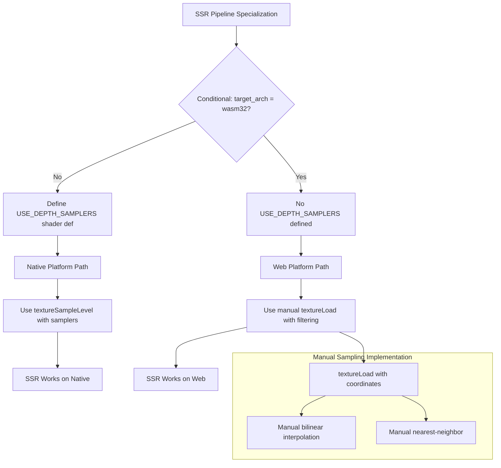

+++
title = "#22193 Add support for SSR on web"
date = "2025-12-30T00:00:00"
draft = false
template = "pull_request_page.html"
in_search_index = true

[taxonomies]
list_display = ["show"]

[extra]
current_language = "en"
available_languages = {"en" = { name = "English", url = "/pull_request/bevy/2025-12/pr-22193-en-20251230" }, "zh-cn" = { name = "中文", url = "/pull_request/bevy/2025-12/pr-22193-zh-cn-20251230" }}
labels = ["C-Bug", "A-Rendering", "O-Web"]
+++

# Title

## Basic Information
- **Title**: Add support for SSR on web
- **PR Link**: https://github.com/bevyengine/bevy/pull/22193
- **Author**: mate-h
- **Status**: MERGED
- **Labels**: C-Bug, A-Rendering, O-Web, S-Ready-For-Final-Review
- **Created**: 2025-12-18T23:50:10Z
- **Merged**: 2025-12-30T05:40:56Z
- **Merged By**: alice-i-cecile

## Description Translation

# Objective

- Implemented WebGPU safe SSR (screen-space reflections) while preserving native behavior
- Fixes #21700 

## Solution

- Kept native SSR unchanged by defining `USE_DEPTH_SAMPLERS` shader def on native
- the pipeline still binds filtered depth samplers and uses `textureSampleLevel` on depth
- added manual depth sampling in `ssr/raymarch.wgsl` via `textureLoad` with clamped bilinear and nearest helpers
- This avoids the validation error previously happening on web (documented in the linked issue above)

## Testing

- Ran the ssr example on native and web using the bevy CLI 
- Ran the atmosphere example on native and web

---

## Showcase

Atmosphere example running (fixed) using deferred rendering + SSR on web browser (chrome)


## The Story of This Pull Request

This PR addresses a WebGPU validation error that was preventing Screen-Space Reflections (SSR) from working correctly on web platforms. The core issue stems from WebGPU's stricter validation rules compared to native platforms, specifically regarding how depth textures can be sampled.

The problem centers around WebGPU's specification that depth textures with formats like `depth32float` cannot be sampled with filtering samplers (like bilinear or nearest-neighbor filters) unless they are used in comparison sampling operations. In Bevy's SSR implementation, the shader was using regular filtered sampling on depth textures, which worked fine on native platforms but caused WebGPU validation errors when running on web.

The developer took a pragmatic approach to solve this compatibility issue without breaking existing native functionality. Instead of changing the native implementation to match web constraints, they implemented a conditional solution that maintains optimal performance on native while providing a compliant workaround for web.

The solution introduces a shader definition `USE_DEPTH_SAMPLERS` that's only defined on non-WASM32 targets (native platforms). This allows the same shader code to branch between two different sampling strategies. On native, the shader continues to use the standard `textureSampleLevel` function with filtered samplers, which is more efficient and leverages GPU hardware filtering. On web, the shader falls back to manual sampling using `textureLoad`, implementing bilinear and nearest-neighbor filtering in shader code.

This approach required adding two new helper functions in the WGSL shader: `depth_sample_bilinear_clamped` and `depth_sample_nearest_clamped`. These functions manually implement texture filtering by:
1. Calculating texel coordinates from UV coordinates
2. Loading the four surrounding texels for bilinear filtering (or just the nearest texel for nearest-neighbor)
3. Performing the interpolation manually in the shader

The manual sampling approach avoids the validation error because it uses `textureLoad` instead of filtered sampling. While less efficient than hardware filtering, it provides correct results and enables SSR to work on web platforms. The implementation carefully handles edge cases with clamping to prevent sampling outside texture boundaries.

From an architectural perspective, this change demonstrates a good pattern for handling platform-specific differences in graphics code. By using shader definitions controlled at compile time, the solution maintains clean separation between platform implementations while keeping the codebase unified. This approach is more maintainable than having completely separate shader files for different platforms.

The changes are minimal and focused: two files modified with a total of 54 lines added and 4 lines removed. The Rust-side change is simply adding the `USE_DEPTH_SAMPLERS` shader definition conditionally. The WGSL changes are self-contained within the shader, wrapping the existing sampling code with conditional branches and adding the manual sampling fallback.

This implementation successfully resolves the validation error while preserving visual parity between native and web versions. The SSR effect works correctly on both platforms, as demonstrated by the provided screenshot showing the atmosphere example with deferred rendering and SSR running in Chrome.

## Visual Representation



## Key Files Changed

### `crates/bevy_pbr/src/ssr/mod.rs` (+3/-0)
This file controls the specialization of the SSR render pipeline. The change adds a conditional shader definition based on the target architecture.

```rust
// Before: No conditional shader definition for depth samplers
// After: Added conditional definition for native platforms

impl SpecializedRenderPipeline for ScreenSpaceReflectionsPipeline {
    // ... existing code ...
    
    #[cfg(not(target_arch = "wasm32"))]
    shader_defs.push("USE_DEPTH_SAMPLERS".into());
    
    // ... existing code ...
}
```

**What changed and why**: The change adds a shader definition `USE_DEPTH_SAMPLERS` that's only included when not compiling for WebAssembly (i.e., on native platforms). This serves as a compile-time flag that the WGSL shader can use to conditionally compile different code paths for native vs web platforms.

### `crates/bevy_pbr/src/ssr/raymarch.wgsl` (+51/-4)
This is the main SSR shader that performs the raymarching algorithm. The changes implement platform-specific sampling strategies.

```rust
// Before: Always using filtered samplers for depth textures
@group(2) @binding(2) var depth_linear_sampler: sampler;
@group(2) @binding(3) var depth_nearest_sampler: sampler;

// In the main function:
let linear_depth = 1.0 / textureSampleLevel(depth_prepass_texture, depth_linear_sampler, interp_uv, 0u);
let unfiltered_depth = 1.0 / textureSampleLevel(depth_prepass_texture, depth_nearest_sampler, interp_uv, 0u);

// After: Conditional compilation based on USE_DEPTH_SAMPLERS
#ifdef USE_DEPTH_SAMPLERS
@group(2) @binding(2) var depth_linear_sampler: sampler;
@group(2) @binding(3) var depth_nearest_sampler: sampler;
#endif

#ifndef USE_DEPTH_SAMPLERS
// Manual sampling implementation for web
fn depth_texel_clamped(texel: vec2<i32>) -> f32 {
    let dims = textureDimensions(depth_prepass_texture);
    let max_coord = vec2<i32>(i32(dims.x) - 1, i32(dims.y) - 1);
    let clamped = clamp(texel, vec2<i32>(0), max_coord);
    return textureLoad(depth_prepass_texture, clamped, 0);
}

fn depth_sample_nearest_clamped(uv: vec2<f32>, tex_size: vec2<f32>) -> f32 {
    let coord = uv * tex_size - vec2(0.5);
    return depth_texel_clamped(vec2<i32>(floor(coord + vec2(0.5))));
}

fn depth_sample_bilinear_clamped(uv: vec2<f32>, tex_size: vec2<f32>) -> f32 {
    let coord = uv * tex_size - vec2(0.5);
    let base = vec2<i32>(floor(coord));
    let frac = coord - floor(coord);

    let d00 = depth_texel_clamped(base);
    let d10 = depth_texel_clamped(base + vec2(1, 0));
    let d01 = depth_texel_clamped(base + vec2(0, 1));
    let d11 = depth_texel_clamped(base + vec2(1, 1));

    let d0 = mix(d00, d10, frac.x);
    let d1 = mix(d01, d11, frac.x);
    return mix(d0, d1, frac.y);
}
#endif

// Wrapper functions that choose implementation based on platform
fn depth_sample_linear(uv: vec2<f32>, tex_size: vec2<f32>) -> f32 {
#ifdef USE_DEPTH_SAMPLERS
    return textureSampleLevel(depth_prepass_texture, depth_linear_sampler, uv, 0u);
#else
    return depth_sample_bilinear_clamped(uv, tex_size);
#endif
}

// In the main function (replacing direct sampler calls):
let linear_depth = 1.0 / depth_sample_linear(interp_uv, (*distance_fn).depth_tex_size);
let unfiltered_depth = 1.0 / depth_sample_nearest(interp_uv, (*distance_fn).depth_tex_size);
```

**What changed and why**: The shader now conditionally defines depth samplers only when `USE_DEPTH_SAMPLERS` is defined (native platforms). For web platforms, it implements manual texture sampling using `textureLoad`. Two new wrapper functions `depth_sample_linear` and `depth_sample_nearest` provide a uniform interface that delegates to either the hardware-sampled or manually-sampled implementation based on the platform. The manual sampling correctly implements both bilinear and nearest-neighbor filtering with proper coordinate clamping.

## Further Reading

- [WebGPU Specification - Texture Formats](https://www.w3.org/TR/webgpu/#texture-formats): Details on which texture formats support which sampling modes
- [WGSL Specification - textureSampleLevel](https://www.w3.org/TR/WGSL/#texturesamplelevel): Documentation on texture sampling with mip level specification
- [WGSL Specification - textureLoad](https://www.w3.org/TR/WGSL/#textureload): Documentation on direct texel loading without filtering
- [Bilinear Interpolation](https://en.wikipedia.org/wiki/Bilinear_interpolation): Mathematical background on bilinear filtering implementation
- [Bevy Shader Definitions](https://bevyengine.org/learn/advanced-topics/shader-defs/): How shader definitions work in Bevy for conditional compilation

# Full Code Diff

The full code diff shows exactly what changed:

```
diff --git a/crates/bevy_pbr/src/ssr/mod.rs b/crates/bevy_pbr/src/ssr/mod.rs
index 40b84f3d733f7..7bd9d02c529de 100644
--- a/crates/bevy_pbr/src/ssr/mod.rs
+++ b/crates/bevy_pbr/src/ssr/mod.rs
@@ -552,6 +552,9 @@ impl SpecializedRenderPipeline for ScreenSpaceReflectionsPipeline {
             shader_defs.push("ATMOSPHERE".into());
         }
 
+        #[cfg(not(target_arch = "wasm32"))]
+        shader_defs.push("USE_DEPTH_SAMPLERS".into());
+
         RenderPipelineDescriptor {
             label: Some("SSR pipeline".into()),
             layout,
diff --git a/crates/bevy_pbr/src/ssr/raymarch.wgsl b/crates/bevy_pbr/src/ssr/raymarch.wgsl
index 12140c91e3170..20a76afa03202 100644
--- a/crates/bevy_pbr/src/ssr/raymarch.wgsl
+++ b/crates/bevy_pbr/src/ssr/raymarch.wgsl
@@ -24,11 +24,60 @@
     position_world_to_ndc,
 }
 
+#ifdef USE_DEPTH_SAMPLERS
 // Allows us to sample from the depth buffer with bilinear filtering.
 @group(2) @binding(2) var depth_linear_sampler: sampler;
 
 // Allows us to sample from the depth buffer with nearest-neighbor filtering.
 @group(2) @binding(3) var depth_nearest_sampler: sampler;
+#endif
+
+// Manual depth fetch helpers used on WebGPU where depth + filtering sampler is invalid.
+#ifndef USE_DEPTH_SAMPLERS
+fn depth_texel_clamped(texel: vec2<i32>) -> f32 {
+    let dims = textureDimensions(depth_prepass_texture);
+    let max_coord = vec2<i32>(i32(dims.x) - 1, i32(dims.y) - 1);
+    let clamped = clamp(texel, vec2<i32>(0), max_coord);
+    return textureLoad(depth_prepass_texture, clamped, 0);
+}
+
+fn depth_sample_nearest_clamped(uv: vec2<f32>, tex_size: vec2<f32>) -> f32 {
+    // Match nearest sampling by snapping to the closest texel center.
+    let coord = uv * tex_size - vec2(0.5);
+    return depth_texel_clamped(vec2<i32>(floor(coord + vec2(0.5))));
+}
+
+fn depth_sample_bilinear_clamped(uv: vec2<f32>, tex_size: vec2<f32>) -> f32 {
+    let coord = uv * tex_size - vec2(0.5);
+    let base = vec2<i32>(floor(coord));
+    let frac = coord - floor(coord);
+
+    let d00 = depth_texel_clamped(base);
+    let d10 = depth_texel_clamped(base + vec2(1, 0));
+    let d01 = depth_texel_clamped(base + vec2(0, 1));
+    let d11 = depth_texel_clamped(base + vec2(1, 1));
+
+    let d0 = mix(d00, d10, frac.x);
+    let d1 = mix(d01, d11, frac.x);
+    return mix(d0, d1, frac.y);
+}
+#endif
+
+fn depth_sample_linear(uv: vec2<f32>, tex_size: vec2<f32>) -> f32 {
+#ifdef USE_DEPTH_SAMPLERS
+    return textureSampleLevel(depth_prepass_texture, depth_linear_sampler, uv, 0u);
+#else
+    return depth_sample_bilinear_clamped(uv, tex_size);
+#endif
+}
+
+fn depth_sample_nearest(uv: vec2<f32>, tex_size: vec2<f32>) -> f32 {
+#ifdef USE_DEPTH_SAMPLERS
+    return textureSampleLevel(depth_prepass_texture, depth_nearest_sampler, uv, 0u);
+#else
+    return depth_sample_nearest_clamped(uv, tex_size);
+#endif
+}
 
 // Main code
 
@@ -241,10 +290,8 @@ fn depth_raymarch_distance_fn_evaluate(
     // * The false occlusions due to duplo land are rejected because the ray stays above the smooth surface.
     // * The shrink-wrap surface is no longer continuous, so it's possible for rays to miss it.
 
-    let linear_depth =
-        1.0 / textureSampleLevel(depth_prepass_texture, depth_linear_sampler, interp_uv, 0u);
-    let unfiltered_depth =
-        1.0 / textureSampleLevel(depth_prepass_texture, depth_nearest_sampler, interp_uv, 0u);
+    let linear_depth = 1.0 / depth_sample_linear(interp_uv, (*distance_fn).depth_tex_size);
+    let unfiltered_depth = 1.0 / depth_sample_nearest(interp_uv, (*distance_fn).depth_tex_size);
 
     var max_depth: f32;
     var min_depth: f32;
```