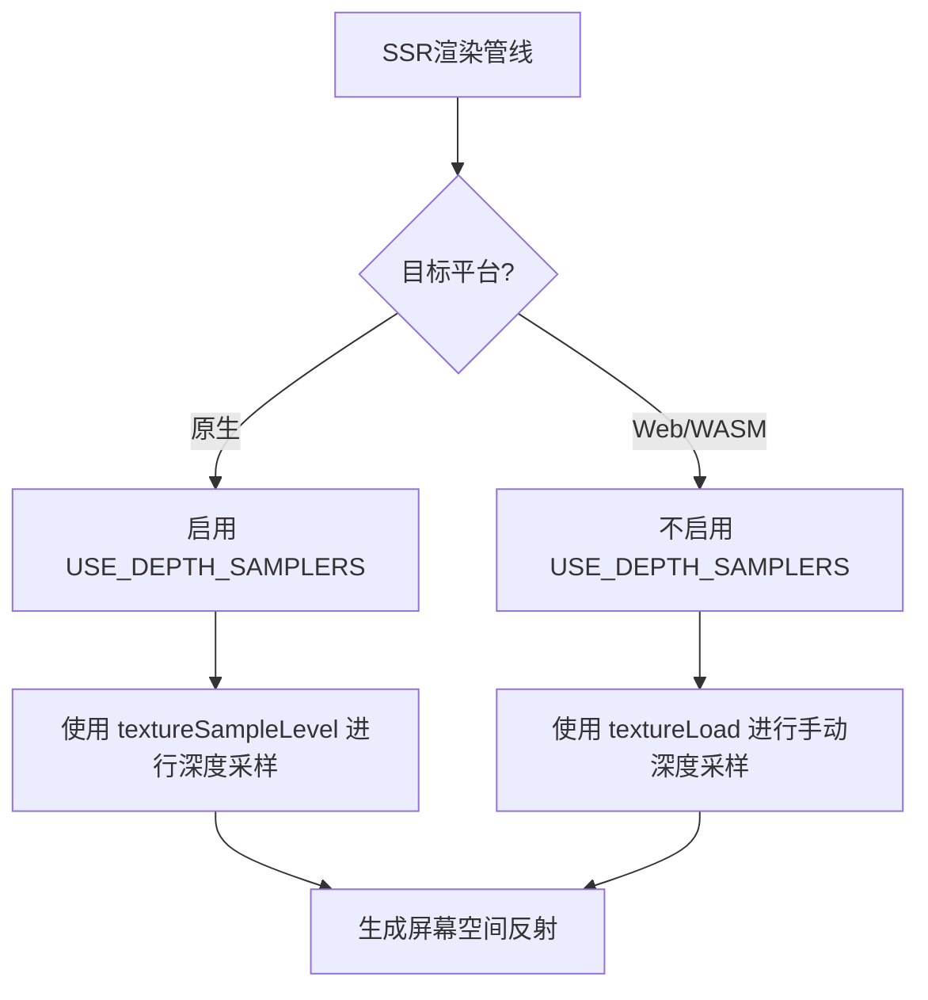

+++
title = "#22193 Add support for SSR on web"
date = "2025-12-30T00:00:00"
draft = false
template = "pull_request_page.html"
in_search_index = false

[extra]
current_language = "zh-cn"
available_languages = {"en" = { name = "English", url = "/pull_request/bevy/2025-12/pr-22193-en-20251230" }, "zh-cn" = { name = "中文", url = "/pull_request/bevy/2025-12/pr-22193-zh-cn-20251230" }}
labels = ["C-Bug", "A-Rendering", "O-Web"]
+++

# Title
Add support for SSR on web

## Basic Information
- **Title**: Add support for SSR on web
- **PR Link**: https://github.com/bevyengine/bevy/pull/22193
- **Author**: mate-h
- **Status**: MERGED
- **Labels**: C-Bug, A-Rendering, O-Web, S-Ready-For-Review
- **Created**: 2025-12-18T23:50:10Z
- **Merged**: 2025-12-30T05:40:56Z
- **Merged By**: alice-i-cecile

## Description Translation
**目标**
- 在Web平台上实现WebGPU安全的SSR（屏幕空间反射），同时保持原生行为。
- 修复 #21700。

**解决方案**
- 通过在本机平台定义 `USE_DEPTH_SAMPLERS` 着色器定义来保持原生SSR不变。
- 管道仍会绑定过滤的深度采样器，并在深度上使用 `textureSampleLevel`。
- 在 `ssr/raymarch.wgsl` 中添加了通过 `textureLoad` 的手动深度采样，以及钳位双线性和最近邻辅助函数。
- 这避免了之前在Web上发生的验证错误（在链接的issue中有记录）。

**测试**
- 使用bevy CLI在本机和Web上运行了ssr示例。
- 在本机和Web上运行了大气示例。

---

**展示**

在Chrome浏览器上运行（已修复的）大气示例，使用了延迟渲染 + SSR。


## The Story of This Pull Request

### 问题与背景
Bevy引擎的屏幕空间反射（SSR）功能在原生平台上运行正常，但在Web平台（通过WebGPU）上遇到了验证错误。问题（issue #21700）的根本原因在于，WebGPU规范不允许将深度纹理与过滤采样器（如线性或最近邻采样器）一起使用。在原生平台上，深度纹理通常可以与采样器绑定，并通过`textureSampleLevel`进行采样，但WebGPU出于兼容性和安全考虑，禁止这种操作。

这个限制意味着在Web上运行SSR会失败，因为现有的SSR着色器代码假设深度纹理可以像普通纹理一样被采样。这阻碍了Bevy的跨平台渲染能力，特别是对于希望使用高级图形效果（如SSR）的Web应用。

### 解决方案思路
开发者需要提供一个在WebGPU上安全的SSR实现，同时不影响原生平台的性能和现有行为。解决方案的核心思路是：**条件编译和手动采样**。

具体来说：
1. **保持原生路径不变**：对于原生平台，继续使用现有的采样器方式，因为这种方式性能更好，并且被图形API广泛支持。
2. **为Web实现备用路径**：对于Web平台，绕过采样器限制，通过`textureLoad`函数手动实现纹理采样，包括双线性和最近邻过滤。

这种方案的关键是引入一个着色器定义（shader def）`USE_DEPTH_SAMPLERS`，该定义仅在原生平台（非`wasm32`）上启用。在着色器代码中，根据这个定义选择使用采样器路径还是手动采样路径。

### 实现细节
实现涉及两个文件：一个Rust代码文件用于设置着色器定义，一个WGSL着色器文件用于实现条件采样逻辑。

首先，在`mod.rs`中，通过条件编译仅在非Web平台添加`USE_DEPTH_SAMPLERS`定义：
```rust
#[cfg(not(target_arch = "wasm32"))]
shader_defs.push("USE_DEPTH_SAMPLERS".into());
```
这确保了在编译面向Web的着色器时，不会定义`USE_DEPTH_SAMPLERS`，从而触发手动采样路径。

其次，在`raymarch.wgsl`中，进行了以下更改：
1. **条件化采样器绑定**：将原有的深度采样器绑定包装在`#ifdef USE_DEPTH_SAMPLERS`块中，这样它们在Web平台上不会被声明，避免了验证错误。
2. **实现手动采样辅助函数**：在`#ifndef USE_DEPTH_SAMPLERS`块中，实现了`depth_texel_clamped`、`depth_sample_nearest_clamped`和`depth_sample_bilinear_clamped`函数。这些函数使用`textureLoad`读取纹理像素，并手动实现双线性插值和最近邻采样，同时确保采样坐标被钳位在纹理范围内。
3. **创建统一的采样接口**：新增了`depth_sample_linear`和`depth_sample_nearest`函数，它们根据`USE_DEPTH_SAMPLERS`的定义，分别调用`textureSampleLevel`或手动采样函数。这样，主着色器代码可以无缝地使用这两个接口，而不需要关心底层平台差异。

### 技术洞察
这个PR展示了一个处理跨平台图形API差异的经典模式：**通过着色器条件编译和抽象接口来隔离平台特定代码**。这样做的好处是：
- **性能**：在原生平台上，继续使用硬件加速的纹理采样，性能最优。
- **兼容性**：在Web平台上，通过手动采样规避API限制，保证了功能的可用性。
- **代码维护**：核心算法逻辑（如光线行进）保持不变，只需修改底层的采样方式。这降低了维护成本，并减少了引入错误的风险。

手动实现双线性滤波需要注意细节：必须将UV坐标转换为纹理坐标，并正确处理边界。实现中的`depth_texel_clamped`函数使用`clamp`来确保纹理坐标不越界，这是稳健的。

### 影响
这个PR成功修复了SSR在Web平台上的问题，使Bevy的SSR功能真正实现了跨平台。用户现在可以在Web浏览器中体验带有屏幕空间反射的图形效果，如大气示例所示。同时，原生平台的性能和行为没有受到任何影响。

从工程角度看，这个解决方案是可扩展的。未来如果其他着色器功能遇到类似的WebGPU限制，可以借鉴相同的模式：通过条件编译提供备用的手动实现。

## Visual Representation



## Key Files Changed

### 1. `crates/bevy_pbr/src/ssr/mod.rs`
- **更改描述**：在构建SSR渲染管线时，仅当目标平台不是`wasm32`（即非Web平台）时，才将`USE_DEPTH_SAMPLERS`着色器定义添加到着色器定义列表中。这确保了在Web平台上编译着色器时，不会使用深度采样器。
- **代码片段**：
```rust
// 更改后（添加部分）：
#[cfg(not(target_arch = "wasm32"))]
shader_defs.push("USE_DEPTH_SAMPLERS".into());
```
- **与PR目标的关系**：这是实现条件编译的关键，它控制着色器代码中哪条路径被激活。

### 2. `crates/bevy_pbr/src/ssr/raymarch.wgsl`
- **更改描述**：重构了深度采样逻辑。添加了手动深度采样辅助函数，并创建了统一的采样接口函数（`depth_sample_linear`和`depth_sample_nearest`）。主光线行进代码现在通过这些接口函数进行深度采样，而底层实现根据`USE_DEPTH_SAMPLERS`的定义选择使用采样器或手动采样。
- **代码片段**（关键部分）：
```wgsl
// 条件化采样器绑定
#ifdef USE_DEPTH_SAMPLERS
@group(2) @binding(2) var depth_linear_sampler: sampler;
@group(2) @binding(3) var depth_nearest_sampler: sampler;
#endif

// 手动采样辅助函数（Web路径）
#ifndef USE_DEPTH_SAMPLERS
fn depth_sample_bilinear_clamped(uv: vec2<f32>, tex_size: vec2<f32>) -> f32 {
    // ... 手动双线性插值实现
}
#endif

// 统一的线性采样接口
fn depth_sample_linear(uv: vec2<f32>, tex_size: vec2<f32>) -> f32 {
#ifdef USE_DEPTH_SAMPLERS
    return textureSampleLevel(depth_prepass_texture, depth_linear_sampler, uv, 0u);
#else
    return depth_sample_bilinear_clamped(uv, tex_size);
#endif
}

// 主代码中使用新接口
// 更改前：
// let linear_depth = 1.0 / textureSampleLevel(depth_prepass_texture, depth_linear_sampler, interp_uv, 0u);
// 更改后：
let linear_depth = 1.0 / depth_sample_linear(interp_uv, (*distance_fn).depth_tex_size);
```
- **与PR目标的关系**：这是实现WebGPU安全SSR的核心，通过手动采样替代了Web平台上不允许的深度纹理过滤采样。

## Further Reading
1. **WebGPU规范**：了解WebGPU中关于深度纹理和采样器的限制。[WebGPU Specification](https://www.w3.org/TR/webgpu/)
2. **Bevy渲染管线**：学习Bevy中渲染管线的构建和着色器管理。[Bevy Rendering Book](https://bevyengine.org/learn/book/rendering/)
3. **屏幕空间反射技术**：深入理解SSR算法的原理和实现。可参考《Real-Time Rendering》第四版中相关章节。
4. **WGSL语言**：熟悉WGSL（WebGPU Shading Language）的语法和特性。[WGSL Specification](https://www.w3.org/TR/WGSL/)
5. **跨平台图形开发**：了解处理不同图形API（如Vulkan/Metal/DirectX与WebGPU）差异的最佳实践。