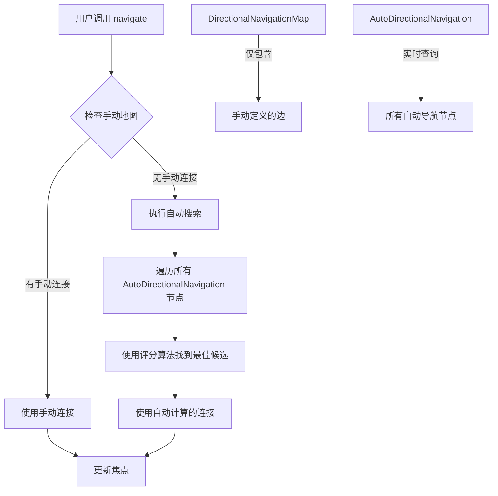

+++
title = "#22194 `DirectionalNavigationMap` no longer caches `AutoDirectionalNavigation` node connections"
date = "2025-12-30T00:00:00"
draft = false
template = "pull_request_page.html"
in_search_index = false

[extra]
current_language = "zh-cn"
available_languages = {"en" = { name = "English", url = "/pull_request/bevy/2025-12/pr-22194-en-20251230" }, "zh-cn" = { name = "中文", url = "/pull_request/bevy/2025-12/pr-22194-zh-cn-20251230" }}
labels = ["C-Bug", "A-UI", "D-Modest"]
+++

# `DirectionalNavigationMap` no longer caches `AutoDirectionalNavigation` node connections

## Basic Information
- **Title**: `DirectionalNavigationMap` no longer caches `AutoDirectionalNavigation` node connections
- **PR Link**: https://github.com/bevyengine/bevy/pull/22194
- **Author**: kfc35
- **Status**: MERGED
- **Labels**: C-Bug, A-UI, S-Ready-For-Final-Review, D-Modest
- **Created**: 2025-12-19T07:25:24Z
- **Merged**: 2025-12-30T00:58:57Z
- **Merged By**: alice-i-cecile

## Description Translation

### 目标
- 修复 #21949

### 解决方案
根据 @viridia 的建议，并在 Discord 上得到 @ickshonpe 的确认，方向导航地图（DirectionalNavigationMap）不应再包含任何 `AutoDirectionalNavigation` 节点连接。本 PR：
- 移除了将这类连接插入地图的系统，将地图的管理完全交给开发者。方向导航地图现在仅用于指定**手动**边。
- 在 `DirectionalNavigation` 系统参数的 `navigate` 函数中，对 `AutoDirectionalNavigation` 节点添加了暴力搜索。`navigate` 会优先在地图的手动边中寻找目标，然后再进行暴力搜索。

### 测试
- 你是否测试了这些更改？如果是，如何测试的？
  我测试了两个相关的示例，以确保没有回归：
  `cargo run --example directional_navigation`：手动定义的边被遵守。在同一行上向东和西导航正确循环，沿着列向北和南导航按照示例中的指定工作，没有循环。
  `cargo run --example auto_directional_navigation`：导航在这里也按预期工作。
  然而，我没有手动测试在应用执行期间移除 `AutoDirectionalNavigation` 节点是否会导致导航系统适应，但我认为这应该是明显的，因为算法不再使用这些类型边的缓存地图。

- 是否有任何部分需要更多测试？
  我尝试为"自动"部分编写自动化测试，但我在让生成的节点为其 `ComputedNode` 和 `UiGlobalTransform` 拥有有效值（尽管我尝试指定，但值不代表零大小内容或无平移）时遇到了困难。我只是通过 auto_directional_navigation 示例来验证行为。
  同时包含自动和手动导航的测试会很好，但可能过度了。那里的逻辑只是相对简单的 if/else。

- 其他人（审阅者）如何测试你的更改？他们需要知道什么具体信息吗？
  你可以测试这些示例，以确保方向导航按预期工作。如果你想更进一步，可以尝试在执行期间移除一些 `AutoDirectionalNavigation` 节点，看看导航是否适应。

- 如果相关，你在哪些平台上测试了这些更改，有哪些重要的平台你无法测试？
  我只在 MacOS 上运行了示例。

## The Story of This Pull Request

这个 PR 的核心问题是解决方向导航系统中的一个设计缺陷。在之前的实现中，`DirectionalNavigationMap` 同时缓存了手动定义的导航边和由 `AutoDirectionalNavigation` 组件自动生成的导航边。这种混合存储方式导致了问题 #21949：当自动导航节点被移除时，缓存中的连接不会自动清理，从而导致导航到不存在的实体。

开发者的解决方案相当直接：将自动导航的计算从缓存改为实时执行。这种改变有几个关键优势：
1. 避免了缓存不一致的问题
2. 简化了系统架构，减少了状态管理
3. 使自动导航的行为更加动态和可预测

**实现策略的变化**主要体现在两个方面。首先，移除了 `auto_rebuild_ui_navigation_graph` 系统，这个系统原本负责监听 `AutoDirectionalNavigation` 节点的变化并更新地图缓存。其次，修改了 `DirectionalNavigation` 系统参数，使其能够在导航时实时计算自动导航目标。

具体的技术实现中，`DirectionalNavigation` 现在持有了两个查询：
- `navigable_entities_query`：用于获取所有可自动导航的节点
- `focusable_area_query`：用于将特定实体转换为 `FocusableArea`

在 `navigate` 方法中，逻辑流程现在是：
```rust
if let Some(manual_neighbor) = self.map.get_neighbor(current_focus, direction) {
    // 使用手动定义的边
} else if let Some(origin) = self.entity_to_focusable_area(current_focus) {
    // 进行自动导航的暴力搜索
    if let Some(auto_neighbor) = find_best_candidate(...) {
        // 使用自动计算的目标
    }
}
```

**性能考虑**是这种设计的重要方面。将自动导航从缓存改为实时计算确实会增加每次导航操作的计算成本，因为需要遍历所有可导航节点。然而，这种成本通常是可接受的，原因如下：
1. UI 节点数量通常有限
2. 导航操作不是高频操作
3. 避免了维护缓存的开销和复杂性

**代码重构**也体现在将原有的 `auto_generate_navigation_edges` 函数中的搜索逻辑提取为独立的 `find_best_candidate` 函数。这种提取提高了代码的复用性，使得实时搜索和原来的缓存生成可以使用相同的评分算法。

**架构影响**方面，这个改变清晰地分离了手动导航和自动导航的职责。`DirectionalNavigationMap` 现在专门用于开发者显式定义的导航关系，而自动导航则完全由 `AutoDirectionalNavigation` 组件和实时搜索算法处理。这种分离使得系统的行为更加可预测，也减少了潜在的错误来源。

**向后兼容性**在这个改变中得到了很好的维护。现有的使用手动导航的代码不需要任何修改，而使用自动导航的代码虽然在底层实现上发生了变化，但 API 行为和最终结果保持不变。

从工程角度看，这个解决方案展示了如何处理缓存一致性问题：当缓存的管理变得复杂且容易出错时，有时更好的选择是移除缓存，改为实时计算。这种权衡在 UI 导航这种计算量不大但正确性至关重要的场景中尤其合适。

## Visual Representation



## Key Files Changed

### `crates/bevy_input_focus/src/directional_navigation.rs` (+135/-133)

这是本次 PR 中唯一修改的文件，主要变化包括：

1. **移除自动重建系统**：删除了 `auto_rebuild_ui_navigation_graph` 系统，不再自动更新导航地图
2. **修改 DirectionalNavigation 系统参数**：添加了实时查询逻辑
3. **提取搜索函数**：将搜索逻辑提取为可复用的函数
4. **更新文档**：反映新的设计理念

**关键代码变化示例**：

```rust
// 修改前：DirectionalNavigation 系统参数结构
pub struct DirectionalNavigation<'w> {
    pub focus: ResMut<'w, InputFocus>,
    pub map: Res<'w, DirectionalNavigationMap>,
}

// 修改后：添加了自动导航的查询能力
pub struct DirectionalNavigation<'w, 's> {
    pub focus: ResMut<'w, InputFocus>,
    pub map: Res<'w, DirectionalNavigationMap>,
    pub config: Res<'w, AutoNavigationConfig>,
    navigable_entities_query: Query<
        'w,
        's,
        (
            Entity,
            &'static ComputedNode,
            &'static UiGlobalTransform,
            &'static InheritedVisibility,
        ),
        With<AutoDirectionalNavigation>,
    >,
    focusable_area_query: Query<
        'w,
        's,
        (Entity, &'static ComputedNode, &'static UiGlobalTransform),
        With<AutoDirectionalNavigation>,
    >,
}
```

```rust
// 修改前：navigate 方法仅使用缓存
if let Some(current_focus) = self.focus.0 {
    if let Some(new_focus) = self.map.get_neighbor(current_focus, direction) {
        self.focus.set(new_focus);
        Ok(new_focus)
    } else {
        Err(DirectionalNavigationError::NoNeighborInDirection {
            current_focus,
            direction,
        })
    }
}

// 修改后：先尝试手动边，再执行自动搜索
if let Some(current_focus) = self.focus.0 {
    // 优先使用手动定义的边
    if let Some(new_focus) = self.map.get_neighbor(current_focus, direction) {
        self.focus.set(new_focus);
        Ok(new_focus)
    } else if let Some(origin) = self.entity_to_focusable_area(current_focus)
        && let Some(new_focus) = find_best_candidate(
            &origin,
            direction,
            &self.get_navigable_nodes(),
            &self.config,
        )
    {
        // 执行自动搜索
        self.focus.set(new_focus);
        Ok(new_focus)
    } else {
        Err(DirectionalNavigationError::NoNeighborInDirection {
            current_focus,
            direction,
        })
    }
}
```

**新增的 find_best_candidate 函数**：
```rust
fn find_best_candidate(
    origin: &FocusableArea,
    direction: CompassOctant,
    candidates: &[FocusableArea],
    config: &AutoNavigationConfig,
) -> Option<Entity> {
    let mut best_candidate = None;
    let mut best_score = f32::INFINITY;

    for candidate in candidates {
        if candidate.entity == origin.entity {
            continue;
        }

        let score = score_candidate(
            origin.position,
            origin.size,
            candidate.position,
            candidate.size,
            direction,
            config,
        );

        if score < best_score {
            best_score = score;
            best_candidate = Some(candidate.entity);
        }
    }

    best_candidate
}
```

## Further Reading

- [Bevy UI 系统文档](https://docs.rs/bevy_ui/latest/bevy_ui/)
- [ECS 系统中的查询模式](https://bevy-cheatbook.github.io/programming/queries.html)
- [实时计算 vs 缓存的权衡](https://en.wikipedia.org/wiki/Cache_(computing)#The_cache_vs_compute_tradeoff)
- [UI 导航系统的设计模式](https://www.w3.org/WAI/ARIA/apg/practices/keyboard-interface/)