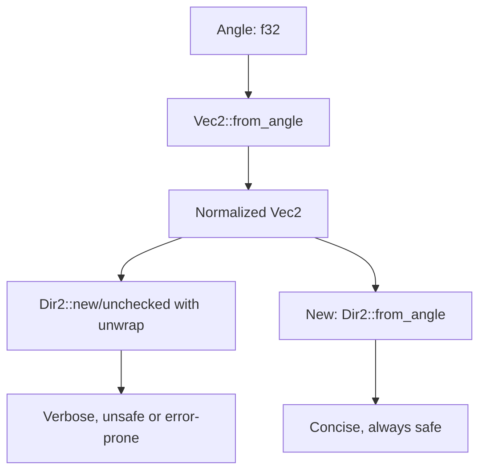

+++
title = "#22197 Add `Dir2::from_angle`"
date = "2025-12-22T00:00:00"
draft = false
template = "pull_request_page.html"
in_search_index = true

[taxonomies]
list_display = ["show"]

[extra]
current_language = "en"
available_languages = {"en" = { name = "English", url = "/pull_request/bevy/2025-12/pr-22197-en-20251222" }, "zh-cn" = { name = "中文", url = "/pull_request/bevy/2025-12/pr-22197-zh-cn-20251222" }}
labels = ["C-Feature", "A-Math", "D-Straightforward"]
+++

# Title
Add `Dir2::from_angle`

## Basic Information
- **Title**: Add `Dir2::from_angle`
- **PR Link**: https://github.com/bevyengine/bevy/pull/22197
- **Author**: lynn-lumen
- **Status**: MERGED
- **Labels**: C-Feature, S-Ready-For-Final-Review, A-Math, D-Straightforward
- **Created**: 2025-12-19T14:17:27Z
- **Merged**: 2025-12-22T20:12:40Z
- **Merged By**: james7132

## Description Translation
# Objective

- I have found myself writing `Dir2::new_unchecked(Vec2::from_angle(angle))` or `Dir2::new(Vec2::from_angle(angle)).unwrap()` quite frequently. This is pretty cumbersome and should not require calling `.unwrap()` or unchecked functions.

## Solution

- Added `Dir2::from_angle(angle)`

## The Story of This Pull Request

This pull request addresses a small but frequent ergonomic issue in the Bevy math library. When working with 2D directions represented as angles, developers were forced to write verbose code that either used unsafe methods or required unwrapping results. The core problem was that creating a normalized direction vector from an angle required multiple steps, even though the mathematical operation is straightforward and always valid.

The developer encountered this issue repeatedly in their workflow: to create a `Dir2` from an angle, they had to first create a `Vec2` using `Vec2::from_angle()`, then convert it to a `Dir2`. Since `Vec2::from_angle()` always produces a normalized vector (because `[cos(θ), sin(θ)]` has unit length by definition), the conversion should be safe, but the existing API required either:
1. Using `Dir2::new_unchecked()` which bypasses safety checks
2. Using `Dir2::new()` followed by `.unwrap()` which adds unnecessary error handling

Both approaches were suboptimal. The first bypasses the type system's safety guarantees, while the second adds unnecessary runtime overhead and complexity for an operation that mathematically cannot fail.

The solution implemented is straightforward and follows existing patterns in the codebase. A new method `Dir2::from_angle()` was added that directly constructs a `Dir2` from an angle. Internally, it calls `Vec2::from_angle()` and wraps the result in a `Dir2`. Since `Vec2::from_angle()` guarantees a normalized vector, this conversion is always safe.

This change improves code ergonomics in several ways:
1. It eliminates the need for unsafe operations or unwrapping for a common use case
2. It makes the intent clearer - when reading `Dir2::from_angle(θ)`, it's immediately obvious what the code is doing
3. It reduces boilerplate and potential for errors
4. It maintains type safety without runtime overhead

The implementation is efficient - it's marked with `#[inline]` to allow the compiler to optimize away the function call overhead. The method simply delegates to `Vec2::from_angle()` which already computes the cosine and sine of the angle.

This change follows the principle that APIs should make common patterns easy and safe. When a mathematical operation is well-defined and cannot fail (like creating a unit direction vector from an angle), the API should reflect that by providing a direct, safe method rather than forcing developers through error-prone or verbose workarounds.

## Visual Representation



## Key Files Changed

**File: `crates/bevy_math/src/direction.rs`**
- **Change**: Added the `from_angle` method to the `Dir2` struct
- **Why**: To provide a direct, safe way to create a 2D direction from an angle without requiring unsafe operations or error handling

**Code Snippet:**
```rust
// Before: No direct method to create Dir2 from angle
// Developers had to write:
let dir1 = Dir2::new_unchecked(Vec2::from_angle(angle)); // Unsafe
let dir2 = Dir2::new(Vec2::from_angle(angle)).unwrap(); // Error-prone

// After: New method added
impl Dir2 {
    /// Creates a 2D direction containing `[angle.cos(), angle.sin()]`.
    #[inline]
    pub fn from_angle(angle: f32) -> Self {
        Self(Vec2::from_angle(angle))
    }
}

// Usage becomes simple and safe:
let dir = Dir2::from_angle(angle);
```

The implementation leverages the existing `Vec2::from_angle()` method which guarantees a normalized vector, making the conversion to `Dir2` always safe. The method is inline to avoid function call overhead, and the documentation clearly states what it does.

## Further Reading

1. **Bevy Math Documentation**: For more information about `Dir2` and other math types in Bevy
2. **Trigonometry Fundamentals**: Understanding why `[cos(θ), sin(θ)]` always produces a unit vector
3. **API Design Principles**: The importance of making safe operations easy and unsafe operations difficult
4. **Rust Inline Attributes**: When and why to use `#[inline]` for performance optimization

# Full Code Diff
```diff
diff --git a/crates/bevy_math/src/direction.rs b/crates/bevy_math/src/direction.rs
index 03cb9f969f1e6..d2c6d4b629370 100644
--- a/crates/bevy_math/src/direction.rs
+++ b/crates/bevy_math/src/direction.rs
@@ -179,6 +179,12 @@ impl Dir2 {
         Self::new_unchecked(Vec2::new(x, y))
     }
 
+    /// Creates a 2D direction containing `[angle.cos(), angle.sin()]`.
+    #[inline]
+    pub fn from_angle(angle: f32) -> Self {
+        Self(Vec2::from_angle(angle))
+    }
+
     /// Returns the inner [`Vec2`]
     pub const fn as_vec2(&self) -> Vec2 {
         self.0
```