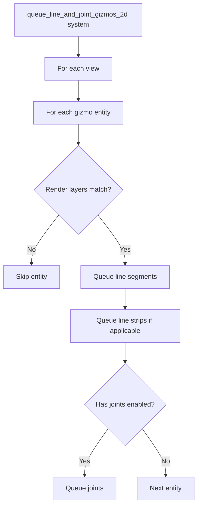

+++
title = "#22199 Fix separate layers with lines and joints"
date = "2025-12-29T00:00:00"
draft = false
template = "pull_request_page.html"
in_search_index = true

[taxonomies]
list_display = ["show"]

[extra]
current_language = "en"
available_languages = {"en" = { name = "English", url = "/pull_request/bevy/2025-12/pr-22199-en-20251229" }, "zh-cn" = { name = "中文", url = "/pull_request/bevy/2025-12/pr-22199-zh-cn-20251229" }}
labels = ["C-Bug", "A-Gizmos", "D-Straightforward"]
+++

# Title
Fix separate layers with lines and joints

## Basic Information
- **Title**: Fix separate layers with lines and joints
- **PR Link**: https://github.com/bevyengine/bevy/pull/22199
- **Author**: yh1970
- **Status**: MERGED
- **Labels**: C-Bug, S-Ready-For-Final-Review, A-Gizmos, D-Straightforward
- **Created**: 2025-12-19T16:39:21Z
- **Merged**: 2025-12-29T20:08:43Z
- **Merged By**: mockersf

## Description Translation

# Objective

Fix #22179 

## Solution

Merge the two queue systems into one. The line and joint pairs should be drawn now in their own layers.

## Testing

I ran the 2d_gizmos example.

---

## Showcase

<details>
  <summary>Click to view showcase</summary>

Before


After


</details>

## The Story of This Pull Request

This PR addresses a specific rendering bug in Bevy's 2D gizmo system where line joints were not being drawn in the correct render layers. The issue (#22179) was reported, and the fix involves refactoring how the rendering queue systems are organized.

The problem stemmed from having two separate queue systems: `queue_line_gizmos_2d` and `queue_line_joint_gizmos_2d`. These systems were running independently but needed to process the same set of gizmo entities. When they ran separately, they could end up adding render items to different render phases or with different layer configurations, causing the joints to appear incorrectly layered relative to their corresponding lines.

The solution is straightforward: merge the two queue systems into a single system that handles both line and joint rendering in the same pass. This ensures that for each gizmo entity, both the line segments and their joints are queued for rendering with consistent render layer settings.

Looking at the implementation, the new `queue_line_and_joint_gizmos_2d` function combines the logic from both previous systems. It now takes both pipeline resources (`LineGizmoPipeline` and `LineJointGizmoPipeline`) and their corresponding specialized render pipeline collections. The function retrieves all three draw functions at once: for regular lines, line strips, and line joints.

The main loop structure remains similar - it iterates through views and gizmo entities. However, instead of having separate passes for lines and joints, it now processes everything in a single pass per entity. First, it handles the non-strip line vertices (if any), then the strip vertices (if applicable), and finally the joints (if the strip has enough vertices and joints are enabled).

This consolidation ensures that the render layer filtering logic (`config.render_layers.intersects(render_layers)`) is applied consistently. Previously, if the two systems ran at slightly different times or with different state, they might produce inconsistent results. Now, with a single pass, the layer filtering is guaranteed to be the same for both lines and their corresponding joints.

The technical approach here follows good software engineering practice: when you have two systems that need to operate on the same data with tight coupling requirements, consolidating them into a single system reduces complexity and eliminates synchronization issues. The refactoring also reduces code duplication, as both the view iteration and entity filtering logic were identical in the two original systems.

One important note about performance: while this change consolidates two systems into one, it doesn't significantly change the computational complexity. Both original systems were already iterating over all views and all gizmo entities. The combined system does the same iterations but processes both lines and joints in the same loop. This might even provide a small performance benefit due to better cache locality and reduced system overhead.

The impact of this fix is visually clear in the showcase images. Before the fix, joints could appear incorrectly layered, potentially behind other elements or in the wrong order. After the fix, lines and their joints render together correctly in their designated layers.

## Visual Representation



## Key Files Changed

### `crates/bevy_gizmos_render/src/pipeline_2d.rs` (+21/-49)

This file contains the core rendering logic for 2D gizmos. The changes replace two separate queue systems with a single unified system.

**Key modifications:**

1. **Plugin system registration changed:**
```rust
// Before:
.add_systems(
    Render,
    (queue_line_gizmos_2d, queue_line_joint_gizmos_2d)
        .in_set(GizmoRenderSystems::QueueLineGizmos2d)
        .after(prepare_assets::<GpuLineGizmo>),
)

// After:
.add_systems(
    Render,
    queue_line_and_joint_gizmos_2d
        .in_set(GizmoRenderSystems::QueueLineGizmos2d)
        .after(prepare_assets::<GpuLineGizmo>),
)
```

2. **Function signature and resource access expanded:**
```rust
// Before (in queue_line_gizmos_2d):
fn queue_line_gizmos_2d(
    draw_functions: Res<DrawFunctions<Transparent2d>>,
    pipeline: Res<LineGizmoPipeline>,
    mut pipelines: ResMut<SpecializedRenderPipelines<LineGizmoPipeline>>,
    // ... other parameters
)

// After:
fn queue_line_and_joint_gizmos_2d(
    draw_functions: Res<DrawFunctions<Transparent2d>>,
    line_gizmo_pipeline: Res<LineGizmoPipeline>,
    line_joint_gizmo_pipeline: Res<LineJointGizmoPipeline>,
    mut line_gizmo_pipelines: ResMut<SpecializedRenderPipelines<LineGizmoPipeline>>,
    mut line_joint_gizmo_pipelines: ResMut<SpecializedRenderPipelines<LineJointGizmoPipeline>>,
    // ... other parameters
)
```

3. **Draw function retrieval consolidated:**
```rust
// Before (in queue_line_gizmos_2d):
let draw_function = draw_functions.read().get_id::<DrawLineGizmo2d>().unwrap();
let draw_function_strip = draw_functions
    .read()
    .get_id::<DrawLineGizmo2dStrip>()
    .unwrap();

// Before (in queue_line_joint_gizmos_2d):
let draw_function = draw_functions
    .read()
    .get_id::<DrawLineJointGizmo2d>()
    .unwrap();

// After (all in one place):
let draw_function = draw_functions.read().get_id::<DrawLineGizmo2d>().unwrap();
let draw_line_function_strip = draw_functions
    .read()
    .get_id::<DrawLineGizmo2dStrip>()
    .unwrap();
let draw_line_joint_function = draw_functions
    .read()
    .get_id::<DrawLineJointGizmo2d>()
    .unwrap();
```

4. **Processing logic combined in a single loop:**
The most significant change is in the main processing loop. Instead of having two separate functions that iterate over views and entities independently, the new function processes lines and joints together:

```rust
// Inside the entity loop:
// Draw lines (non-strip)
if line_gizmo.list_vertex_count > 0 {
    // ... line rendering logic
}

// Draw line strips
if line_gizmo.strip_vertex_count >= 2 {
    // ... strip rendering logic
}

// Draw line joints (only if conditions met)
if line_gizmo.strip_vertex_count < 3 || config.line_joints == GizmoLineJoint::None {
    continue;
}
// ... joint rendering logic
```

This ensures that for each entity, the render layer check happens once, and both lines and joints are processed with consistent state.

## Further Reading

1. **Bevy ECS System Scheduling**: Understanding how Bevy schedules systems is crucial for this fix. The Bevy Book's chapter on Scheduling explains how systems run and when they can access shared resources.
2. **Bevy Render Phases**: The concept of render phases and how they organize draw calls is fundamental to understanding the rendering pipeline this PR modifies.
3. **Entity Component System Patterns**: This fix exemplifies when to combine systems that operate on the same data vs. keeping them separate for modularity.
4. **Graphics Pipeline State Management**: The PR touches on how render state (like which pipeline to use) needs to be consistent across related draw calls.