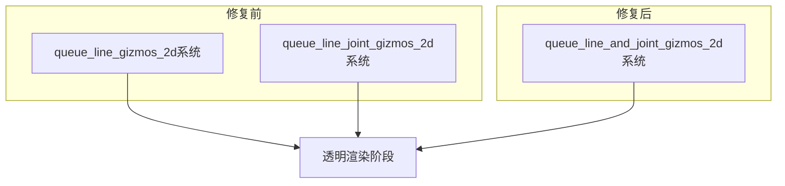

+++
title = "#22199 Fix separate layers with lines and joints"
date = "2025-12-29T00:00:00"
draft = false
template = "pull_request_page.html"
in_search_index = false

[extra]
current_language = "zh-cn"
available_languages = {"en" = { name = "English", url = "/pull_request/bevy/2025-12/pr-22199-en-20251229" }, "zh-cn" = { name = "中文", url = "/pull_request/bevy/2025-12/pr-22199-zh-cn-20251229" }}
+++

# Title

## Basic Information
- **标题**: Fix separate layers with lines and joints
- **PR链接**: https://github.com/bevyengine/bevy/pull/22199
- **作者**: yh1970
- **状态**: 已合并
- **标签**: C-Bug, S-Ready-For-Final-Review, A-Gizmos, D-Straightforward
- **创建时间**: 2025-12-19T16:39:21Z
- **合并时间**: 2025-12-29T20:08:43Z
- **合并者**: mockersf

## 描述翻译

# 目标

修复 #22179

## 解决方案

将两个队列系统合并为一个。线条（line）和连接点（joint）现在应该能在各自的层级中绘制。

## 测试

我运行了 2d_gizmos 示例。

---

## 效果展示

<details>
  <summary>点击查看效果展示</summary>

修复前


修复后


</details>

## 该Pull Request的故事

这个Pull Request解决了Bevy引擎中2D调试绘图（gizmos）系统的一个渲染层级问题。具体来说，当同时绘制带有连接点（joints）的线条时，线条和连接点没有正确地被分配到独立的渲染层级（layers），导致渲染顺序错误。

**问题和背景**

问题的根源在于`queue_line_gizmos_2d`和`queue_line_joint_gizmos_2d`这两个独立的系统。它们分别处理普通线条和线条连接点的渲染队列。每个系统都会遍历所有视图和线条实体，并检查渲染层级配置，然后将对应的绘制指令添加到透明渲染阶段。

然而，这两个系统是**并行**执行的（它们被添加到同一个`Render`调度集`GizmoRenderSystems::QueueLineGizmos2d`中）。由于Bevy的调度系统不保证这两个系统的执行顺序，它们向同一个透明渲染阶段添加项目（items）的顺序是不确定的。这导致了渲染顺序的错乱，使得线条和连接点可能以错误的Z顺序绘制，从而破坏了预期的视觉效果。

**解决方案**

开发者采取了最直接有效的解决方案：将两个独立的队列系统合并成一个单一系统`queue_line_and_joint_gizmos_2d`。

合并后的系统在一个循环中处理两种类型的绘图：
1. 首先处理普通线条（包括条带`strip`模式）
2. 然后在同一实体和视图上下文中处理连接点

通过这种方式，对于每个实体和视图的组合，线条和连接点的绘制指令被按顺序添加到渲染队列，确保了正确的层级关系。

**实现细节**

关键的修改在`pipeline_2d.rs`文件中。主要变化包括：

1. **系统注册的简化**：在`LineGizmo2dPlugin`中，将两个独立的队列系统替换为一个。
    ```rust
    // 之前:
    .add_systems(
        Render,
        (queue_line_gizmos_2d, queue_line_joint_gizmos_2d)
            .in_set(GizmoRenderSystems::QueueLineGizmos2d)
            .after(prepare_assets::<GpuLineGizmo>),
    );
    
    // 之后:
    .add_systems(
        Render,
        queue_line_and_joint_gizmos_2d
            .in_set(GizmoRenderSystems::QueueLineGizmos2d)
            .after(prepare_assets::<GpuLineGizmo>),
    );
    ```

2. **系统函数的重构**：新的合并系统接收两个渲染管道的资源，分别用于线条和连接点。
    ```rust
    fn queue_line_and_joint_gizmos_2d(
        draw_functions: Res<DrawFunctions<Transparent2d>>,
        line_gizmo_pipeline: Res<LineGizmoPipeline>,
        line_joint_gizmo_pipeline: Res<LineJointGizmoPipeline>,
        mut line_gizmo_pipelines: ResMut<SpecializedRenderPipelines<LineGizmoPipeline>>,
        mut line_joint_gizmo_pipelines: ResMut<SpecializedRenderPipelines<LineJointGizmoPipeline>>,
        // ... 其他参数
    )
    ```

3. **统一的处理逻辑**：在同一个循环中处理线条和连接点，使用注释清晰地分隔两部分逻辑。
    ```rust
    // Draw lines
    if line_gizmo.list_vertex_count > 0 {
        // ... 线条渲染队列逻辑
    }
    
    // Draw line joints
    if line_gizmo.strip_vertex_count < 3 || config.line_joints == GizmoLineJoint::None {
        continue;
    }
    // ... 连接点渲染队列逻辑
    ```

**技术洞察**

这个修复展示了几个重要的工程原则：

1. **数据局部性（Data Locality）**：通过在同一系统内处理相关的渲染指令，减少了系统间的通信开销，并利用缓存局部性。

2. **确定性的执行顺序**：在游戏引擎中，渲染顺序至关重要。通过合并系统，开发者确保了线条总是在连接点之前被添加到队列中（对于同一实体），从而提供了确定性的、可预测的渲染结果。

3. **简化系统图**：减少系统数量可以降低调度复杂性，特别是在需要考虑系统间顺序依赖时。

4. **性能考量**：虽然将两个系统合并可能略微增加单个系统的执行时间，但减少了系统调度开销，并且避免了重复的实体查询和视图遍历。

**影响**

这个修复直接解决了渲染层级错乱的问题，使得2D调试绘图能够正确显示。这对于游戏开发者在调试物理碰撞、路径规划或其他需要可视化辅助的场景中至关重要。从代码质量角度看，这个修改也简化了代码结构，使其更易于理解和维护。

## 可视化表示



## 关键文件变更

- **`crates/bevy_gizmos_render/src/pipeline_2d.rs`** (+21/-49)

这个文件包含了所有必要的修改。主要变化包括：

1. **插件系统注册的变更**：
    ```rust
    // 之前：注册两个系统
    .add_systems(
        Render,
        (queue_line_gizmos_2d, queue_line_joint_gizmos_2d)
            .in_set(GizmoRenderSystems::QueueLineGizmos2d)
            .after(prepare_assets::<GpuLineGizmo>),
    );
    
    // 之后：注册一个系统
    .add_systems(
        Render,
        queue_line_and_joint_gizmos_2d
            .in_set(GizmoRenderSystems::QueueLineGizmos2d)
            .after(prepare_assets::<GpuLineGizmo>),
    );
    ```

2. **系统函数签名变更**：
    ```rust
    // 之前：两个独立的系统函数
    fn queue_line_gizmos_2d(
        draw_functions: Res<DrawFunctions<Transparent2d>>,
        pipeline: Res<LineGizmoPipeline>,
        mut pipelines: ResMut<SpecializedRenderPipelines<LineGizmoPipeline>>,
        // ... 其他参数
    )
    
    fn queue_line_joint_gizmos_2d(
        draw_functions: Res<DrawFunctions<Transparent2d>>,
        pipeline: Res<LineJointGizmoPipeline>,
        mut pipelines: ResMut<SpecializedRenderPipelines<LineJointGizmoPipeline>>,
        // ... 其他参数
    )
    
    // 之后：一个合并的系统函数
    fn queue_line_and_joint_gizmos_2d(
        draw_functions: Res<DrawFunctions<Transparent2d>>,
        line_gizmo_pipeline: Res<LineGizmoPipeline>,
        line_joint_gizmo_pipeline: Res<LineJointGizmoPipeline>,
        mut line_gizmo_pipelines: ResMut<SpecializedRenderPipelines<LineGizmoPipeline>>,
        mut line_joint_gizmo_pipelines: ResMut<SpecializedRenderPipelines<LineJointGizmoPipeline>>,
        // ... 其他参数
    )
    ```

3. **统一的处理逻辑**：
    新函数在一个循环中同时处理线条和连接点的渲染队列，确保了正确的顺序。

## 扩展阅读

- [Bevy引擎的ECS架构](https://bevy-cheatbook.github.io/programming/ecs-intro.html) - 理解Bevy的实体组件系统（Entity-Component-System）架构
- [Bevy渲染管线](https://bevy-cheatbook.github.io/programming/rendering.html) - 了解Bevy的渲染系统如何工作
- [渲染阶段和排序](https://bevyengine.org/learn/quick-start/getting-started/resources/) - 关于Bevy中渲染阶段和排序键的概念
- [GitHub Issue #22179](https://github.com/bevyengine/bevy/issues/22179) - 该PR所修复的原始问题报告