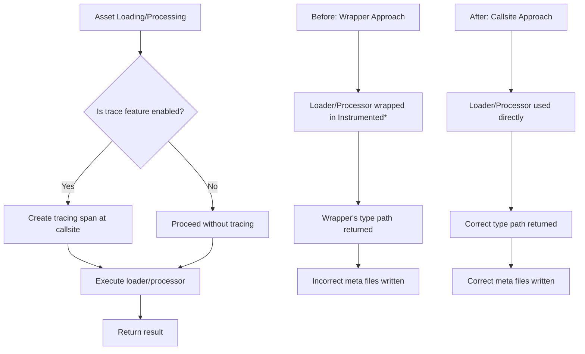

+++
title = "#22213 Delete `InstrumentedAssetLoader` and `InstrumentedAssetProcessor`, but keep the instrumentation."
date = "2025-12-23T00:00:00"
draft = false
template = "pull_request_page.html"
in_search_index = true

[taxonomies]
list_display = ["show"]

[extra]
current_language = "en"
available_languages = {"en" = { name = "English", url = "/pull_request/bevy/2025-12/pr-22213-en-20251223" }, "zh-cn" = { name = "中文", url = "/pull_request/bevy/2025-12/pr-22213-zh-cn-20251223" }}
labels = ["C-Bug", "A-Assets", "D-Straightforward"]
+++

# Title

## Basic Information
- **Title**: Delete `InstrumentedAssetLoader` and `InstrumentedAssetProcessor`, but keep the instrumentation.
- **PR Link**: https://github.com/bevyengine/bevy/pull/22213
- **Author**: andriyDev
- **Status**: MERGED
- **Labels**: C-Bug, A-Assets, S-Ready-For-Final-Review, D-Straightforward
- **Created**: 2025-12-20T22:31:08Z
- **Merged**: 2025-12-22T23:53:40Z
- **Merged By**: alice-i-cecile

## Description Translation
# Objective

- In #12988, we added tracing spans to asset loading and processing, by creating wrapper structs `InstrumentedAssetLoader` and `InstrumentedAssetProcessor`.
- Unfortunately, this causes an issue where `ErasedAssetLoader::{default_meta, type_path}` and `ErasedProcessor::default_meta` can return the wrong type path when using the `trace` feature, and this type path could be written into a meta file, which will be rendered unloadable/unprocessable.
    - Note even though the loader/processor's type use to have the instrumentation wrapper, when registering the loader/processor, we would actually register the loader/processor under the original type names. So you could still load non-`trace` written meta files, but `trace` written meta files would fail to load whether `trace` was enabled or not!

## Solution

- Remove the wrapper loader/processor and instead just create the spans at the callsites. I checked and there's a single callsite of `load` and a single callsite of `process` - very good!
- I also added testing that was omitted in #17216 (due to missing test utilities which have since been added). This is how I found out about this problem! Score one for testing.

## Testing

- We still produce spans in the `asset_processing` example for both loading and processing.

Note: We don't need a migration guide since users should really not be using these directly, and any meta files using these would just be broken.

## The Story of This Pull Request

This PR addresses a subtle but significant bug in Bevy's asset system related to how tracing instrumentation was implemented. The issue stemmed from the approach taken in PR #12988, which added tracing spans to asset loading and processing by creating wrapper structs around the actual loader and processor types.

The core problem was that when the `trace` feature was enabled, the wrapper structs (`InstrumentedAssetLoader` and `InstrumentedAssetProcessor`) were being used, and their type paths were being returned by the `ErasedAssetLoader::type_path()` and `ErasedAssetLoader::default_meta()` methods. This caused incorrect type paths to be written into asset meta files. Specifically, the meta files would contain the type path of the wrapper struct (e.g., `InstrumentedAssetLoader<MyLoader>`) instead of the actual loader type (`MyLoader`). Since asset loaders and processors are registered under their original type names, these meta files would fail to load or process regardless of whether the `trace` feature was enabled.

The developer discovered this bug while adding tests that were missing from PR #17216. The tests involved writing default meta files for loaders and processors, which revealed that the type paths being written were incorrect when `trace` was enabled.

The solution was straightforward: instead of wrapping the loaders and processors at registration time, the tracing spans are now created directly at the callsites where `load` and `process` are invoked. This approach has several advantages:

1. It eliminates the wrapper structs entirely, so the type paths remain correct.
2. It centralizes the tracing logic to just two locations (one for loading, one for processing), making the code easier to maintain.
3. It preserves the tracing functionality while fixing the bug.

The implementation required changes in several files:
- The wrapper structs and their implementations were removed from `loaders.rs` and `processor/mod.rs`.
- The `ErasedProcessor` trait needed a new `type_path()` method to expose the processor's type path without relying on the wrapper.
- Tracing spans were added directly in `AssetServer::load_with_meta_loader` and `AssetProcessor::process_asset`.
- Tests were added to verify that default meta files are written with the correct type paths.

One important detail in the implementation is the use of Rust's `#[cfg(feature = "trace")]` attribute to conditionally compile the tracing instrumentation. This ensures that the tracing code only affects builds with the `trace` feature enabled, maintaining performance for release builds.

The fix also included a minor adjustment to the meta serialization code to use consistent newline characters (`\n`) across platforms, which was necessary for the new tests to pass on Windows.

This PR demonstrates the importance of comprehensive testing in complex systems like asset pipelines. The bug was only discovered because the developer added tests for writing default meta files, which had been omitted from a previous PR. Without these tests, the issue might have gone unnoticed until users encountered corrupted meta files in production.

## Visual Representation



## Key Files Changed

### `crates/bevy_asset/src/server/loaders.rs` (+0/-45)
**What changed**: Removed the `InstrumentedAssetLoader` wrapper struct and its implementation.
**Why**: The wrapper was causing incorrect type paths to be returned when the `trace` feature was enabled.

```rust
// Removed entirely:
#[cfg(feature = "trace")]
#[derive(TypePath)]
struct InstrumentedAssetLoader<T>(T);

#[cfg(feature = "trace")]
impl<T: AssetLoader> AssetLoader for InstrumentedAssetLoader<T> {
    // ... implementation that wrapped the loader with tracing spans
}
```

### `crates/bevy_asset/src/server/mod.rs` (+13/-3)
**What changed**: Added tracing spans directly at the `load` callsite instead of using a wrapper.
**Why**: This ensures the correct loader type path is used while maintaining tracing functionality.

```rust
// After: Tracing span created at callsite
let load = AssertUnwindSafe(loader.load(reader, settings, load_context)).catch_unwind();
#[cfg(feature = "trace")]
let load = {
    use tracing::Instrument;

    let span = tracing::info_span!(
        "asset loading",
        loader = loader.type_path(),
        asset = asset_path.to_string()
    );
    load.instrument(span)
};
load.await
```

### `crates/bevy_asset/src/processor/mod.rs` (+11/-33)
**What changed**: Removed `InstrumentedAssetProcessor` wrapper and added tracing at the `process` callsite.
**Why**: Similar to the loader fix - ensures correct processor type paths in meta files.

```rust
// After: Tracing span created at callsite
let process = processor.process(&mut context, settings, &mut *writer);
#[cfg(feature = "trace")]
let process = {
    let span = info_span!(
        "asset processing",
        processor = processor.type_path(),
        asset = asset_path.to_string(),
    );
    process.instrument(span)
};
process.await?
```

### `crates/bevy_asset/src/processor/process.rs` (+2/-0)
**What changed**: Added `type_path()` method to the `ErasedProcessor` trait.
**Why**: Needed to get the processor's type path without relying on wrapper structs.

```rust
pub trait ErasedProcessor: Send + Sync {
    // ... existing methods
    /// Returns the type-path of the original [`Process`].
    fn type_path(&self) -> &'static str;
}

impl<P: Process> ErasedProcessor for P {
    fn type_path(&self) -> &'static str {
        P::type_path()
    }
}
```

### `crates/bevy_asset/src/lib.rs` (+66/-2) and `crates/bevy_asset/src/processor/tests.rs` (+88/-6)
**What changed**: Added test utilities and tests for writing default meta files.
**Why**: To verify that the fix works correctly and prevent regressions.

```rust
// Test utility added to lib.rs
pub(crate) fn read_meta_as_string(dir: &Dir, path: &Path) -> String {
    let bytes = dir.get_metadata(path).unwrap();
    str::from_utf8(bytes.value()).unwrap().to_string()
}

// Test added to verify loader meta writing
#[test]
fn writes_default_meta_for_loader() {
    // ... test setup
    assert_eq!(
        read_meta_as_string(&source, Path::new(ASSET_PATH)),
        r#"(
    meta_format_version: "1.0",
    asset: Load(
        loader: "bevy_asset::tests::CoolTextLoader",  // Correct type path, not wrapped
        settings: (),
    ),
)"#
    );
}
```

### `crates/bevy_asset/src/meta.rs` (+6/-3)
**What changed**: Modified serialization to use consistent newline characters.
**Why**: To ensure tests pass consistently across platforms (Windows uses `\r\n` by default).

```rust
fn serialize(&self) -> Vec<u8> {
    ron::ser::to_string_pretty(
        &self,
        // This defaults to \r\n on Windows, so hard-code it to \n so it's consistent for
        // testing.
        PrettyConfig::default().new_line("\n"),
    )
    .expect("type is convertible to ron")
    .into_bytes()
}
```

## Further Reading

1. **Rust Tracing Documentation**: For understanding how tracing spans and instrumentation work in Rust: https://docs.rs/tracing/latest/tracing/
2. **Bevy Asset System Documentation**: For understanding Bevy's asset pipeline: https://bevyengine.org/learn/books/asset-system/
3. **Conditional Compilation in Rust**: For understanding `#[cfg(feature = "...")]` attribute: https://doc.rust-lang.org/reference/conditional-compilation.html
4. **Type Erasure Pattern**: For understanding how Bevy's asset system uses type erasure for dynamic dispatch: https://doc.rust-lang.org/book/ch17-02-trait-objects.html

# Full Code Diff
[The full code diff is provided in the initial request above]