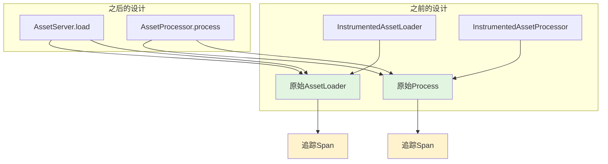

+++
title = "#22213 Delete `InstrumentedAssetLoader` and `InstrumentedAssetProcessor`, but keep the instrumentation."
date = "2025-12-23T00:00:00"
draft = false
template = "pull_request_page.html"
in_search_index = false

[extra]
current_language = "zh-cn"
available_languages = {"en" = { name = "English", url = "/pull_request/bevy/2025-12/pr-22213-en-20251223" }, "zh-cn" = { name = "中文", url = "/pull_request/bevy/2025-12/pr-22213-zh-cn-20251223" }}
labels = ["C-Bug", "A-Assets", "D-Straightforward"]
+++

# Title
Delete `InstrumentedAssetLoader` and `InstrumentedAssetProcessor`, but keep the instrumentation.

## Basic Information
- **Title**: Delete `InstrumentedAssetLoader` and `InstrumentedAssetProcessor`, but keep the instrumentation.
- **PR Link**: https://github.com/bevyengine/bevy/pull/22213
- **Author**: andriyDev
- **Status**: MERGED
- **Labels**: C-Bug, A-Assets, S-Ready-For-Final-Review, D-Straightforward
- **Created**: 2025-12-20T22:31:08Z
- **Merged**: 2025-12-22T23:53:40Z
- **Merged By**: alice-i-cecile

## Description Translation
### 目标

- 在 #12988 中，我们通过创建包装结构体 `InstrumentedAssetLoader` 和 `InstrumentedAssetProcessor` 为资产加载和处理添加了追踪(tracing) spans。
- 不幸的是，这导致了一个问题：当使用 `trace` 功能时，`ErasedAssetLoader::{default_meta, type_path}` 和 `ErasedProcessor::default_meta` 可能返回错误的类型路径，并且这个类型路径可能会被写入元文件(meta file)，导致无法加载/处理。
    - 注意：即使加载器/处理器的类型包含仪器包装层，当我们注册加载器/处理器时，我们实际上是以原始类型名称注册的。所以你仍然可以加载非 `trace` 编写的元文件，但 `trace` 编写的元文件无论 `trace` 是否启用都会加载失败！

### 解决方案

- 移除包装加载器/处理器，改为在调用点(callsites)创建 spans。我检查过，`load` 和 `process` 都只有一个调用点 - 很好！
- 我还添加了在 #17216 中省略的测试（因为当时缺少测试工具，后来已经添加）。我就是通过测试发现这个问题的！测试又得一分。

### 测试

- 在 `asset_processing` 示例中，我们仍然为加载和处理生成 spans。

注意：我们不需要迁移指南，因为用户不应该直接使用这些包装器，而任何使用这些包装器的元文件都会直接损坏。

## The Story of This Pull Request

这个PR解决了一个与Bevy资产系统追踪功能相关的潜在bug。当 `trace` 功能启用时，`InstrumentedAssetLoader` 和 `InstrumentedAssetProcessor` 这两个包装器结构体导致了类型路径不一致的问题。

问题的核心在于：当 `trace` 功能启用时，资产加载器和处理器被包装在 `InstrumentedAssetLoader` 和 `InstrumentedAssetProcessor` 中，但它们的 `default_meta` 和 `type_path` 方法返回的是包装后的类型路径（例如 `InstrumentedAssetLoader<CoolTextLoader>`），而不是原始的加载器/处理器类型路径（例如 `CoolTextLoader`）。当这些元信息被写入资产元文件时，后续尝试加载这些资产会失败，因为资产系统使用原始类型名称注册加载器/处理器，无法识别包装器类型路径。

这是一个典型的设计问题：包装器模式(wrapper pattern)在添加横切关注点(cross-cutting concerns)如追踪时很有用，但需要确保核心接口（如类型标识）保持不变。在这个案例中，包装器改变了类型路径，但资产系统的注册机制基于原始类型。

解决方案相对直接：移除包装器结构体，改为在调用点直接添加追踪 spans。这种方法的优点是：
1. 保持了正确的类型路径
2. 减少了间接层(indirection)
3. 由于 `load` 和 `process` 方法都只有一个调用点，代码移动很简单

在实现方面，主要变化包括：
1. 从 `server/loaders.rs` 中删除 `InstrumentedAssetLoader` 结构体及其实现
2. 从 `processor/mod.rs` 中删除 `InstrumentedAssetProcessor` 结构体及其实现
3. 在 `server/mod.rs` 中的 `load_with_meta_loader` 方法调用点添加追踪 span
4. 在 `processor/mod.rs` 中的 `process_asset` 方法调用点添加追踪 span
5. 在 `ErasedProcessor` trait 中添加 `type_path` 方法，以便在追踪 span 中获取处理器类型路径

这个修复还添加了测试来验证默认元文件的正确生成。测试确保：
1. 加载器的默认元文件包含正确的类型路径
2. 处理器的默认元文件包含正确的类型路径
3. 不会覆盖已存在的元文件

从技术角度看，这个PR展示了几个重要的工程原则：
- 包装器模式需要小心处理，确保不破坏核心接口
- 横切关注点可以通过调用点注入，而不是通过包装器
- 测试对于发现和防止回归非常重要

修复是向后兼容的，因为用户不应该直接使用这些包装器类型，而且任何损坏的元文件（包含错误类型路径）已经无法工作，无论 `trace` 功能是否启用。

## Visual Representation



## Key Files Changed

### 1. `crates/bevy_asset/src/server/loaders.rs` (+0/-45)
**变化**：完全删除了 `InstrumentedAssetLoader` 结构体及其实现。
**原因**：移除包装器，改为在调用点添加追踪。

**关键代码**：
```rust
// 之前存在的代码（已删除）：
#[cfg(feature = "trace")]
#[derive(TypePath)]
struct InstrumentedAssetLoader<T>(T);

#[cfg(feature = "trace")]
impl<T: AssetLoader> AssetLoader for InstrumentedAssetLoader<T> {
    // 包装器实现...
}
```

### 2. `crates/bevy_asset/src/server/mod.rs` (+13/-3)
**变化**：在 `load_with_meta_loader` 方法的调用点添加追踪 span。

**关键代码**：
```rust
// 修改后：
let load = AssertUnwindSafe(loader.load(reader, settings, load_context)).catch_unwind();
#[cfg(feature = "trace")]
let load = {
    use tracing::Instrument;

    let span = tracing::info_span!(
        "asset loading",
        loader = loader.type_path(),
        asset = asset_path.to_string()
    );
    load.instrument(span)
};
load.await
```

### 3. `crates/bevy_asset/src/processor/mod.rs` (+11/-33)
**变化**：
1. 删除 `InstrumentedAssetProcessor` 结构体
2. 在 `process_asset` 方法的调用点添加追踪 span
3. 添加 `type_path` 方法到 `ErasedProcessor` trait（在另一个文件中）

**关键代码**：
```rust
// 在 process_asset 方法中：
let process = processor.process(&mut context, settings, &mut *writer);
#[cfg(feature = "trace")]
let process = {
    let span = info_span!(
        "asset processing",
        processor = processor.type_path(),
        asset = asset_path.to_string(),
    );
    process.instrument(span)
};
process.await?
```

### 4. `crates/bevy_asset/src/processor/process.rs` (+2/-0)
**变化**：在 `ErasedProcessor` trait 中添加 `type_path` 方法。

**关键代码**：
```rust
pub trait ErasedProcessor: Send + Sync {
    // ... 现有方法 ...
    
    /// Returns the type-path of the original [`Process`].
    fn type_path(&self) -> &'static str;  // 新增方法
}
```

### 5. `crates/bevy_asset/src/processor/tests.rs` (+88/-6)
**变化**：添加测试来验证处理器默认元文件的正确生成。

**关键代码**：
```rust
#[test]
fn writes_default_meta_for_processor() {
    // 测试处理器默认元文件的生成
    // 验证包含正确的处理器类型路径
}

#[test]
fn write_default_meta_does_not_overwrite() {
    // 测试不会覆盖已存在的元文件
}
```

### 6. `crates/bevy_asset/src/lib.rs` (+66/-2)
**变化**：
1. 添加测试工具函数 `read_asset_as_string` 和 `read_meta_as_string`
2. 添加测试验证加载器默认元文件的正确生成
3. 修改测试设置以支持内存资产写入器

**关键代码**：
```rust
pub(crate) fn read_meta_as_string(dir: &Dir, path: &Path) -> String {
    let bytes = dir.get_metadata(path).unwrap();
    str::from_utf8(bytes.value()).unwrap().to_string()
}

#[test]
fn writes_default_meta_for_loader() {
    // 测试加载器默认元文件的生成
    // 验证包含正确的加载器类型路径
}
```

### 7. `crates/bevy_asset/src/meta.rs` (+5/-3)
**变化**：修改元数据序列化以使用硬编码的换行符 `\n`，确保测试的一致性。

**关键代码**：
```rust
fn serialize(&self) -> Vec<u8> {
    ron::ser::to_string_pretty(
        &self,
        // 在Windows上默认使用\r\n，所以硬编码为\n以确保测试一致
        PrettyConfig::default().new_line("\n"),
    )
    .expect("type is convertible to ron")
    .into_bytes()
}
```

## Further Reading

1. **Bevy 资产系统文档**：https://bevyengine.org/learn/book/assets/
2. **Rust 追踪(Tracing)库**：https://docs.rs/tracing/latest/tracing/
3. **包装器模式(Wrapper Pattern)**：https://en.wikipedia.org/wiki/Wrapper_pattern
4. **横切关注点(Cross-cutting Concerns)**：https://en.wikipedia.org/wiki/Cross-cutting_concern
5. **PR #12988**：原始添加追踪功能的PR：https://github.com/bevyengine/bevy/pull/12988

# Full Code Diff
（已在上文各文件分析中展示关键代码差异）