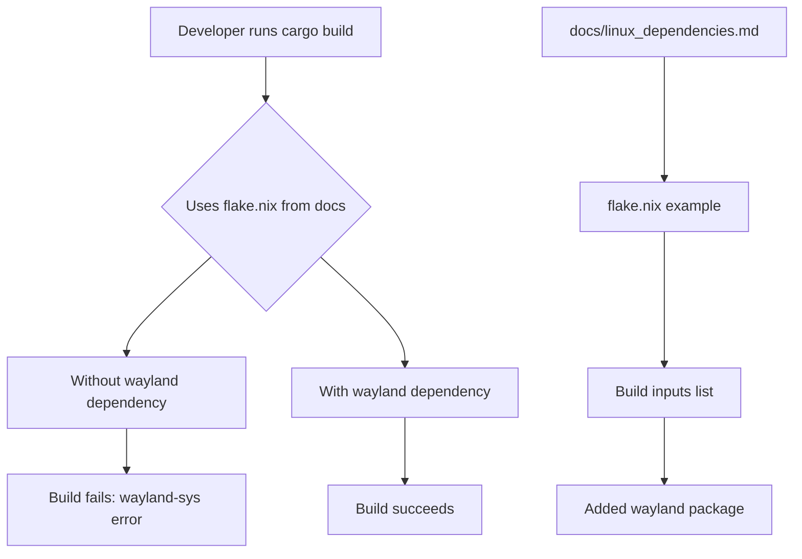

+++
title = "#22216 Add wayland to `flake.nix` linux dependencies example"
date = "2025-12-22T00:00:00"
draft = false
template = "pull_request_page.html"
in_search_index = true

[taxonomies]
list_display = ["show"]

[extra]
current_language = "en"
available_languages = {"en" = { name = "English", url = "/pull_request/bevy/2025-12/pr-22216-en-20251222" }, "zh-cn" = { name = "中文", url = "/pull_request/bevy/2025-12/pr-22216-zh-cn-20251222" }}
labels = ["C-Docs", "O-Linux"]
+++

# Title

## Basic Information
- **Title**: Add wayland to `flake.nix` linux dependencies example
- **PR Link**: https://github.com/bevyengine/bevy/pull/22216
- **Author**: apekros
- **Status**: MERGED
- **Labels**: C-Docs, O-Linux
- **Created**: 2025-12-21T05:55:12Z
- **Merged**: 2025-12-22T01:31:23Z
- **Merged By**: james7132

## Description Translation
# Objective

Fixes #22215

## Solution

- Adds wayland to `flake.nix` example in the Linux dependencies documentation

## Testing

- Did you test these changes? If so, how?
Use the main branch `flake.nix` and run `cargo build` and it gives:
`error: failed to run custom build command for wayland-sys v0.31.7`
With this change it does compile successfully

---

## The Story of This Pull Request

This pull request addresses a straightforward but important documentation issue affecting Linux developers using Nix for their development environment. The problem was discovered when a developer attempted to build Bevy using the provided `flake.nix` configuration from the main branch and encountered a compilation failure related to missing Wayland dependencies.

The issue manifested as a build error when running `cargo build` with the existing `flake.nix` configuration. The error message indicated that the `wayland-sys` crate version 0.31.7 failed to run its custom build command, which is a clear signal that the necessary Wayland development libraries were not available in the Nix environment. This is a common problem when documentation examples don't include all required dependencies, particularly for cross-platform development where different display server protocols like Wayland and X11 require different libraries.

The solution is minimal and direct: add the `wayland` package to the list of build inputs in the `flake.nix` example. This change ensures that developers using Nix on Linux systems with Wayland as their display server protocol have all necessary dependencies available. The fix is pragmatic - rather than investigating complex workarounds or conditional dependencies, the approach correctly identifies that Wayland support is a standard requirement for modern Linux graphics applications and should be included by default in the development environment setup.

From an implementation perspective, the change fits cleanly into the existing pattern. The `flake.nix` file already lists several graphics and windowing dependencies including `libxkbcommon`, `xorg.libX11`, and others. Adding `wayland` to this list maintains consistency and completeness. The placement after `libxkbcommon` follows logical grouping since both are related to input handling and window system integration.

This fix highlights an important aspect of cross-platform game engine development: documentation for platform-specific dependencies must be accurate and complete. Even small omissions like this can create significant friction for developers trying to set up their environment. The fact that the error occurred during the build process for `wayland-sys` (a system-scanning build script) rather than at link time underscores how certain Rust crates dynamically detect and bind to system libraries.

The impact of this change is immediate and practical. Developers using Nix on Wayland-based Linux distributions (which are increasingly common, especially with modern desktop environments like GNOME and KDE Plasma) will now have a working development environment out of the box. This reduces setup time and eliminates a common point of confusion for new contributors.

From a technical perspective, it's worth noting that Wayland is a display server protocol that has been gaining adoption as a modern replacement for X11. Including it as a dependency reflects Bevy's commitment to supporting contemporary Linux graphics infrastructure. The `wayland` package in Nix provides both the client libraries and development headers needed to compile applications that use Wayland, which the `wayland-sys` Rust crate relies on during its build process.

## Visual Representation



## Key Files Changed

### `docs/linux_dependencies.md`

This file contains documentation for setting up Linux dependencies for Bevy development. The change adds the `wayland` package to the example Nix flake configuration, ensuring developers have all necessary dependencies for building Bevy on Wayland-based Linux systems.

**Change:**
```nix
# File: docs/linux_dependencies.md
# Before:
              ];
              packages = with pkgs; [
                udev
                alsa-lib
                vulkan-loader
                libxkbcommon
                xorg.libX11
                xorg.libXcursor
                xorg.libXi
                xorg.libXrandr
                libxkbcommon
              ];

# After:
              ];
              packages = with pkgs; [
                udev
                alsa-lib
                vulkan-loader
                libxkbcommon
                xorg.libX11
                xorg.libXcursor
                xorg.libXi
                xorg.libXrandr
                libxkbcommon
                wayland
              ];
```

The addition of `wayland` to the packages list ensures that the Nix development environment includes Wayland client libraries and development headers, which are required by the `wayland-sys` crate during compilation.

## Further Reading

- [Wayland Protocol Documentation](https://wayland.freedesktop.org/docs/html/) - Official documentation for the Wayland display server protocol
- [Nix Package Manager](https://nixos.org/guides/nix-pills/) - Comprehensive guide to Nix and NixOS
- [Rust and Nix Integration](https://nixos.org/guides/rust/) - Best practices for Rust development with Nix
- [Bevy Linux Dependencies](https://github.com/bevyengine/bevy/blob/main/docs/linux_dependencies.md) - Complete Linux dependency documentation for Bevy
- [Wayland-sys Crate Documentation](https://docs.rs/wayland-sys/latest/wayland_sys/) - Documentation for the Rust bindings to Wayland system libraries