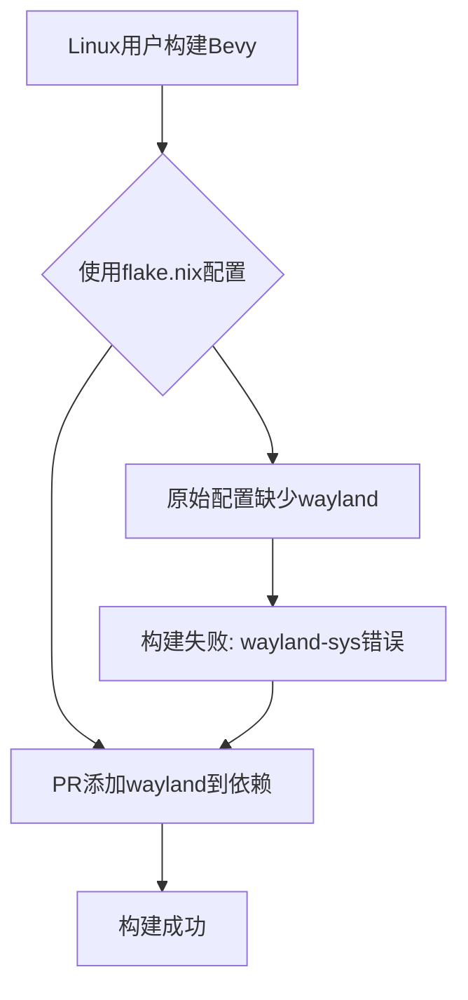

+++
title = "#22216 Add wayland to `flake.nix` linux dependencies example"
date = "2025-12-22T00:00:00"
draft = false
template = "pull_request_page.html"
in_search_index = false

[extra]
current_language = "zh-cn"
available_languages = {"en" = { name = "English", url = "/pull_request/bevy/2025-12/pr-22216-en-20251222" }, "zh-cn" = { name = "中文", url = "/pull_request/bevy/2025-12/pr-22216-zh-cn-20251222" }}
labels = ["C-Docs", "O-Linux"]
+++

# Title: Add wayland to `flake.nix` linux dependencies example

## Basic Information
- **Title**: Add wayland to `flake.nix` linux dependencies example
- **PR Link**: https://github.com/bevyengine/bevy/pull/22216
- **Author**: apekros
- **Status**: MERGED
- **Labels**: C-Docs, O-Linux
- **Created**: 2025-12-21T05:55:12Z
- **Merged**: 2025-12-22T01:31:23Z
- **Merged By**: james7132

## Description Translation
# 目标

修复 #22215

## 解决方案

- 在Linux依赖文档的`flake.nix`示例中添加wayland

## 测试

- 你测试了这些更改吗？如果是，如何测试的？
使用主分支的`flake.nix`并运行`cargo build`，它会给出：
`error: failed to run custom build command for wayland-sys v0.31.7`
应用此更改后，编译成功

---

## The Story of This Pull Request

这个PR的故事始于一个用户在Linux系统上构建Bevy项目时遇到的构建错误。用户在issue #22215中报告，使用当前文档中的`flake.nix`配置时，运行`cargo build`会失败，错误信息指向wayland-sys的构建问题。

问题的根源在于Bevy在Linux上支持多种窗口系统，包括X11和Wayland。wayland-sys是一个Rust crate，它提供了Wayland系统库的绑定。当Bevy项目被编译时，如果系统支持Wayland，那么wayland-sys会被启用，并需要系统安装Wayland库。然而，在Bevy文档提供的Nix配置示例中，虽然包含了X11相关的依赖，却遗漏了wayland。

这是一个典型的文档问题，而非代码逻辑问题。对于使用Nix包管理器的用户来说，`flake.nix`文件定义了构建环境的所有依赖。Nix采用声明式的方法管理依赖，所有依赖必须显式声明。原始的配置缺少了wayland，导致构建失败。

解决方案非常直接：在`flake.nix`示例的`nativeBuildInputs`数组中添加`wayland`依赖项。这个修改确保了当用户在支持Wayland的系统上构建Bevy时，必要的系统库会被包含在构建环境中。

从技术角度来看，这个修改虽然简单，但对于使用Nix的Bevy开发者来说非常重要。Nix以其可重现的构建环境而闻名，正确的依赖声明是保证构建成功的关键。这个修复也反映了跨平台游戏引擎在文档维护上的挑战——需要为不同平台和配置提供准确的环境配置指导。

作者测试了这个修改，验证了在应用更改后，`cargo build`可以成功执行。这确认了wayland确实是缺失的必要依赖。

## Visual Representation



## Key Files Changed

### `docs/linux_dependencies.md` (+1/-0)

这个文件包含了在Linux系统上构建Bevy所需的依赖说明。PR在`flake.nix`示例的依赖列表中添加了`wayland`。

修改前的代码片段：
```nix
nativeBuildInputs = with pkgs; [
  clang
  llvmPackages.libclang
  mold
  pkg-config
  python3
] ++ (with pkgs.xorg; [
  libX11
  libXcursor
  libXi
  libXrandr
  libxkbcommon
]);
```

修改后的代码片段：
```nix
nativeBuildInputs = with pkgs; [
  clang
  llvmPackages.libclang
  mold
  pkg-config
  python3
] ++ (with pkgs.xorg; [
  libX11
  libXcursor
  libXi
  libXrandr
  libxkbcommon
  wayland
]);
```

这个更改确保了Nix用户在使用提供的flake配置时，Wayland开发库会被包含在构建环境中，从而避免wayland-sys构建失败的问题。

## Further Reading

- [Wayland官方网站](https://wayland.freedesktop.org/) - 了解Wayland显示服务器协议
- [Nix Flakes官方文档](https://nixos.wiki/wiki/Flakes) - 学习Nix Flakes的使用
- [Bevy的Linux依赖文档](https://github.com/bevyengine/bevy/blob/main/docs/linux_dependencies.md) - 查看完整的Linux依赖说明
- [wayland-sys crate文档](https://docs.rs/wayland-sys/latest/wayland_sys/) - 了解Rust中的Wayland系统绑定

# Full Code Diff
```diff
diff --git a/docs/linux_dependencies.md b/docs/linux_dependencies.md
index 8ca4177047460..9050e7495f0ae 100644
--- a/docs/linux_dependencies.md
+++ b/docs/linux_dependencies.md
@@ -156,6 +156,7 @@ Add a `flake.nix` file to the root of your GitHub repository containing:
                 xorg.libXi
                 xorg.libXrandr
                 libxkbcommon
+                wayland
               ];
             RUST_SRC_PATH = "${pkgs.rust.packages.stable.rustPlatform.rustLibSrc}";
             LD_LIBRARY_PATH = lib.makeLibraryPath [
```