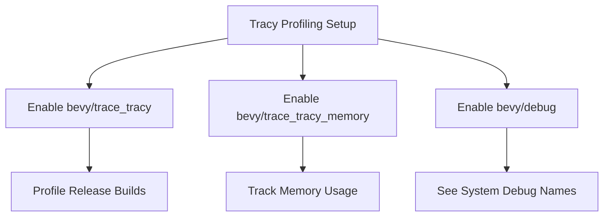

+++
title = "#22217 Mention `bevy/debug` in tracy quickstart"
date = "2025-12-22T00:00:00"
draft = false
template = "pull_request_page.html"
in_search_index = true

[taxonomies]
list_display = ["show"]

[extra]
current_language = "en"
available_languages = {"en" = { name = "English", url = "/pull_request/bevy/2025-12/pr-22217-en-20251222" }, "zh-cn" = { name = "中文", url = "/pull_request/bevy/2025-12/pr-22217-zh-cn-20251222" }}
labels = ["C-Docs", "D-Trivial", "C-Testing"]
+++

# Title
Mention `bevy/debug` in tracy quickstart

## Basic Information
- **Title**: Mention `bevy/debug` in tracy quickstart
- **PR Link**: https://github.com/bevyengine/bevy/pull/22217
- **Author**: apekros
- **Status**: MERGED
- **Labels**: C-Docs, D-Trivial, S-Ready-For-Final-Review, C-Testing
- **Created**: 2025-12-21T09:08:27Z
- **Merged**: 2025-12-22T20:07:47Z
- **Merged By**: james7132

## Description Translation
# Objective

Fixes #21956

## Solution

Add brief line on enabling `bevy/debug` feature if the user wants to track Bevy's own systems.

## The Story of This Pull Request

This PR addresses a documentation gap that was causing confusion for developers trying to profile Bevy applications using Tracy. The issue (#21956) stemmed from users not having clear instructions on how to see debug names for Bevy's internal systems when using the Tracy profiler.

When developers use Tracy for performance profiling in Bevy, they can see function calls and system executions in the profiler's timeline. However, Bevy's internal systems are only given human-readable debug names when the `bevy/debug` feature is enabled. Without this feature, developers would see generic or hashed names in the profiler, making it difficult to identify which specific Bevy systems were causing performance issues.

The existing documentation in `docs/profiling.md` provided clear instructions for setting up Tracy profiling, including how to enable the `bevy/trace_tracy` and `bevy/trace_tracy_memory` features. However, it missed the crucial detail about the `bevy/debug` feature. This oversight meant developers had to discover this requirement through trial and error or by searching through other documentation and GitHub issues.

The solution implemented in this PR is straightforward but important: adding a single line to the Tracy quickstart section of the profiling documentation. This line explicitly states that developers should add the `bevy/debug` feature if they want to see debug names for Bevy's own systems. The change is placed logically as an additional bullet point under step 4 of the Tracy setup instructions, where feature configuration is already discussed.

This documentation update doesn't change any code functionality—it simply clarifies an existing capability. The `bevy/debug` feature was already available and working, but developers needed to know about it to use it effectively. By adding this note, the PR helps developers get better insights from their profiling sessions without additional debugging overhead.

From an engineering perspective, this change highlights the importance of complete documentation for feature flags in complex systems. Bevy has multiple optional features that affect different aspects of the engine, and clear documentation is essential for developers to understand how to configure the engine for their specific use cases. The placement of this note alongside other Tracy-related features shows good documentation organization—keeping related configuration information together.

## Visual Representation



## Key Files Changed

### `docs/profiling.md` (+1/-0)
This documentation file was updated to include the missing information about the `bevy/debug` feature.

**Key change:**
```markdown
# File: docs/profiling.md
# Before (around line 83):
   - You can capture memory usage as well with `--features bevy/trace_tracy_memory`, at the cost of increased overhead.

# After:
   - You can capture memory usage as well with `--features bevy/trace_tracy_memory`, at the cost of increased overhead.
   - To see debug names for Bevy's own systems, add the `bevy/debug` feature with `--features bevy/trace_tracy,bevy/debug`.
```

The change adds a new bullet point explaining that the `bevy/debug` feature is required to see human-readable names for Bevy's internal systems in the Tracy profiler. This information was previously missing from the quickstart guide, forcing developers to discover it through other channels.

## Further Reading

- [Bevy Profiling Documentation](https://github.com/bevyengine/bevy/blob/main/docs/profiling.md) - Complete guide to profiling Bevy applications
- [Tracy Profiler Documentation](https://github.com/wolfpld/tracy) - Official Tracy profiler documentation
- [Bevy Feature Flags](https://github.com/bevyengine/bevy/blob/main/docs/features.md) - Overview of Bevy's feature system
- [Issue #21956](https://github.com/bevyengine/bevy/issues/21956) - Original issue reporting the documentation gap

# Full Code Diff
```diff
diff --git a/docs/profiling.md b/docs/profiling.md
index 7a88b1311af61..694297199b729 100644
--- a/docs/profiling.md
+++ b/docs/profiling.md
@@ -80,6 +80,7 @@ The [Tracy profiling tool](https://github.com/wolfpld/tracy) is:
 4. Run your bevy app with `--features bevy/trace_tracy --release`
    - `--release` as theres little point to profiling unoptimized code
    - You can capture memory usage as well with `--features bevy/trace_tracy_memory`, at the cost of increased overhead.
+   - To see debug names for Bevy's own systems, add the `bevy/debug` feature with `--features bevy/trace_tracy,bevy/debug`.
 
 #### Finding the correct Tracy version
```