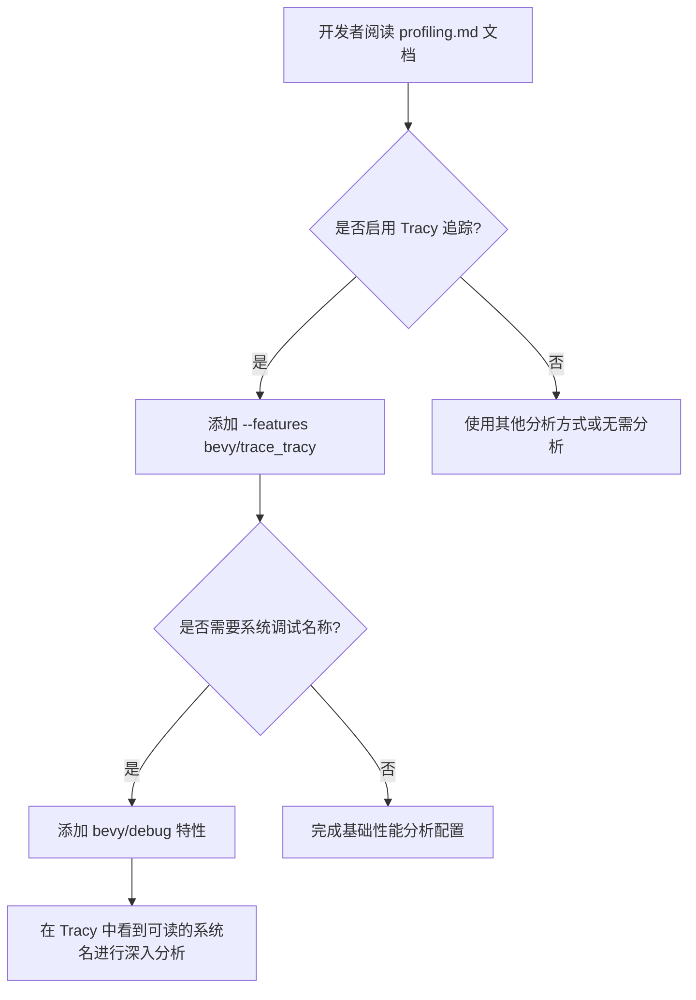

+++
title = "#22217 Mention `bevy/debug` in tracy quickstart"
date = "2025-12-22T00:00:00"
draft = false
template = "pull_request_page.html"
in_search_index = false

[extra]
current_language = "zh-cn"
available_languages = {"en" = { name = "English", url = "/pull_request/bevy/2025-12/pr-22217-en-20251222" }, "zh-cn" = { name = "中文", url = "/pull_request/bevy/2025-12/pr-22217-zh-cn-20251222" }}
+++

# Title

## 基本信息
- **标题**: Mention `bevy/debug` in tracy quickstart
- **PR 链接**: https://github.com/bevyengine/bevy/pull/22217
- **作者**: apekros
- **状态**: 已合并
- **标签**: C-Docs, D-Trivial, S-Ready-For-Final-Review, C-Testing
- **创建时间**: 2025-12-21T09:08:27Z
- **合并时间**: 2025-12-22T20:07:47Z
- **合并者**: james7132

## 描述翻译
**目标** (Objective)
修复 #21956

**解决方案** (Solution)
添加一行简短的说明，告知用户如果希望追踪 Bevy 自身的系统（system），需要启用 `bevy/debug` 特性（feature）。

## 本次 Pull Request 的故事

本次 PR 的故事源于一个简单但常见的开发者困惑。当开发者使用强大的 Tracy 性能分析工具（profiling tool）来诊断他们的 Bevy 应用性能时，他们可能会发现 Tracy 捕获到的许多系统调用显示为难以理解的内部标识符，而不是可读的名称。这使得分析工作流（workflow）变得困难，因为很难将性能数据与具体的游戏逻辑或引擎系统对应起来。

问题的核心在于配置细节。Bevy 引擎为了在发布（release）构建中追求最佳性能，默认会剥离调试符号和名称信息。这虽然对最终应用的性能有利，但对于开发阶段的性能分析却是一个障碍。开发者需要明确告知构建系统，他们希望保留这些用于分析的元数据（metadata）。这正是 Issue #21956 所报告的问题：现有文档遗漏了这一关键步骤，导致开发者无法在 Tracy 中看到 Bevy 系统（如 `transform_propagate_system`）的友好名称（friendly names），只能看到泛泛的或哈希后的标识符。

解决这个问题的方案非常直接，属于典型的文档完善工作。开发者 `apekros` 没有修改任何核心引擎代码，而是定位到了指导文档 `docs/profiling.md` 中的 Tracy 快速入门（quickstart）部分。这里的文档已经详细说明了如何启用 Tracy 追踪功能（通过 `bevy/trace_tracy` 特性）以及如何捕获内存使用情况（通过 `bevy/trace_tracy_memory` 特性）。所缺失的，就是关于如何启用系统调试名称的一行说明。

因此，解决方案就是在文档的相应位置添加一行清晰的指示。这行指示被放置在逻辑上最合适的地方——紧跟在关于如何启用内存追踪的说明之后。这样的安排形成了一个清晰的配置选项列表，引导开发者根据不同的分析需求组合特性。添加的文本精确地说明了目的（“To see debug names for Bevy's own systems”）、所需的操作（“add the `bevy/debug` feature”）以及具体的命令行语法示例（`--features bevy/trace_tracy,bevy/debug`）。这个示例清晰地展示了如何将多个特性用逗号分隔同时启用，这是一种标准的 Cargo 特性指定方式。

从技术实现角度看，这个修改虽然微小，但体现了良好的文档实践。它修复了信息缺口，使得工作流（从阅读文档到成功获得有意义的性能分析数据）变得完整。`bevy/debug` 是一个条件编译特性（conditional compilation feature），当启用时，它会引导编译器包含额外的代码来注册系统的调试名称。这个特性通常与 `bevy/trace_tracy` 一起使用，但也可以单独用于其他调试目的。文档的修改确保了两者的关联性被明确传达。

这次修改的影响是立竿见影的。任何遵循更新后文档的开发者，现在都可以轻松地在 Tracy 性能分析界面中看到具有明确意义的系统名称，而不是晦涩的标识符。这显著提升了性能分析工作的效率和准确性。从代码库管理的角度看，这是一个“无风险”的改进，因为它只涉及文档，不会引入任何运行时（runtime）行为变更或潜在错误。标签中的 `D-Trivial`（微不足道）和 `C-Docs`（文档）准确地反映了这次更改的性质。

总的来说，这个 PR 是一个关于完善开发者体验（Developer Experience, DX）的典型案例。它通过填补文档中一个关键但微小的空白，解决了实际使用中的痛点，使得一个强大的工具（Tracy）能够被更有效地利用。它提醒我们，优秀的文档不仅仅是介绍功能，还需要涵盖完整的、端到端（end-to-end）的工作流配置细节。

## 视觉表示



## 关键文件更改

- `docs/profiling.md` (+1/-0)

**描述**:
该文件是 Bevy 的性能分析指南。本次修改在 Tracy 工具的快速入门章节中添加了一行说明，告知用户如何启用 `bevy/debug` 特性以在 Tracy 捕获的性能数据中显示 Bevy 自身系统的可读调试名称。

**代码片段**:
```markdown
<!-- 文件: docs/profiling.md -->
<!-- 修改上下文: -->
4. Run your bevy app with `--features bevy/trace_tracy --release`
   - `--release` as theres little point to profiling unoptimized code
   - You can capture memory usage as well with `--features bevy/trace_tracy_memory`, at the cost of increased overhead.
+  - To see debug names for Bevy's own systems, add the `bevy/debug` feature with `--features bevy/trace_tracy,bevy/debug`.
```
**与 PR 目标的关系**:
这是本次 PR 的唯一修改，直接实现了其目标：在文档中说明启用 `bevy/debug` 特性的方法，从而解决了用户在 Tracy 中无法看到系统调试名称的问题 (#21956)。

## 延伸阅读

- **[Tracy 官方文档](https://github.com/wolfpld/tracy)**: 深入了解 Tracy 性能分析工具的所有功能和用法。
- **[Bevy 官方文档 - 特性 (Features)](https://bevy-cheatbook.github.io/features.html)**: 学习 Bevy 中特性（features）的工作原理以及如何管理它们。
- **[Rust Cargo 手册 - 特性](https://doc.rust-lang.org/cargo/reference/features.html)**: 理解 Cargo 的特性机制，这是 Rust 项目中条件编译和可选依赖的基础。
- **Issue #21956**: 查看引发本次 PR 的原始问题讨论。