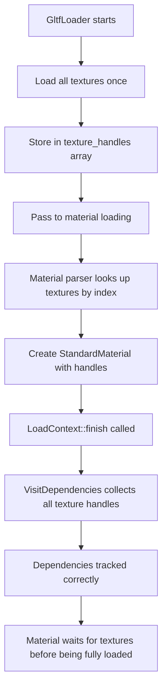

+++
title = "#22227 Make `LoadContext::finish` add all dependencies, and avoid a second texture load in GltfLoader."
date = "2025-12-30T00:00:00"
draft = false
template = "pull_request_page.html"
in_search_index = true

[taxonomies]
list_display = ["show"]

[extra]
current_language = "en"
available_languages = {"en" = { name = "English", url = "/pull_request/bevy/2025-12/pr-22227-en-20251230" }, "zh-cn" = { name = "中文", url = "/pull_request/bevy/2025-12/pr-22227-zh-cn-20251230" }}
labels = ["A-Assets", "D-Modest", "A-glTF", "C-Refinement"]
+++

# Title
Make `LoadContext::finish` add all dependencies, and avoid a second texture load in GltfLoader.

## Basic Information
- **Title**: Make `LoadContext::finish` add all dependencies, and avoid a second texture load in GltfLoader.
- **PR Link**: https://github.com/bevyengine/bevy/pull/22227
- **Author**: andriyDev
- **Status**: MERGED
- **Labels**: A-Assets, S-Ready-For-Final-Review, D-Modest, A-glTF, C-Refinement
- **Created**: 2025-12-22T05:17:19Z
- **Merged**: 2025-12-30T01:09:24Z
- **Merged By**: alice-i-cecile

## Description Translation
# Objective

- The glTF loader previously did two loads for textures: the first did all the expected parsing and loading. The second would **intentionally** try to perform the same load to A) avoid doing a second load, and B) to add the handle as a dependency specifically for the material - so that the material would not be "loaded with dependencies" until all its textures were loaded.
- In general, it's possible for an asset to have a handle to another asset, without that handle being considered a dependency according to the `LoadContext`.
- Also, some handles in the `StandardMaterial` were missing the `#[dependency]` attribute.

## Solution

- Add the dependency attribute to all handles in `StandardMaterial`.
- Make the gltf anisotropy extension also use the `parse_material_extension_texture` function like all the other extensions (the existing implementation matched exactly).
- Made `LoadContext::finish` update the list of dependencies with `VisitDependencies`.
- Propagate the list of texture handles through the `GltfLoader` and clone the handle out when necessary.

## Testing

- Added tests to `bevy_asset` to verify tracking dependencies works - this also fails before the rest of this PR.
- Ran the `load_gltf` example and it still works. This won't show whether the dependency tracking works correctly though.

## The Story of This Pull Request

This PR addresses a subtle but important issue in Bevy's asset loading system, specifically around dependency tracking in the glTF loader. The problem originated from how texture handles were being processed when loading materials from glTF files.

Before this change, the glTF loader had an unusual pattern for handling texture dependencies. When loading a material, it would first parse and load textures normally. Then, to ensure proper dependency tracking, it would intentionally attempt a second load of the same texture. This second load wasn't meant to actually load the texture again (the asset system would return the existing handle), but rather to add the texture handle to the material's dependency list through the `LoadContext`. This ensured that materials wouldn't be marked as "loaded with all dependencies" until their textures were ready.

This approach had several issues. First, it was inefficient - even though the actual texture data wasn't loaded twice, the loader still performed unnecessary work. Second, it revealed a broader problem: in Bevy's asset system, an asset could contain handles to other assets without those handles being tracked as dependencies if they weren't loaded through the same `LoadContext`.

The core insight behind this fix is that dependency tracking should be automatic and reliable. The solution takes two complementary approaches:

1. **Fix the underlying dependency tracking mechanism**: The PR modifies `LoadContext::finish` to automatically collect all dependencies from an asset by using the `VisitDependencies` trait. This ensures that any handle marked with `#[dependency]` attribute will be included in the dependency list, regardless of how it was obtained.

2. **Refactor the glTF loader to avoid redundant loads**: Instead of performing two loads for each texture, the loader now loads all textures once upfront and passes them as a pre-loaded array to material and extension parsing functions. This eliminates the need for the second "dependency-adding" load while maintaining correct dependency tracking.

The implementation demonstrates good software engineering practices. By separating concerns - loading textures once and then reusing handles - the code becomes more efficient and easier to reason about. The changes to the glTF loader are extensive but follow a consistent pattern: instead of each material parsing function loading textures individually, they now receive pre-loaded texture handles and simply look them up by index.

This refactoring also revealed that some texture handles in `StandardMaterial` were missing the `#[dependency]` attribute, which would have prevented proper dependency tracking even with the improved `LoadContext::finish`. The PR fixes these missing attributes to ensure complete coverage.

The test added in `bevy_asset` is particularly important because it verifies the core dependency tracking behavior works correctly. It creates a scenario where an asset contains a handle to another asset that wasn't loaded through the same `LoadContext`, and ensures that the dependency is still properly tracked. This test would fail without the changes to `LoadContext::finish`.

From an architectural perspective, this PR moves Bevy's asset system toward a more robust and predictable model. Assets with dependencies will now reliably wait for those dependencies to load, preventing subtle bugs where assets might be used before their dependencies are ready. The elimination of redundant texture loads in the glTF loader also provides a small performance improvement, particularly for complex scenes with many materials.

## Visual Representation



## Key Files Changed

### `crates/bevy_asset/src/loader.rs` (+80/-0)
This file contains the most fundamental change to the asset system. The `LoadContext::finish` method now automatically collects dependencies from assets using the `VisitDependencies` trait.

```rust
// Before:
pub fn finish<A: Asset>(self, value: A) -> LoadedAsset<A> {
    LoadedAsset {
        value,
        dependencies: self.dependencies,
        version: self.version,
    }
}

// After:
pub fn finish<A: Asset>(mut self, value: A) -> LoadedAsset<A> {
    value.visit_dependencies(&mut |asset_id| {
        let (type_id, index) = match asset_id {
            UntypedAssetId::Index { type_id, index } => (type_id, index),
            UntypedAssetId::Uuid { .. } => return,
        };
        self.dependencies
            .insert(ErasedAssetIndex { index, type_id });
    });
    LoadedAsset {
        value,
        dependencies: self.dependencies,
        version: self.version,
    }
}
```

### `crates/bevy_gltf/src/loader/mod.rs` (+263/-241)
This is the main file for the glTF loader refactoring. The key change is how textures are loaded and passed to material parsing functions.

```rust
// Before (simplified):
let handle = load_material(&material, load_context, &gltf.document, false);

// After:
let handle = {
    let (label, material) = load_material(
        &material,
        &texture_handles,
        false,
        load_context.path().clone(),
    );
    load_context.add_labeled_asset(label, material)
};
```

The `load_material` function signature changed from taking a `LoadContext` and `Document` to taking pre-loaded texture handles and an asset path:

```rust
// Before:
fn load_material(material: &Material, load_context: &mut LoadContext, document: &Document) -> Handle<StandardMaterial>

// After:
fn load_material(material: &Material, textures: &[Handle<Image>], asset_path: AssetPath<'_>) -> (String, StandardMaterial)
```

### `crates/bevy_gltf/src/loader/gltf_ext/texture.rs` (+2/-65)
This file was simplified by removing texture loading functions that are no longer needed since textures are now loaded upfront in the main loader.

```rust
// Removed functions:
pub(crate) fn texture_handle(texture: &Texture<'_>, load_context: &mut LoadContext) -> Handle<Image>
pub(crate) fn texture_handle_from_info(info: &Info, document: &Document, load_context: &mut LoadContext) -> Handle<Image>
```

### `crates/bevy_gltf/src/loader/extensions/khr_materials_anisotropy.rs` (+15/-23)
This extension was refactored to use the shared `parse_material_extension_texture` function and work with pre-loaded texture handles.

```rust
// Before:
pub(crate) fn parse(load_context: &mut LoadContext, document: &Document, material: &Material)

// After:
pub(crate) fn parse(material: &Material, textures: &[Handle<Image>], asset_path: AssetPath<'_>)
```

### `crates/bevy_pbr/src/pbr_material.rs`
Multiple texture handle fields in `StandardMaterial` now have the `#[dependency]` attribute added to ensure they're included in dependency tracking:

```rust
// Examples of added #[dependency] attributes:
#[dependency]
pub diffuse_transmission_texture: Option<Handle<Image>>,

#[dependency]
pub specular_transmission_texture: Option<Handle<Image>>,

#[dependency]
pub thickness_texture: Option<Handle<Image>>,
```

## Further Reading

- [Bevy Asset System Documentation](https://bevyengine.org/learn/book/features/assets/) - Official documentation on Bevy's asset system
- [glTF 2.0 Specification](https://www.khronos.org/gltf/) - The official glTF specification
- [Bevy glTF Loader Source](https://github.com/bevyengine/bevy/tree/main/crates/bevy_gltf) - The source code for Bevy's glTF implementation
- [Rust Attribute Macros](https://doc.rust-lang.org/reference/attributes.html) - Understanding how attributes like `#[dependency]` work in Rust

# Full Code Diff
*(The full code diff is included in the original query)*