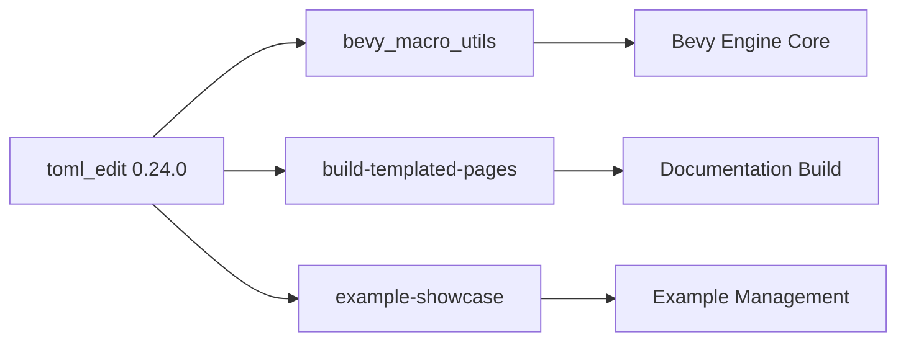

+++
title = "#22232 Update toml_edit requirement from 0.23.2 to 0.24.0"
date = "2025-12-22T00:00:00"
draft = false
template = "pull_request_page.html"
in_search_index = true

[taxonomies]
list_display = ["show"]

[extra]
current_language = "en"
available_languages = {"en" = { name = "English", url = "/pull_request/bevy/2025-12/pr-22232-en-20251222" }, "zh-cn" = { name = "中文", url = "/pull_request/bevy/2025-12/pr-22232-zh-cn-20251222" }}
labels = ["C-Dependencies"]
+++

# Title
Update toml_edit requirement from 0.23.2 to 0.24.0

## Basic Information
- **Title**: Update toml_edit requirement from 0.23.2 to 0.24.0
- **PR Link**: https://github.com/bevyengine/bevy/pull/22232
- **Author**: app/dependabot
- **Status**: MERGED
- **Labels**: C-Dependencies
- **Created**: 2025-12-22T06:35:15Z
- **Merged**: 2025-12-22T20:04:53Z
- **Merged By**: james7132

## Description Translation
Updates the requirements on [toml_edit](https://github.com/toml-rs/toml) to permit the latest version.
<details>
<summary>Commits</summary>
<ul>
<li><a href="https://github.com/toml-rs/toml/commit/2e094015675c23c868512590c84df0b6ce68e4ad"><code>2e09401</code></a> chore: Release</li>
<li><a href="https://github.com/toml-rs/toml/commit/e32c7a2f9b126d42fab0705e9783fec42b88e861"><code>e32c7a2</code></a> chore: Release</li>
<li><a href="https://github.com/toml-rs/toml/commit/df1c3286de0c7d3d8b77f417fb97f2413cb71807"><code>df1c328</code></a> docs: Update changelog</li>
<li><a href="https://github.com/toml-rs/toml/commit/b826cf4914de08adc437d948c3ff40fdfc2bb7ec"><code>b826cf4</code></a> feat(edit)!: Allow <code>set_position(None)</code> (<a href="https://redirect.github.com/toml-rs/toml/issues/1080">#1080</a>)</li>
<li><a href="https://github.com/toml-rs/toml/commit/8043f20af7fe175c00d07e7965809001bd18bd88"><code>8043f20</code></a> feat(edit)!: Allow <code>set_position(None)</code></li>
<li><a href="https://github.com/toml-rs/toml/commit/a02c0db59fc7a68257d754759bb558602ba7e96d"><code>a02c0db</code></a> feat: Support TOML 1.1 (<a href="https://redirect.github.com/toml-rs/toml/issues/1079">#1079</a>)</li>
<li><a href="https://github.com/toml-rs/toml/commit/5cfb838b15c4490a22b056c9f8a5bc9df2273a2a"><code>5cfb838</code></a> feat(edit): Support TOML 1.1</li>
<li><a href="https://github.com/toml-rs/toml/commit/1eb4d606d3a75bb87e3ee362fd89e5819fecad87"><code>1eb4d60</code></a> feat(toml): Support TOML 1.1</li>
<li><a href="https://github.com/toml-rs/toml/commit/695d7883d88745960225e873a62572567a8d570c"><code>695d788</code></a> feat(edit)!: Multi-line inline tables with trailing commas</li>
<li><a href="https://github.com/toml-rs/toml/commit/cc4f7acd94d214f4ea66254a97809711a712b895"><code>cc4f7ac</code></a> feat(toml): Multi-line inline tables with trailing commas</li>
<li>Additional commits viewable in <a href="https://github.com/toml-rs/toml/compare/v0.23.2...v0.24.0">compare view</a></li>
</ul>
</details>
<br />

Dependabot will resolve any conflicts with this PR as long as you don't alter it yourself. You can also trigger a rebase manually by commenting `@dependabot rebase`.

[//]: # (dependabot-automerge-start)
[//]: # (dependabot-automerge-end)

---

<details>
<summary>Dependabot commands and options</summary>
<br />

You can trigger Dependabot actions by commenting on this PR:
- `@dependabot rebase` will rebase this PR
- `@dependabot recreate` will recreate this PR, overwriting any edits that have been made to it
- `@dependabot merge` will merge this PR after your CI passes on it
- `@dependabot squash and merge` will squash and merge this PR after your CI passes on it
- `@dependabot cancel merge` will cancel a previously requested merge and block automerging
- `@dependabot reopen` will reopen this PR if it is closed
- `@dependabot close` will close this PR and stop Dependabot recreating it. You can achieve the same result by closing it manually
- `@dependabot show <dependency name> ignore conditions` will show all of the ignore conditions of the specified dependency
- `@dependabot ignore this major version` will close this PR and stop Dependabot creating any more for this major version (unless you reopen the PR or upgrade to it yourself)
- `@dependabot ignore this minor version` will close this PR and stop Dependabot creating any more for this minor version (unless you reopen the PR or upgrade to it yourself)
- `@dependabot ignore this dependency` will close this PR and stop Dependabot creating any more for this dependency (unless you reopen the PR or upgrade to it yourself)

</details>

## The Story of This Pull Request

This PR represents a routine but important dependency maintenance task. Dependabot, an automated dependency update tool, detected that the `toml_edit` library had released version 0.24.0 and created this pull request to update Bevy's dependencies accordingly.

The `toml_edit` library is used for parsing and manipulating TOML configuration files. In the Bevy project, it's employed in three distinct areas: the `bevy_macro_utils` crate and two build tools (`build-templated-pages` and `example-showcase`). These components use `toml_edit` specifically for parsing TOML files with the `parse` feature enabled and with default features disabled to minimize dependencies.

Looking at the `toml_edit` changelog reveals this is a significant update that includes support for TOML 1.1, which introduces several new language features. The version bump from 0.23.2 to 0.24.0 indicates there may be breaking changes (as suggested by the exclamation marks in the commit messages), including changes to the `set_position(None)` API and support for multi-line inline tables with trailing commas.

For Bevy, the update is straightforward because the project uses `toml_edit` in a limited capacity with specific feature flags. The fact that all three uses disable default features and only enable the `parse` feature suggests Bevy is primarily using the library for TOML parsing rather than complex manipulation. This limited usage pattern likely makes the update lower risk, as breaking changes in other parts of the API wouldn't affect Bevy's code.

The PR was automatically created by Dependabot, which monitors dependency versions and creates updates when new versions are available. This automation is crucial for maintaining security and accessing new features while minimizing manual maintenance overhead. The PR description includes standard Dependabot commands that project maintainers can use to control the update process.

The update was merged relatively quickly (within about 14 hours), suggesting that the CI tests passed without issues and the maintainers were confident in the compatibility of the new version. This quick merge indicates that either Bevy's usage of `toml_edit` doesn't interact with the breaking changes, or the project's test suite provides sufficient confidence that the update is safe.

From an engineering perspective, this PR demonstrates good dependency management practices: using automated tooling for updates, specifying feature flags precisely to limit API surface exposure, and maintaining a comprehensive test suite that can quickly validate compatibility with new dependency versions.

## Visual Representation



## Key Files Changed

List the most significant files changed in this PR:
- `crates/bevy_macro_utils/Cargo.toml` (+1/-1)
- `tools/build-templated-pages/Cargo.toml` (+1/-1)
- `tools/example-showcase/Cargo.toml` (+1/-1)

For each important file, include:
1. A brief description of what changed and why
2. Code snippets showing the key modifications (both before and after if applicable). DO NOT translate any comments/code in Code snippets.
3. How these changes relate to the overall purpose of the PR

### `crates/bevy_macro_utils/Cargo.toml`
This crate provides utility functions for Bevy's procedural macros and needs TOML parsing capabilities for reading configuration files.

```toml
# File: crates/bevy_macro_utils/Cargo.toml
# Before:
toml_edit = { version = "0.23.2", default-features = false, features = [
  "parse",
] }

# After:
toml_edit = { version = "0.24.0", default-features = false, features = [
  "parse",
] }
```

### `tools/build-templated-pages/Cargo.toml`
This build tool generates documentation pages and uses TOML parsing for configuration.

```toml
# File: tools/build-templated-pages/Cargo.toml
# Before:
toml_edit = { version = "0.23.2", default-features = false, features = [
  "parse",
] }

# After:
toml_edit = { version = "0.24.0", default-features = false, features = [
  "parse",
] }
```

### `tools/example-showcase/Cargo.toml`
This tool manages Bevy examples and uses TOML parsing for reading example metadata.

```toml
# File: tools/example-showcase/Cargo.toml
# Before:
toml_edit = { version = "0.23.2", default-features = false, features = [
  "parse",
] }

# After:
toml_edit = { version = "0.24.0", default-features = false, features = [
  "parse",
] }
```

All three changes are identical: they update the version constraint from `0.23.2` to `0.24.0` while preserving the same feature configuration. This consistency shows that all components use `toml_edit` for the same basic TOML parsing functionality.

## Further Reading

- [toml-rs GitHub Repository](https://github.com/toml-rs/toml) - The main repository for the toml-rs ecosystem, including `toml_edit`
- [TOML 1.1 Specification](https://toml.io/en/v1.1.0) - The updated TOML specification that version 0.24.0 now supports
- [Dependabot Documentation](https://docs.github.com/en/code-security/dependabot) - Information about automated dependency updates with Dependabot
- [Cargo Feature Flags](https://doc.rust-lang.org/cargo/reference/features.html) - Documentation on how to use feature flags in Rust dependencies