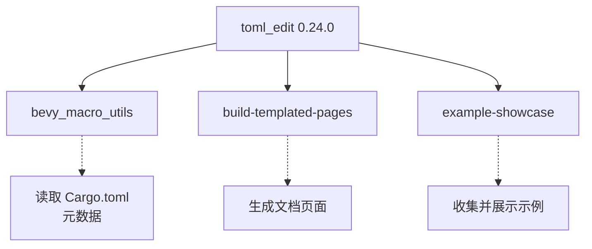

+++
title = "#22232 Update toml_edit requirement from 0.23.2 to 0.24.0"
date = "2025-12-22T00:00:00"
draft = false
template = "pull_request_page.html"
in_search_index = false

[extra]
current_language = "zh-cn"
available_languages = {"en" = { name = "English", url = "/pull_request/bevy/2025-12/pr-22232-en-20251222" }, "zh-cn" = { name = "中文", url = "/pull_request/bevy/2025-12/pr-22232-zh-cn-20251222" }}
+++

# Title

## 基本信息
- **标题**: Update toml_edit requirement from 0.23.2 to 0.24.0
- **PR 链接**: https://github.com/bevyengine/bevy/pull/22232
- **作者**: app/dependabot
- **状态**: 已合并
- **标签**: C-Dependencies
- **创建时间**: 2025-12-22T06:35:15Z
- **合并时间**: 2025-12-22T20:04:53Z
- **合并者**: james7132

## 描述翻译
将 `toml_edit` 的要求更新到允许最新版本。
<details>
<summary>提交记录</summary>
<ul>
<li><a href="https://github.com/toml-rs/toml/commit/2e094015675c23c868512590c84df0b6ce68e4ad"><code>2e09401</code></a> chore: 发布</li>
<li><a href="https://github.com/toml-rs/toml/commit/e32c7a2f9b126d42fab0705e9783fec42b88e861"><code>e32c7a2</code></a> chore: 发布</li>
<li><a href="https://github.com/toml-rs/toml/commit/df1c3286de0c7d3d8b77f417fb97f2413cb71807"><code>df1c328</code></a> docs: 更新变更日志</li>
<li><a href="https://github.com/toml-rs/toml/commit/b826cf4914de08adc437d948c3ff40fdfc2bb7ec"><code>b826cf4</code></a> feat(edit)!: 允许 <code>set_position(None)</code> (<a href="https://redirect.github.com/toml-rs/toml/issues/1080">#1080</a>)</li>
<li><a href="https://github.com/toml-rs/toml/commit/8043f20af7fe175c00d07e7965809001bd18bd88"><code>8043f20</code></a> feat(edit)!: 允许 <code>set_position(None)</code></li>
<li><a href="https://github.com/toml-rs/toml/commit/a02c0db59fc7a68257d754759bb558602ba7e96d"><code>a02c0db</code></a> feat: 支持 TOML 1.1 (<a href="https://redirect.github.com/toml-rs/toml/issues/1079">#1079</a>)</li>
<li><a href="https://github.com/toml-rs/toml/commit/5cfb838b15c4490a22b056c9f8a5bc9df2273a2a"><code>5cfb838</code></a> feat(edit): 支持 TOML 1.1</li>
<li><a href="https://github.com/toml-rs/toml/commit/1eb4d606d3a75bb87e3ee362fd89e5819fecad87"><code>1eb4d60</code></a> feat(toml): 支持 TOML 1.1</li>
<li><a href="https://github.com/toml-rs/toml/commit/695d7883d88745960225e873a62572567a8d570c"><code>695d788</code></a> feat(edit)!: 带尾随逗号的多行内联表</li>
<li><a href="https://github.com/toml-rs/toml/commit/cc4f7acd94d214f4ea66254a97809711a712b895"><code>cc4f7ac</code></a> feat(toml): 带尾随逗号的多行内联表</li>
<li>更多提交记录可在 <a href="https://github.com/toml-rs/toml/compare/v0.23.2...v0.24.0">比较视图</a> 中查看</li>
</ul>
</details>
<br />

只要你没有手动修改此 PR，Dependabot 将为你解决任何冲突。你也可以通过评论 `@dependabot rebase` 来手动触发 rebase。

[//]: # (dependabot-automerge-start)
[//]: # (dependabot-automerge-end)

---

<details>
<summary>Dependabot 命令和选项</summary>
<br />

你可以通过在此 PR 上评论来触发 Dependabot 操作：
- `@dependabot rebase` 将 rebase 此 PR
- `@dependabot recreate` 将重新创建此 PR，覆盖已对其进行的任何编辑
- `@dependabot merge` 将在你的 CI 通过后合并此 PR
- `@dependabot squash and merge` 将在你的 CI 通过后 squash 并合并此 PR
- `@dependabot cancel merge` 将取消先前请求的合并并阻止自动合并
- `@dependabot reopen` 将重新打开此 PR（如果它已关闭）
- `@dependabot close` 将关闭此 PR 并阻止 Dependabot 重新创建它。你可以通过手动关闭它来达到相同效果
- `@dependabot show <dependency name> ignore conditions` 将显示指定依赖项的所有忽略条件
- `@dependabot ignore this major version` 将关闭此 PR 并阻止 Dependabot 为此主版本创建更多 PR（除非你重新打开 PR 或自行升级）
- `@dependabot ignore this minor version` 将关闭此 PR 并阻止 Dependabot 为此次版本创建更多 PR（除非你重新打开 PR 或自行升级）
- `@dependabot ignore this dependency` 将关闭此 PR 并阻止 Dependabot 为此依赖项创建更多 PR（除非你重新打开 PR 或自行升级）

</details>

## 本次 Pull Request 的故事

这是一个由 Dependabot 自动化工具创建的依赖项更新 PR。Bevy 项目使用了 `toml_edit` 这个 Rust 库来处理 TOML 文件，主要在两个领域：`bevy_macro_utils` 内部用于读取 crate 元数据，以及构建工具链中用于处理项目配置和示例清单。依赖管理（dependency management）是维护任何软件项目健康的重要组成部分，定期更新可以获取安全补丁、性能改进和新功能。

这次 PR 将 `toml_edit` 的版本要求从 `0.23.2` 更新到 `0.24.0`。根据提交记录，这是一个包含了破坏性变更（breaking changes）的次要版本升级。主要的新特性是支持了 TOML 1.1 规范。TOML 1.1 引入了多项新特性，例如更灵活的日期时间格式、允许尾随逗号（trailing commas）的新语法、以及对 Unicode 字符串的新规定。对于 Bevy 的工具链来说，支持 TOML 1.1 意味着未来如果项目或示例的配置文件中使用了新语法，这些工具仍然能够正确解析。另外，`toml_edit` 库的 API 也有变化，例如 `set_position(None)` 现在被允许，这为操作 TOML 文档的格式提供了更多灵活性。

这个 PR 的修改非常直接，只涉及三个 `Cargo.toml` 文件中的版本号字符串。这种看似简单的变更，实际上需要依赖项目的测试套件来验证兼容性。维护者 `james7132` 在 CI 测试通过后合并了此 PR，表明这次升级在 Bevy 的上下文中是安全的，没有引入回归（regressions）。对于使用 Bevy 的开发者而言，这次升级是透明的，但确保了底层工具链与 TOML 生态系统的最新标准保持同步，为未来的兼容性打下了基础。它体现了现代软件开发中自动化依赖管理的最佳实践：通过工具（如 Dependabot）监控更新，并通过自动化测试快速、安全地集成。

## 视觉表示



## 关键文件变更

本次 PR 修改了三个 `Cargo.toml` 文件，将 `toml_edit` 依赖的版本号从 `0.23.2` 统一更新为 `0.24.0`。

1.  **`crates/bevy_macro_utils/Cargo.toml`**
    *   **变更原因**：`bevy_macro_utils` 是一个供 Bevy 内部过程宏（procedural macros）使用的工具库。它需要读取和解析 `Cargo.toml` 文件来获取 crate 的元信息（例如版本号）。更新依赖以获取 TOML 1.1 支持和新功能。
    *   **代码差异**：
        ```diff
        diff --git a/crates/bevy_macro_utils/Cargo.toml b/crates/bevy_macro_utils/Cargo.toml
        index e3a104758b84f..6e2cd35c975ca 100644
        --- a/crates/bevy_macro_utils/Cargo.toml
        +++ b/crates/bevy_macro_utils/Cargo.toml
        @@ -12,7 +12,7 @@ keywords = ["bevy"]
         syn = "2.0"
         quote = "1.0"
         proc-macro2 = "1.0"
        -toml_edit = { version = "0.23.2", default-features = false, features = [
        +toml_edit = { version = "0.24.0", default-features = false, features = [
           "parse",
         ] }
        ```

2.  **`tools/build-templated-pages/Cargo.toml`**
    *   **变更原因**：`build-templated-pages` 是一个构建时工具，用于生成 Bevy 的文档网站页面。它很可能需要解析项目中的 TOML 文件（如 `Cargo.toml` 或特定配置文件）来获取生成页面所需的数据。保持依赖更新确保它能处理可能采用新语法的配置文件。
    *   **代码差异**：
        ```diff
        diff --git a/tools/build-templated-pages/Cargo.toml b/tools/build-templated-pages/Cargo.toml
        index 726207e611271..462d84b951bdb 100644
        --- a/tools/build-templated-pages/Cargo.toml
        +++ b/tools/build-templated-pages/Cargo.toml
        @@ -6,7 +6,7 @@ publish = false
         license = "MIT OR Apache-2.0"
         
         [dependencies]
        -toml_edit = { version = "0.23.2", default-features = false, features = [
        +toml_edit = { version = "0.24.0", default-features = false, features = [
           "parse",
         ] }
         tera = "1.15"
        ```

3.  **`tools/example-showcase/Cargo.toml`**
    *   **变更原因**：`example-showcase` 工具用于收集和展示 Bevy 的示例。它会扫描示例目录并解析相关的清单文件（很可能是 `Cargo.toml`）来获取示例的元数据（如名称、描述）。更新依赖保证了该工具对示例清单文件的解析能力与最新的 TOML 规范兼容。
    *   **代码差异**：
        ```diff
        diff --git a/tools/example-showcase/Cargo.toml b/tools/example-showcase/Cargo.toml
        index f2fe0bb55bc38..ddff3f22bc77d 100644
        --- a/tools/example-showcase/Cargo.toml
        +++ b/tools/example-showcase/Cargo.toml
        @@ -8,7 +8,7 @@ license = "MIT OR Apache-2.0"
         [dependencies]
         xshell = "0.2"
         clap = { version = "4.0", features = ["derive"] }
        -toml_edit = { version = "0.23.2", default-features = false, features = [
        +toml_edit = { version = "0.24.0", default-features = false, features = [
           "parse",
         ] }
         pbr = "1.1"
        ```

## 进一步阅读

1.  **TOML 官方规范**：
    *   [TOML v1.0.0 规范](https://toml.io/en/v1.0.0) - 当前广泛使用的标准。
    *   [TOML v1.1.0-rc.1 规范](https://toml.io/en/v1.1.0-rc.1) - 本次 `toml_edit` 升级所支持的新版本规范，了解新增功能。

2.  **`toml_edit` 库**：
    *   [GitHub 仓库: toml-rs/toml](https://github.com/toml-rs/toml) - 查看源代码、提交历史和问题跟踪。
    *   [Crates.io 页面: toml_edit](https://crates.io/crates/toml_edit) - 获取版本发布信息和文档链接。

3.  **Rust 依赖管理与 Cargo**：
    *   [Cargo Book: Specifying Dependencies](https://doc.rust-lang.org/cargo/reference/specifying-dependencies.html) - 了解 Cargo 中指定依赖版本的各种语法。
    *   [Semantic Versioning](https://semver.org/) - 理解版本号 `0.24.0` 中主版本、次版本、修订号的含义，以及破坏性变更（breaking changes）的预期。