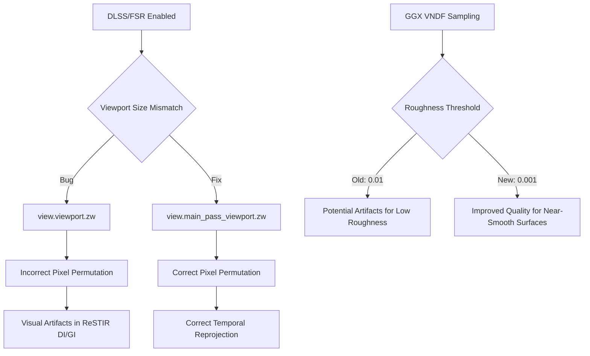

+++
title = "#22240 Solari: Fix bug with wrong viewport size under DLSS"
date = "2025-12-29T00:00:00"
draft = false
template = "pull_request_page.html"
in_search_index = true

[taxonomies]
list_display = ["show"]

[extra]
current_language = "en"
available_languages = {"en" = { name = "English", url = "/pull_request/bevy/2025-12/pr-22240-en-20251229" }, "zh-cn" = { name = "中文", url = "/pull_request/bevy/2025-12/pr-22240-zh-cn-20251229" }}
labels = ["C-Bug", "A-Rendering", "D-Straightforward"]
+++

# Title
## Basic Information
- **Title**: Solari: Fix bug with wrong viewport size under DLSS
- **PR Link**: https://github.com/bevyengine/bevy/pull/22240
- **Author**: JMS55
- **Status**: MERGED
- **Labels**: C-Bug, A-Rendering, S-Ready-For-Final-Review, D-Straightforward
- **Created**: 2025-12-23T00:48:34Z
- **Merged**: 2025-12-29T04:57:08Z
- **Merged By**: alice-i-cecile

## Description Translation
Fix https://github.com/bevyengine/bevy/issues/22200

## The Story of This Pull Request

This PR addresses a specific bug in the Solari rendering system related to how the viewport dimensions were being accessed during temporal reprojection when DLSS (Deep Learning Super Sampling) is active. The issue manifested as incorrect sampling behavior in the ReSTIR (ReSTIR 指 Resampled Temporal Importance Resampling, 是一种路径采样技术) DI (Direct Illumination) and GI (Global Illumination) passes.

The core problem was a mismatch between the viewport size used for pixel permutation and the actual render target size. The Solari system uses a technique called "permuted sampling" to reduce temporal noise. This technique requires knowing the exact dimensions of the render target to correctly map pixel coordinates. The bug occurred because the code was using `view.viewport.zw` (which represents the full window/viewport size) instead of `view.main_pass_viewport.zw` (which represents the size of the actual main render pass target, which can be different when upscaling techniques like DLSS or FSR are active).

When DLSS is enabled, the engine renders at a lower internal resolution and then upscales. The `main_pass_viewport` correctly reflects this internal render target size, while the generic `viewport` might still reflect the final output/window size. Using the wrong size in the `permute_pixel` function would cause the permutation to index pixels outside the valid range of the render target, leading to incorrect temporal data being fetched and visual artifacts.

The fix is straightforward but important: change three occurrences of `view.viewport.zw` to `view.main_pass_viewport.zw` in the relevant shader files. This ensures the pixel permutation logic uses the correct dimensions for the buffer it's actually reading from and writing to.

Alongside this main fix, a secondary, minor adjustment was made to a roughness threshold in the GGX VNDF (Visible Normal Distribution Function) sampling routine. The threshold for early exiting the full sampling routine (and returning a perfect reflection) was changed from `0.01` to `0.001`. This is an optimization and quality tweak. Materials with a roughness below this threshold are considered essentially perfectly smooth. Using a lower threshold (`0.001`) means the full, more expensive sampling algorithm will be used for slightly rougher surfaces, which can improve the quality of very sharp reflections by avoiding approximation artifacts that might occur near the old threshold. The change is minimal but aligns with common practice for handling near-zero roughness in PBR (Physically Based Rendering) shaders.

Finally, a purely cosmetic change added a blank line in a utility shader for better code organization, which doesn't affect functionality.

The impact of this PR is the correction of potential visual artifacts and incorrect lighting in scenes using Solari's ReSTIR DI/GI when DLSS or similar dynamic resolution techniques are active. The changes are localized to shader code, so they don't affect the Rust-side engine API or structure. The fix is essential for ensuring the advanced rendering techniques work correctly under common performance-enhancing upscaling methods.

## Visual Representation



## Key Files Changed

1. **File**: `crates/bevy_solari/src/realtime/restir_di.wgsl`
   - **Change**: Updated the viewport size parameter passed to `permute_pixel` from `view.viewport.zw` to `view.main_pass_viewport.zw`.
   - **Why**: To use the correct render target dimensions for temporal pixel permutation when DLSS/FSR modifies the internal resolution.
   - **Code Snippet**:
     ```wgsl
     // Before:
     let permuted_temporal_pixel_id = permute_pixel(vec2<u32>(temporal_pixel_id_float), constants.frame_index, view.viewport.zw);
     
     // After:
     let permuted_temporal_pixel_id = permute_pixel(vec2<u32>(temporal_pixel_id_float), constants.frame_index, view.main_pass_viewport.zw);
     ```

2. **File**: `crates/bevy_solari/src/realtime/restir_gi.wgsl`
   - **Change**: Identical change as in `restir_di.wgsl` for the GI pass.
   - **Why**: The same bug existed in both DI and GI temporal reprojection logic.
   - **Code Snippet**: (Same change as above)

3. **File**: `crates/bevy_solari/src/scene/sampling.wgsl`
   - **Change**: Adjusted the early-exit threshold in `sample_ggx_vndf` from `0.01` to `0.001`.
   - **Why**: To improve visual quality for materials with very low roughness (near-mirror surfaces) by using the full sampling algorithm for a broader range, reducing potential artifacts.
   - **Code Snippet**:
     ```wgsl
     // Before:
     if roughness <= 0.01 {
     
     // After:
     if roughness <= 0.001 {
     ```

4. **File**: `crates/bevy_pbr/src/render/utils.wgsl`
   - **Change**: Added a blank line after the `sample_cosine_hemisphere` function for better code readability.
   - **Why**: Cosmetic/organizational change only.
   - **Code Snippet**:
     ```wgsl
     // A blank line was added between functions.
     fn sample_cosine_hemisphere(...) -> vec3<f32> {
         // ... function body
     }
     // <-- This blank line was added
     fn sample_uniform_hemisphere(...) -> vec3<f32> {
     ```

## Further Reading
*   **ReSTIR (Resampled Temporal Importance Resampling)**: The original research paper, "Spatiotemporal reservoir resampling for real-time ray tracing with dynamic direct lighting" [\[PDF\]](https://research.nvidia.com/sites/default/files/pubs/2020-07_Spatiotemporal-reservoir-resampling/ReSTIR.pdf), provides the foundation for the techniques used in Solari.
*   **GGX VNDF Sampling**: The paper "Bounded VNDF Sampling for Smith-GGX Reflections" [\[Link\]](https://gpuopen.com/download/bounded-vndf-sampling-for-smith-ggx-reflections/) details the sampling algorithm being adjusted in this PR. The provided link in the shader comment is a good starting point.
*   **DLSS (Deep Learning Super Sampling)**: NVIDIA's developer documentation for DLSS explains the concept of rendering at a lower internal resolution and using AI to upsample, which is the context for the `main_pass_viewport` vs `viewport` distinction.
*   **Bevy Viewport & Render Target Management**: The Bevy engine's documentation on its rendering architecture, specifically how `Viewport` and camera projections work, would provide context for why these two viewport size values can differ.