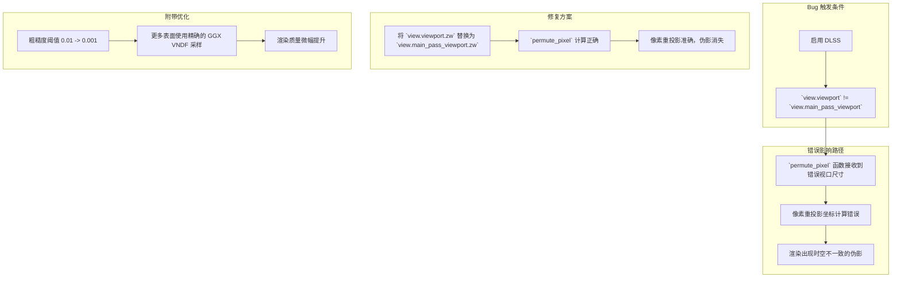

+++
title = "#22240 Solari: Fix bug with wrong viewport size under DLSS"
date = "2025-12-29T00:00:00"
draft = false
template = "pull_request_page.html"
in_search_index = false

[extra]
current_language = "zh-cn"
available_languages = {"en" = { name = "English", url = "/pull_request/bevy/2025-12/pr-22240-en-20251229" }, "zh-cn" = { name = "中文", url = "/pull_request/bevy/2025-12/pr-22240-zh-cn-20251229" }}
+++

# Solari: Fix bug with wrong viewport size under DLSS

## 基本信息
- **标题**: Solari: Fix bug with wrong viewport size under DLSS
- **PR 链接**: https://github.com/bevyengine/bevy/pull/22240
- **作者**: JMS55
- **状态**: 已合并 (MERGED)
- **标签**: C-Bug, A-Rendering, S-Ready-For-Final-Review, D-Straightforward
- **创建时间**: 2025-12-23T00:48:34Z
- **合并时间**: 2025-12-29T04:57:08Z
- **合并者**: alice-i-cecile

## 描述翻译
修复 https://github.com/bevyengine/bevy/issues/22200

## 本次 Pull Request 的来龙去脉

这个 PR 修复了 Bevy 渲染引擎中 Solari 模块（一个实时光线追踪/全局光照系统）在使用 DLSS (Deep Learning Super Sampling) 时出现的一个关键 bug。问题的核心在于视口 (Viewport) 尺寸的错误使用，导致了渲染伪影。

**问题与背景**
当启用 DLSS 或其他动态分辨率技术时，渲染管线可能会在主渲染视口 (`main_pass_viewport`) 之外使用一个不同的、用于上采样或抗锯齿的视口 (`viewport`)。Solari 的 ReSTIR (Resampled Importance Sampling via Temporal Importance Resampling) 算法在进行时域重投影 (temporal reprojection) 时，需要一个函数 (`permute_pixel`) 来对历史帧的像素坐标进行随机排列，以防止固定的重投影模式产生带状瑕疵。此函数需要知道当前视口的尺寸以正确计算排列。在修复前，代码错误地使用了 `view.viewport.zw`，这个值在 DLSS 下可能不是主渲染视口的尺寸，导致排列计算错误。最终表现为屏幕上出现闪烁或位置错误的像素，如同 issue #22200 所报告。

**解决方案与实现**
解决方案非常直接：将错误的视口引用更正为正确的。开发者识别出在 `load_temporal_reservoir` 函数中，传递给 `permute_pixel` 的视口尺寸参数应该是主渲染视口的尺寸。因此，在两处关键代码中将 `view.viewport.zw` 替换为 `view.main_pass_viewport.zw`。

同时，PR 还包含了一个对 `sample_ggx_vndf` 函数的优化，将判断是否为镜面反射 (specular) 的粗糙度 (roughness) 阈值从 `0.01` 降低到 `0.001`。这个改动与主 bug 无关，但属于同一模块的质量改进。`sample_ggx_vndf` 函数用于对基于 GGX 分布的可见法线分布函数 (Visible Normal Distribution Function) 进行重要性采样。当粗糙度非常低（表面非常光滑）时，为了性能和数值稳定性，代码会采用一个简化的、精确的镜面反射方向作为采样结果。将阈值从 `0.01` 降低到 `0.001`，意味着只有更接近完美镜面的表面才会使用这个简化路径，从而在更多的表面上使用更精确的 VNDF 采样，提升了渲染质量，同时仍然为极端光滑的表面保留了性能优化。

从工程角度看，这次修复体现了对渲染管线数据流的清晰理解。`view` 结构体可能包含多个视口信息，正确区分 `viewport`（可能与后处理相关）和 `main_pass_viewport`（主渲染通道的视口）是保证空间-时域重投影算法正确性的基础。这个错误很隐蔽，因为它只在使用特定渲染技术（如 DLSS）时才会显现。

**影响**
此修复直接解决了在启用 DLSS 时 Solari 渲染出现伪影的问题，确保了高级渲染功能组合（实时光线追踪 + AI 超分辨率）的稳定性和正确性。粗糙度阈值的微调虽然影响范围较小，但体现了对渲染细节的持续优化。整体而言，这是一个典型的、精准定位的图形渲染 bug 修复，通过微小的代码改动解决了特定的技术兼容性问题。

## 视觉表示



## 关键文件变更

1.  **`crates/bevy_solari/src/realtime/restir_di.wgsl` 与 `crates/bevy_solari/src/realtime/restir_gi.wgsl`**
    *   **变更描述**: 修复了直接光照 (DI) 和间接光照 (GI) 的 ReSTIR 时域重投影中，用于像素排列的视口尺寸参数错误的问题。这是本次修复的核心。
    *   **代码片段**:
        ```wgsl
        // 修复前:
        let permuted_temporal_pixel_id = permute_pixel(vec2<u32>(temporal_pixel_id_float), constants.frame_index, view.viewport.zw);

        // 修复后:
        let permuted_temporal_pixel_id = permute_pixel(vec2<u32>(temporal_pixel_id_float), constants.frame_index, view.main_pass_viewport.zw);
        ```

2.  **`crates/bevy_solari/src/scene/sampling.wgsl`**
    *   **变更描述**: 优化了 GGX VNDF 采样函数，降低了启用简化镜面反射路径的粗糙度阈值，使得更多表面采用精确采样，提升渲染质量。
    *   **代码片段**:
        ```wgsl
        // 修复前:
        if roughness <= 0.01 {
            return vec3(-wi_tangent.xy, wi_tangent.z);
        }

        // 修复后:
        if roughness <= 0.001 {
            return vec3(-wi_tangent.xy, wi_tangent.z);
        }
        ```

3.  **`crates/bevy_pbr/src/render/utils.wgsl`**
    *   **变更描述**: 这是一个纯粹的格式化变更，在 `sample_cosine_hemisphere` 和 `sample_uniform_hemisphere` 函数之间添加了一个空行，提高了代码可读性，与功能修复无关。
    *   **代码片段**:
        ```wgsl
        // 变更后（添加了一个空行）:
        fn sample_cosine_hemisphere(normal: vec3<f32>, rng: ptr<function, u32>) -> vec3<f32> {
            ...
        }
        // 新增的空行在这里
        // https://www.pbr-book.org/3ed-2018/Monte_Carlo_Integration/2D_Sampling_with_Multidimensional_Transformations#UniformlySamplingaHemisphere
        fn sample_uniform_hemisphere(normal: vec3<f32>, rng: ptr<function, u32>) -> vec3<f32> {
            ...
        }
        ```

## 扩展阅读
*   **ReSTIR 算法**: 了解用于实时渲染的 Resampled Importance Sampling 技术。
    *   原始论文: *[Spatiotemporal reservoir resampling for real-time ray tracing with dynamic direct lighting](https://research.nvidia.com/publication/2020-07_spatiotemporal-reservoir-resampling-real-time-ray-tracing-dynamic-direct)*
*   **DLSS (深度学习超级采样)**: NVIDIA 的 AI 驱动的超分辨率技术。
    *   NVIDIA 官方介绍: [NVIDIA DLSS Technology](https://www.nvidia.com/en-us/geforce/technologies/dlss/)
*   **GGX 微表面模型与 VNDF 采样**: 现代基于物理的渲染中用于模拟粗糙表面反射的核心模型及其高效采样方法。
    *   Heitz, Eric. *[Sampling the GGX Distribution of Visible Normals](https://jcgt.org/published/0007/04/01/)*. Journal of Computer Graphics Techniques, 2018.
*   **Bevy 引擎渲染架构**: 了解 Bevy 的渲染图 (Render Graph)、视口管理和着色器模块系统。