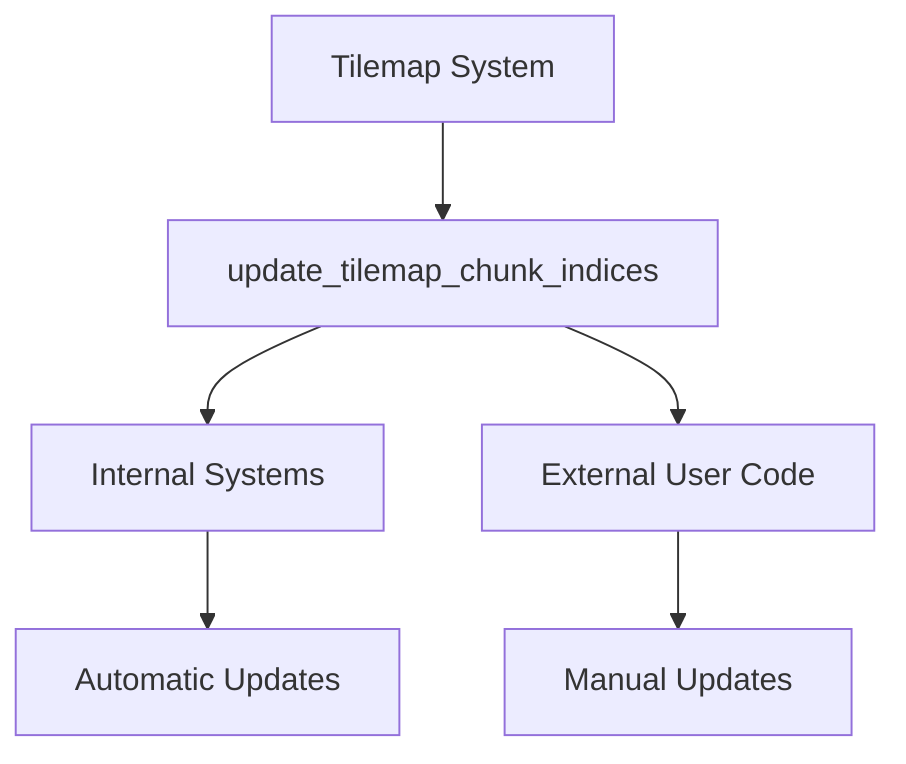

+++
title = "#22243 Make `update_tilemap_chunk_indices` public"
date = "2025-12-29T00:00:00"
draft = false
template = "pull_request_page.html"
in_search_index = true

[taxonomies]
list_display = ["show"]

[extra]
current_language = "en"
available_languages = {"en" = { name = "English", url = "/pull_request/bevy/2025-12/pr-22243-en-20251229" }, "zh-cn" = { name = "中文", url = "/pull_request/bevy/2025-12/pr-22243-zh-cn-20251229" }}
labels = ["A-Rendering", "C-Usability"]
+++

# Title

## Basic Information
- **Title**: Make `update_tilemap_chunk_indices` public
- **PR Link**: https://github.com/bevyengine/bevy/pull/22243
- **Author**: apekros
- **Status**: MERGED
- **Labels**: A-Rendering, C-Usability, S-Ready-For-Final-Review
- **Created**: 2025-12-23T09:40:51Z
- **Merged**: 2025-12-29T06:26:24Z
- **Merged By**: alice-i-cecile

## Description Translation

# Objective

Fixes #22145

## Solution

Following @alice-i-cecile simple suggestion of making `update_tilemap_chunk_indices` public.

## The Story of This Pull Request

This PR addresses a straightforward but significant API completeness issue in Bevy's tilemap system. The core problem was that a critical function for managing tilemap chunk indices wasn't accessible to users who needed to trigger manual updates.

In Bevy's tilemap rendering system, chunks are used to optimize rendering by grouping tiles into manageable batches. The `update_tilemap_chunk_indices` function handles the recalculation of these chunks when tiles change position or state. However, this function was marked as private, making it unavailable for external use cases where developers needed to manually trigger chunk updates.

The issue #22145 highlighted a concrete scenario where this limitation became problematic. Without access to `update_tilemap_chunk_indices`, developers working with custom tile manipulation logic couldn't properly synchronize the chunk system with their changes, potentially leading to rendering artifacts or incorrect tile behavior.

The solution follows a direct pattern common in API design: when a utility function serves a clear purpose that extends beyond internal system use, making it public provides flexibility for advanced use cases. The change itself is minimal but meaningful—adding the `pub` keyword transforms the function from an internal implementation detail to a public API surface.

This approach aligns with Rust's principle of exposing only what's necessary while recognizing when utilities have legitimate external applications. The function signature and implementation remain unchanged; only its visibility is modified, ensuring backward compatibility for existing code that might already be using the tilemap systems through standard Bevy APIs.

From an architectural perspective, this change demonstrates good API evolution. The function was already well-designed for its internal role, with appropriate parameters and return types. Making it public simply extends its utility without requiring any redesign. This is a low-risk change that solves a concrete developer pain point.

The impact is practical: developers can now call `update_tilemap_chunk_indices` directly when implementing custom tile manipulation logic, animation systems, or procedural generation that modifies tile positions outside the standard Bevy systems. This provides the flexibility needed for advanced 2D game development scenarios while maintaining the existing automatic update behavior for typical use cases.

## Visual Representation



## Key Files Changed

### `crates/bevy_sprite_render/src/tilemap_chunk/mod.rs` (+1/-1)

This file contains the tilemap chunk management system. The change modifies a single function's visibility from private to public, enabling external access to chunk index updates.

**Before:**
```rust
fn update_tilemap_chunk_indices(
    query: Query<
        (
            Entity,
```

**After:**
```rust
pub fn update_tilemap_chunk_indices(
    query: Query<
        (
            Entity,
```

The modification is minimal: adding the `pub` keyword before the function name. This change allows the function to be called from other modules or user code while maintaining its existing implementation and behavior.

## Further Reading

1. [Rust Visibility and Privacy](https://doc.rust-lang.org/book/ch07-02-defining-modules-to-control-scope-and-privacy.html) - Understanding Rust's module system and visibility controls
2. [Bevy Tilemap Documentation](https://docs.rs/bevy/latest/bevy/sprite/struct.Tilemap.html) - Official documentation for Bevy's tilemap system
3. [API Design Principles](https://rust-lang.github.io/api-guidelines/) - Rust API guidelines for designing public interfaces
4. [Bevy ECS System Functions](https://bevy-cheatbook.github.io/programming/systems.html) - How system functions work in Bevy's ECS

# Full Code Diff

```
diff --git a/crates/bevy_sprite_render/src/tilemap_chunk/mod.rs b/crates/bevy_sprite_render/src/tilemap_chunk/mod.rs
index 8b4f062873262..6832b6b5f9bb5 100644
--- a/crates/bevy_sprite_render/src/tilemap_chunk/mod.rs
+++ b/crates/bevy_sprite_render/src/tilemap_chunk/mod.rs
@@ -182,7 +182,7 @@ fn on_insert_tilemap_chunk(mut world: DeferredWorld, HookContext { entity, .. }:
         .insert((Mesh2d(mesh), MeshMaterial2d(material)));
 }
 
-fn update_tilemap_chunk_indices(
+pub fn update_tilemap_chunk_indices(
     query: Query<
         (
             Entity,
```