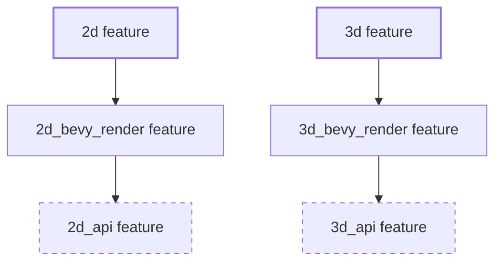

+++
title = "#22244 Remove `*_api` feature from `2d` and `3d`"
date = "2025-12-29T00:00:00"
draft = false
template = "pull_request_page.html"
in_search_index = true

[taxonomies]
list_display = ["show"]

[extra]
current_language = "en"
available_languages = {"en" = { name = "English", url = "/pull_request/bevy/2025-12/pr-22244-en-20251229" }, "zh-cn" = { name = "中文", url = "/pull_request/bevy/2025-12/pr-22244-zh-cn-20251229" }}
labels = ["C-Code-Quality", "A-Cross-Cutting"]
+++

# Title

## Basic Information
- **Title**: Remove `*_api` feature from `2d` and `3d`
- **PR Link**: https://github.com/bevyengine/bevy/pull/22244
- **Author**: Shatur
- **Status**: MERGED
- **Labels**: C-Code-Quality, S-Ready-For-Final-Review, A-Cross-Cutting
- **Created**: 2025-12-23T16:55:31Z
- **Merged**: 2025-12-29T05:53:31Z
- **Merged By**: alice-i-cecile

## Description Translation

# Objective

- It's already enabled by `*_bevy_render`.

## Solution

- Looks like it can be removed. Makes it easier to reason what to re-enable if you're enable specific subsets.

## The Story of This Pull Request

This pull request addresses a straightforward issue of feature flag redundancy in Bevy's Cargo.toml file. The problem centered around two features, `2d_api` and `3d_api`, which were included in the `2d` and `3d` feature sets respectively. The developer, Shatur, identified that these features were already implicitly enabled through their corresponding `*_bevy_render` features. Having them explicitly listed created unnecessary duplication and made the feature dependency graph harder to reason about.

The context here involves managing Rust's feature system in a large project like Bevy. Features allow conditional compilation and can have complex dependencies. When a feature `A` depends on feature `B`, and both are included in another feature `C`, it's redundant to list both `A` and `B` in `C`'s definition if `A` already brings in `B`. This redundancy doesn't cause functional bugs but creates maintenance overhead and cognitive load for developers trying to understand which features are actually needed.

The solution approach was simple and pragmatic: remove the redundant feature declarations. No architectural changes or code modifications were required since this was purely a build system configuration issue. The developer correctly reasoned that if `2d_bevy_render` already enables `2d_api`, then explicitly listing `2d_api` in the `2d` feature set serves no purpose. The same logic applies to the 3D counterpart.

The implementation consisted of a minimal two-line change in the Cargo.toml file, removing the `"2d_api"` entry from the `2d` feature array and the `"3d_api"` entry from the `3d` feature array. This change demonstrates effective feature management by eliminating redundant declarations and simplifying the feature hierarchy.

From a technical perspective, this change has several benefits. First, it reduces the surface area for potential feature-related bugs - fewer explicit dependencies mean fewer places where inconsistencies can be introduced. Second, it makes the feature structure more transparent; developers can now trace dependencies more easily without encountering circular or redundant relationships. Third, it aligns with the principle of DRY (Don't Repeat Yourself) applied to build configuration.

The impact of this change is primarily on developer experience and codebase maintainability. For users enabling specific feature subsets, the simplified dependency graph makes it clearer what actually needs to be re-enabled when working with partial feature sets. This is particularly valuable in large projects where feature combinations can become complex. The change also slightly reduces the cognitive load for new contributors trying to understand Bevy's feature architecture.

This PR serves as a good example of routine code quality maintenance in Rust projects using Cargo's feature system. It shows how even small, seemingly trivial changes can improve the overall health and clarity of a project's build configuration.

## Visual Representation



*Solid lines show explicit feature dependencies. Dashed lines show implicit dependencies that were previously explicit but removed in this PR.*

## Key Files Changed

### `Cargo.toml` (+0/-2)

This was the only file changed in the PR. The modifications removed redundant feature declarations from the `2d` and `3d` feature sets.

**Before the changes:**
```toml
2d = [
  "default_app",
  "default_platform",
  "2d_api",  # This line was removed
  "2d_bevy_render",
  "ui",
  "scene",
  "default_font",
  "default_winit",
]

3d = [
  "default_app",
  "default_platform",
  "3d_api",  # This line was removed
  "3d_bevy_render",
  "ui",
  "scene",
  "default_font",
  "default_winit",
]
```

**After the changes:**
```toml
2d = [
  "default_app",
  "default_platform",
  "2d_bevy_render",
  "ui",
  "scene",
  "default_font",
  "default_winit",
]

3d = [
  "default_app",
  "default_platform",
  "3d_bevy_render",
  "ui",
  "scene",
  "default_font",
  "default_winit",
]
```

The changes are minimal but significant for code quality. By removing the explicit `2d_api` and `3d_api` dependencies, the feature definitions become cleaner and more accurate. Since `2d_bevy_render` already depends on `2d_api` (and similarly for 3D), listing it explicitly was redundant. This simplification makes it easier for developers to understand the actual dependency structure when working with these features.

## Further Reading

1. **The Cargo Book - Features Chapter**: https://doc.rust-lang.org/cargo/reference/features.html
   - Official documentation on Rust's feature system, essential for understanding how features work in Cargo

2. **Bevy's Feature Documentation**: https://bevyengine.org/learn/book/getting-started/features/
   - Bevy-specific guidance on using features in the engine

3. **Rust API Guidelines - Feature Documentation**: https://rust-lang.github.io/api-guidelines/documentation.html#c-feature
   - Best practices for documenting and managing features in Rust crates

4. **"The Little Book of Rust Macros" - Conditional Compilation**: https://veykril.github.io/tlborm/decl-macros/macros-conditionally-compiling.html
   - Covers how conditional compilation works in Rust, which is closely related to feature flags

5. **GitHub Issue on Feature Flag Best Practices**: https://github.com/rust-lang/cargo/issues/3494
   - Discussion about feature flag patterns and anti-patterns in the Rust ecosystem

# Full Code Diff
```diff
diff --git a/Cargo.toml b/Cargo.toml
index 7dda86c8f1418..015e84dce0a39 100644
--- a/Cargo.toml
+++ b/Cargo.toml
@@ -131,7 +131,6 @@ default = ["2d", "3d", "ui"]
 2d = [
   "default_app",
   "default_platform",
-  "2d_api",
   "2d_bevy_render",
   "ui",
   "scene",
@@ -143,7 +142,6 @@ default = ["2d", "3d", "ui"]
 3d = [
   "default_app",
   "default_platform",
-  "3d_api",
   "3d_bevy_render",
   "ui",
   "scene",
```