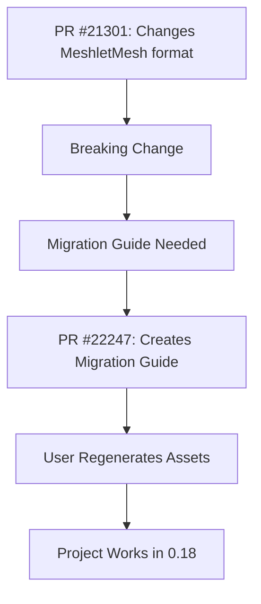

+++
title = "#22247 Virtual geometry 0.18 migration guide"
date = "2025-12-29T00:00:00"
draft = false
template = "pull_request_page.html"
in_search_index = true

[taxonomies]
list_display = ["show"]

[extra]
current_language = "en"
available_languages = {"en" = { name = "English", url = "/pull_request/bevy/2025-12/pr-22247-en-20251229" }, "zh-cn" = { name = "中文", url = "/pull_request/bevy/2025-12/pr-22247-zh-cn-20251229" }}
labels = ["A-Rendering", "M-Migration-Guide"]
+++

# Title

## Basic Information
- **Title**: Virtual geometry 0.18 migration guide
- **PR Link**: https://github.com/bevyengine/bevy/pull/22247
- **Author**: JMS55
- **Status**: MERGED
- **Labels**: A-Rendering, S-Ready-For-Final-Review, M-Migration-Guide
- **Created**: 2025-12-23T17:26:01Z
- **Merged**: 2025-12-29T04:51:30Z
- **Merged By**: alice-i-cecile

## Description Translation
Closes #22170

## The Story of This Pull Request

This PR addresses a straightforward but essential task in software development: providing migration guidance for breaking changes. The context is Bevy 0.18, which introduced changes to the virtual geometry system. Specifically, PR #21301 modified the underlying asset format for `MeshletMesh`. When a game engine like Bevy updates its data formats, existing assets created with the old format become incompatible. This breaks existing projects unless users know how to update their assets.

The solution implemented here is minimal and direct: create a migration guide. Migration guides are a standard practice in software maintenance, especially for game engines and frameworks where user projects depend on specific data formats. They serve as clear, actionable documentation that helps users transition between versions without confusion or data loss.

The implementation consists of creating a single Markdown file in the repository's migration guide section. The file follows the established pattern for Bevy migration guides, using frontmatter to specify the title and the pull request that introduced the change. The guide's content is concise, stating the core fact: the asset format changed and assets must be regenerated. This brevity is effective because it directly answers the user's most critical question: "What do I need to do to make my project work again?"

From a technical perspective, this change highlights an important engineering practice. Breaking changes in data serialization formats are a common source of upgrade friction. By explicitly documenting the need to regenerate `MeshletMesh` assets, the guide prevents users from encountering cryptic errors when loading old assets. This is particularly important for `MeshletMesh`, which is part of Bevy's meshlet-based rendering pipeline—a performance-oriented feature where incorrect asset data could lead to rendering artifacts or crashes.

The impact of this PR is purely on documentation and user experience. It doesn't change any runtime code, but it significantly improves the upgrade process for developers using the virtual geometry features. The lesson here is that even small, non-code changes are crucial for maintaining a healthy ecosystem. Good documentation reduces support burden and helps users adopt new versions successfully.

## Visual Representation



## Key Files Changed

### `release-content/migration-guides/virtual_geometry.md` (+6/-0)

This is a new file created to document the migration required for the virtual geometry changes in Bevy 0.18. The file is a Markdown document with YAML frontmatter and a single line of content.

1. **What changed and why**: A new migration guide was added. The guide informs users that the asset format for virtual geometry (`MeshletMesh`) has changed and that they must regenerate these assets to use them with Bevy 0.18. This is necessary because PR #21301 introduced a breaking change to the format.

2. **Code snippet**:
```markdown
---
title: Virtual Geometry
pull_requests: [21301]
---

Virtual geometry's asset format has changed. You must regenerate `MeshletMesh` assets.
```

3. **How it relates to the PR**: This file is the entire content of the PR. It fulfills the requirement to document the migration steps for the breaking change introduced in PR #21301.

## Further Reading

1. **Bevy Migration Guides**: The broader collection of migration guides in the Bevy repository provides context for how breaking changes are documented.
2. **Meshlets and Virtual Geometry**: For technical details on the meshlet rendering system and why asset format changes might be necessary, refer to the Bevy documentation on meshlets and the original PR #21301.
3. **Semantic Versioning and Breaking Changes**: Understanding semantic versioning (SemVer) helps explain why major version releases (like 0.17 to 0.18) can include breaking changes that require migration guides.

# Full Code Diff
diff --git a/release-content/migration-guides/virtual_geometry.md b/release-content/migration-guides/virtual_geometry.md
new file mode 100644
index 0000000000000..bdc873f66edbe
--- /dev/null
+++ b/release-content/migration-guides/virtual_geometry.md
@@ -0,0 +1,6 @@
+---
+title: Virtual Geometry
+pull_requests: [21301]
+---
+
+Virtual geometry's asset format has changed. You must regenerate `MeshletMesh` assets.