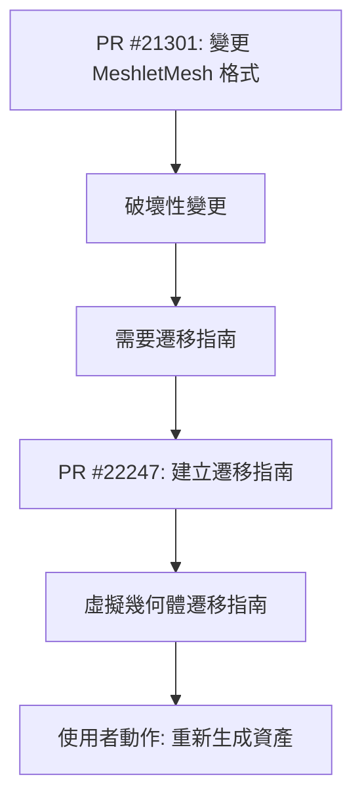

+++
title = "#22247"
date = "2025-12-29T00:00:00"
draft = false
template = "pull_request_page.html"
in_search_index = false

[extra]
current_language = "zh-cn"
available_languages = {"en" = { name = "English", url = "/pull_request/bevy/2025-12/pr-22247-en-20251229" }, "zh-cn" = { name = "中文", url = "/pull_request/bevy/2025-12/pr-22247-zh-cn-20251229" }}
+++

# Virtual geometry 0.18 migration guide

## 基本資訊
- **標題**: Virtual geometry 0.18 migration guide
- **PR 連結**: https://github.com/bevyengine/bevy/pull/22247
- **作者**: JMS55
- **狀態**: 已合併
- **標籤**: A-Rendering, S-Ready-For-Final-Review, M-Migration-Guide
- **建立時間**: 2025-12-23T17:26:01Z
- **合併時間**: 2025-12-29T04:51:30Z
- **合併者**: alice-i-cecile

## 描述翻譯
關閉 #22170

## 本次 PR 的故事

這個 PR 的核心任務很明確：為 Bevy 0.18 版本中虛擬幾何體（Virtual Geometry）系統的變更撰寫遷移指南。

背景是 PR #21301 引入了一項破壞性變更，它修改了 `MeshletMesh` 資產的內部格式。這種格式變更意味著在舊版本 Bevy 中建立或預先計算的 `MeshletMesh` 資產檔案，與新版本的 Bevy 引擎不再相容。如果開發者直接升級到 0.18 版本，而沒有重新處理這些資產，可能會在載入或使用這些網格時遇到錯誤或無法預期的行為。

這類資產格式的變更是渲染管線優化中常見的情況。當底層的資料表示方法或壓縮演算法改進時，為了獲得更好的效能或功能，格式變更通常是必要的。然而，這會對現有專案造成影響，因此需要清晰的遷移指引。

解決方案非常直接：建立一份簡潔的遷移指南文件。這份指南只需要做兩件事：
1.  明確告知開發者這是一項破壞性變更。
2.  提供具體的解決步驟——即重新生成 `MeshletMesh` 資產。

從工程角度看，這個 PR 的實現非常精簡。它沒有修改任何程式碼邏輯，而是新增了一份 Markdown 文件到 `release-content/migration-guides/` 目錄下。這遵循了 Bevy 社群管理破壞性變更的慣例：為每個重要的變更提供遷移指南，幫助社群順利過渡。

指南的內容設計也體現了實用性。它通過 `pull_requests: [21301]` 元數據直接連結到引入變更的原始 PR，讓有興趣深入了解技術細節的開發者可以輕鬆找到源頭。核心指令只有一句話：「虛擬幾何體的資產格式已更改。你必須重新生成 `MeshletMesh` 資產。」這避免了冗長的解釋，直擊要點，減少了開發者的認知負擔。

這類遷移指南的價值在於它們作為知識的樞紐。它們將程式碼庫中分散的破壞性變更集中記錄下來，並在版本發行說明中提供連結。對於升級大型專案的團隊來說，這是一個關鍵的參考點，可以系統性地檢查所有需要進行的調整，而不是在執行時才遭遇問題。

從更廣泛的專案維護角度來看，及時為破壞性變更提供遷移指南，是維護一個健康的開源生態系統的重要實踐。它降低了升級的門檻和風險，鼓勵社群保持最新版本，從而讓更多開發者能夠受益於最新的修復和改進。

## 視覺化表示



## 主要變更檔案

### `release-content/migration-guides/virtual_geometry.md` (+6/-0)
這是一個新增的檔案，專門用來記錄從舊版本遷移到 Bevy 0.18 時，虛擬幾何體模組所需的步驟。

**關鍵修改：**
```markdown
---
title: Virtual Geometry
pull_requests: [21301]
---

Virtual geometry's asset format has changed. You must regenerate `MeshletMesh` assets.
```

**說明：**
- 檔案使用標準的遷移指南 Front Matter 格式，包含標題和相關 PR 連結。
- 正文非常簡潔，直接說明了變更的性質（資產格式改變）和需要採取的具體行動（重新生成 `MeshletMesh` 資產）。
- 這個檔案將被整合到 Bevy 0.18 的完整遷移文件中，幫助使用者系統性地處理所有破壞性變更。

## 延伸閱讀

- **[PR #21301](https://github.com/bevyengine/bevy/pull/21301)**: 本次遷移指南所對應的原始技術變更 PR，包含了虛擬幾何體資產格式修改的具體細節和原因。
- **[Bevy 官方遷移指南](https://bevyengine.org/learn/migration-guides/)**: 了解 Bevy 遷移指南的整體結構和風格。
- **[Meshlets 技術介紹](https://en.wikipedia.org/wiki/Mesh_shading)**: 關於 Meshlets 和網格著色器（Mesh Shading）的背景知識，這項技術是虛擬幾何體系統的基礎。