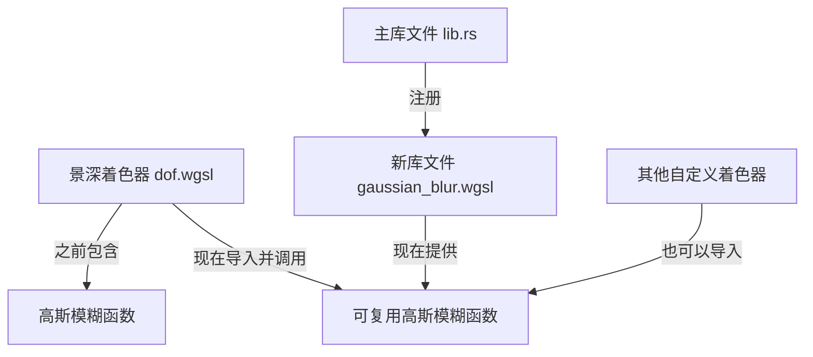

+++
title = "#22249 Move the Gaussian blur shader function into a reusable library."
date = "2025-12-30T00:00:00"
draft = false
template = "pull_request_page.html"
in_search_index = false

[extra]
current_language = "zh-cn"
available_languages = {"en" = { name = "English", url = "/pull_request/bevy/2025-12/pr-22249-en-20251230" }, "zh-cn" = { name = "中文", url = "/pull_request/bevy/2025-12/pr-22249-zh-cn-20251230" }}
+++

# Move the Gaussian Blur Shader Function into a Reusable Library

## 基本信息
- **标题**: Move the Gaussian blur shader function into a reusable library.
- **PR链接**: https://github.com/bevyengine/bevy/pull/22249
- **作者**: pcwalton
- **状态**: 已合并
- **标签**: A-Rendering, C-Code-Quality, C-Usability, S-Ready-For-Final-Review, D-Straightforward, D-Shaders
- **创建时间**: 2025-12-23T18:10:43Z
- **合并时间**: 2025-12-30T01:14:06Z
- **合并者**: alice-i-cecile

## 描述翻译

景深（depth of field）通道有一个中等性能的高斯模糊实现，这个实现注释完善且经过充分测试，但目前仅在该通道内部使用。高斯模糊的实用性很高，值得暴露给应用程序的着色器使用，因此本次PR将该代码提取到一个可复用的着色器库中。

## 本次PR的技术分析

在Bevy渲染引擎的演进中，代码复用和模块化是提升开发者体验和代码质量的关键。这次PR #22249 解决了一个具体问题：将景深（DOF）后处理效果中实现的高斯模糊算法提取为独立、可复用的着色器库。

### 问题与背景

在原始的实现中，高斯模糊算法直接内嵌在 `crates/bevy_post_process/src/dof/dof.wgsl` 文件中，作为 `gaussian_blur` 函数存在。这个函数实现了可分离的高斯模糊核（separable Gaussian blur kernel），用于景深效果的模糊处理。该实现质量很高：代码有详细注释，利用了双边纹理采样的优化技巧来减少纹理采样次数，并且经过了实际使用的验证。

然而，这种做法存在明显的局限性：
1. **代码重复风险**：如果其他后处理效果（如运动模糊、自定义模糊效果）也需要高斯模糊，开发者不得不复制粘贴这段代码，导致维护问题。
2. **可复用性差**：该函数依赖于特定的纹理和采样器变量（`color_texture_a` 和 `color_texture_sampler`），耦合度很高。
3. **API不友好**：自定义着色器无法直接使用这个经过优化的、现成的模糊算法。

因此，将这个函数重构为通用的库函数是提高代码复用性和降低开发者实现模糊效果门槛的自然选择。

### 解决方案

作者采取了直接而有效的重构策略：将函数从具体实现位置提取到新的库文件中，并通过参数化消除对具体纹理的依赖。

具体技术路径如下：
1. **创建独立库文件**：在 `crates/bevy_post_process/src/` 目录下创建新的 `gaussian_blur.wgsl` 文件。
2. **函数泛化**：将原函数签名从依赖隐式变量改为接收显式参数，特别是将硬编码的 `color_texture_a` 和 `color_texture_sampler` 改为函数参数。
3. **更新原有调用点**：修改景深着色器，移除内部函数定义，改为导入（`#import`）并使用新的库函数。
4. **注册库文件**：在Rust端的模块初始化代码中，加载新的着色器库，使其可用于整个项目。

这种方法最大限度地保留了原有实现的正确性和性能，同时实现了代码解耦。

### 实现细节

新创建的 `gaussian_blur.wgsl` 文件定义了一个名为 `gaussian_blur` 的公共函数。关键变化在于函数签名：它现在接受 `color_texture` 和 `color_texture_sampler` 作为参数，而不是依赖于外部作用域中定义的变量。这使得函数可以应用于任何纹理，而不仅仅是景深处理中的特定中间纹理。

```wgsl
// 新文件: crates/bevy_post_process/src/gaussian_blur.wgsl
// 关键的函数签名变化，增加了纹理和采样器参数
fn gaussian_blur(color_texture: texture_2d<f32>, color_texture_sampler: sampler, 
                 frag_coord: vec4<f32>, coc: f32, frag_offset: vec2<f32>) -> vec4<f32> {
    // ... 函数体逻辑基本保持不变，但使用传入的参数
    let uv = frag_coord.xy / vec2<f32>(textureDimensions(color_texture));
    let offset = frag_offset / vec2<f2>(textureDimensions(color_texture));
    // ...
}
```

在 `dof.wgsl` 中，原来的 `gaussian_blur` 函数被完全移除（删除了65行代码），并替换为简单的导入和调用：

```wgsl
// 修改后: crates/bevy_post_process/src/dof/dof.wgsl
#import bevy_post_process::gaussian_blur::gaussian_blur

// ...

@fragment
fn gaussian_horizontal(in: FullscreenVertexOutput) -> @location(0) vec4<f32> {
    let coc = calculate_circle_of_confusion(in.position);
    // 调用库函数，显式传递纹理和采样器
    return gaussian_blur(color_texture_a, color_texture_sampler, in.position, coc, vec2(1.0, 0.0));
}
```

Rust端的修改很简单，只需在 `lib.rs` 的插件构建函数中注册新的着色器库：

```rust
// 修改后: crates/bevy_post_process/src/lib.rs
impl Plugin for PostProcessPlugin {
    fn build(&self, app: &mut App) {
        load_shader_library!(app, "gaussian_blur.wgsl");
        // ... 其他插件注册
    }
}
```

### 技术洞察

这个PR展示了几个有价值的软件工程和图形编程实践：

1. **可分离滤波器的实现**：高斯模糊是一种可分离的卷积滤波器（separable filter），这意味着二维模糊可以分解为两个一维模糊（水平和垂直）的连续应用。这大大减少了计算量，从 O(n²) 降低到 O(2n)。PR中的函数正是实现了一个方向的一维高斯模糊。

2. **优化纹理采样的技巧**：原实现包含了一个重要的优化——通过巧妙利用双线性过滤（bilinear filtering），将两个相邻样本的加权和合并为一次纹理采样。这可以减少约一半的纹理采样次数，对性能有明显提升。新库保留了这一优化，使其对使用者完全透明。

3. **WGSL模块化**：Bevy的着色器系统支持通过 `#import` 语句和 `#define_import_path` 指令创建模块化的着色器库。这种模式类似于传统编程中的库函数，允许代码复用和逻辑封装。

4. **参数化设计**：将硬编码的依赖改为参数传递，这是函数从特定上下文解耦的标准重构方法。这种改变保持了函数的纯函数特性（pure function），使其更易于测试和理解。

### 影响与意义

这次重构带来了多方面的积极影响：

1. **代码质量提升**：消除了潜在的代码重复，将核心算法集中维护在一处。如果未来需要修复错误或优化算法，只需修改一个位置。

2. **开发者体验改善**：现在，任何Bevy开发者都可以在他们的自定义着色器中通过 `#import bevy_post_process::gaussian_blur::gaussian_blur` 来使用这个经过优化的高斯模糊实现，无需重新发明轮子。

3. **架构清晰度**：分离了通用算法（高斯模糊）和特定应用逻辑（景深效果），使代码库的组织结构更加清晰。

4. **性能保障**：由于只是重构而非重写，现有的性能特性（如优化的纹理采样）得以完整保留，不会影响现有景深效果的渲染性能。

从更广泛的视角看，这个PR体现了Bevy项目对代码质量和开发者体验的持续关注。通过将经过验证的实用算法提取为公共API，项目降低了新开发者实现高级图形效果的门槛，同时提高了代码库的长期可维护性。

## 组件关系图



## 关键文件变更

### 1. `crates/bevy_post_process/src/gaussian_blur.wgsl` (+75/-0)

**变更说明**：这是新建的文件，包含了从景深着色器中提取出来的高斯模糊函数。

**关键代码片段**：
```wgsl
// 完整的函数实现，现在接受纹理和采样器作为参数
fn gaussian_blur(color_texture: texture_2d<f32>, color_texture_sampler: sampler, 
                 frag_coord: vec4<f32>, coc: f32, frag_offset: vec2<f32>) -> vec4<f32> {
    // ... 函数体保持不变但使用参数
    let uv = frag_coord.xy / vec2<f32>(textureDimensions(color_texture));
    // ... 优化采样逻辑
}
```

### 2. `crates/bevy_post_process/src/dof/dof.wgsl` (+3/-65)

**变更说明**：移除了内嵌的高斯模糊函数定义，改为导入库函数并调整调用方式。

**关键代码片段**：
```wgsl
// 之前：内嵌函数定义（已删除65行）
/*
fn gaussian_blur(frag_coord: vec4<f32>, coc: f32, frag_offset: vec2<f32>) -> vec4<f32> {
    // 硬编码依赖 color_texture_a 和 color_texture_sampler
    let uv = frag_coord.xy / vec2<f32>(textureDimensions(color_texture_a));
    // ... 完整实现
}
*/

// 之后：导入并调用库函数
#import bevy_post_process::gaussian_blur::gaussian_blur

@fragment
fn gaussian_horizontal(in: FullscreenVertexOutput) -> @location(0) vec4<f32> {
    let coc = calculate_circle_of_confusion(in.position);
    // 显式传递纹理和采样器参数
    return gaussian_blur(color_texture_a, color_texture_sampler, in.position, coc, vec2(1.0, 0.0));
}
```

### 3. `crates/bevy_post_process/src/lib.rs` (+3/-0)

**变更说明**：在插件初始化时加载新的着色器库文件。

**关键代码片段**：
```rust
impl Plugin for PostProcessPlugin {
    fn build(&self, app: &mut App) {
        // 新增：注册高斯模糊着色器库
        load_shader_library!(app, "gaussian_blur.wgsl");
        
        // 原有的插件注册保持不变
        app.add_plugins((
            MsaaWritebackPlugin,
            BloomPlugin,
            // ...
        ));
    }
}
```

## 延伸阅读

1. **可分离滤波器**：
   - [维基百科：可分离滤波器](https://en.wikipedia.org/wiki/Separable_filter)
   - [GPU Gems 3: 高效的高斯模糊](https://developer.nvidia.com/gpugems/gpugems3/part-vi-gpu-computing/chapter-40-incremental-computation-trees)

2. **WGSL 着色器语言**：
   - [WebGPU Shading Language (WGSL) 规范](https://www.w3.org/TR/WGSL/)
   - [Bevy 着色器文档](https://bevyengine.org/learn/books/bevy-shader-book/)

3. **后处理技术**：
   - [Real-Time Rendering, 4th Edition - 第12章：图像空间效果](http://www.realtimerendering.com/)
   - [Bevy 后处理效果示例](https://github.com/bevyengine/bevy/blob/main/examples/3d/post_processing.rs)

4. **代码重构模式**：
   - Martin Fowler 的《重构：改善既有代码的设计》- "提取函数"和"参数化函数"模式