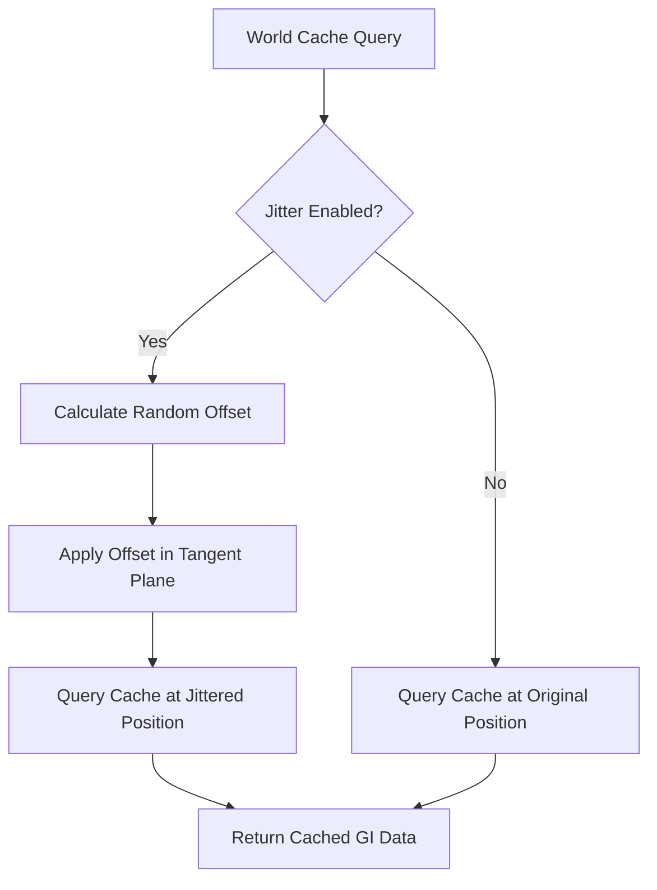

+++
title = "#22252 Solari: Disable world cache jitter"
date = "2025-12-29T00:00:00"
draft = false
template = "pull_request_page.html"
in_search_index = true

[taxonomies]
list_display = ["show"]

[extra]
current_language = "en"
available_languages = {"en" = { name = "English", url = "/pull_request/bevy/2025-12/pr-22252-en-20251229" }, "zh-cn" = { name = "中文", url = "/pull_request/bevy/2025-12/pr-22252-zh-cn-20251229" }}
labels = ["A-Rendering", "C-Refinement"]
+++

# Solari: Disable world cache jitter

## Basic Information
- **Title**: Solari: Disable world cache jitter
- **PR Link**: https://github.com/bevyengine/bevy/pull/22252
- **Author**: JMS55
- **Status**: MERGED
- **Labels**: A-Rendering, S-Ready-For-Final-Review, C-Refinement
- **Created**: 2025-12-24T02:22:18Z
- **Merged**: 2025-12-29T05:21:50Z
- **Merged By**: alice-i-cecile

## Description Translation
I did a bunch of testing, and after recent rounds of improvements to specular GI, I don't think this is worth it anymore. Turning it off reduces light leaks with thin geometry.

## The Story of This Pull Request

This pull request addresses a specific optimization trade-off in Bevy's Solari global illumination system. The change focuses on the world cache query mechanism in the real-time rendering pipeline, specifically modifying how position jittering is handled during cache lookups.

The core issue revolves around jittering world positions when querying the world cache. Previously, the system used jittering to reduce banding artifacts by adding random offsets to query positions within the tangent plane of the surface normal. This technique was implemented following guidance from external resources, as referenced in the code comment pointing to a blog post about ReGIR (Realtime Global Illumination in Raytracing).

However, after extensive testing and recent improvements to the specular GI implementation, the author determined that the jittering approach was no longer providing sufficient benefits to justify its cost. More critically, the jittering was found to cause light leaks with thin geometry. These light leaks occur when the jittered query position incorrectly samples lighting information from behind thin surfaces or from adjacent geometry, resulting in unrealistic illumination bleeding through objects.

The solution implemented is straightforward: disable the jittering by default. This is achieved by changing the conditional compilation flag from `NO_JITTER_WORLD_CACHE` to `JITTER_WORLD_CACHE`. The change effectively inverts the default behavior - instead of jittering being enabled by default (and requiring an explicit flag to disable it), jittering is now disabled by default and must be explicitly enabled if needed.

Technically, this change represents a refinement based on empirical testing results. The jittering technique was originally implemented to address specific visual artifacts, but as the overall GI system improved, the trade-offs shifted. The removal of jittering reduces computational overhead (avoiding the orthonormalization and random offset calculations) while simultaneously improving visual quality by eliminating light leaks.

The implementation is minimal but significant. By changing just one line in a WGSL shader, the entire system's behavior is modified. This type of change demonstrates how small adjustments in graphics programming can have substantial impacts on visual quality and performance. The conditional compilation approach ensures that the jittering code remains available for potential future use or experimentation, while keeping the default path optimized and artifact-free.

## Visual Representation



## Key Files Changed

### File: `crates/bevy_solari/src/realtime/world_cache_query.wgsl`

This WGSL shader file contains the world cache query function that retrieves global illumination data. The change modifies how world positions are handled before querying the cache.

**Before the change:**
```wgsl
// https://tomclabault.github.io/blog/2025/regir, jitter_world_position_tangent_plane
#ifndef NO_JITTER_WORLD_CACHE
    let TBN = orthonormalize(world_normal);
    let offset = (rand_vec2f(rng) * 2.0 - 1.0) * cell_size * 0.5;
    world_position += offset.x * TBN[0] + offset.y * TBN[1];
#endif
```

**After the change:**
```wgsl
// https://tomclabault.github.io/blog/2025/regir, jitter_world_position_tangent_plane
#ifdef JITTER_WORLD_CACHE
    let TBN = orthonormalize(world_normal);
    let offset = (rand_vec2f(rng) * 2.0 - 1.0) * cell_size * 0.5;
    world_position += offset.x * TBN[0] + offset.y * TBN[1];
#endif
```

The key difference is the conditional compilation flag. Previously, jittering was enabled by default unless `NO_JITTER_WORLD_CACHE` was defined. Now, jittering is disabled by default and only enabled if `JITTER_WORLD_CACHE` is explicitly defined. This change directly addresses the light leak issue by removing the random position offsets that could cause queries to sample from incorrect locations.

## Further Reading

1. [ReGIR: Realtime Global Illumination in Raytracing](https://tomclabault.github.io/blog/2025/regir) - The original blog post referenced in the code comment, which discusses the jittering technique in detail.

2. Bevy's rendering documentation for understanding how the Solari global illumination system integrates with the overall rendering pipeline.

3. Graphics programming resources on jittering and anti-aliasing techniques for understanding the trade-offs involved in position jittering approaches.

4. Real-time global illumination literature for context on the challenges of thin geometry and light leaks in GI systems.