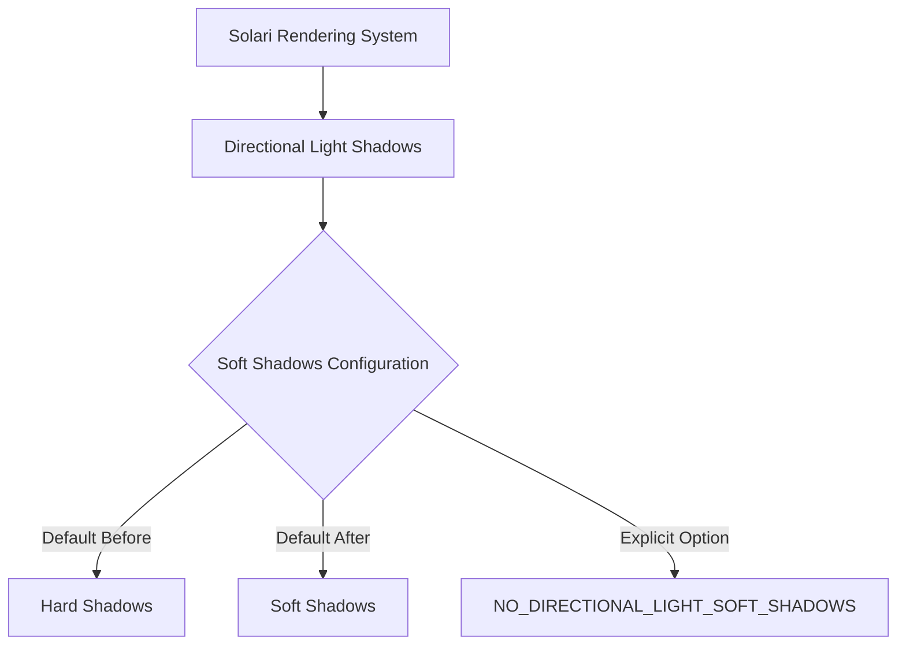

+++
title = "#22253 Solari: Enable directional light soft shadows"
date = "2025-12-29T00:00:00"
draft = false
template = "pull_request_page.html"
in_search_index = true

[taxonomies]
list_display = ["show"]

[extra]
current_language = "en"
available_languages = {"en" = { name = "English", url = "/pull_request/bevy/2025-12/pr-22253-en-20251229" }, "zh-cn" = { name = "中文", url = "/pull_request/bevy/2025-12/pr-22253-zh-cn-20251229" }}
labels = ["A-Rendering", "D-Straightforward"]
+++

# Title
Solari: Enable directional light soft shadows

## Basic Information
- **Title**: Solari: Enable directional light soft shadows
- **PR Link**: https://github.com/bevyengine/bevy/pull/22253
- **Author**: JMS55
- **Status**: MERGED
- **Labels**: A-Rendering, S-Ready-For-Final-Review, D-Straightforward
- **Created**: 2025-12-24T02:38:39Z
- **Merged**: 2025-12-29T05:21:50Z
- **Merged By**: alice-i-cecile

## Description Translation
Another last minute defaults change for Solari (I need to make these proper configs soon...)

## The Story of This Pull Request

This PR addresses a configuration issue in Bevy's Solari rendering system related to directional light soft shadows. The problem was straightforward: the default behavior for directional light shadows needed to be changed from hard shadows to soft shadows. The technical context is that Solari, Bevy's new renderer, is still in active development, and configuration options are currently implemented through compile-time flags in shader code rather than runtime settings.

The developer faced a practical issue: soft shadows for directional lights were disabled by default, requiring explicit enablement via the `DIRECTIONAL_LIGHT_SOFT_SHADOWS` preprocessor flag. This default didn't match the desired user experience for the Solari renderer, where soft shadows should be the standard behavior. The constraint was that the configuration system for Solari wasn't yet mature - as noted in the PR description, the developer acknowledged the need for proper configuration systems in the future.

The solution approach was minimal and pragmatic: invert the conditional logic in the shader code. Instead of requiring the presence of a flag to enable soft shadows, the code now enables soft shadows by default unless a different flag (`NO_DIRECTIONAL_LIGHT_SOFT_SHADOWS`) is explicitly defined. This represents a straightforward engineering decision - change the default behavior with minimal code impact while maintaining backward compatibility for users who explicitly want to disable the feature.

The implementation consists of a single-line change in a WGSL shader file. The technical insight here is about compile-time configuration management in graphics pipelines. The `#ifdef` and `#ifndef` preprocessor directives control which code paths are included during shader compilation. By changing from `#ifdef DIRECTIONAL_LIGHT_SOFT_SHADOWS` to `#ifndef NO_DIRECTIONAL_LIGHT_SOFT_SHADOWS`, the default behavior flips from opt-in to opt-out. This approach maintains the same technical capability (soft shadows can still be disabled) while changing the default experience.

The impact of this change is primarily about user experience defaults rather than technical functionality. Users of the Solari renderer will now get soft shadows for directional lights without needing to configure anything. The codebase impact is minimal - just one line changed. A key technical lesson from this PR is the importance of thoughtful default settings in rendering systems, especially during active development when user expectations are being established. The developer's comment about needing "proper configs soon" highlights a common pattern in systems development: starting with compile-time configuration and evolving toward runtime configuration as the system matures.

## Visual Representation



## Key Files Changed

### `crates/bevy_solari/src/scene/sampling.wgsl` (+1/-1)
This WGSL shader file handles light sampling in the Solari renderer. The change flips the default behavior for directional light soft shadows from disabled to enabled.

**Code Change:**
```wgsl
// Before:
#ifdef DIRECTIONAL_LIGHT_SOFT_SHADOWS
    // Sample a random direction within a cone whose base is the sun approximated as a disk
    // https://www.realtimerendering.com/raytracinggems/unofficial_RayTracingGems_v1.9.pdf#0004286901.INDD%3ASec30%3A305
    var rng = light_sample.seed;

// After:
#ifndef NO_DIRECTIONAL_LIGHT_SOFT_SHADOWS
    // Sample a random direction within a cone whose base is the sun approximated as a disk
    // https://www.realtimerendering.com/raytracinggems/unofficial_RayTracingGems_v1.9.pdf#0004286901.INDD%3ASec30%3A305
    var rng = light_sample.seed;
```

The change replaces a `#ifdef` (if defined) directive with `#ifndef` (if not defined), effectively inverting the condition. The code block that implements soft shadow sampling for directional lights is now included by default unless the `NO_DIRECTIONAL_LIGHT_SOFT_SHADOWS` flag is explicitly defined during compilation.

This change directly implements the PR's goal of enabling directional light soft shadows by default in the Solari renderer, while maintaining the ability to disable them for specific use cases.

## Further Reading

1. **WGSL Specification**: Understanding WebGPU Shading Language syntax and preprocessor directives
2. **Real-Time Rendering Techniques**: The linked Ray Tracing Gems resource provides background on the soft shadow implementation technique
3. **Configuration Management in Game Engines**: Patterns for managing renderer settings at compile-time vs. runtime
4. **Bevy's Solari Renderer Documentation**: For context on the broader rendering system this change affects
5. **Graphics Pipeline Configuration**: Best practices for managing shader variants and feature flags in modern rendering engines