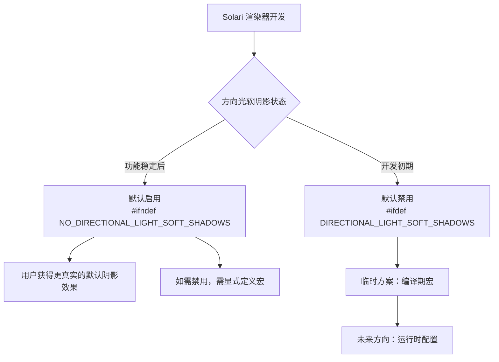

+++
title = "#22253 Solari: Enable directional light soft shadows"
date = "2025-12-29T00:00:00"
draft = false
template = "pull_request_page.html"
in_search_index = false

[extra]
current_language = "zh-cn"
available_languages = {"en" = { name = "English", url = "/pull_request/bevy/2025-12/pr-22253-en-20251229" }, "zh-cn" = { name = "中文", url = "/pull_request/bevy/2025-12/pr-22253-zh-cn-20251229" }}
labels = ["A-Rendering", "D-Straightforward"]
+++

# Title
## Basic Information
- **Title**: Solari: Enable directional light soft shadows
- **PR Link**: https://github.com/bevyengine/bevy/pull/22253
- **Author**: JMS55
- **Status**: MERGED
- **Labels**: A-Rendering, S-Ready-For-Final-Review, D-Straightforward
- **Created**: 2025-12-24T02:38:39Z
- **Merged**: 2025-12-29T05:21:50Z
- **Merged By**: alice-i-cecile

## Description Translation
另一个为 Solari 做的最后一刻的默认值修改（我很快需要把这些做成正式的配置...）

## The Story of This Pull Request
这个 PR 发生在 Bevy 游戏引擎的新渲染后端 Solari 的开发过程中。Solari 是 Bevy 正在开发的现代化渲染器，旨在提供更强大的图形功能和更好的性能。在这个开发阶段，许多功能标志和默认设置仍在调整中，以找到最佳的开发体验和视觉效果平衡点。

本次修改的核心是一个单一的目标：**将方向光（directional light）的软阴影（soft shadows）功能默认启用**。方向光通常用于模拟太阳光等平行光源，而软阴影是高质量渲染中的一个关键特性，它通过模拟光源并非一个理想的点，而是具有物理大小的面，使得阴影的边缘产生自然的、逐渐过渡的柔和效果，而不是生硬的硬阴影（hard shadows）。这对于提升场景的真实感至关重要。

在修改之前，软阴影功能的启用由一个正向的条件编译宏 `DIRECTIONAL_LIGHT_SOFT_SHADOWS` 控制。这意味着该功能默认是关闭的，除非在编译时显式地定义了这个宏。这种设置在功能开发初期是合理的，可以避免未完成或可能不稳定的代码影响所有用户。然而，随着功能变得稳定并被期望作为标准体验的一部分，保持默认关闭的状态就会成为问题，尤其是对于新用户或快速原型开发来说，他们可能无法获得预期的视觉效果。

开发者（JMS55）的解决方案非常直接：将控制逻辑从 `#ifdef` 翻转为 `#ifndef`，并将宏名改为 `NO_DIRECTIONAL_LIGHT_SOFT_SHADOWS`。这是一个经典的“默认启用”模式转换。修改后，软阴影功能变为默认启用。如果某个特定构建或场景需要禁用软阴影（例如，为了进行性能分析，或者在某些风格化渲染中特意需要硬阴影），则可以通过定义 `NO_DIRECTIONAL_LIGHT_SOFT_SHADOWS` 宏来显式地关闭它。

这个修改的代码位置在着色器的光照采样解析函数 `resolve_light_sample` 中。当检测到光源类型为方向光时，它会检查这个宏来决定是否执行软阴影采样算法。该算法引用自《Ray Tracing Gems》一书，通过一个随机数生成器（RNG）在一个圆锥体内采样方向，来模拟将太阳近似为一个圆盘光源的效果。这使得从不同微小角度射出的光线会产生略微不同的阴影边界，在积分后形成柔和的过渡。

从工程角度看，这个PR虽然改动极小，但它反映了渲染器开发流程中的一个常见模式：功能从“实验性/可选”状态过渡到“稳定/默认”状态。作者在PR描述中提到“需要尽快做正式的配置”，这暗示了当前通过编译期宏控制的方式只是一个临时的、开发阶段的解决方案。更理想的方式是在运行时通过配置系统或资源来控制此类图形质量选项，从而为用户提供更灵活的动态调整能力，而无需重新编译着色器或整个应用程序。

总而言之，这个PR通过翻转一个条件编译宏的逻辑，将Solari渲染器中方向光软阴影的质量提升功能设为了默认启用。这是一个旨在改善新用户开箱即用视觉体验的简单但重要的更改，同时也为未来向更灵活的运行时配置系统迁移铺平了道路。

## Visual Representation


## Key Files Changed
- `crates/bevy_solari/src/scene/sampling.wgsl` (+1/-1)

这个文件是 Solari 渲染器中的一个 WebGPU 着色语言（WGSL）文件，负责场景中的采样逻辑。具体的修改位于 `resolve_light_sample` 函数中，该函数处理光源采样后的解析。

**修改内容与目的：**
此改动将控制方向光软阴影是否生效的条件编译逻辑从“定义宏则启用”改为“不定义宏则启用”，从而默认开启该功能。

**代码片段：**
```wgsl
// File: crates/bevy_solari/src/scene/sampling.wgsl
// 修改前（第127行）：
#ifdef DIRECTIONAL_LIGHT_SOFT_SHADOWS

// 修改后（第127行）：
#ifndef NO_DIRECTIONAL_LIGHT_SOFT_SHADOWS
```
这段修改直接影响其下方用于计算软阴影的代码块（包括基于《Ray Tracing Gems》的圆锥采样算法）是否会被编译和执行。修改后，除非特意定义了 `NO_DIRECTIONAL_LIGHT_SOFT_SHADOWS` 宏，否则软阴影计算将始终生效。

## Further Reading
1.  **《Ray Tracing Gems》**：此 PR 中引用的软阴影采样算法来自此书，是学习现代光线追踪和高级渲染技术的优秀资源。
2.  **Bevy 渲染架构文档**：了解 Bevy 引擎整体的渲染管线设计，以及 Solari 作为新后端的定位和目标。
3.  **WebGPU 与 WGSL 规范**：理解本次修改所发生的语言和环境，WebGPU 是下一代图形 API，WGSL 是其着色语言。
4.  **实时渲染中的阴影技术**：可以搜索“PCSS”（Percentage-Closer Soft Shadows）、“VSM”（Variance Shadow Maps）等软阴影实现方案，了解工业界常见的实时软阴影算法。